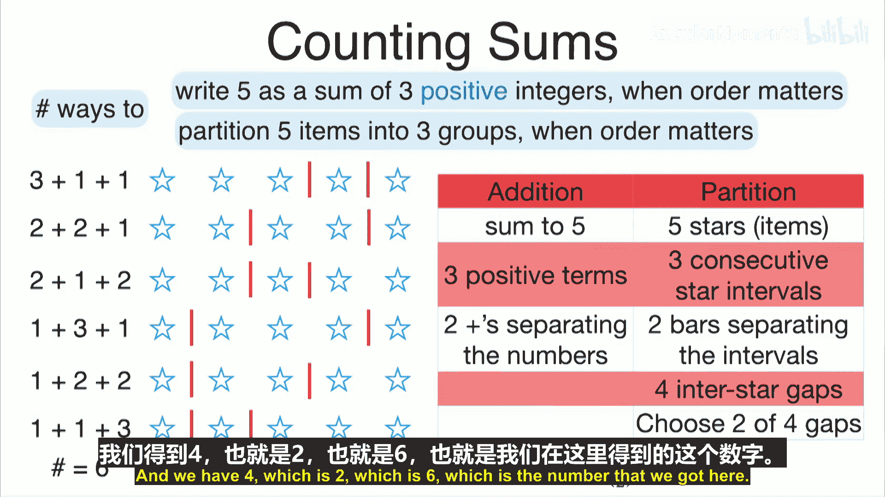
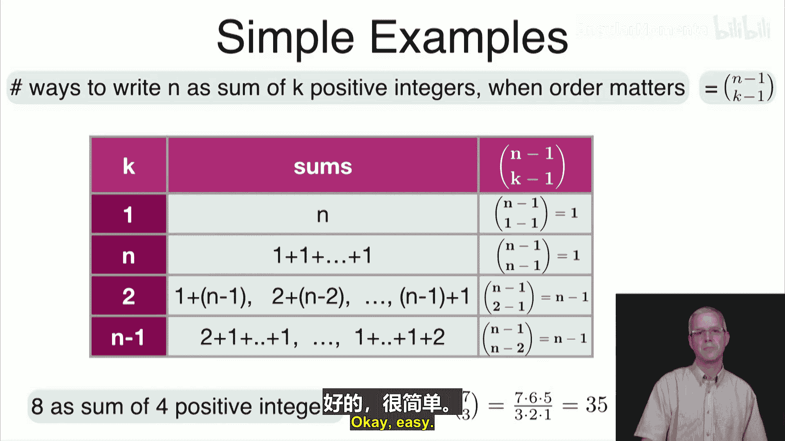
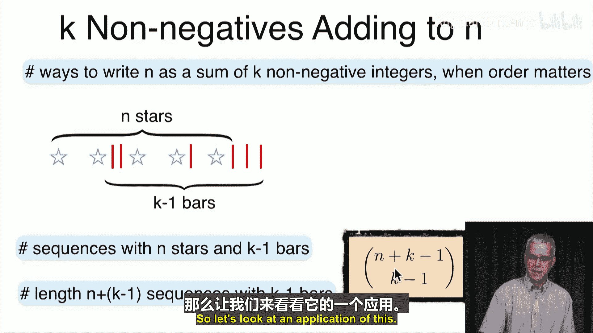
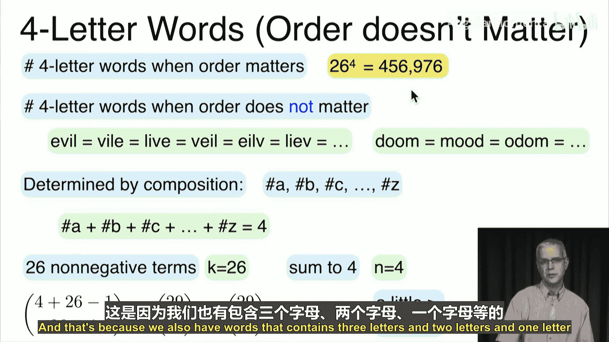
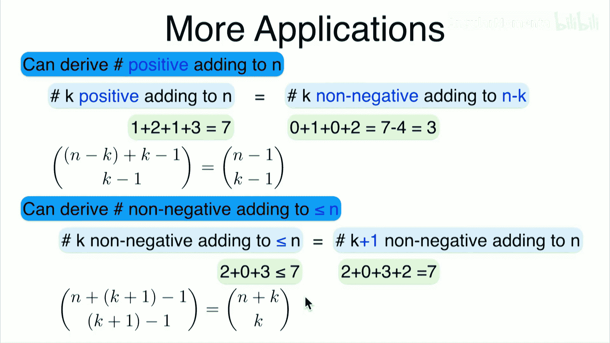

# 022：星与条法

在本节课中，我们将学习组合数学的最后一个重要应用——星与条法。我们将探讨如何利用之前学到的组合知识，解决代数中关于整数求和的问题，并推导出简洁的公式。

## 概述

到目前为止，我们已经讨论了排列、组合和二项式系数等组合数学的应用。本节将介绍一种不同的应用：使用星与条法来计算将一个整数写成特定数量整数之和的方法数。我们将从简单的例子入手，逐步推导出通用公式，并展示其在解决实际问题中的威力。

## 正整数有序求和

首先，我们考虑一个具体问题：有多少种方法可以将数字5写成三个**正整数**之和，且**顺序不同视为不同的方法**？

例如，5可以写成：
*   3 + 1 + 1
*   2 + 2 + 1
*   2 + 1 + 2
*   1 + 3 + 1
*   1 + 2 + 2
*   1 + 1 + 3

通过枚举，我们发现总共有6种方法。我们的目标是利用组合数学来推导出这个数字6。

### 建立类比：星与条

我们可以将这个问题转化为一个“分配”问题：将5个相同的物品（用星号 `*` 表示）分配到3个有序的组中，每组至少有一个物品。

*   求和 `3 + 1 + 1` 对应分组：`*** | * | *`
*   求和 `2 + 2 + 1` 对应分组：`** | ** | *`
*   求和 `2 + 1 + 2` 对应分组：`** | * | **`

在这个类比中：
1.  **星号 (`*`)** 的总数代表要求和的目标数字（这里是5）。
2.  **条 (`|`)** 用于分隔不同的组。由于有3组，我们需要 `3 - 1 = 2` 个条。
3.  **关键约束**：为了确保每组至少有一个星号（即每个加数都是正整数），我们不能将条放在相邻星号之间的同一个间隙，并且条不能放在序列的两端。

对于5个星号，它们之间有 `5 - 1 = 4` 个间隙。我们需要从这4个间隙中选择2个来放置分隔条。因此，总的方法数就是组合数 **C(4, 2)**。

**公式**：`C(4, 2) = 6`，这与我们枚举的结果一致。

### 推广到一般情况

上一节我们通过一个具体例子建立了星与条模型，现在将其推广到一般情况。

假设我们想将正整数 `n` 写成 `k` 个**正整数**之和（顺序重要）。根据类比：
*   我们有 `n` 个星号。
*   我们有 `k` 个组，因此需要 `k - 1` 个条来分隔。
*   星号之间有 `n - 1` 个间隙。
*   我们需要从这 `n - 1` 个间隙中选择 `k - 1` 个来放置条。

因此，方法总数由以下组合数给出：

**公式**：`C(n - 1, k - 1)`

让我们验证几个简单情况以确保公式正确：
*   **k = 1**：将 `n` 写成1个数之和，只有 `n = n` 一种方式。公式给出 `C(n-1, 0) = 1`。
*   **k = n**：将 `n` 写成 `n` 个数之和，每个数必须是1，只有 `1+1+...+1` 一种方式。公式给出 `C(n-1, n-1) = 1`。
*   **k = 2**：将 `n` 写成两个数之和，有 `(1, n-1), (2, n-2), ..., (n-1, 1)` 共 `n-1` 种方式。公式给出 `C(n-1, 1) = n-1`。

这个公式的强大之处在于能快速解决复杂问题。例如，问“8写成4个正整数之和有多少种方法？”，我们无需费力枚举，直接计算：`C(8-1, 4-1) = C(7, 3) = 35`。

## 扩展到任意项数的正整数求和

现在，我们考虑一个更宽泛的问题：将正整数 `n` 写成**任意多个**正整数之和（顺序重要）有多少种方法？

以 `n=3` 为例：
*   3
*   1+2
*   2+1
*   1+1+1
总共4种方法。

再次使用星与条模型。对于3个星号 (`***`)，它们之间有2个间隙。每个间隙我们都可以选择“放条”或“不放条”来决定是否在此处分割数字。
*   `***` (无条) 对应求和：3
*   `*|**` (在第一个间隙放条) 对应求和：1+2
*   `**|*` (在第二个间隙放条) 对应求和：2+1
*   `*|*|*` (在两个间隙都放条) 对应求和：1+1+1

每个间隙有2种选择（放或不放），2个间隙总共就有 `2^2 = 4` 种排列方式，对应4种求和方法。

推广到一般情况：对于 `n` 个星号，有 `n-1` 个间隙，每个间隙独立地有2种选择。因此，总方法数为：

**公式**：`2^(n-1)`

我们也可以用上一节的公式来验证这个结果。将 `n` 写成任意多个正整数之和，相当于对 `k` 从1到 `n` 求和：`Σ_{k=1}^{n} C(n-1, k-1)`。令 `i = k-1`，则求和变为 `Σ_{i=0}^{n-1} C(n-1, i)`。根据二项式定理，这个和等于 `2^(n-1)`，与我们的推导一致。

## 非负整数有序求和

接下来，我们修改问题的条件：有多少种方法可以将数字 `n` 写成 `k` 个**非负整数**（即可以包含0）之和，且顺序重要？

以 `n=2, k=3` 为例，我们需要找到三个非负数相加等于2：
*   2+0+0
*   0+2+0
*   0+0+2
*   1+1+0
*   1+0+1
*   0+1+1
总共6种方法。

我们依然使用星与条模型，但规则需要调整：
*   `n` 个星号仍然代表总和。
*   `k` 个非负数需要 `k-1` 个条来分隔。
*   **关键变化**：由于数字可以为0，意味着两个条之间（或序列开头到第一个条之间，或最后一个条到序列结尾之间）的星号数量可以为0。因此，**条可以相邻，也可以出现在序列两端**。

这样一来，问题就变成了：我们有 `n` 个相同的星号和 `k-1` 个相同的条，将它们排成一列，总共有多少种不同的排列方式？

总共有 `n + (k-1)` 个位置。我们只需要从中选择 `k-1` 个位置来放置条（或者等价地，选择 `n` 个位置来放置星号）。因此，方法总数为：

**公式**：`C(n + k - 1, k - 1)` 或等价的 `C(n + k - 1, n)`

对于 `n=2, k=3` 的例子：`C(2+3-1, 3-1) = C(4, 2) = 6`，结果正确。

### 应用示例：不计顺序的单词计数

让我们看一个实际应用。问：由26个字母组成的**4字母单词**有多少个？（注意：这里“单词”指字母序列）
*   **如果顺序重要**：每个位置有26种选择，总数为 `26^4 = 456,976`。
*   **如果顺序不重要**：我们只关心字母的**组成**，即字母A出现了几次，B出现了几次……例如，“evil”、“vile”、“live”被视为同一个“单词”。那么，一个“单词”就由一组非负整数 `(a, b, c, ..., z)` 决定，其中 `a + b + c + ... + z = 4`（因为单词长度为4）。

这正好是将数字4写成26个（对应26个字母）非负整数之和的问题（顺序在这里指字母种类的顺序是固定的A-Z，但求和本身顺序不重要，我们使用星与条法时已经隐含了这种顺序）。因此，根据公式：

**计算**：`C(4 + 26 - 1, 26 - 1) = C(29, 25) = C(29, 4) = 23,751`

这个结果远小于 `456,976` 是合理的。因为大多数4字母单词由4个不同字母组成，如果不计顺序，每组不同的4个字母对应的 `4! = 24` 种排列会合并为1种。`456,976 / 24 ≈ 19,040`，再加上那些包含重复字母的单词组合，总数 `23,751` 是合理的。

## 公式间的联系

最后，我们简要探讨一下本节推导的几个公式之间的联系。

**1. 正整数求和与非负整数求和公式的关联**
将 `n` 写成 `k` 个**正整数**之和的方法数 `C(n-1, k-1)`，可以通过非负整数求和的公式推导出来。
思路：对于一组 `k` 个正整数 `(a1, a2, ..., ak)`，满足 `Σ ai = n`。令 `bi = ai - 1`，则每个 `bi` 都是非负整数，且 `Σ bi = n - k`。这个变换是一一对应的。因此：
`#(k个正整数之和为n) = #(k个非负整数之和为n-k) = C((n-k) + k - 1, k-1) = C(n-1, k-1)`

**2. 求和“至多”为n的情况**
考虑 `k` 个非负整数之和**不超过** `n` 的方法数。这等价于 `k+1` 个非负整数之和**恰好等于** `n` 的方法数。
思路：对于一组和不超过 `n` 的 `k` 个非负整数，我们总可以添加一个非负整数“余项”，使总和恰好等于 `n`。这个添加的余项是唯一的。因此：
`#(k个非负整数之和 ≤ n) = #(k+1个非负整数之和 = n) = C(n + (k+1) - 1, (k+1)-1) = C(n + k, k)`

## 总结

本节课中，我们一起学习了组合数学中强大的**星与条法**。我们首先学习了如何计算将整数 `n` 写成 `k` 个**正整数**之和（有序）的方法数，其公式为 **`C(n-1, k-1)`**。接着，我们将其扩展到**任意项数**的正整数求和，得到方法数为 **`2^(n-1)`**。然后，我们处理了**非负整数**求和的问题，推导出公式 **`C(n + k - 1, k - 1)`**，并应用该公式解决了“不计顺序的单词计数”问题。最后，我们看到了这些公式之间的内在联系。

星与条法展示了组合技巧如何为看似复杂的代数计数问题提供清晰直观的解决方案。接下来，我们将离开组合数学的主题，开始概率论部分的学习。