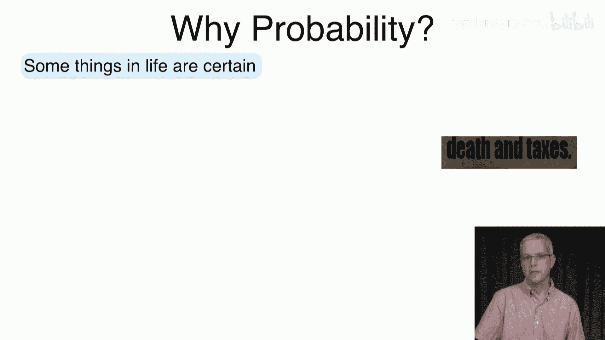
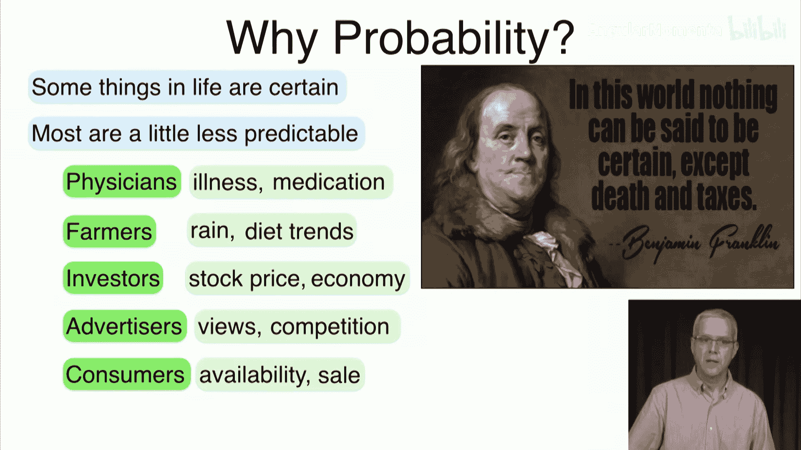
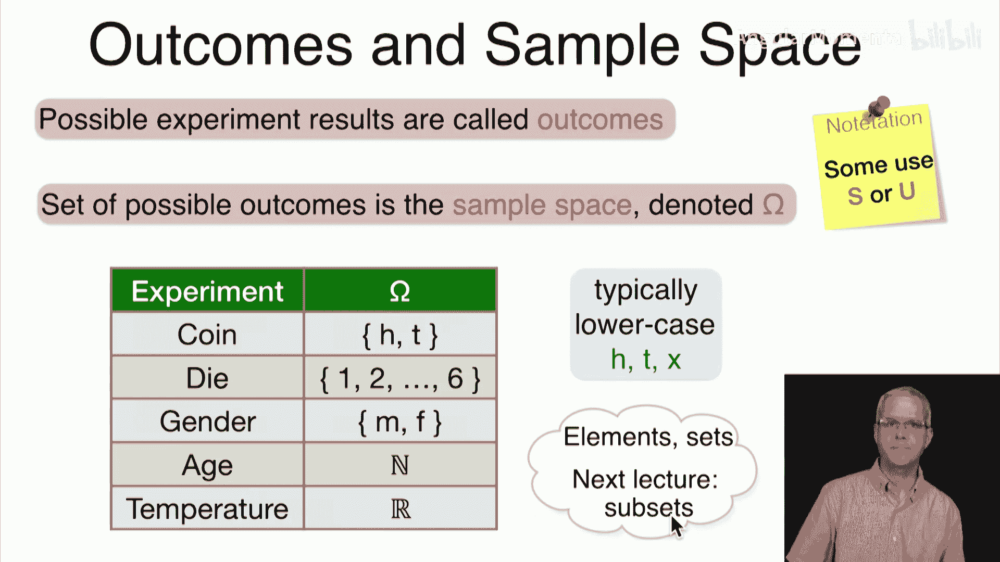
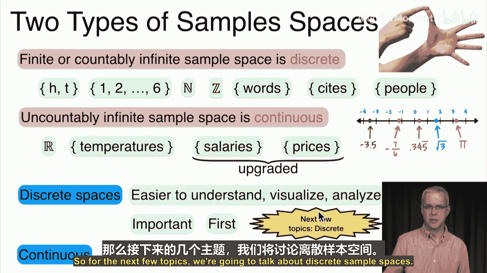
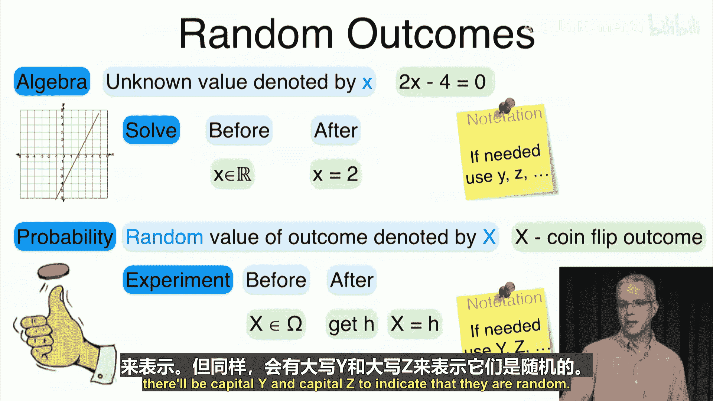
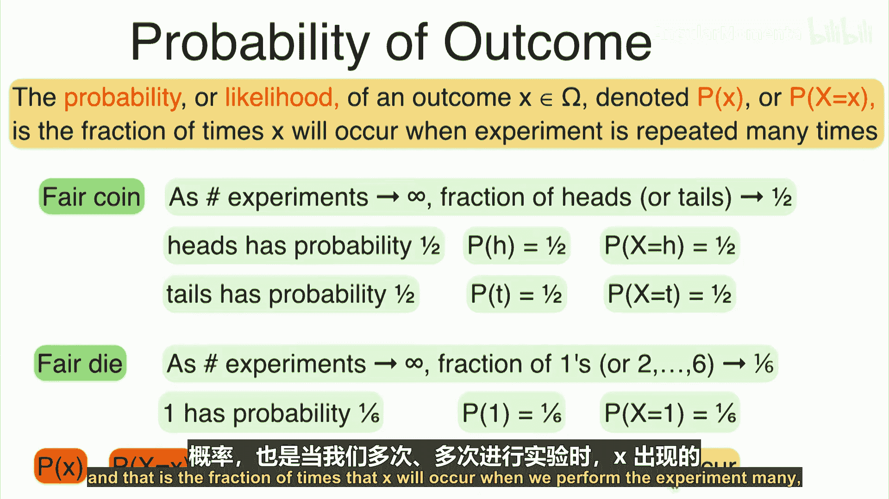
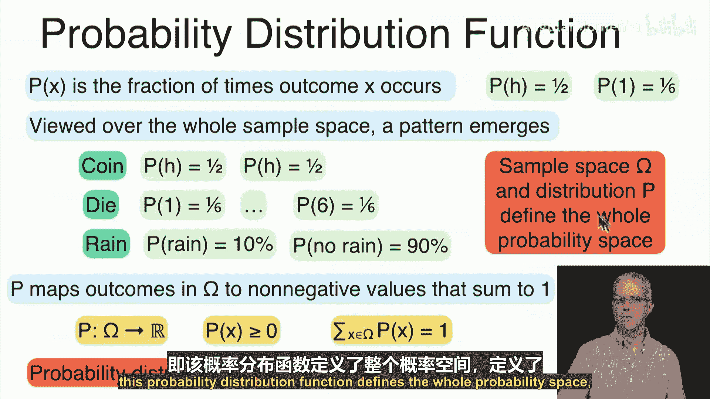

# 023：概率论导论 🎲

在本节课中，我们将要学习概率论的基础概念。我们将从讨论随机性及其重要性开始，然后探讨概率的含义。接着，我们会介绍随机实验的可能结果，以及所有可能结果的集合——样本空间。最后，我们将学习概率分布的概念。

## 为什么需要概率？🤔

生活中的某些事情是确定的，例如死亡和税收。但无论你是否认同本杰明·富兰克林的哲学，你都会同意，生活中的大多数事情都难以完全预测。

例如：
*   医生可能想知道病人患了什么病，或者某种药物是否有效。
*   农民可能短期担心第二天是否会下雨，或者长期担心他们种植的作物是否正确，因为饮食习惯可能会改变。
*   投资者肯定担心他们持有的股票是涨是跌，同时也更广泛地担忧经济走势。
*   广告商可能想知道一则广告在线上会被观看多少次，他们也担心未知的竞争。
*   消费者可能想知道他们去商店时产品是否有货，以及是否会打折。
*   当然，最令人担忧的是学生。从食堂队伍有多长这样的小事，到这门课能得什么成绩这样的大事，再到父母会如何看待他们的成绩、他们将得到的工作，或者他们希望拥有的约会，以及最重要的——他们在电子游戏中的表现如何。

即使是那些看似不可避免的事情，仔细想想，也许也不像我们认为的那样确定。因为仍然存在何时发生、以何种形式、在何地发生的问题。对于税收，你可能想知道自己是否会被审计，或者今年是否会实行10%的统一税率。

因此，我们需要讨论随机现象。问题是，既然我们在谈论随机的事物，我们无法必然地确定某些事情。那么，我们是应该完全放弃，还是仍然可以说一些有智慧且有用的话呢？

我们将要展示的是，实际上你可以了解随机现象的某些方面。例如，你可以尝试了解你将观察到的范围、你将如何获得数据、你将看到的事物的平均值、它们的变异性，以及你观察到的随机数据的其他属性。你可以尝试推断许多事情，包括你所查看数据的结构、它是否随时间变化、如果变化，朝什么方向变化、不同种类数据之间可能存在的关系，以及这种关系如何随机地表现出来。

然后，你也可以尝试预测不同的值，可以尝试预测数据的未来值，或者你可以尝试预测某些结果的可能性，并尝试提出保证，说明我可以对结果有某种程度的把握。

一旦你完成了所有这些，你就可以希望通过理解数据背后的更多内容、提前规划事物可能如何变化或保持不变、可能发生什么，并利用对可能不同结果和结构的了解来构建算法或设备，从而从随机数据中受益。

## 从一般到具体：术语介绍 📚

我们需要从这种非常笼统的介绍转向更具体的内容。我们需要像处理集合时那样，引入一些术语，以便我们能够简洁而精确地讨论问题。

我们希望讨论几个方面：
*   生成和观察数据的过程。
*   个体结果。
*   我们将看到的所有可能观察结果的集合。
*   概率的含义、它意味着什么以及我们如何解释。

我们将采取直观的方法，而不是从公理开始，看看它们对数据意味着什么。相反，我们将从数据开始，看看公理应该是什么以满足我们观察到的现象。

## 实验与结果 🔬

我们从收集数据的过程开始，这被称为**实验**。原因是概率论的发展部分是为了辅助不同的科学努力，因此他们将生成随机数据然后观察结果的过程称为实验，例如生物或化学实验。

但我们以一种非常通用的方式使用这个词。无论你是在生物学、社会学中观察人们的行为或趋势，还是在商业中观察股票价格或广告，或者在工程学中收集数据并观察不同的可能性，我们都称之为你进行的**实验**。

为了理解它，我们显然需要比“我们有一个模糊的生物实验”更精确一些。因此，我们将从非常简单的例子开始，可能是最简单的那种。随着时间的推移，我们将逐步过渡到更复杂的例子和实验。

如果你进行一个实验，那么你正在从该实验中做一些观察。可能的结果、结果或观察被称为实验的**结果**。

所有可能结果的集合被称为**样本空间**，用符号 **Ω** 表示。

需要注意的是，有些人使用 **S** 表示样本集，或 **U** 表示全域，但我们将使用 **Ω**。

以下是几个例子：
*   假设你抛一枚硬币，在某种意义上进行一个实验，可能的结果是正面和反面，我们用 **H** 和 **T** 表示。
*   如果你掷一个骰子，可能的结果是1到6。这也是我们的样本空间 **Ω**。
*   如果你观察一个人的性别，样本空间是男或女。
*   如果你观察年龄，那么样本空间可能是整数、非负整数或自然数。
*   如果你观察温度，那么可能的温度是所有实数。当然，我们知道温度不能太低，但暂时让我们这样想象。

这些就是实验、可能结果的集合，这个集合再次被称为样本空间。通常，如你所见，我们用小写字母表示结果，如 **H**、**T** 或 **x**（如果它是一个通用的结果）。你当然会注意到这与我们之前研究的集合元素的相似之处，这并非巧合。我们研究集合，以便可以在这里讨论元素和集合。正如你可能想象的那样，事实上在下一讲中，我们将从讨论集合转向讨论子集。

## 样本空间的类型 📊

样本空间有两种类型：一种是有限或可数无限的，这些样本空间被称为**离散的**。基本上，这些是你可以用手指计数的东西，尽管可能需要不止一只手。

它们包括：
*   如果实验是抛硬币，由正面和反面组成的集合。
*   如果实验是掷骰子，由数字1到6组成的样本空间。
*   年龄的自然数集合。
*   整数集合 **Z**。
*   如果你分析文档，单词的集合。
*   如果你进行涉及位置的实验，城市的集合。
*   人的集合。

另一种类型的样本空间是**连续的**，即不可数无限的。我们通常将连续样本空间视为可以沿实数线表示的事物。

它们包括：
*   实数集 **R**，例如用于温度、薪水或价格。需要注意的是，薪水和价格可能不完全连续，因为它们可能以美分表示，但它们足够接近连续，我们将其视为连续的，这样做实际上很有帮助。

现在，我们将首先关注离散空间，因为离散空间更容易理解、可视化和处理，而且它们也很重要。连续空间也非常重要，但概念上更难，所以我们稍后再讨论。因此，在接下来的几个主题中，我们将讨论离散样本空间。

## 随机变量 🎯

现在，一旦我们进行一个随机实验，结果将是随机的，我们需要给它一个名字。

我们知道，在进行代数运算时，我们用小写 **x** 表示未知值。例如，如果我们有这个方程 `2x - 4 = 0`，**x** 代表某个我们还不知道的实数，但它满足这个方程。一旦你解出它，你就会发现 **x** 的值。在求解之前，你只知道 **x** 是一个实数；求解之后，你会知道在这种情况下 `2x = 4` 或 `x = 2`。

类似地，当我们进行概率实验时，我们会得到一个随机结果，我们想给它起个名字。我们将用大写 **X** 表示这个随机结果。这里我们有小写 **x**，这里我们有大写 **X**。随机结果将用大写 **X** 表示。

例如，**X** 可以是一次抛硬币的结果，我们不知道它。我们进行实验，抛硬币。在进行实验之前，我们所知道的是 **X** 属于样本空间 **Ω**。在这种情况下，我们知道 **X** 要么是正面，要么是反面。在我们进行实验之后，如果我们得到正面，那么 **X** 将获得值 **H**，就像之前小写 **x** 获得值 **2** 一样。如果硬币出现反面，那么随机变量大写 **X** 将获得值 **T** 表示反面。

请注意，就像代数中我们经常需要不止一个变量一样，如果需要，我们会使用 **Y** 和 **Z** 等，而不仅仅是 **X**。同样，这里我们将从 **X** 开始，但如果需要更多随机变量，我们将使用大写 **Y** 和大写 **Z** 来表示它们是随机的。

## 结果的概率 📈

接下来，我们想讨论结果的概率。直观地说，样本空间 **Ω** 中某个结果 **x** 的概率或可能性，我们用 **P(x)** 表示，或者随机变量大写 **X** 取值为小写 **x** 的概率，是当实验重复多次时，这个小写 **x** 发生的次数所占的比例。

例如，如果抛一枚公平的硬币，那么随着实验次数趋于无穷大，正面的比例（即观察到正面的次数除以实验总次数）将趋近于二分之一。同样，如果硬币是公平的，那么反面的比例（观察到反面的次数除以实验总次数）也将趋近于二分之一。

这意味着对我们来说，正面的概率是二分之一，因为它们发生在一半的时间里。我们会说正面 **H** 的概率是二分之一，或者随机结果 **X** 是正面的概率是二分之一。

同样，反面的概率也是二分之一。我们将其表示为 **P(T) = 1/2**。如果我们重复实验很多很多次，反面的比例将是二分之一，或者随机结果 **X** 取值为反面的概率是二分之一。

如果我们有一个公平的骰子，那么随着实验次数趋于无穷大，出现1、2、3……6的比例将趋近于六分之一。如果我们掷这个骰子一百万次，我们预计大约六分之一的时间会看到值1，六分之一的时间会看到值2，依此类推。那么我们会说1的概率是六分之一，或者随机结果 **X** 是1的概率是六分之一。

总结一下，**P(x)**，即 **x** 的概率，也表示为随机变量 **X** 取值为小写 **x** 的概率。例如，实验得到正面值的概率，或者这个随机实验以反面值结束的概率，这就是 **x** 的概率，也就是当我们多次进行实验时，**x** 发生的次数所占的比例。

## 概率分布函数 📊

就像我们处理元素和集合一样，我们希望从个体元素或结果转向整个样本空间。**P(x)** 是结果 **x** 发生的次数比例。例如，正面的概率是二分之一，它发生在一半的时间里；1的概率是六分之一，平均每六次掷骰子中会有一次是1。

当我们查看整个样本空间的概率时，一个模式就出现了。让我们看看：
*   如果你抛一枚硬币，那么正面的概率是二分之一，反面的概率也是二分之一。
*   如果你掷一个骰子，那么1的概率是六分之一，依此类推，直到6的概率也是六分之一。
*   如果你看某一天下雨的概率，假设下雨的概率是10%，那么不下雨的概率就是90%。

当我们观察这些不同的实验时，有一个共同点，那就是这个概率 **P** 实际上将样本空间的元素（如正面和反面）映射到非负数，并且它们的总和为一。

这意味着对我们来说，**P** 是一个函数，它将样本空间 **Ω** 中的结果映射到实数，使得每个元素的概率大于等于0，并且当你对样本空间中所有元素的概率求和时，你会得到1。例如，这里六分之一加六分之一，加六次，得到1；对于下雨，10%加90%等于1。

因此，我们将这个被视为从 **Ω** 到实数的映射的概率称为**概率分布函数**。它给出了 **Ω** 中每个元素的分布或概率。有时我们简称为**分布**。

需要注意的一点是，当我们取样本空间 **Ω**（例如，我们有正面和反面）以及说明正面概率是多少、反面概率是多少的分布时，**Ω** 和这个概率分布函数的组合定义了整个概率空间，定义了我们关于这个实验需要知道的一切。

## 总结 🎉

本节课中我们一起学习了概率论的基础知识。我们讨论了随机性以及为什么我们关心它，提供了一些动机和解释来说明概率的含义。我们描述了什么是结果、什么是样本空间，并讨论了概率分布。

下一次课，我们将讨论分布的类型。下次见。