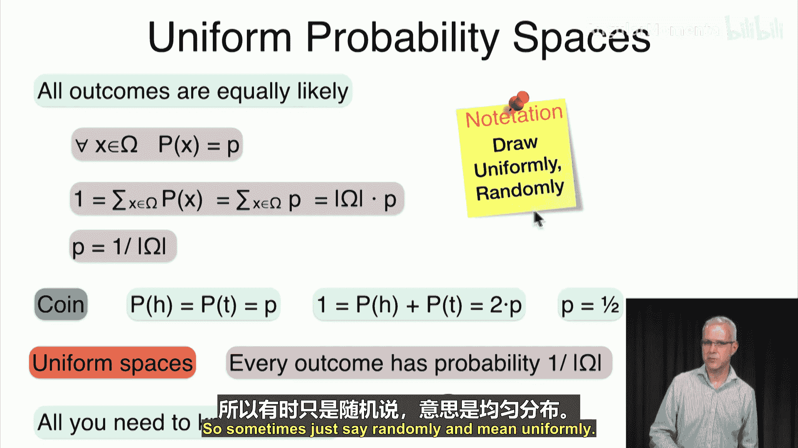
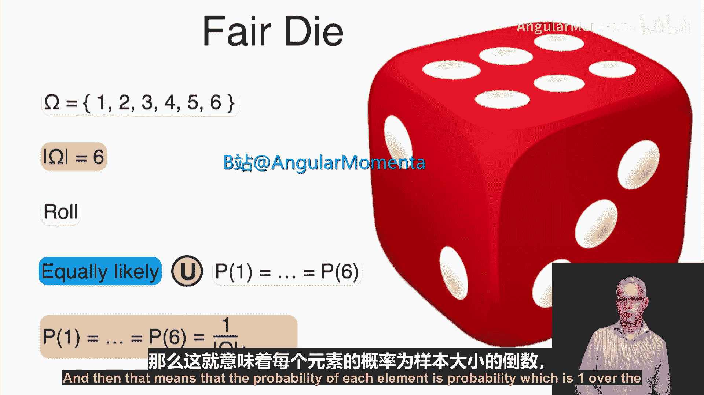
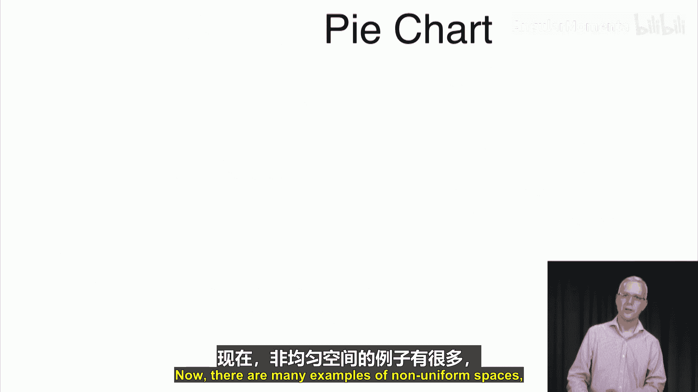
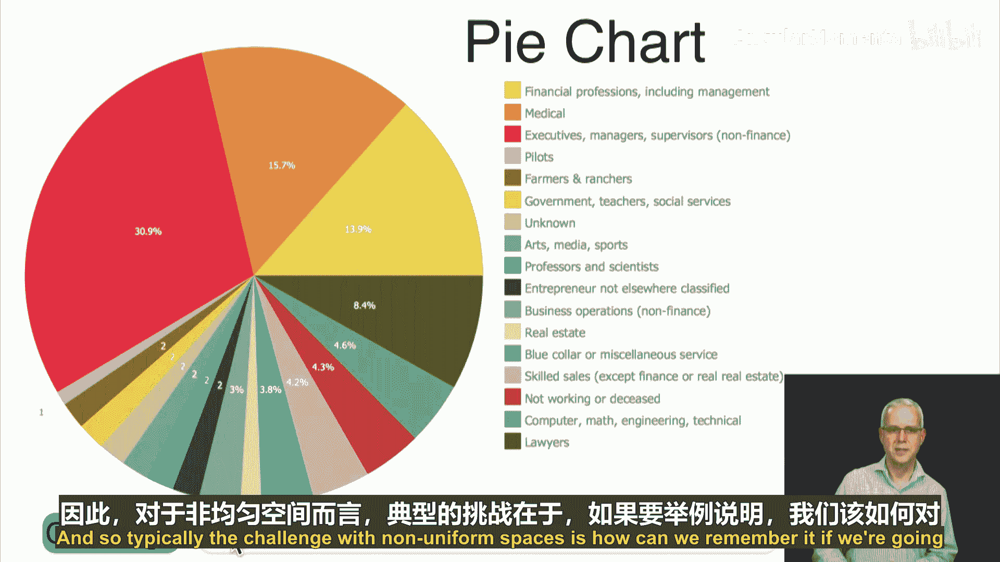
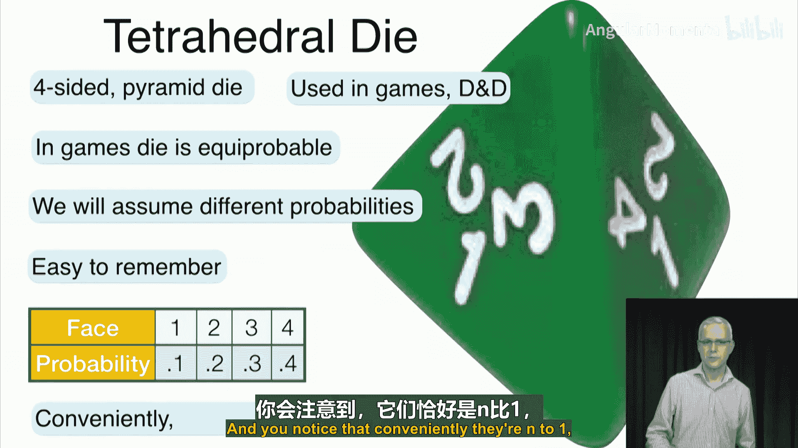
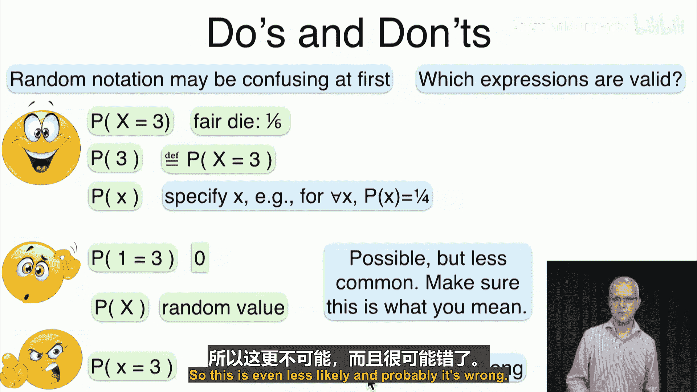

# 024：分布类型 📊

在本节课中，我们将要学习概率分布的类型。我们将从最简单的**均匀分布**开始，通过硬币、骰子和扑克牌等例子来理解它。然后，我们将探讨更普遍的**非均匀分布**，并介绍一个四面体骰子的例子。理解这些分布类型是进行后续概率计算的基础。

## 均匀概率空间

上一节我们讨论了随机性和分布的基本概念，本节中我们来看看一种特殊的分布类型——均匀分布。在均匀概率空间中，所有可能的结果都具有相同的发生概率。

在数学上，对于一个样本空间 Ω，如果它是均匀的，那么对于空间中的每一个结果 *x*，其概率 *P(x)* 都相等。由于所有概率之和必须为1，我们可以得到以下公式：

**P(x) = 1 / |Ω|**

其中，|Ω| 表示样本空间 Ω 的大小（即可能结果的总数）。

以下是几个均匀概率空间的经典例子：

*   **公平硬币**：样本空间 Ω = {H, T}，大小为2。因此，P(H) = P(T) = 1/2。
    

*   **公平骰子**：样本空间 Ω = {1, 2, 3, 4, 5, 6}，大小为6。因此，每个面朝上的概率都是 1/6。
    

*   **标准扑克牌**：从一副52张的牌中随机抽一张，每张牌被抽中的概率相同，均为 1/52。

在均匀分布中，我们常说“随机抽取”或“均匀抽取”，这意味着每个结果被选中的机会均等。这使得概率计算变得非常简单，因为你只需要知道可能结果的总数。

## 非均匀概率空间

然而，现实世界中的许多情况并非均匀分布。均匀分布像硬币和骰子那样理想化，但自然界中非均匀的情况更为普遍。

例如，下雨的概率、学生获得不同等级的成绩、某些单词在语言中出现的频率、不同疾病的患病率、网页的访问量分布等，通常都不是均匀的。反映这种不同概率的典型可视化工具是饼图。

为了具体说明非均匀分布，我们来看一个特制的四面体骰子（金字塔形骰子）的例子。虽然这种骰子在游戏中通常也是均匀的，但这里我们赋予它的四个面（1, 2, 3, 4）不同的概率，以便于记忆：

*   面1的概率：0.1
*   面2的概率：0.2
*   面3的概率：0.3
*   面4的概率：0.4

注意，这些概率之和为 0.1 + 0.2 + 0.3 + 0.4 = 1，满足概率分布的要求。

## 关于概率记法的注意事项

在讨论了具体例子之后，我们需要注意概率记法，初学者有时可能会感到困惑。以下是有效和无效表达方式的说明：

以下是正确且常见的概率表达式：
*   `P(X = 3)`：表示随机变量 *X* 取值 3 的概率。
*   `P(3)`：是 `P(X = 3)` 的简写形式。
*   `P(x)`：当明确 *x* 是某个特定值时，例如在四面体骰子中，`P(1) = 0.1`。

以下是可能不常见或容易出错的表达式：
*   `P(1 = 3)`：这通常表示“数字1等于数字3”的概率，其值为0。除非有特殊上下文，否则很少这样写。
*   `P(X)`：这表示随机变量 *X* 本身的概率，在基础概率论中不这样使用。它可能被解释为 `P(X=x)` 对于某个 *x*，但含义模糊。

以下是错误的表达式：
*   `P(x = 3)`：注意，小写 *x* 通常代表一个具体的数值，而不是随机变量。因此“数值等于3的概率”这种说法没有意义。

## 总结

本节课中我们一起学习了概率分布的两种主要类型。我们首先介绍了**均匀分布**，其中所有结果等可能发生，并通过硬币、骰子和扑克牌的例子加深了理解。接着，我们探讨了更为常见的**非均匀分布**，并以一个概率各不相同的四面体骰子为例进行了说明。最后，我们澄清了关于概率记法的一些关键点，为后续学习事件及其概率计算做好了准备。