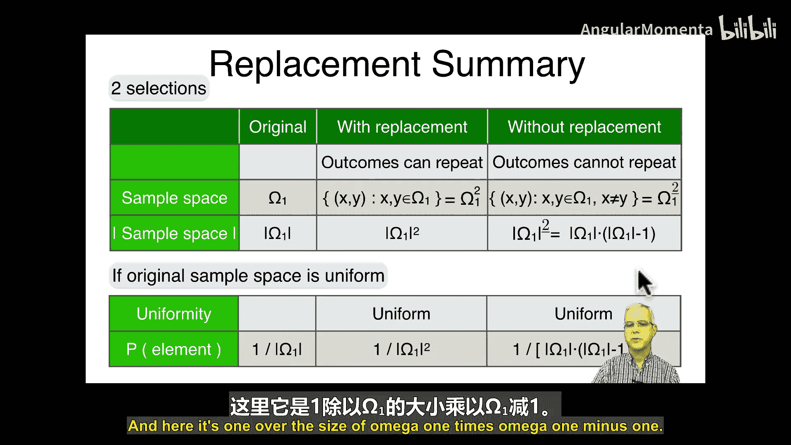

**概率与统计：P25：重复实验（第二部分）**

在本节课中，我们将继续学习重复实验。上一节我们介绍了复合实验，以及有放回和无放回抽样的概念。本节中，我们将探讨在重复实验中，**顺序是否重要**对概率计算的影响。

---

### **顺序是否重要**

到目前为止，我们讨论的例子都假设顺序是重要的。例如，在抽牌时，我们区分“先抽到5，再抽到3”和“先抽到3，再抽到5”这两种情况。在许多实际应用中，顺序确实重要，比如股票价格的先后变化。

然而，在另一些应用中，顺序并不重要。例如，在选举中统计票数时，只关心最终各候选人获得的总票数，而不关心投票的先后顺序。购物时，篮子里的商品集合是相同的，也不关心放入篮子的顺序。

当顺序不重要时，我们关心的结果从**有序元组**（例如 `(2, 5)`）变成了**无序集合**（例如 `{2, 5}`）。这意味着，原本两个不同的有序结果（如 `(2, 5)` 和 `(5, 2)`）现在对应于同一个无序集合 `{2, 5}`。

---

### **有放回抽样下的顺序影响**

假设我们有一个包含数字1到6的集合，进行**有放回**地抽取两次（相当于掷两次骰子）。

**当顺序重要时**，样本空间是所有有序对 `(i, j)`，其中 `i, j ∈ {1, 2, 3, 4, 5, 6}`。总共有 `6^2 = 36` 种等可能的结果，每个结果的概率为 `1/36`。

**当顺序不重要时**，我们关心的是无序集合 `{i, j}`。此时概率分布不再均匀。

*   **计算集合 `{1, 2}` 的概率**：它对应两个有序结果：`(1, 2)` 和 `(2, 1)`。因此，`P({1, 2}) = 2/36`。
*   **计算集合 `{1, 1}` 的概率**：它只对应一个有序结果：`(1, 1)`。因此，`P({1, 1}) = 1/36`。

可以看到，非重复元素集合的概率是重复元素集合概率的两倍。

**验证概率和为1**：
*   非重复元素集合（如 `{1, 2}`）共有 `C(6, 2) = 15` 个，每个概率为 `2/36`，总概率为 `15 * (2/36) = 30/36`。
*   重复元素集合（如 `{1, 1}`）共有6个，每个概率为 `1/36`，总概率为 `6 * (1/36) = 6/36`。
*   总和为 `(30+6)/36 = 1`。

---

### **无放回抽样下的顺序影响**

现在，我们从数字1到6中**无放回**地抽取两次。

**当顺序重要时**，样本空间是所有 `i ≠ j` 的有序对 `(i, j)`。总共有 `6 * 5 = 30` 种等可能结果，每个结果的概率为 `1/30`。

**当顺序不重要时**，我们关心无序集合 `{i, j}`（此时 `i` 必然不等于 `j`）。

*   **计算集合 `{1, 2}` 的概率**：它对应 `(1, 2)` 和 `(2, 1)` 两个有序结果。因此，`P({1, 2}) = 2/30 = 1/15`。
*   **注意**：不可能出现像 `{1, 1}` 这样的重复集合。

在这种情况下，**所有可能的无序集合都是等概率的**，每个的概率都是 `1 / C(6, 2) = 1/15`。这是因为无放回抽样天然避免了重复元素，使得每个无序集合都恰好对应两个有序结果。

**另一种计算思路**：当顺序不重要时，我们可以将“无放回抽取两个元素”直接视为**同时抽取两个元素**。样本空间就是所有可能的无序对 `{i, j}`，大小为 `C(6, 2)=15`。由于抽样是随机的，每个无序对被抽中的机会均等，因此概率为 `1/15`。这与上面的结果一致。

---

### **应用示例：扑克手牌概率**

一个标准扑克牌组有52张牌。一手扑克牌是5张牌的组合。

*   **样本空间 Ω**：所有可能的5张牌手牌的集合。
*   **样本空间大小**：从52张牌中无放回、不计顺序地抽取5张，总组合数为：
    `|Ω| = C(52, 5) = 52! / (5! * 47!) = 2,598,960`
    这大约是260万种可能的手牌。
*   **概率计算**：由于每手牌被抽中的机会均等（均匀分布），任何一手特定牌型（例如同花顺）的概率都是 `1 / 2,598,960`。要计算更复杂事件（如“拿到一对”）的概率，只需计算满足条件的手牌数量，再除以总手牌数即可。

---

### **总结**

本节课中我们一起学习了重复实验中顺序的影响。

1.  **第一部分回顾**：我们复习了有放回和无放回抽样。有放回时，新样本空间大小为原大小的平方；无放回时，新样本空间大小为 `n * (n-1)`。
2.  **顺序的重要性**：
    *   当**顺序重要**时，我们处理有序元组。
    *   当**顺序不重要**时，我们处理无序集合。同一个集合可能对应多个有序元组。
3.  **对概率分布的影响**：
    *   **有放回抽样**下，若顺序不重要，概率分布**不再均匀**（非重复集合的概率是重复集合的两倍）。
    *   **无放回抽样**下，若顺序不重要，概率分布**保持均匀**，每个可能集合的概率为 `1 / C(n, k)`。
4.  **核心公式**：
    *   从 `n` 个元素中无放回、不计顺序地抽取 `k` 个，样本空间大小为组合数：`C(n, k) = n! / (k! * (n-k)!)`。
    *   在该均匀分布中，任何特定组合的概率为：`P(特定组合) = 1 / C(n, k)`。

下一节课，我们将开始应用这些概念来分析各种机会游戏。