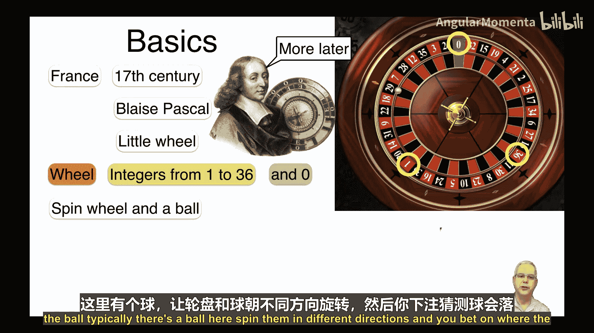
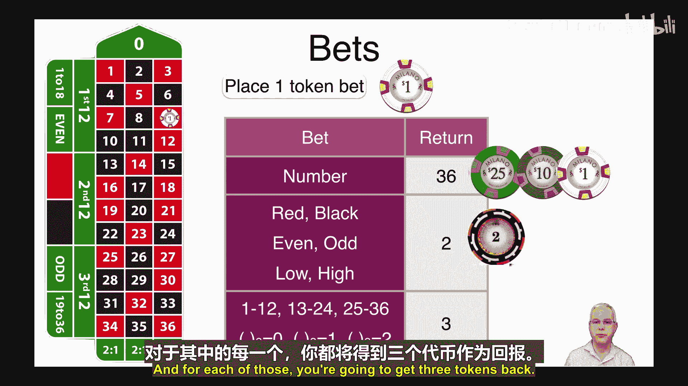
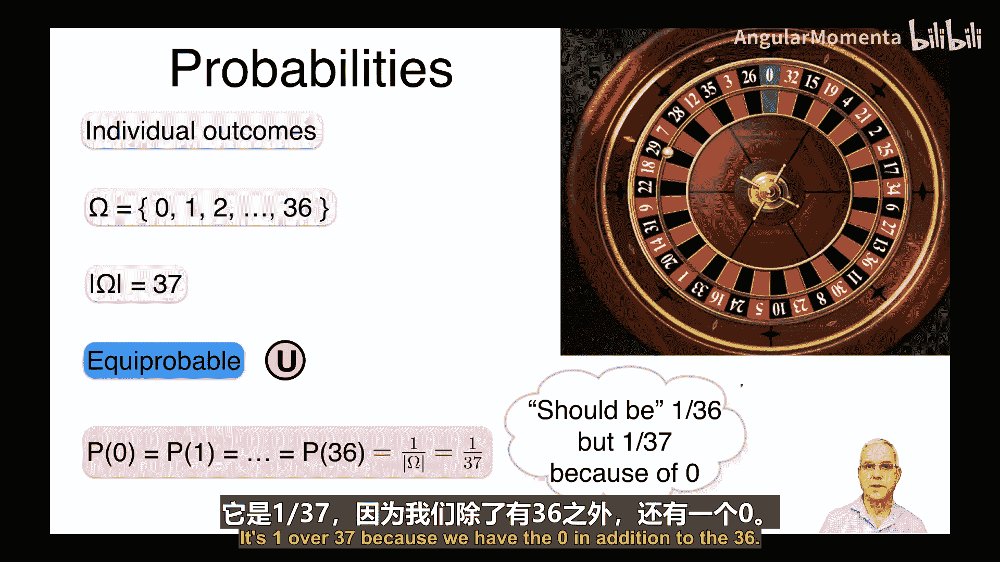
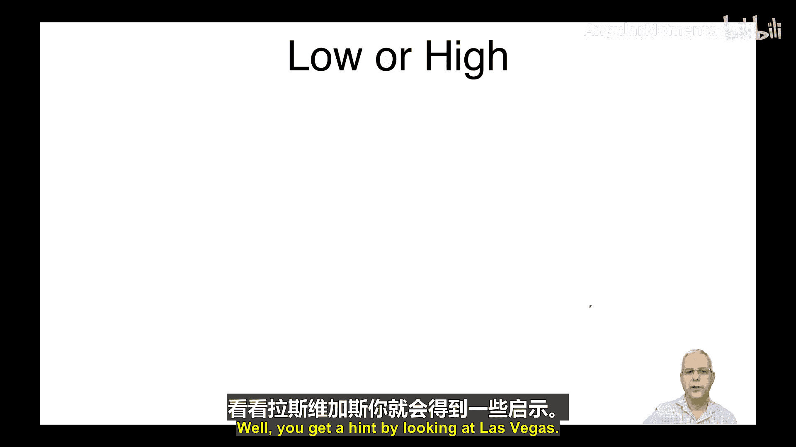

# 026：概率博弈 🎲

在本节课中，我们将应用之前学到的关于单个元素、事件、有放回与无放回抽样的概率知识，来计算几种游戏中的概率。这为我们提供了一个实验的机会，帮助我们更好地理解均匀概率空间以及不同结果和事件的概率。我们将讨论轮盘赌、多米诺骨牌、扑克和双陆棋等游戏。

---

## 轮盘赌：游戏规则与概率计算

上一节我们介绍了本课程的目标，本节中我们来看看第一个游戏：轮盘赌。我们将先讨论游戏的基本规则，然后计算相关概率，最后分析玩家的预期收益。

轮盘赌于17世纪在法国发明，据说是由布莱士·帕斯卡（Blaise Pascal）所创。我们将在本课程后续再次提到帕斯卡。他当时试图研究永动机，在此过程中发明了轮盘赌。其名称“Roulette”来源于法语，意为“小轮子”。

轮盘如图所示，包含从1到36的整数，以及一个通常显示为绿色的数字0。游戏时，旋转轮盘和一个小球，玩家对小球最终停留的位置进行下注。例如，图中小球停在了数字25上。

轮盘赌有不同的种类，这里我们讨论的是法式（也称欧式）轮盘。美式轮盘则额外多了一个“00”。当然，还有俄式轮盘，但我们不在此讨论。

以下是你可以进行的投注类型。如图所示是轮盘赌的赌桌，你可以在不同位置放置筹码。例如，你可以将筹码放在单个数字上（如图中数字9）。如果结果命中该数字，你投入1个筹码，将获得36个筹码的回报。

你也可以押注结果为红色或黑色，或者数字为偶数或奇数（如2、4、6等），或者数字为小（1-18）或大（19-36）。在这些情况下，你将获得2个筹码的回报（即净赚1个）。

你还可以押注数字范围，例如1-12（图中第二列）、13-24（中间列）或25-36（最后一列）。或者，你可以押注数字除以3的余数是0、1或2。对于这些范围投注，你将获得3个筹码的回报。

---

## 计算概率：从单个结果到复合事件

现在让我们计算不同结果的概率。首先从单个结果开始。

样本空间由数字0到36组成，共有37个可能结果。每个结果出现的可能性相同，因此这是一个均匀（或等可能）概率空间。根据均匀性，每个元素（从0到36）的概率是样本空间大小的倒数，即 **1/37**。

注意，我们可能认为有36个数字，概率应是1/36。但实际上由于存在数字0，概率略小，为1/37。

现在讨论一些事件。例如，押注“结果为偶数”这个事件，其包含的有利结果为2, 4, ..., 36。该事件的大小（有利结果的数量）是18（36除以2）。注意，数字0不计入偶数。

因此，根据均匀性，“结果为偶数”的概率是事件大小除以样本空间大小，即 **18/37**。这很合理，因为有37种可能结果（包括0），但只有18种算作偶数。你可能会认为概率应该是1/2，但由于0的存在，它略小于一半，不是18/36，而是18/37。

类似地，“奇数”、“红色”、“黑色”、“1-18”、“19-36”这些事件的大小都是18，因此每个事件的概率都是 **18/37**。

对于“1-12”、“13-24”、“25-36”或“模3余数为0、1、2”这些事件，每个事件的大小是12，因此概率为 **12/37**。

---

## 预期收益分析：你会赢还是输？

接下来分析在轮盘赌中你能期望赢或输多少钱。单次游戏随机性很大，难以断言。因此，我们假设你玩很多次游戏，比如去赌场玩一周，然后观察在这个过程中你预期会赚取或损失多少。

为简化计算，我们假设每次下注1美元（下注2美元等额情况原理类似）。我们将考虑两种类型的投注。

**第一种情况：始终押注单个数字**
假设你总是押注同一个数字，例如数字6。你将筹码放在数字6上。

设游戏总次数为 `n`，并假设 `n` 非常大。计算你将获得多少美元。
*   你每次下注1美元，因此总下注金额为 `n` 美元（确定值）。
*   你的回报是随机的。但由于每次押中的概率是 `1/37`，根据大数定律，在大量游戏中，你押中的次数大致为 `n/37` 次。
*   每次押中，你获得36美元。因此，你获得的总回报大约是 `36 * (n/37)` 美元。
*   你的净收益（或损失）是总回报减去总下注：`36*(n/37) - n = -n/37` 美元。
*   这意味着你在亏损。平均每次游戏，你损失 `1/37 ≈ 0.027` 美元，即约为下注金额的 **2.7%**。

这个比例也是赌场赚取的比例，称为 **庄家优势** 或 **赌场优势**。每次你在单个数字上下注，平均而言，赌场会获得下注额的2.7%，而你则损失2.7%。这额外的优势正是来自数字0。

**第二种情况：始终押注红色**
现在假设你总是将赌注押在红色上。

*   你每次仍下注1美元，总下注金额为 `n` 美元。
*   押中红色的概率是 `18/37`，因此押中的次数大约为 `(18/37)*n` 次。
*   每次押中，你获得2美元（净赚1美元）。因此，总回报大约是 `2 * (18/37)*n = (36/37)*n` 美元。
*   净收益为：`(36/37)*n - n = -n/37` 美元。

结果与押注单个数字完全相同！你仍然平均每次损失下注额的 **2.7%**，庄家优势依然是2.7%。在本课程后面，我们将探讨为何这些数字相同，以及它们何时会不同。

---

## 庄家优势对比：轮盘赌在赌场游戏中处于什么水平？

现在，我们评估一下2.7%这个数字是高还是低。首先将其与其他赌场游戏进行对比。

以下是不同赌场游戏的庄家优势数据。我们计算的轮盘赌（欧式）优势是2.7%。如图所示，有些游戏的庄家优势更低，有些则更高，但轮盘赌处于常见游戏的范围内。图表显示轮盘赌的庄家优势在2.7%到5.26%之间，其中5.26%对应的是有“0”和“00”的美式轮盘赌。我们留作练习，让你计算美式轮盘赌的赔率。图表中还列出了标准差（Sigma），我们将在后续课程中讨论。

那么，2.7%这个数字算小还是算大呢？看看拉斯维加斯的景象，你或许能得到一些提示。

如果这还不够，那么看看澳门，你会得到更明显的提示。

即使如此，若仍不足以判断这些利润是高是低，你可以做一个简单的核查：去年美国人仅在赌博上就损失了近1200亿美元。这就是2.7%的庄家优势累积起来的结果，正是这些利润建造了所有这些豪华赌场。你可以由此推断人们总共损失了多少钱。

---

## 本节总结与下节预告

本节课中，我们一起学习了轮盘赌的基础知识，计算了一些简单的概率，并分析了在长期多次游戏中玩家的预期收益。我们看到，由于庄家优势的存在，玩家平均而言总是处于亏损状态。

下一节，我们将讨论多米诺骨牌游戏中的概率。