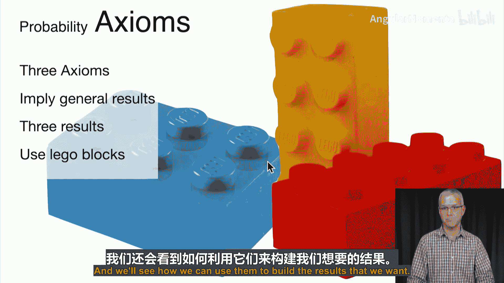
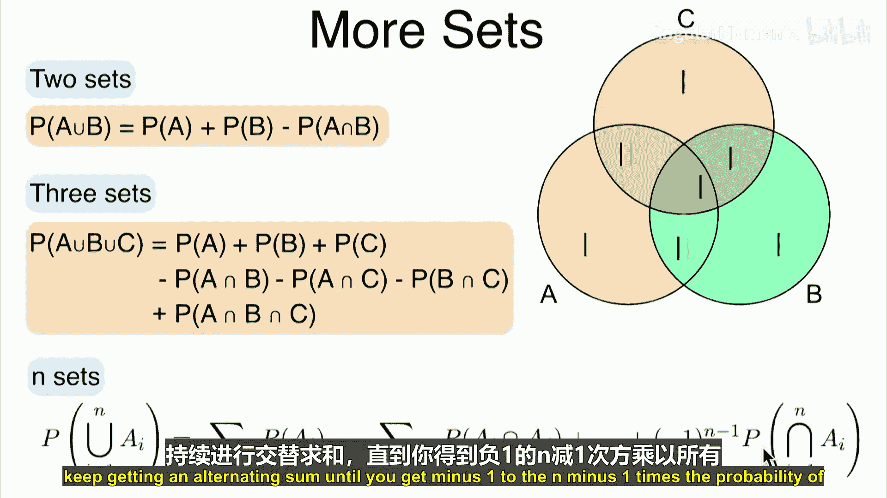
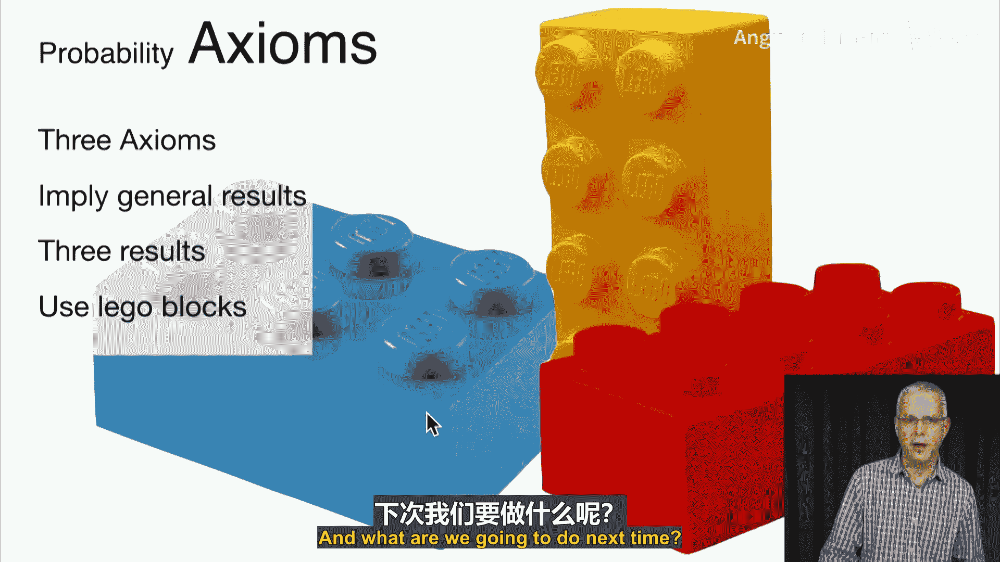

# 027：概率公理体系 🧱

在本节课中，我们将学习概率论的三个基本公理。我们将看到，仅凭这三个简单的“基石”，就能推导出之前讨论过的许多概率性质，例如补集规则、减法规则和容斥原理。

## 概述

上一节我们讨论了概率的各种性质。现在，我们将从一个全新的角度出发，通过定义一组公理来构建整个概率论体系。我们将介绍三个核心公理，并证明它们可以推导出我们之前观察到的所有一般性结果。

## 三个基本公理

以下是概率论的三个基本公理，它们构成了我们所有推理的基础。

### 公理一：非负性

对于样本空间 Ω 中的任何事件 A，其概率至少为零。这非常自然，因为根据概率的频率解释，概率是事件发生次数与总试验次数的比值，这个比值永远不会是负数。

**公式表示：**
对于任意事件 A，有 **P(A) ≥ 0**。

### 公理二：归一性

整个样本空间 Ω 的概率为 1。这同样符合直觉：在所有试验中，样本空间（即所有可能结果的集合）总是发生的。

**公式表示：**
**P(Ω) = 1**。

### 公理三：可加性（加法规则）

如果两个事件 A 和 B 互斥（即没有共同元素），那么它们并集的概率等于各自概率之和。这个公理有一个更一般的形式：对于任意可数个互斥事件 A₁, A₂, ...，其并集的概率等于各事件概率之和。

**公式表示：**
若 A ∩ B = ∅，则 **P(A ∪ B) = P(A) + P(B)**。
更一般地，对于可数个互斥事件，有 **P(⋃ᵢ Aᵢ) = Σᵢ P(Aᵢ)**。

## 从公理推导重要规则

现在，我们将像搭积木一样，仅使用上述三个公理来构建几个重要的概率规则。

### 1. 补集规则

首先，我们推导补集规则。回忆一下，对于任何事件 A，A 与其补集 Aᶜ 的并集是整个样本空间 Ω，即 A ∪ Aᶜ = Ω。同时，A 和 Aᶜ 是互斥的。

以下是推导步骤：
1.  根据归一性公理：**P(Ω) = 1**。
2.  因为 A ∪ Aᶜ = Ω，所以 **P(A ∪ Aᶜ) = P(Ω) = 1**。
3.  因为 A 和 Aᶜ 互斥，根据可加性公理：**P(A ∪ Aᶜ) = P(A) + P(Aᶜ)**。
4.  结合第2步和第3步：**P(A) + P(Aᶜ) = 1**。
5.  因此，我们得到补集规则：**P(Aᶜ) = 1 - P(A)**。

**推导总结：**
这个规则仅使用了**可加性**和**归一性**两个公理。

### 2. 减法规则（嵌套集合）

接下来，我们推广补集规则。首先考虑嵌套集合的情况，即当事件 A 是事件 B 的子集时（A ⊆ B）。

我们的目标是证明：**P(B \ A) = P(B) - P(A)**。（符号“\”表示集合差）

推导过程如下：
1.  当 A ⊆ B 时，B 可以表示为 A 与 (B \ A) 的并集，即 **B = A ∪ (B \ A)**。
2.  由于 A 和 (B \ A) 是互斥的，根据可加性公理：**P(B) = P(A) + P(B \ A)**。
3.  将 P(A) 移到等式另一边，即得：**P(B \ A) = P(B) - P(A)**。

**推导总结：**
这个规则仅使用了**可加性**公理。

### 3. 减法规则（一般集合）

现在，我们将减法规则推广到任意两个事件 A 和 B（不一定嵌套）。

我们的目标是证明：**P(B \ A) = P(B) - P(A ∩ B)**。

推导过程如下：
1.  观察可知，集合 B \ A 等于 B \ (A ∩ B)。（从 B 中减去 A 与 B 的交集，效果等同于减去整个 A 在 B 中的部分）。
2.  注意，A ∩ B 是 B 的子集。因此，我们可以应用上一步的**嵌套集合减法规则**。
3.  将 A ∩ B 视为嵌套情况下的 A，得到：**P(B \ (A ∩ B)) = P(B) - P(A ∩ B)**。
4.  结合第1步，即得：**P(B \ A) = P(B) - P(A ∩ B)**。

**推导总结：**
这个规则也仅使用了**可加性**公理（因为嵌套集合的减法规则由可加性推导而来）。

### 4. 容斥原理

最后，我们推导概率论中非常重要的容斥原理。对于任意两个事件 A 和 B，容斥原理表述为：
**P(A ∪ B) = P(A) + P(B) - P(A ∩ B)**

推导过程如下：
1.  观察可知，A ∪ B 可以写成 A 与 (B \ A) 的并集，即 **A ∪ B = A ∪ (B \ A)**。
2.  由于 A 和 (B \ A) 互斥，根据可加性公理：**P(A ∪ B) = P(A) + P(B \ A)**。
3.  将上一步推导的**一般集合减法规则**代入：P(B \ A) = P(B) - P(A ∩ B)。
4.  因此，**P(A ∪ B) = P(A) + P(B) - P(A ∩ B)**。

**直观理解：**
如果简单地将 P(A) 和 P(B) 相加，那么 A 与 B 交集部分的概率被计算了两次。因此，需要减去一次 P(A ∩ B) 来修正。

**推导总结：**
容斥原理的推导综合使用了**可加性**公理和**减法规则**（而减法规则本身也源自可加性），因此本质上只用了可加性这一个“积木块”。

## 容斥原理的扩展

以上我们推导了两个集合的容斥原理。对于更多集合，原理是类似的，它是一个交替求和的过程。

*   **三个集合（A, B, C）的容斥原理：**
    **P(A ∪ B ∪ C) = P(A) + P(B) + P(C) - P(A∩B) - P(A∩C) - P(B∩C) + P(A∩B∩C)**

*   **直观解释（三个集合）：**
    先加三个事件的概率，但这样两两交集部分被加了两次，所以需要减去一次所有两两交集的概率。然而，三个事件的共同交集部分在“加”的步骤中被加了三次，在“减”的步骤中又被减了三次，相当于没有被计算，所以最后需要再加回来一次。

*   **n个集合的一般形式：**
    n个集合并集的概率，等于所有单个集合的概率之和，减去所有两两交集概率之和，加上所有三三交集概率之和，……，以此类推，直到加上 (-1)ⁿ⁻¹ 乘以所有n个集合交集的概率。

## 总结

本节课中，我们一起学习了概率论的三个基本公理：**非负性**、**归一性**和**可加性**。我们演示了如何仅用这一两个简单的公理作为“基石”，像搭积木一样严谨地推导出**补集规则**、**减法规则**和**容斥原理**等重要结论。这展示了公理化体系的强大与简洁：所有复杂的概率性质都可以从这几个基本假设出发逻辑地推导出来。