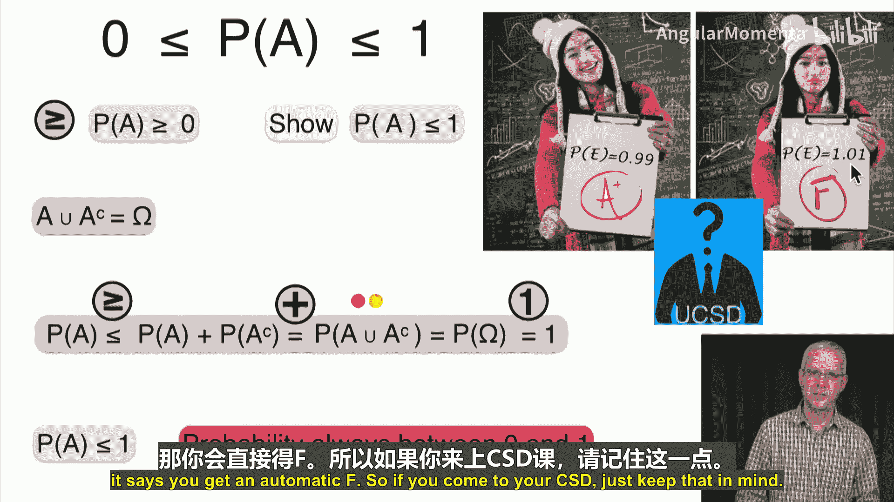
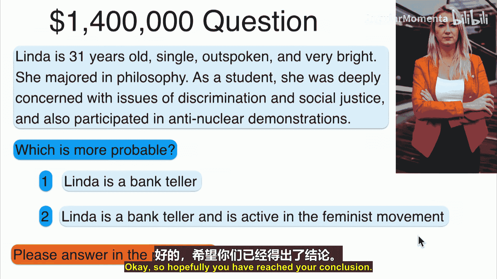
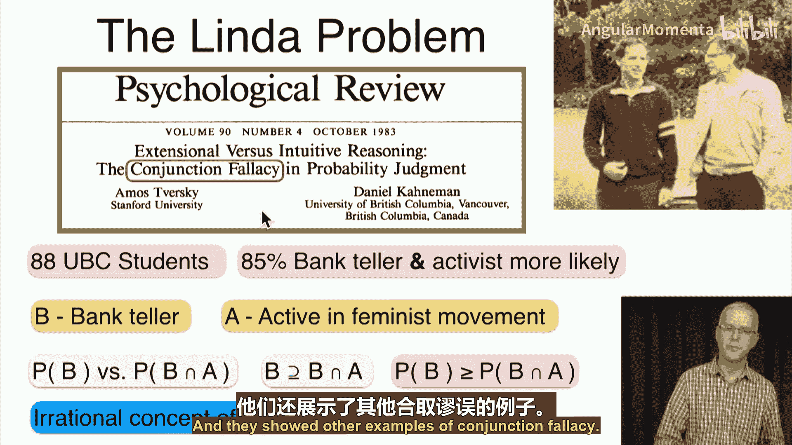
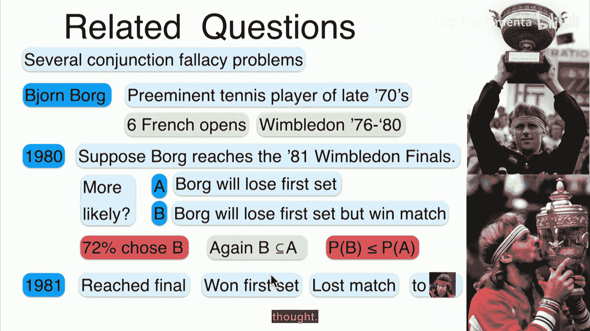
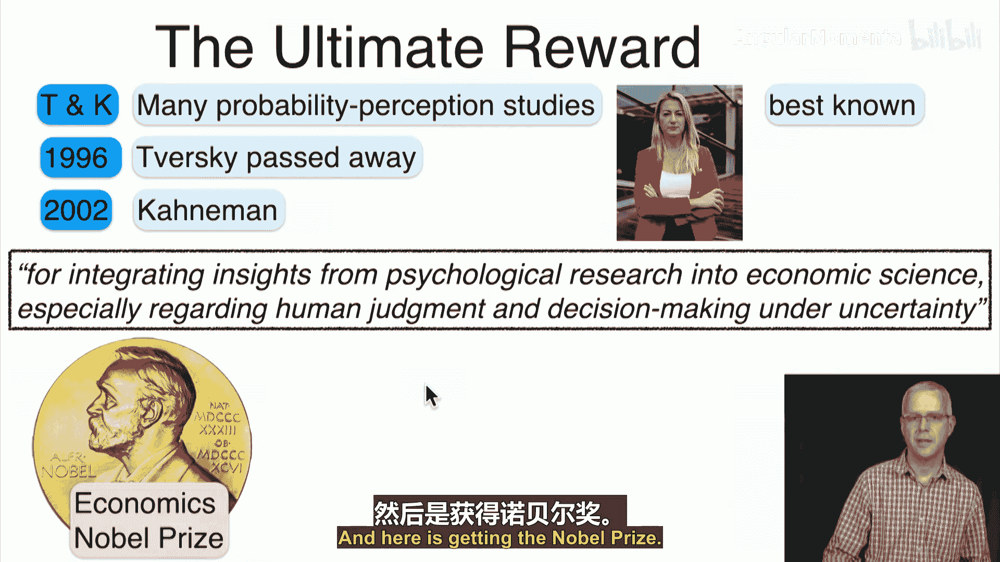
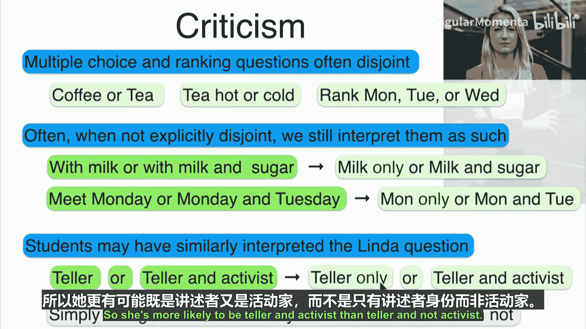
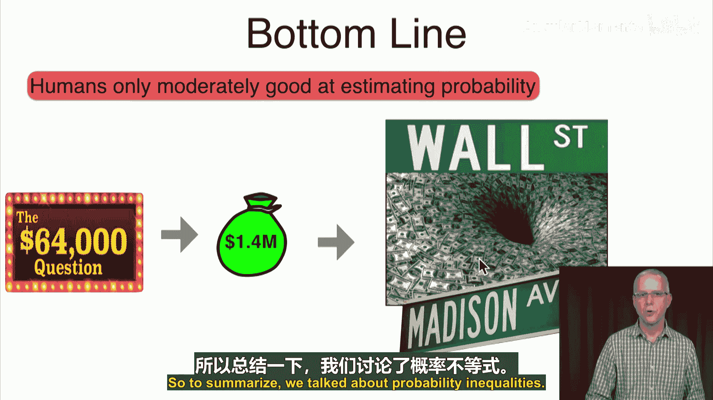

# 028：不等式 📊

在本节课中，我们将学习如何运用概率公理来证明一些重要的不等式。我们将从证明空集的概率为零开始，逐步推导出概率的通用界限、子集概率关系以及并集的概率界限。最后，我们将通过一个著名的“琳达问题”来探讨人类在概率判断中可能存在的误区。

## 空集的概率为零

上一节我们利用概率公理证明了一些等式，本节我们来看看如何证明不等式。首先，我们从证明空集的概率为零开始。

根据概率公理，样本空间Ω的概率为1。我们可以将Ω表示为空集∅与Ω本身的并集：`Ω = ∅ ∪ Ω`。由于∅与Ω互斥，根据可加性公理，有：
`P(Ω) = P(∅) + P(Ω)`
由于`P(Ω) = 1`，代入上式可得：
`1 = P(∅) + 1`
因此，`P(∅) = 0`。

这个结果很简单，它表明不可能事件的概率为零。

## 概率的通用界限

接下来，我们证明任何事件的概率都介于0和1之间。非负性公理已经告诉我们概率至少为0，所以我们只需证明概率至多为1。

对于任何事件A，其与补集A^c的并集是整个样本空间：`A ∪ A^c = Ω`。由于A和A^c互斥，根据可加性公理：
`P(Ω) = P(A) + P(A^c)`
即：
`1 = P(A) + P(A^c)`
由于`P(A^c) ≥ 0`（非负性公理），因此：
`P(A) = 1 - P(A^c) ≤ 1`
所以，对于任何事件A，有：
`0 ≤ P(A) ≤ 1`

这个结果被称为概率的通用界限。

## 子集的概率关系

现在，我们探讨子集与其超集的概率关系。如果事件A是事件B的子集（`A ⊆ B`），那么A的概率不会超过B的概率。

因为A是B的子集，所以B可以表示为A与差集`B \ A`的并集：`B = A ∪ (B \ A)`，且A与`B \ A`互斥。根据可加性公理：
`P(B) = P(A) + P(B \ A)`
由于`P(B \ A) ≥ 0`，因此：
`P(B) ≥ P(A)`
即：
`如果 A ⊆ B，则 P(A) ≤ P(B)`

## 并集的概率界限

对于两个事件A和B的并集，其概率存在一个下界和一个上界。

以下是关于并集概率的两个重要不等式：

*   **下界**：并集的概率至少等于两个事件概率的最大值。
    `P(A ∪ B) ≥ max(P(A), P(B))`
    **证明**：因为`A ⊆ (A ∪ B)`且`B ⊆ (A ∪ B)`，根据子集概率关系，有`P(A) ≤ P(A ∪ B)`和`P(B) ≤ P(A ∪ B)`。因此，两者的最大值也小于等于`P(A ∪ B)`。

*   **上界（容斥原理与并界）**：并集的概率至多等于两个事件概率之和。
    `P(A ∪ B) ≤ P(A) + P(B)`
    **证明**：根据容斥原理，`P(A ∪ B) = P(A) + P(B) - P(A ∩ B)`。由于`P(A ∩ B) ≥ 0`，减去一个非负数会使结果变小，因此`P(A ∪ B) ≤ P(A) + P(B)`。

这个上界`P(A ∪ B) ≤ P(A) + P(B)`被称为**并界**，它在概率论中非常有用，常被用来证明许多有趣的结果。

## 案例分析：琳达问题与合取谬误

掌握了以上不等式后，我们来看一个著名的思想实验——“琳达问题”，它揭示了人类概率判断中的一个常见误区。

琳达的描述是：31岁，单身，坦率，聪明。大学主修哲学，学生时期深切关注歧视与社会正义问题，并参加过反核示威。

问题是：以下哪种情况可能性更高？
1.  琳达是银行出纳。
2.  琳达是银行出纳并且是活跃的女权主义者。

令事件B表示“琳达是银行出纳”，事件A表示“琳达是活跃的女权主义者”。那么选项2对应的事件是`B ∩ A`。

显然，`(B ∩ A) ⊆ B`。根据我们刚刚证明的子集概率关系，必然有：
`P(B ∩ A) ≤ P(B)`
也就是说，选项2的概率**不可能高于**选项1的概率。

然而，当特沃斯基和卡尼曼对88名学生进行测试时，85%的人认为选项2更可能。这种认为两个事件同时发生的概率高于其中单个事件概率的认知偏差，被称为**合取谬误**。

研究者还提出了其他例子，例如关于网球明星博格的问题，也出现了类似大比例的判断错误。特沃斯基和卡尼曼因在“不确定条件下的人类判断和决策”研究方面的贡献，于2002年获得了诺贝尔经济学奖。

当然，对“琳达问题”也存在批评，例如有人认为问题表述可能被误解为互斥选项（“仅是出纳” vs “出纳兼活动家”）。但无论如何，这个案例清晰地表明，人类对概率的直觉判断并不总是可靠的，而理解并运用严谨的概率规则则至关重要。

## 总结

本节课我们一起学习了概率论中的几个重要不等式：
1.  证明了空集的概率`P(∅) = 0`。
2.  推导出概率的通用界限：任何事件的概率满足`0 ≤ P(A) ≤ 1`。
3.  证明了子集概率关系：如果`A ⊆ B`，则`P(A) ≤ P(B)`。
4.  推导了并集的概率界限：`max(P(A), P(B)) ≤ P(A ∪ B) ≤ P(A) + P(B)`，其中上界即**并界**。
5.  通过“琳达问题”分析了**合取谬误**，认识到基于严谨数学规则进行概率推理的重要性。

下一节课，我们将讨论条件概率。