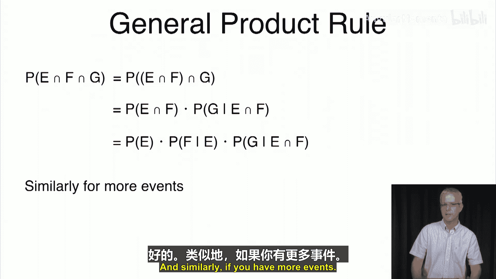

# 029：条件概率

在本节课中，我们将学习概率论中的一个重要概念——条件概率。我们常常会获得关于世界的部分信息，并希望利用这些信息来获得更准确的概率估计。条件概率能帮助我们理解，在已知某些事件发生的情况下，其他事件发生的概率如何变化。

## 条件概率的直观定义

上一节我们介绍了基础概率，本节中我们来看看条件概率。条件概率是指，在已知某个事件E发生的前提下，另一个事件F发生的概率。

我们将其定义为：在所有事件E发生的情况下，事件F也发生的比例。

例如，考虑一个公平的骰子。我们想知道，在已知掷出结果为偶数的条件下，掷出数字2的概率。我们会观察一长串掷骰结果，找出所有结果为偶数的掷次（如2，4，6等），然后计算在这些掷次中，结果为2的比例。如果偶数结果有6次，其中2出现了2次，那么这个条件概率就是2/6，即1/3。

## 骰子示例

以下是几个使用骰子的条件概率计算示例：

*   **已知结果大于等于3，求结果为4的概率**：此时，可能的结果是3，4，5，6。由于这些结果等可能，结果为4的比例是1/4。
*   **已知结果小于等于3，求结果为4的概率**：此时，可能的结果是1，2，3。在这些结果中，4永远不会出现，因此概率为0。
*   **已知结果小于等于4，求结果小于等于2的概率**：可能的结果是1，2，3，4。我们关心的是结果为1或2的情况，因此概率是2/4，即1/2。
*   **已知结果大于等于2，求结果小于等于2的概率**：可能的结果是2，3，4，5，6。我们只关心结果为2的情况，因此概率是1/5。

注意，在某些情况下，条件信息会改变事件的概率。例如，当被告知结果小于等于4时，“结果小于等于2”的概率从1/3增加到了1/2。而当被告知结果大于等于2时，该事件的概率则从1/3下降到了1/5。

## 一般情况下的公式推导

以上是针对等可能样本空间（如公平骰子）的例子。在更一般的情况下，样本点可能具有不同的概率。

设E和F为两个事件。在已知事件E发生的前提下，事件F发生的条件概率记作 **P(F|E)**。

其计算公式为：
**P(F|E) = P(E ∩ F) / P(E)**

这个公式可以理解为：事件E和F同时发生的概率，占事件E发生总概率的比例。

## 非均匀概率示例

考虑一个四面骰子，其各面概率分别为：P(1)=0.1， P(2)=0.2， P(3)=0.3， P(4)=0.4。

现在计算：在已知结果小于等于3的条件下，结果大于等于2的概率。

根据公式：
P(结果≥2 | 结果≤3) = P(结果在2和3之间) / P(结果≤3)
= P({2, 3}) / P({1, 2, 3})
= (0.2 + 0.3) / (0.1 + 0.2 + 0.3)
= 0.5 / 0.6
= 5/6

## 乘法法则

从条件概率公式可以推导出一个非常有用的工具——乘法法则。

由 **P(F|E) = P(E ∩ F) / P(E)**， 可得：
**P(E ∩ F) = P(E) * P(F|E)**

这个法则可以帮助我们更简便地计算联合概率。

## 乘法法则应用：抽球问题

假设一个袋子里有1个蓝球和2个红球。我们不放回地连续抽取两个球。求两次都抽到红球的概率。

定义事件：
*   R1：第一次抽到红球。
*   R2：第二次抽到红球。

我们要求的是 P(R1 ∩ R2)。

使用乘法法则：
P(R1 ∩ R2) = P(R1) * P(R2|R1)

*   P(R1) = 2/3 （因为初始有3个球，2个红球）
*   在R1发生的条件下（即已抽走一个红球），袋中剩下1个蓝球和1个红球。因此，P(R2|R1) = 1/2。

所以，P(两次都是红球) = (2/3) * (1/2) = 1/3。

乘法法则可以推广到更多事件。例如，对于三个事件E， F， G：
**P(E ∩ F ∩ G) = P(E) * P(F|E) * P(G|E ∩ F)**

## 总结

本节课中我们一起学习了条件概率。我们了解到，条件概率 **P(F|E)** 描述了在已知事件E发生的情况下，事件F发生的可能性，其核心公式为 **P(F|E) = P(E ∩ F) / P(E)**。由此推导出的乘法法则 **P(E ∩ F) = P(E) * P(F|E)** 是计算联合概率的强大工具。在下一节中，我们将探讨另一个关键概念：事件的独立性。