# 030：独立性 🔗

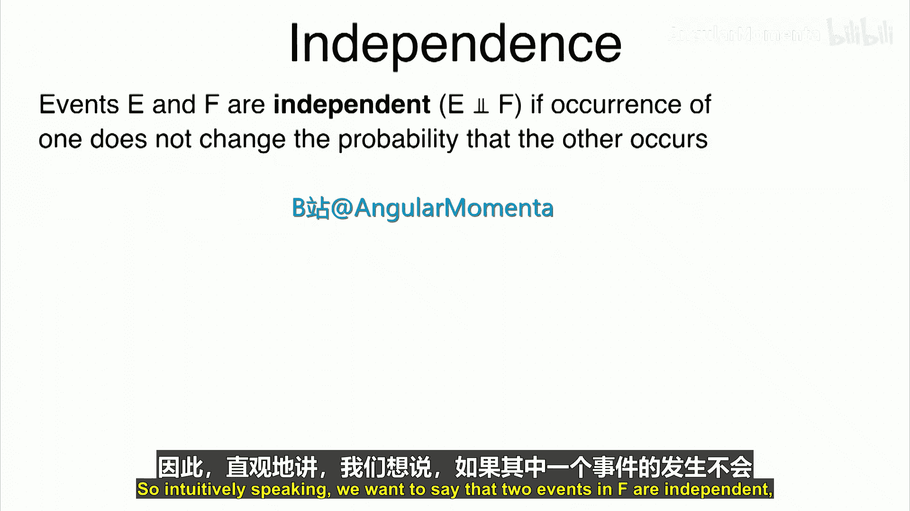

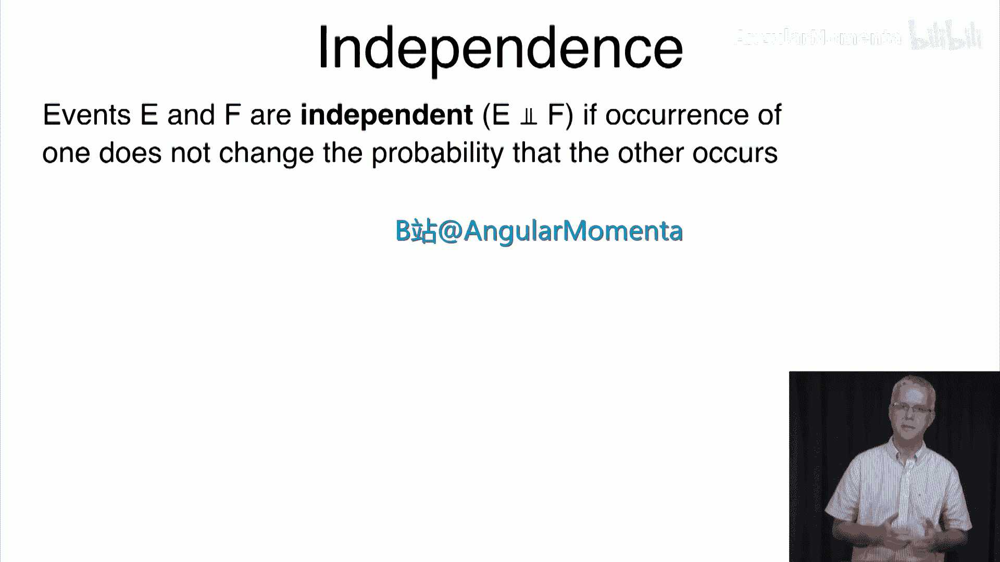

在本节课中，我们将要学习概率论中的一个核心概念：**独立性**。上一节我们介绍了条件概率，本节中我们来看看两个事件在何种情况下可以被认为是互不影响的，即相互独立。

## 独立性的直观理解与定义

直观地说，如果事件 **E** 的发生不会改变事件 **F** 发生的概率，我们就称事件 **E** 和 **F** 是独立的，记作 **E ⟂ F**。

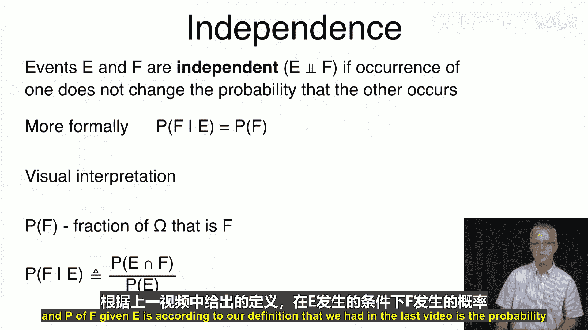

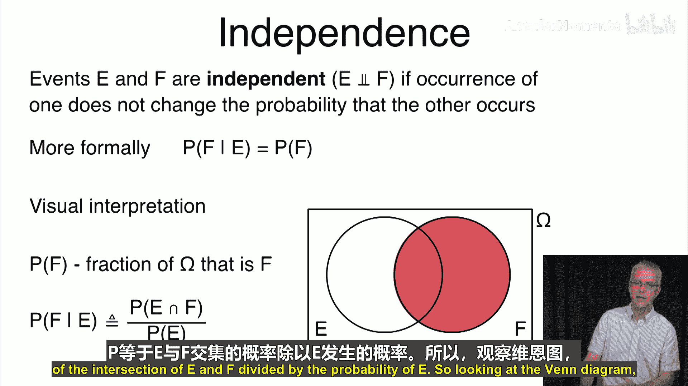

更正式地，如果 **P(F|E) = P(F)**，即已知 **E** 发生的情况下 **F** 发生的概率，等于 **F** 原本发生的概率，那么 **E** 和 **F** 就是独立的。

我们可以通过韦恩图来可视化理解：**P(F)** 是事件 **F** 的面积占整个样本空间 **Ω** 的比例。**P(F|E)** 是事件 **E** 和 **F** 的交集面积占事件 **E** 面积的比例。如果这两个比例相等，则意味着 **E** 的发生没有改变 **F** 发生的“相对大小”，即两者独立。

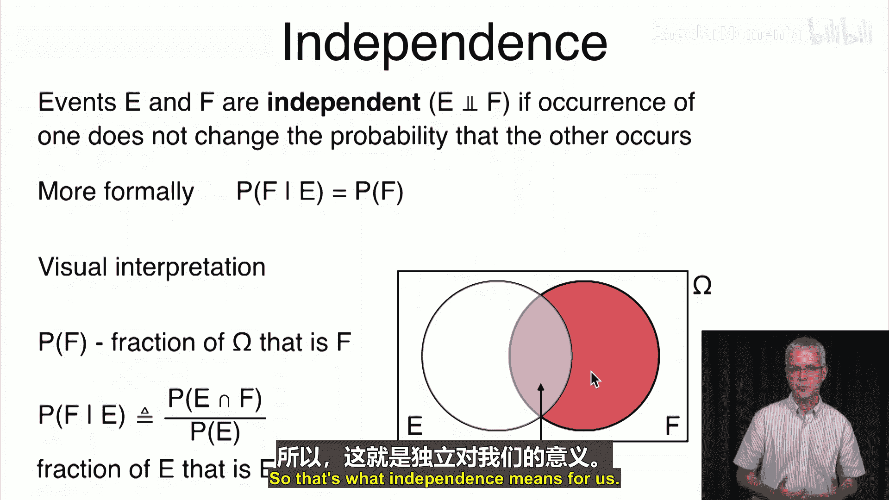

## 独立性的正式定义

上述基于条件概率的定义存在两个小问题：1）它不对称；2）当 **P(E) = 0** 时，**P(F|E)** 无定义。

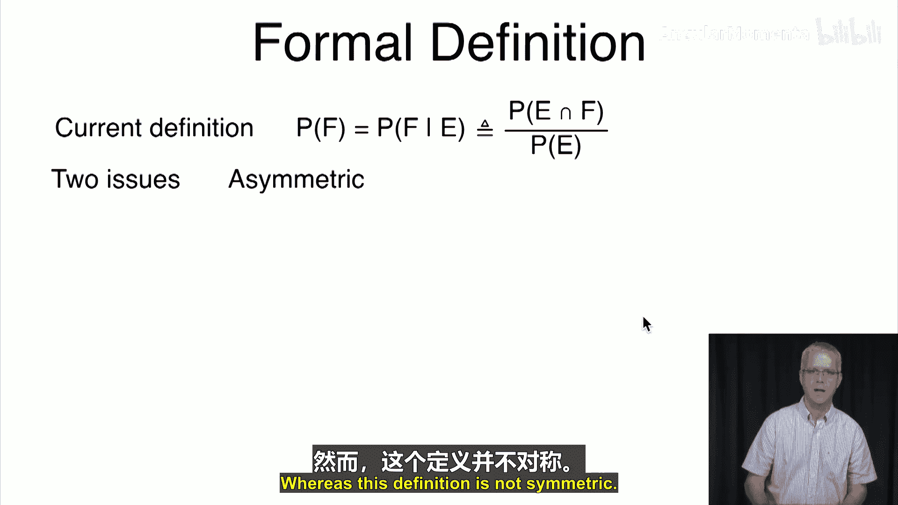

为了解决这些问题，我们采用一个更通用且对称的正式定义：

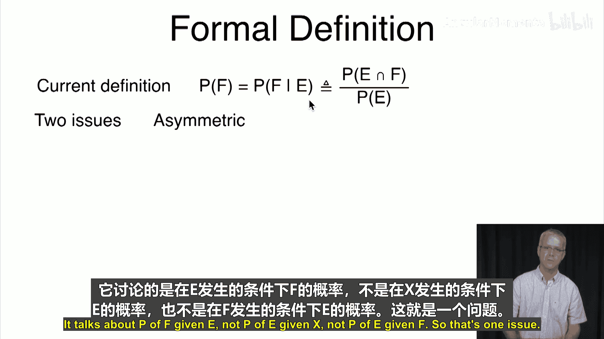

**事件 E 和 F 是独立的，当且仅当：**
**P(E ∩ F) = P(E) * P(F)**

这个定义是等价的（当 **P(E) ≠ 0** 时，两边同除以 **P(E)** 即可得到条件概率形式），并且它天然对称，也适用于概率为零的事件。

## 实例分析：骰子实验

让我们通过一个掷骰子的例子来辨别事件的独立性。定义三个事件：
*   **A（质数）**：点数为 2, 3, 5。**P(A) = 1/2**
*   **B（奇数）**：点数为 1, 3, 5。**P(B) = 1/2**
*   **C（平方数）**：点数为 1, 4。**P(C) = 1/3**

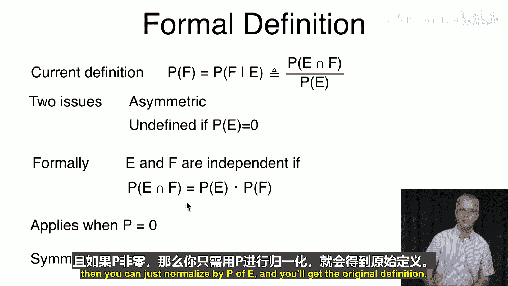

以下是判断它们是否独立的过程：

**1. 判断 A（质数）与 B（奇数）是否独立**
*   交集 **A ∩ B**：{3, 5}。**P(A ∩ B) = 2/6 = 1/3**
*   **P(A) * P(B) = (1/2) * (1/2) = 1/4**
*   因为 **1/3 ≠ 1/4**，所以事件 **A** 和 **B** 是**依赖**的。

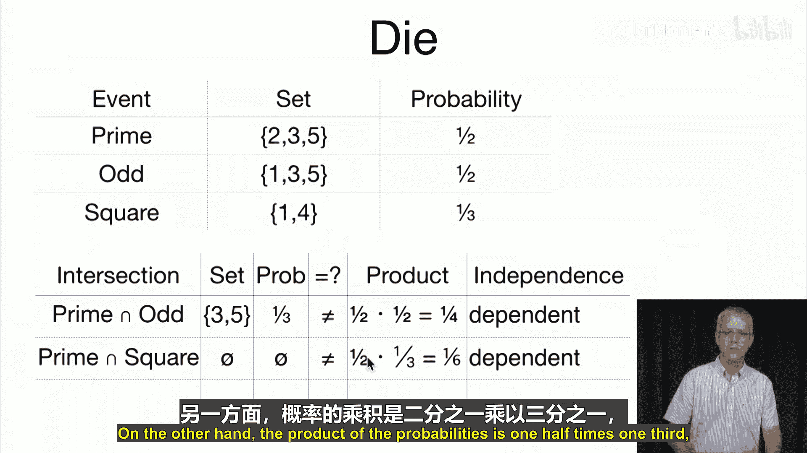

**2. 判断 A（质数）与 C（平方数）是否独立**
*   交集 **A ∩ C**：∅（空集，因为2,3,5中没有平方数）。**P(A ∩ C) = 0**
*   **P(A) * P(C) = (1/2) * (1/3) = 1/6**
*   因为 **0 ≠ 1/6**，所以事件 **A** 和 **C** 是**依赖**的。

**3. 判断 B（奇数）与 C（平方数）是否独立**
*   交集 **B ∩ C**：{1}。**P(B ∩ C) = 1/6**
*   **P(B) * P(C) = (1/2) * (1/3) = 1/6**
*   因为 **1/6 = 1/6**，所以事件 **B** 和 **C** 是**独立**的。这意味着，知道点数是奇数，不会改变它是平方数的概率（仍是1/3）；反之亦然。

## 实例分析：抛硬币实验

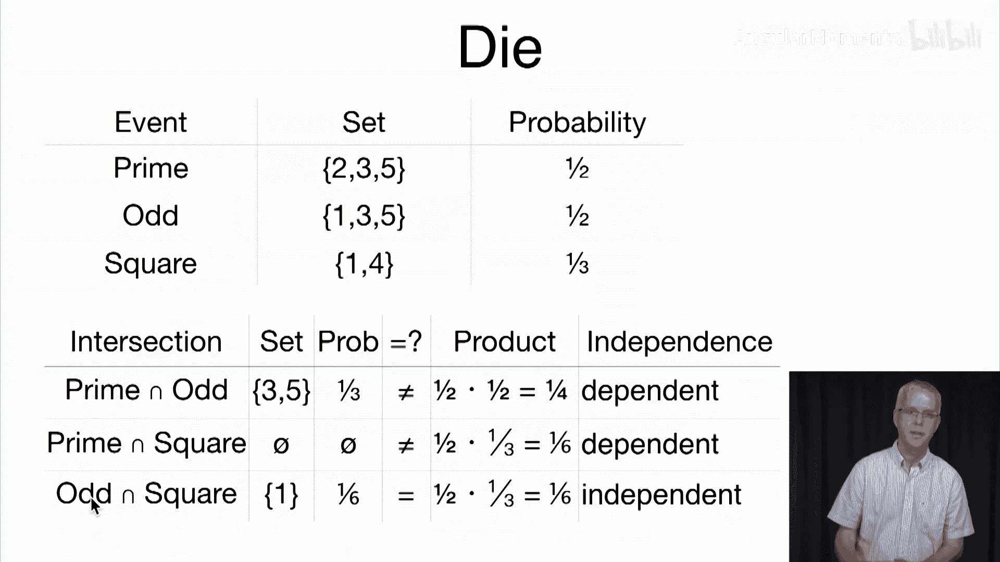

考虑抛三次硬币的样本空间。定义三个事件：
*   **H1**：第一次抛掷结果为正面。**P(H1) = 1/2**
*   **H2**：第二次抛掷结果为正面。**P(H2) = 1/2**
*   **D**：恰好有两次连续正面（即 HHT 或 THH）。**P(D) = 2/8 = 1/4**

以下是判断过程：

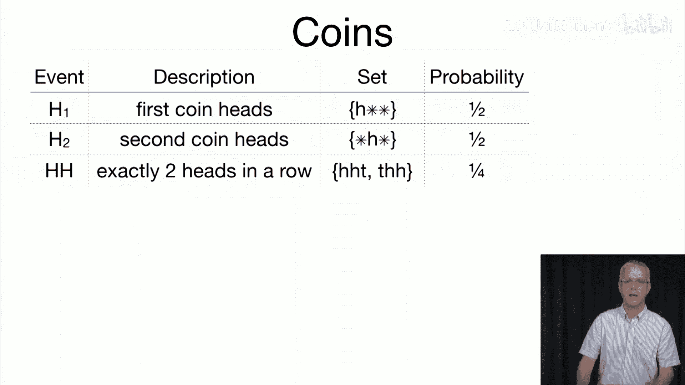

**1. 判断 H1 与 H2 是否独立**
*   交集 **H1 ∩ H2**：第一次和第二次都是正面（HHH, HHT）。**P(H1 ∩ H2) = 2/8 = 1/4**
*   **P(H1) * P(H2) = (1/2) * (1/2) = 1/4**
*   等式成立，因此 **H1** 和 **H2** 是**独立**的。

**2. 判断 H2 与 D 是否独立**
*   交集 **H2 ∩ D**：第二次是正面且恰好有两次连续正面（HHT, THH）。**P(H2 ∩ D) = 2/8 = 1/4**
*   **P(H2) * P(D) = (1/2) * (1/4) = 1/8**
*   因为 **1/4 ≠ 1/8**，所以 **H2** 和 **D** 是**依赖**的。知道第二次是正面，会增加出现连续两次正面的可能性。

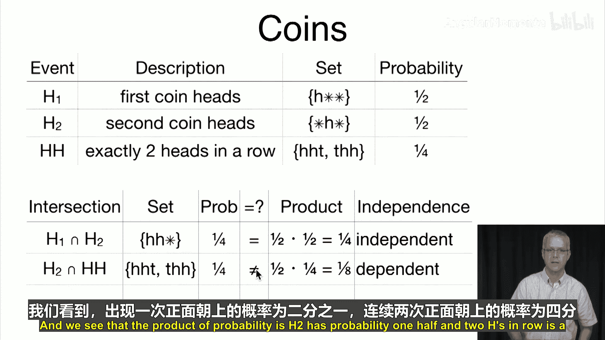

**3. 判断 H1 与 D 是否独立**
*   交集 **H1 ∩ D**：第一次是正面且恰好有两次连续正面（HHT）。**P(H1 ∩ D) = 1/8**
*   **P(H1) * P(D) = (1/2) * (1/4) = 1/8**
*   等式成立，因此 **H1** 和 **D** 是**独立**的。

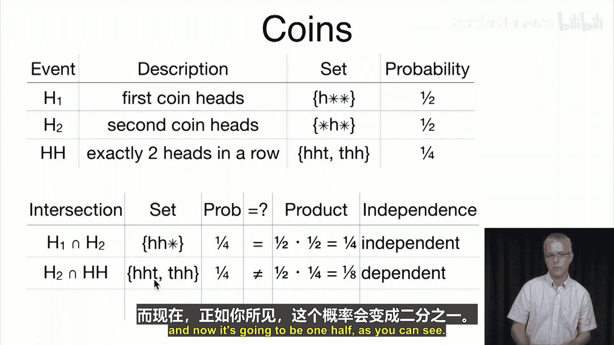

## 总结

本节课中我们一起学习了**事件的独立性**。
*   独立性描述了两个事件互不影响的关系。
*   其核心定义是：**P(E ∩ F) = P(E) * P(F)**。
*   判断独立性是一个纯粹的统计计算过程，通过比较交集的概率与各自概率的乘积即可得出结论。
*   独立性并不意味着事件之间没有逻辑关联，只意味着它们发生的概率在统计上互不影响。

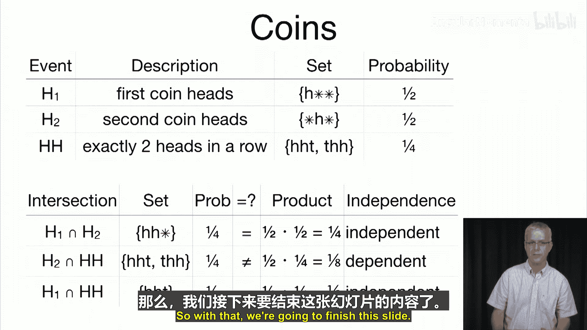

下一节，我们将探讨概率论中另一个非常重要的定理：贝叶斯定理。