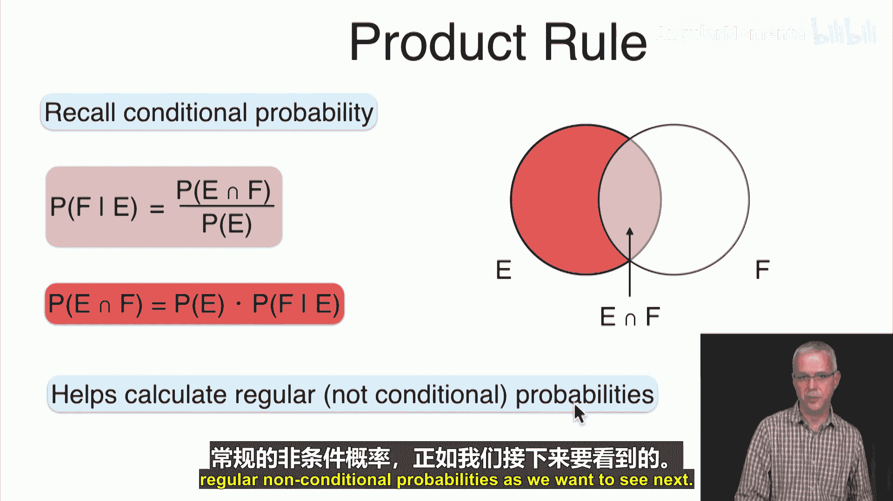
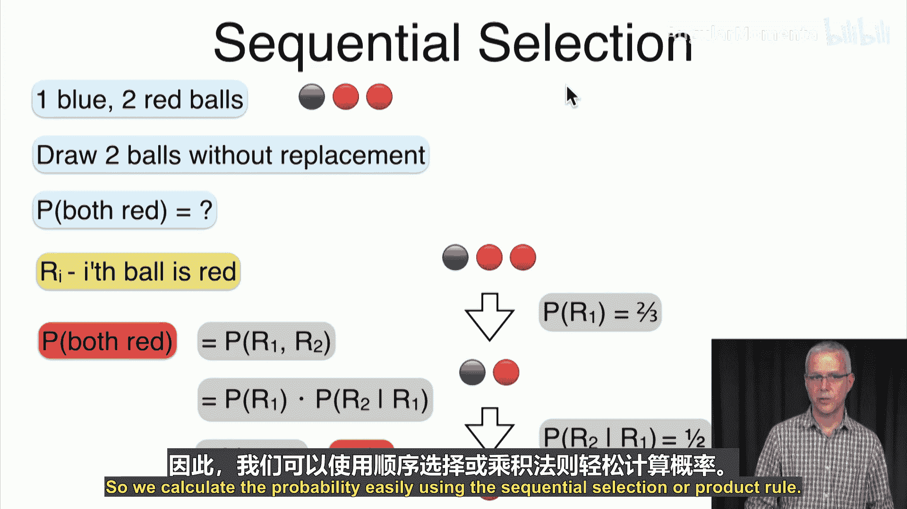
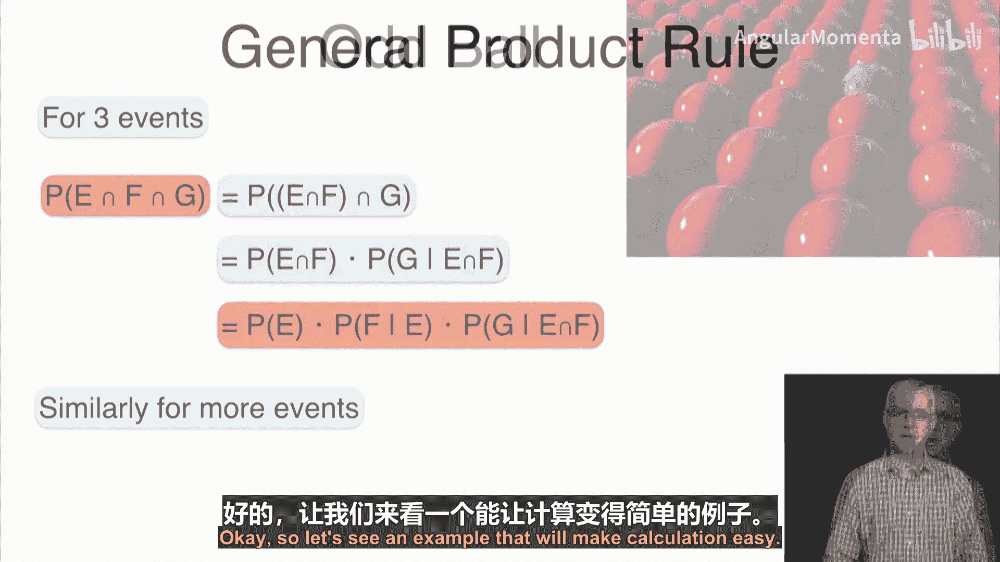
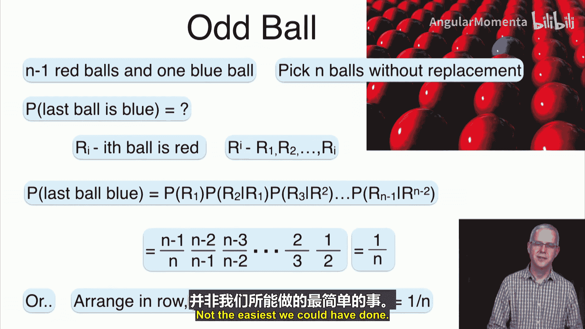
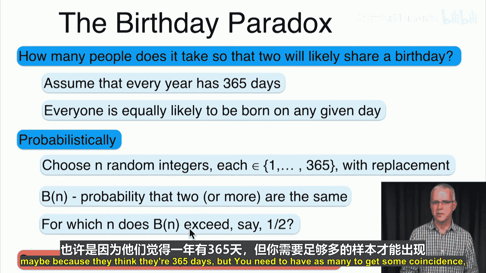
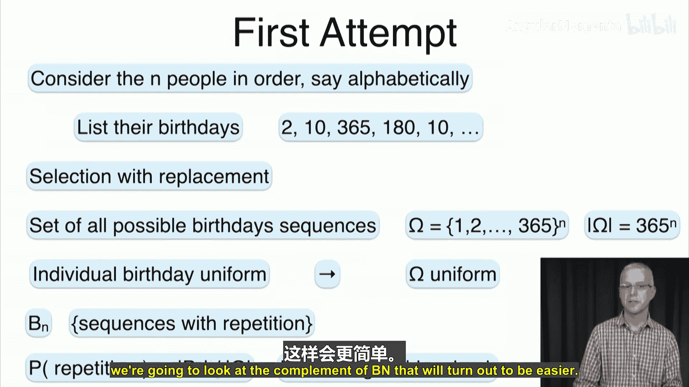
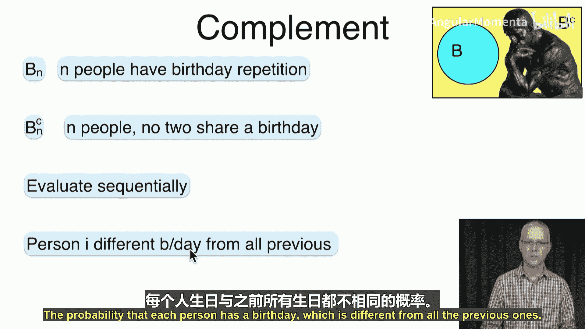
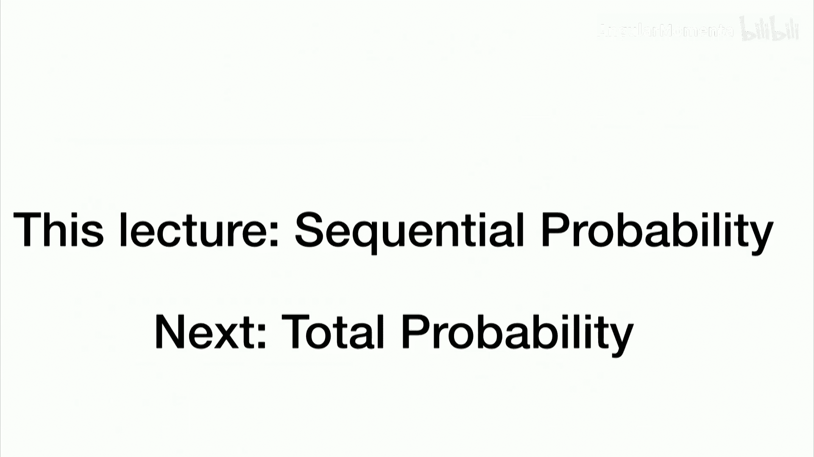

# 031：序列概率 🧮

在本节课中，我们将学习序列概率，重点介绍**乘积法则**及其在解决一系列连续事件概率问题中的应用。我们将从基础概念出发，通过几个经典例子来理解如何计算连续事件的概率。

## 概述

上一节我们介绍了条件概率。本节中，我们来看看如何利用条件概率的乘积法则来计算一系列事件依次发生的概率，即序列概率。我们将从两个事件的简单情况开始，逐步推广到多个事件，并通过实际例子来掌握其应用。

## 乘积法则

回忆条件概率的结果。事件F在事件E已发生条件下发生的概率，是E与F交集的概率除以E的概率。公式表示为：
`P(F|E) = P(E ∩ F) / P(E)`

我们可以重新排列这个公式，得到**乘积法则**：
`P(E ∩ F) = P(E) * P(F|E)`

这个公式的含义是：两个事件E和F同时发生的概率，等于事件E发生的概率乘以在E发生的条件下事件F发生的概率。

## 序列选择示例

让我们看一个序列选择的案例。假设你有一个蓝球和两个红球。我们不放回地抽取两个球。问题是：两个球都是红色的概率是多少？

定义事件：
*   `R1`：第一次抽到红球。
*   `R2`：第二次抽到红球。

我们感兴趣的概率是 `P(R1 且 R2)`。根据乘积法则，这可以写为：
`P(R1 且 R2) = P(R1) * P(R2 | R1)`

以下是计算步骤：
1.  **计算 `P(R1)`**：总共有3个球，其中2个是红的。因此，`P(R1) = 2/3`。
2.  **计算 `P(R2 | R1)`**：假设第一次抽到了红球，那么袋子里剩下1个蓝球和1个红球。因此，`P(R2 | R1) = 1/2`。
3.  **计算最终概率**：`P(两个都是红球) = (2/3) * (1/2) = 1/3`。

我们利用乘积法则轻松地计算出了概率。

## 推广到多个事件

乘积法则可以推广到两个以上的事件。对于三个事件E、F、G，其同时发生的概率为：
`P(E ∩ F ∩ G) = P(E) * P(F|E) * P(G|E ∩ F)`

这个模式可以继续推广：一系列事件依次发生的概率，等于第一个事件发生的概率，乘以在第一个事件发生条件下第二个事件发生的概率，再乘以在前两个事件都发生条件下第三个事件发生的概率，依此类推。

让我们看一个例子。假设有 `n-1` 个红球和1个蓝球，总共 `n` 个球。我们不放回地抽取所有球。问题是：最后一个球是蓝球的概率是多少？

定义事件 `R_i` 为第 `i` 次抽到红球。那么，最后一个球是蓝球，等价于前 `n-1` 次抽到的都是红球。即求 `P(R_1 且 R_2 且 ... 且 R_{n-1})`。

根据推广的乘积法则：
`P(R_1 且 ... 且 R_{n-1}) = P(R_1) * P(R_2|R_1) * P(R_3|R_1, R_2) * ... * P(R_{n-1}|R_1, ..., R_{n-2})`

以下是计算过程：
*   `P(R_1) = (n-1)/n`
*   `P(R_2|R_1) = (n-2)/(n-1)`
*   `P(R_3|R_1, R_2) = (n-3)/(n-2)`
*   ...
*   最后一项 `P(R_{n-1}|...) = 1/2`

将这些项相乘，分子分母会出现连续的抵消，最终结果为 `1/n`。这个结果很直观：蓝球在 `n` 个位置中等可能出现，出现在最后一个位置的概率自然是 `1/n`。

## 生日悖论应用

乘积法则一个著名且有趣的应用是“生日悖论”问题。问题是：在一个聚会中，至少需要多少人，才能使其中至少有两人生日相同的概率超过50%？（假设一年有365天，生日分布均匀）。

我们不是直接计算至少两人生日相同的概率，而是计算其互补事件——所有人生日都不同的概率。

假设有 `n` 个人。计算所有人生日都不同的概率：
1.  第一个人生日可以是任意一天。
2.  第二个人生日与第一个人不同的概率是 `364/365`。
3.  第三个人生日与前两个人都不同的概率（在前两个人生日不同的条件下）是 `363/365`。
4.  依此类推，第 `n` 个人生日与前 `n-1` 个人都不同的概率是 `(365 - n + 1)/365`。

因此，所有人生日都不同的概率 `P(无重复)` 为：
`P(无重复) = 1 * (364/365) * (363/365) * ... * ((365 - n + 1)/365)`

我们可以利用近似公式 `1 - x ≈ e^{-x}`（当 `x` 较小时）来估算。令 `P(无重复) ≈ e^{-n(n-1)/(2*365)}`。

我们希望 `P(至少一对重复) = 1 - P(无重复) > 0.5`，即 `P(无重复) < 0.5`。
解近似方程 `e^{-n^2/(2*365)} = 0.5`，取自然对数得 `-n^2/(2*365) = ln(0.5) ≈ -0.693`。
解得 `n ≈ √(2*365*0.693) ≈ 22.49`。

因此，当人数达到 **23** 时，至少有两人生日相同的概率就超过了50%。这个数字远小于许多人的直觉估计（183左右），因此被称为“悖论”。通过精确计算也可以验证，`n=23` 时，`P(至少一对重复) ≈ 50.7%`。

## 总结

本节课中我们一起学习了序列概率的核心工具——**乘积法则**。我们了解到，计算一系列连续事件发生的概率，可以分解为计算每一步的条件概率并相乘。我们从简单的两个球的抽取问题开始，逐步推广到多个球的抽取，并最终应用这个法则解决了著名的生日悖论问题，展示了其在处理看似复杂概率计算时的强大能力。下一节，我们将探讨全概率公式。