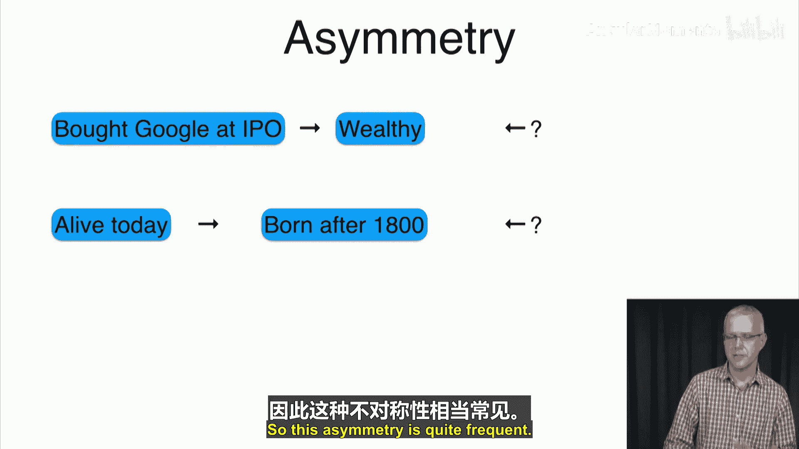
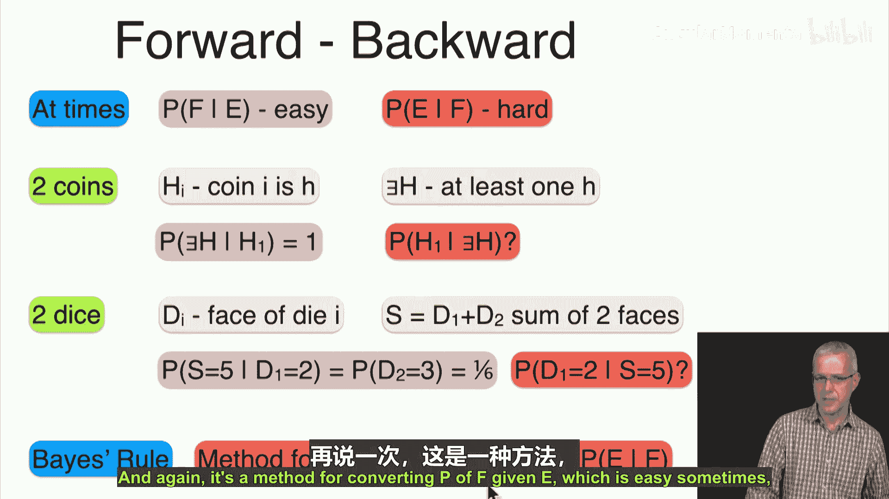
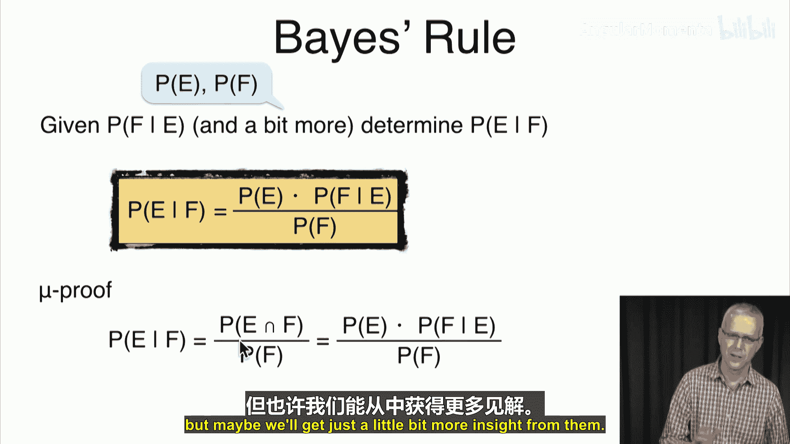
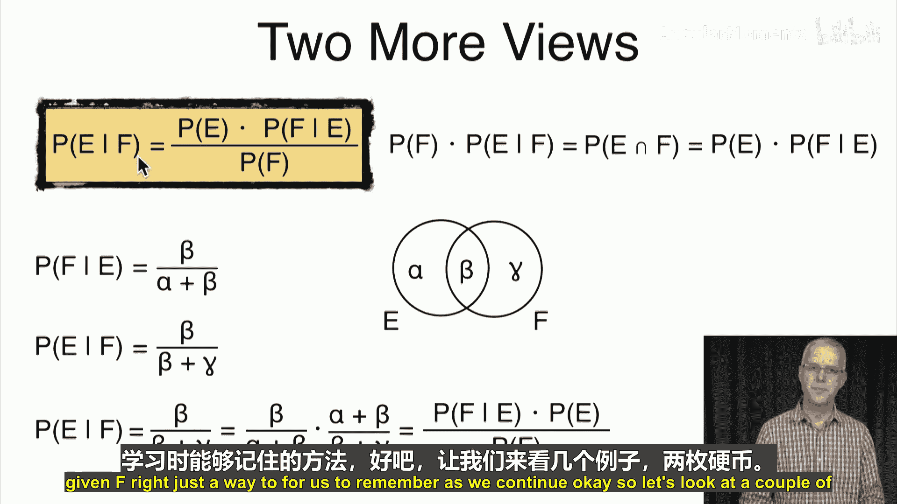
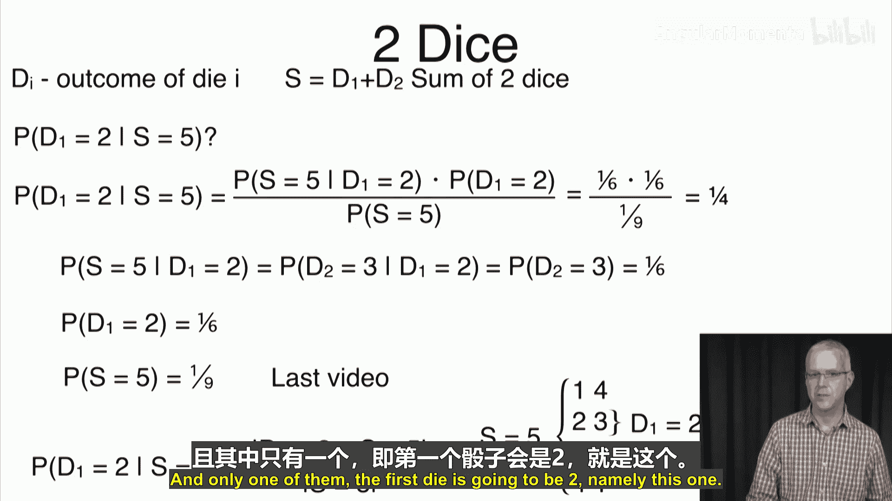
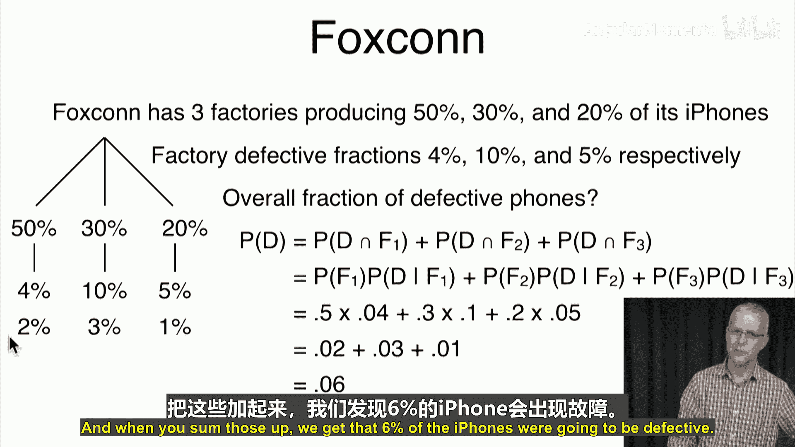
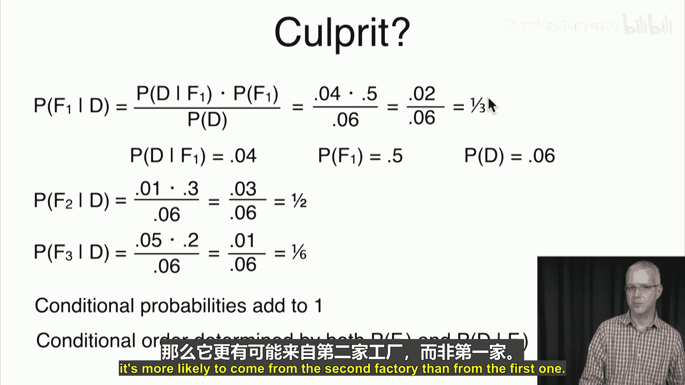
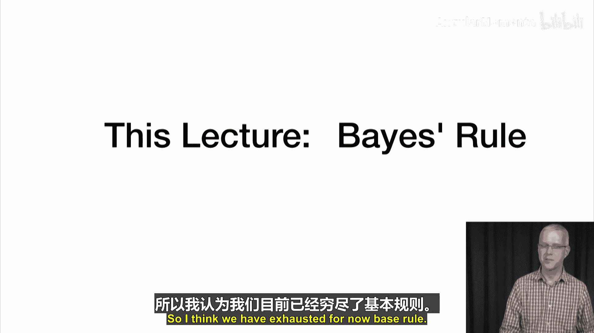

# 032：贝叶斯定理 📊

在本节课中，我们将要学习贝叶斯定理。上一节我们介绍了全概率公式，本节中我们来看看如何利用已知的“正向”条件概率，来计算“反向”的条件概率。

## 不对称性与贝叶斯定理

事件之间常常存在不对称性。例如，如果你在谷歌上市时购买了其股票，那么你现在很可能非常富有。但反过来，如果你非常富有，你是因为买了谷歌股票才富有的概率却并不明确，因为你可能通过其他途径致富。这种从“正向”推断“反向”的困难，正是贝叶斯定理要解决的问题。

有时，计算 **P(F|E)** 很容易，但计算 **P(E|F)** 却很困难。贝叶斯定理提供了一种方法，在已知 **P(F|E)**、**P(E)** 和 **P(F)** 的情况下，计算出 **P(E|F)**。

贝叶斯定理的公式如下：

**P(E|F) = [P(F|E) * P(E)] / P(F)**

## 定理的证明与理解

我们可以从条件概率的定义出发来证明这个公式。

**P(E|F) = P(E ∩ F) / P(F)**

根据乘法法则，分子可以写作：

**P(E ∩ F) = P(E) * P(F|E)**

将第二个公式代入第一个，就得到了贝叶斯定理：

**P(E|F) = [P(E) * P(F|E)] / P(F)**

另一种理解方式是考虑事件的韦恩图。设事件E由区域α和β组成，事件F由区域β和γ组成。那么：
*   **P(F|E)** = β / (α + β)
*   **P(E|F)** = β / (β + γ)

要得到 **P(E|F)**，我们可以从已知的 **P(F|E)** 出发，乘以 **P(E)**（即 α + β），再除以 **P(F)**（即 β + γ）。这正是贝叶斯定理所描述的操作。

## 应用示例

以下是几个应用贝叶斯定理的具体例子。

### 示例一：抛两枚硬币

假设我们抛两枚均匀硬币。令 **H1** 为“第一枚硬币正面朝上”，**ExistH** 为“至少有一枚硬币正面朝上”。

我们想求：已知至少有一枚硬币正面朝上，第一枚硬币也正面朝上的概率，即 **P(H1 | ExistH)**。

根据贝叶斯定理：
**P(H1 | ExistH) = [P(ExistH | H1) * P(H1)] / P(ExistH)**

*   **P(ExistH | H1) = 1** （如果第一枚是正面，则必然至少有一枚正面）
*   **P(H1) = 1/2**
*   **P(ExistH) = 3/4** （所有可能结果：HH, HT, TH, TT 中，排除TT）

代入计算：
**P(H1 | ExistH) = (1 * 1/2) / (3/4) = 2/3**

### 示例二：掷两个骰子

掷两个均匀的六面骰子。令 **D1** 为第一个骰子的点数，**S** 为两个骰子的点数之和。

我们想求：已知点数之和为5，第一个骰子点数为2的概率，即 **P(D1=2 | S=5)**。

根据贝叶斯定理：
**P(D1=2 | S=5) = [P(S=5 | D1=2) * P(D1=2)] / P(S=5)**

*   **P(S=5 | D1=2) = 1/6** （第一个骰子是2时，第二个骰子必须是3，概率为1/6）
*   **P(D1=2) = 1/6**
*   **P(S=5) = 4/36 = 1/9** （和为5的组合有：(1,4), (2,3), (3,2), (4,1)）

代入计算：
**P(D1=2 | S=5) = (1/6 * 1/6) / (1/9) = 1/4**

### 示例三：有缺陷的iPhone

假设三家工厂（A, B, C）生产iPhone，市场份额和缺陷率如下：
*   工厂A：生产50%的iPhone，缺陷率4%
*   工厂B：生产30%的iPhone，缺陷率10%
*   工厂C：生产20%的iPhone，缺陷率5%

上一节我们利用全概率公式计算出，任意一部iPhone有缺陷的概率 **P(D) = 6%**。

现在问题是：如果你买到一部有缺陷的iPhone，它来自工厂B的概率是多少？即求 **P(Factory_B | Defective)**。

根据贝叶斯定理：
**P(Factory_B | D) = [P(D | Factory_B) * P(Factory_B)] / P(D)**

*   **P(D | Factory_B) = 10%**
*   **P(Factory_B) = 30%**
*   **P(D) = 6%**

代入计算：
**P(Factory_B | D) = (0.1 * 0.3) / 0.06 = 0.5**

同理，可以计算出来自工厂A和C的条件概率：
*   **P(Factory_A | D) = (0.04 * 0.5) / 0.06 ≈ 0.333**
*   **P(Factory_C | D) = (0.05 * 0.2) / 0.06 ≈ 0.167**

观察可知，尽管工厂A产量最大（50%），但给定手机有缺陷时，它来自缺陷率更高的工厂B的概率（50%）反而最大。这说明了条件概率不仅取决于先验概率 **P(Factory)**，也取决于似然度 **P(D | Factory)**。

## 总结

本节课中我们一起学习了贝叶斯定理。贝叶斯定理是一个强大的工具，它允许我们在已知“结果”发生的情况下，更新对“原因”可能性的判断。其核心公式 **P(原因|结果) ∝ P(结果|原因) * P(原因)** 在数据分析、机器学习（如朴素贝叶斯分类器）和许多科学推断领域都有广泛应用。通过硬币、骰子和iPhone工厂的例子，我们看到了如何将定理应用于解决实际问题。下一节，我们将开始讨论随机变量的概念。