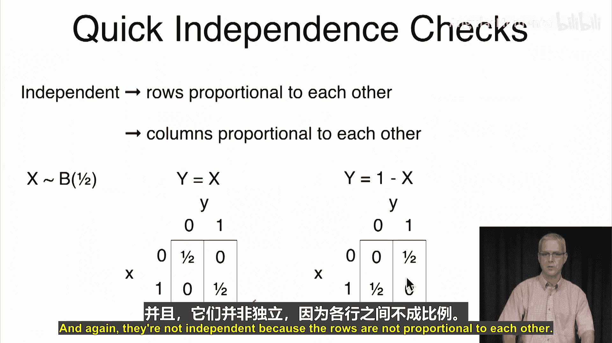

# 033：双变量随机变量

在本节课中，我们将从单一随机变量的学习，过渡到研究两个随机变量。我们将学习如何描述两个随机变量的联合分布，并探讨其核心性质，包括边缘分布、条件分布以及独立性。

## 从单变量到双变量

上一节我们介绍了单一随机变量，本节中我们来看看两个随机变量。在实际实验中，我们常常会得到多个观测值。例如，研究某一天的天气时，我们可能同时关心温度和降水概率，这两个变量是相关的。又或者，预测下个月的经济状况时，我们可能同时关注失业率和通货膨胀率，这两个随机变量相互影响。在数据库表中，每一行可能对应一名员工，我们可能同时关注其工作年限和薪资，这两个变量因属于同一个人而存在关联。即使是学生，也可以同时考虑本季度选修的课程数量和预期GPA，这两个变量之间也存在某种关联。当然，最复杂的“人类实验”包含更多特征，如胆固醇水平、年龄、职业、幸福感等。不过，我们将从最简单的例子开始：两枚硬币。

## 独立伯努利随机变量

设 `U` 和 `V` 是两个独立的伯努利(1/2)随机变量，即两次独立的公平硬币抛掷。

描述其分布有几种方式：

*   **直接写出**：概率 `P(U=u, V=v)` 对所有 `u, v ∈ {0, 1}` 均为 1/4。
*   **列出表格**：列出所有 `(U, V)` 组合及其概率。
*   **使用二维表**：以 `U` 的值为行，`V` 的值为列，在每个单元格中填入对应的联合概率 `P(U=u, V=v)`。对于本例，所有四个单元格的概率均为 0.25。

以下是二维表的表示方法：

| U\V | 0   | 1   |
| :-- | :-- | :-- |
| 0   | 0.25| 0.25|
| 1   | 0.25| 0.25|

## 由独立变量构造新变量

我们可以利用 `U` 和 `V` 构造其他双变量例子，以观察联合分布的特性。

**例1：最小值与最大值**
定义 `X = min(U, V)`， `Y = max(U, V)`。
我们可以列出所有 `(U, V)` 组合对应的 `(X, Y)` 值：
*   `(U,V)=(0,0)` => `(X,Y)=(0,0)`，概率 1/4。
*   `(U,V)=(0,1)` 或 `(1,0)` => `(X,Y)=(0,1)`，概率 1/2。
*   `(U,V)=(1,1)` => `(X,Y)=(1,1)`，概率 1/4。

由此得到 `(X, Y)` 的联合分布表：

| X\Y | 0   | 1   |
| :-- | :-- | :-- |
| 0   | 0.25| 0.50|
| 1   | 0.00| 0.25|

注意，`(X=1, Y=0)` 的概率为0，因为最小值不可能大于最大值。

**例2：乘积与和**
定义 `X = U * V`， `Y = U + V`。
*   `X` 可取 {0, 1}。
*   `Y` 可取 {0, 1, 2}。

计算联合概率：
*   `P(X=0, Y=0) = P(U=0,V=0) = 1/4`
*   `P(X=0, Y=1) = P({(0,1), (1,0)}) = 1/2`
*   `P(X=1, Y=2) = P(U=1,V=1) = 1/4`

其他组合概率为0。可以验证，所有概率之和为1。

**例3：三枚硬币的和**
假设 `U1, U2, U3` 是三个独立的伯努利(1/2)变量。定义 `X = U1 + U2`（前两次抛掷的正面数），`Y = U2 + U3`（后两次抛掷的正面数）。
`X` 和 `Y` 均可取 {0, 1, 2}。通过枚举所有8种 `(U1,U2,U3)` 组合，可以得到 `(X,Y)` 的联合分布。例如，`P(X=1, Y=1)` 对应 `(U1,U2,U3)` 为 (0,1,0) 或 (1,0,1) 的情况，因此概率为 2/8 = 1/4。

## 一般形式的联合分布

现在，我们抛开具体例子，看看双变量联合分布的一般形式。

对于随机变量 `X` 和 `Y`，其**联合分布**指定了每一对可能取值 `(x, y)` 的概率，记作：
`P(X=x, Y=y)` 或简写为 `p(x, y)`。

它必须满足两个条件：
1.  **非负性**：对所有 `x, y`，有 `p(x, y) ≥ 0`。
2.  **归一性**：所有可能 `(x, y)` 组合的概率之和为1。
    `∑_x ∑_y p(x, y) = 1`

联合分布包含了关于 `(X, Y)` 的所有信息，我们可以用它计算任何感兴趣的事件的概率。例如，给定一个联合分布表，要计算 `P(X ≤ Y)`，只需将所有满足 `x ≤ y` 的单元格 `(x, y)` 的概率相加即可。

## 联合分布的核心性质

联合分布中有几个性质尤为重要，我们将逐一探讨。

### 1. 边缘分布

**边缘分布**描述的是单个随机变量自身的概率分布，忽略另一个变量的信息。

*   `X` 的边缘分布：`p_X(x) = P(X=x) = ∑_y p(x, y)`
*   `Y` 的边缘分布：`p_Y(y) = P(Y=y) = ∑_x p(x, y)`

**计算示例**：
考虑以下联合分布表：

| X\Y | y=0 | y=1 | 边缘 P(X) |
| :-- | :-- | :-- | :------- |
| x=0 | 0.1 | 0.2 | **0.3**  |
| x=1 | 0.3 | 0.4 | **0.7**  |
| 边缘 P(Y) | **0.4** | **0.6** | **1.0**  |

*   `P(X=0) = p(0,0) + p(0,1) = 0.1 + 0.2 = 0.3`
*   `P(Y=1) = p(0,1) + p(1,1) = 0.2 + 0.4 = 0.6`

边缘概率由对应行或列的概率相加得到，且各自之和为1。

### 2. 条件分布

**条件分布**描述在已知一个随机变量取某个值的条件下，另一个随机变量的分布。

*   给定 `Y=y` 时 `X` 的条件分布：
    `P(X=x | Y=y) = p(x|y) = p(x, y) / p_Y(y)`，要求 `p_Y(y) > 0`。
*   给定 `X=x` 时 `Y` 的条件分布：
    `P(Y=y | X=x) = p(y|x) = p(x, y) / p_X(x)`，要求 `p_X(x) > 0`。

**计算示例**（沿用上表）：
*   `P(Y=0 | X=0) = p(0,0) / P(X=0) = 0.1 / 0.3 ≈ 0.333`
*   `P(X=1 | Y=0) = p(1,0) / P(Y=0) = 0.3 / 0.4 = 0.75`

### 3. 独立性

两个随机变量 `X` 和 `Y` 被称为**独立的**，如果知道其中一个变量的值，不会改变我们对另一个变量分布的认知。

以下是等价的定义：
1.  对所有 `x, y`，有 `P(Y=y | X=x) = P(Y=y)`。
2.  对所有 `x, y`，有 `P(X=x | Y=y) = P(X=x)`。
3.  对所有 `x, y`，有 `P(X=x, Y=y) = P(X=x) * P(Y=y)`。**这是最常用的判定公式**。

**判断示例**：
*   **独立案例**：观察以下分布表，每个单元格的概率恰好等于其对应行边缘概率与列边缘概率的乘积（例如 0.12 = 0.6 * 0.2）。因此 `X` 和 `Y` 独立。

| X\Y | y=0 | y=1 | 边缘 P(X) |
| :-- | :-- | :-- | :------- |
| x=0 | 0.12| 0.48| 0.6      |
| x=1 | 0.08| 0.32| 0.4      |
| 边缘 P(Y) | 0.2 | 0.8 | 1.0      |

*   **不独立案例**：本节第一个示例表（概率为0.1, 0.2, 0.3, 0.4）不满足乘积关系。例如，`P(X=0)*P(Y=0)=0.3*0.4=0.12`，但 `p(0,0)=0.1`，两者不相等，故 `X` 和 `Y` 不独立。

一个快速的视觉判断方法是：如果联合分布表中，**每一行**的概率值比例都相同（即行与行成比例），并且**每一列**的概率值比例也都相同，那么这两个变量是独立的。否则，它们不独立。例如，若定义 `Y = X` 或 `Y = 1 - X`，其联合分布表的行或列明显不成比例，因此 `X` 和 `Y` 不独立。

## 总结

本节课中，我们一起学习了双变量随机变量的基础知识。我们首先了解了从单变量扩展到多变量的必要性，并通过硬币抛掷的例子引入了联合分布的概念。我们学习了如何用表格表示联合分布，以及如何从联合分布中计算**边缘分布**和**条件分布**。最后，我们探讨了随机变量**独立性**的核心概念及其判定方法（`p(x,y) = p_X(x) * p_Y(y)`）。联合分布是理解多个随机变量共同行为的基石。在接下来的课程中，我们将基于联合分布，开始研究双随机变量函数的期望。