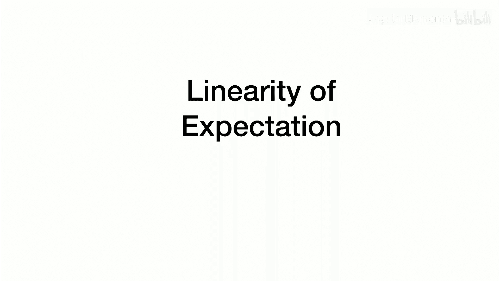
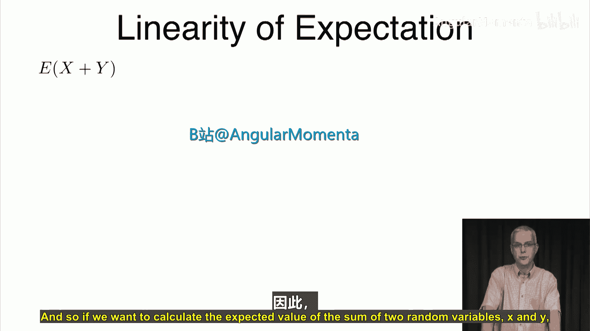
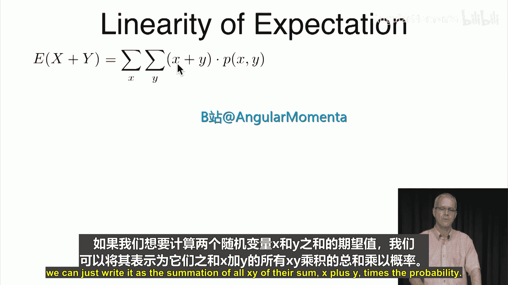
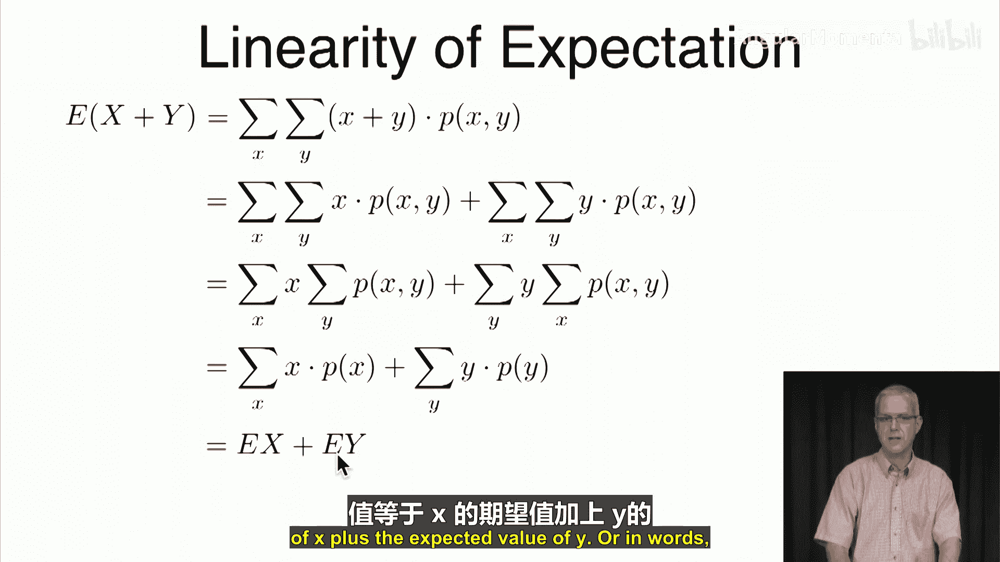
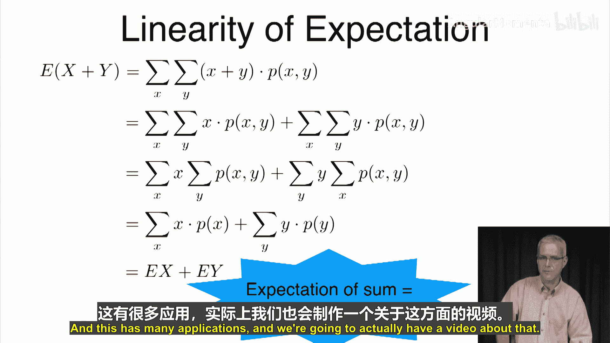
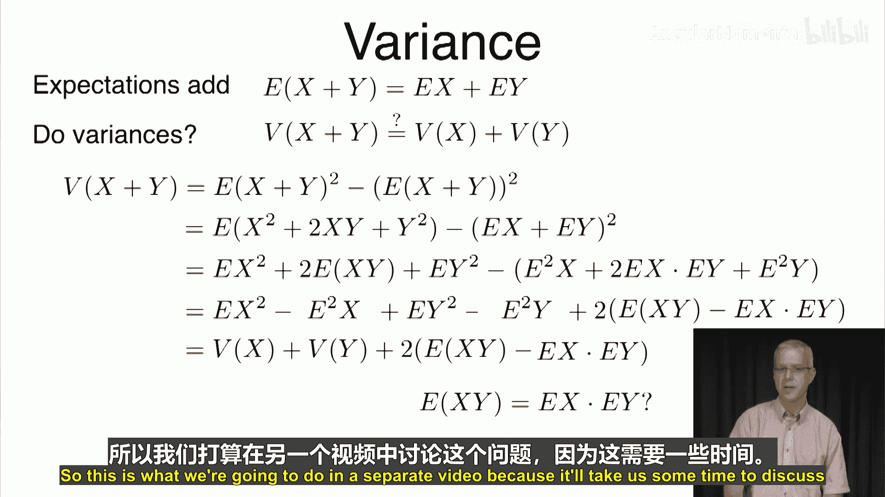

# 034：期望的线性性质 📈

在本节课中，我们将要学习期望值的一个核心性质——**线性性质**。我们将探讨两个随机变量之和的期望值如何计算，并初步了解方差是否也具有类似的可加性。

## 期望的线性性质

上一节我们介绍了期望值的定义，本节中我们来看看期望值的一个重要运算性质。

对于两个随机变量 **X** 和 **Y**，它们之和的期望值 **E[X+Y]** 可以通过以下公式计算：
`E[X+Y] = Σ_x Σ_y (x + y) * P(X=x, Y=y)`

我们可以对这个求和式进行分解和重组。

以下是推导步骤：
1.  将求和式拆分为两部分：`Σ_x Σ_y x * P(x,y) + Σ_x Σ_y y * P(x,y)`。
2.  在第一部分中，**x** 与对 **y** 的求和无关，因此可以提到对 **y** 的求和符号之外，得到 `Σ_x x * Σ_y P(x,y)`。
3.  根据全概率公式，`Σ_y P(x,y)` 等于 **X** 的边缘概率 **P(X=x)**。因此第一部分简化为 `Σ_x x * P(X=x)`，这正是 **E[X]**。
4.  同理，第二部分可以简化为 `Σ_y y * P(Y=y)`，即 **E[Y]**。

由此我们得出结论：
**E[X+Y] = E[X] + E[Y]**

这意味着，**和的期望等于期望的和**。这一性质在概率计算中有着广泛的应用。

## 方差的可加性探讨

既然期望具有可加性，那么一个很自然的问题是：方差是否也具有同样的性质？即，**Var(X+Y)** 是否等于 **Var(X) + Var(Y)**？

为了探究这个问题，我们从方差的定义出发。随机变量 **Z** 的方差定义为：
`Var(Z) = E[Z²] - (E[Z])²`

令 **Z = X + Y**，我们将其代入公式。

以下是推导过程：
1.  `Var(X+Y) = E[(X+Y)²] - (E[X+Y])²`
2.  展开 `(X+Y)²` 并利用期望的线性性质：
    *   `E[(X+Y)²] = E[X² + 2XY + Y²] = E[X²] + 2E[XY] + E[Y²]`
    *   `(E[X+Y])² = (E[X] + E[Y])² = (E[X])² + 2E[X]E[Y] + (E[Y])²`
3.  将上述结果代入方差公式并重新分组：
    `Var(X+Y) = [E[X²] - (E[X])²] + [E[Y²] - (E[Y])²] + 2[E[XY] - E[X]E[Y]]`
4.  根据方差定义，前两项分别是 **Var(X)** 和 **Var(Y)**。

因此，我们得到最终关系式：
**Var(X+Y) = Var(X) + Var(Y) + 2[E[XY] - E[X]E[Y]]**

由此可见，方差 **Var(X+Y)** 是否等于 **Var(X) + Var(Y)**，完全取决于式子 `E[XY] - E[X]E[Y]` 是否为零。也就是说，关键在于 **E[XY]** 是否等于 **E[X]E[Y]**。这个关于乘积期望的问题，比方差的可加性更为基础，我们将在下一个视频中专门讨论。

本节课中我们一起学习了期望的线性性质，证明了 **E[X+Y] = E[X] + E[Y]**。同时，我们也推导出方差不总是可加的，其可加性成立的条件是 **E[XY] = E[X]E[Y]**。理解这个条件是学习随机变量独立性的关键，我们下节课再见。