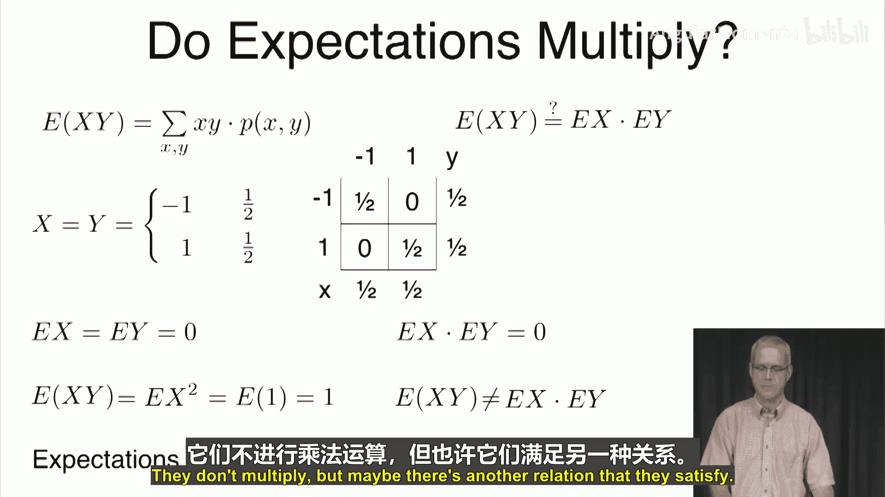
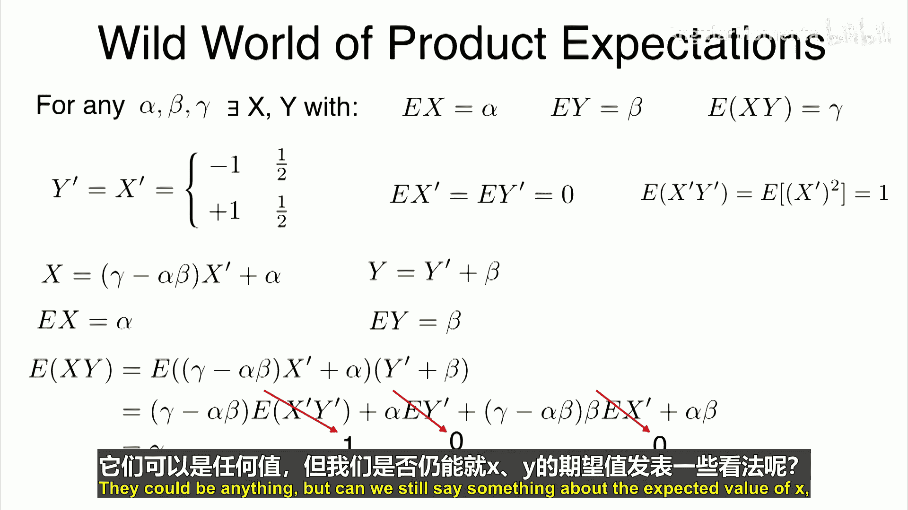
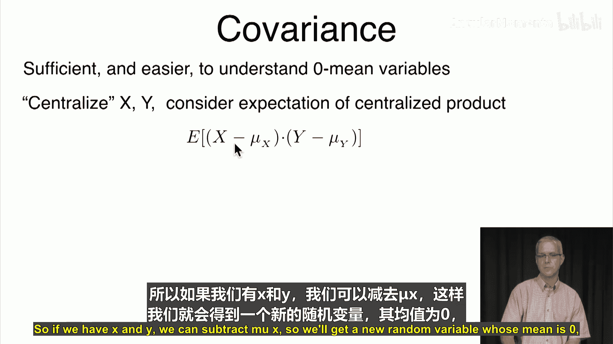
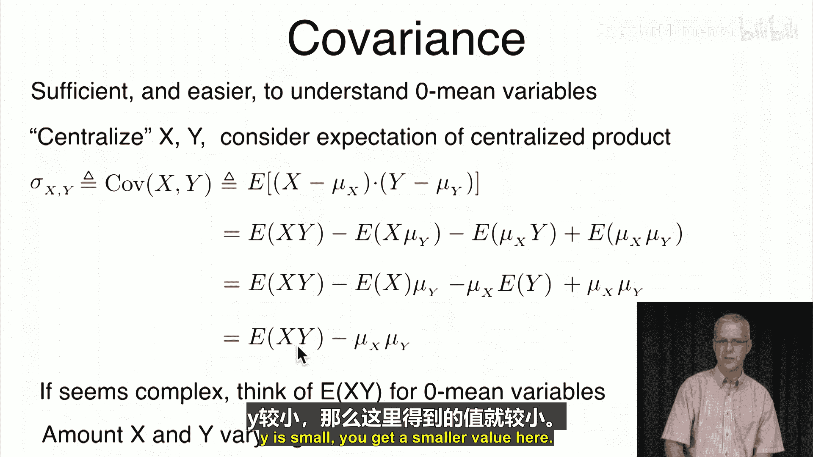
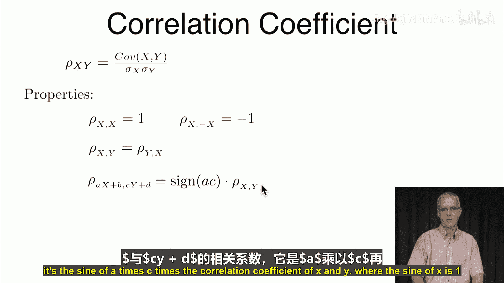
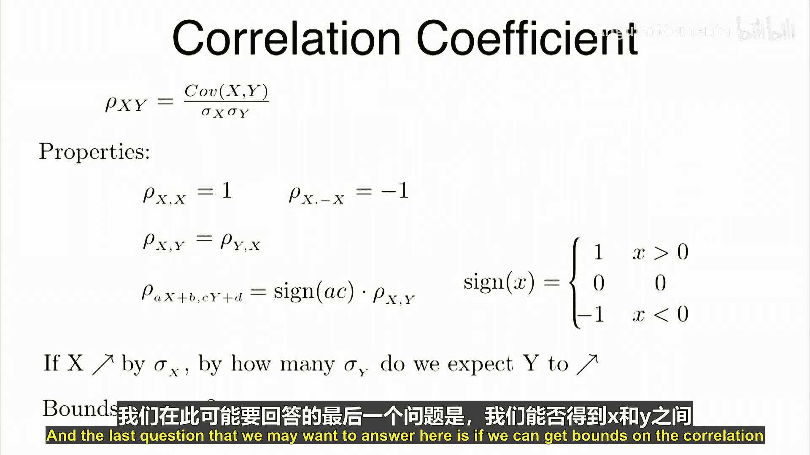
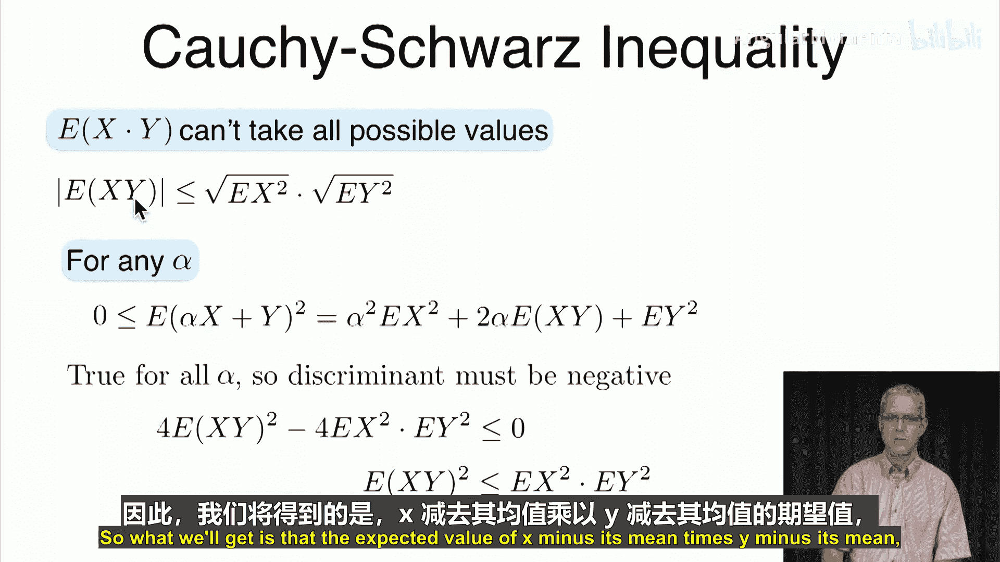
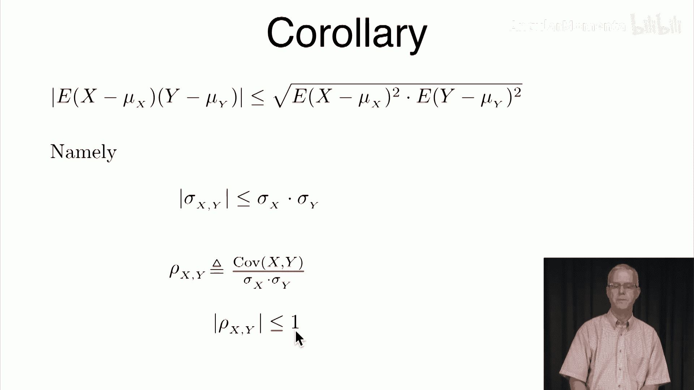

# 035：协方差 📊

在本节课中，我们将要学习协方差的概念。协方差是衡量两个随机变量如何共同变化的重要工具。我们将从探讨期望的乘法性质开始，逐步引入协方差的定义、性质及其标准化形式——相关系数。

上一节我们探讨了随机变量期望的性质，本节中我们来看看两个随机变量乘积的期望是否等于它们各自期望的乘积。

## 期望的乘法性质

我们想知道，对于两个随机变量X和Y，是否有 **E[XY] = E[X]E[Y]** 成立。

让我们看一个简单的反例。假设X和Y是两个完全相同的随机变量，它们以1/2的概率取-1，以1/2的概率取1。它们的联合分布如下：

*   当X=-1时，Y=-1的概率为1/2。
*   当X=1时，Y=1的概率为1/2。
*   当X和Y取值不同时，概率为0。

X和Y的边缘分布都是均匀的：P(X=-1)=1/2， P(X=1)=1/2。因此，**E[X] = 0**。同理，**E[Y] = 0**。所以，**E[X]E[Y] = 0**。

现在计算左边：**E[XY]**。由于Y恒等于X，所以 **E[XY] = E[X²]**。而X²总是等于1，因此 **E[X²] = 1**。

由此我们得到 **E[XY] = 1 ≠ 0 = E[X]E[Y]**。这说明期望并不总是满足乘法性质。

## 期望乘积的任意性

既然期望不总是相乘，那么它们之间是否存在其他确定的关系？答案是否定的。实际上，两个随机变量乘积的期望可以是任意值。

具体来说，对于任意给定的三个数α, β, γ，我们都可以构造出两个随机变量X和Y，使得：
*   **E[X] = α**
*   **E[Y] = β**
*   **E[XY] = γ**

这个构造过程表明，仅凭各自的期望值，无法约束它们乘积的期望值。因此，我们需要一个新的度量来描述两个变量之间的联动关系。

## 协方差的引入

为了研究 **E[XY]**，我们首先考虑将变量“中心化”，即减去各自的均值。这引出了协方差的定义。

两个随机变量X和Y的协方差定义为：
**Cov(X, Y) = E[(X - μₓ)(Y - μᵧ)]**
其中，μₓ = E[X]， μᵧ = E[Y]。协方差也常记作 **σₓᵧ**。

协方差的计算公式可以展开为：
**Cov(X, Y) = E[XY] - E[X]E[Y]**

这个公式清晰地展示了协方差与乘积期望之间的关系。当X和Y的均值都为0时，协方差就等于 **E[XY]**。协方差衡量的是X和Y如何围绕各自的均值共同变化。如果当X大于其均值时，Y也倾向于大于其均值，则协方差为正；反之则为负。

## 相关系数：标准化的协方差

协方差的大小受变量自身尺度的影响。为了进行无尺度的比较，我们引入相关系数。

随机变量X和Y的相关系数ρₓᵧ定义为：
**ρₓᵧ = Cov(X, Y) / (σₓ σᵧ)**
其中，σₓ和σᵧ分别是X和Y的标准差。

以下是相关系数的一些重要性质：

*   **自相关性**：变量与自身的相关系数为1。**ρₓₓ = 1**。
*   **完全负相关**：变量与其负值的相关系数为-1。**ρₓ,₋ₓ = -1**。
*   **对称性**：相关系数是对称的。**ρₓᵧ = ρᵧₓ**。
*   **尺度不变性**：对变量进行线性变换（**aX + b** 和 **cY + d**），相关系数的绝对值不变，符号由a和c的符号乘积决定。**ρ_{aX+b, cY+d} = sign(a·c) · ρₓᵧ**。

相关系数的意义在于：如果X增加一个标准差，那么Y平均会增加 **ρₓᵧ** 个标准差。

## 相关系数的边界：柯西-施瓦茨不等式

相关系数并非可以取任意值，它的绝对值被限制在1以内。这个结论来源于柯西-施瓦茨不等式。

柯西-施瓦茨不等式指出，对于任意随机变量X和Y，有：
**|E[XY]| ≤ √(E[X²] E[Y²])**

将这个不等式应用于中心化后的变量 **(X - μₓ)** 和 **(Y - μᵧ)**，我们得到：
**|Cov(X, Y)| ≤ σₓ σᵧ**

两边同时除以 **σₓ σᵧ**，就得到了相关系数的边界：
**|ρₓᵧ| ≤ 1**

这个性质非常重要，它保证了相关系数是一个介于-1和1之间的标准化度量。

## 总结

本节课中我们一起学习了协方差与相关系数。

*   我们首先发现随机变量乘积的期望并不等于期望的乘积，且其值可以是任意的。
*   为了量化两个变量之间的线性关联，我们引入了协方差 **Cov(X, Y) = E[(X - μₓ)(Y - μᵧ)]**。
*   为了消除尺度影响并进行标准化比较，我们定义了相关系数 **ρₓᵧ = Cov(X, Y) / (σₓ σᵧ)**。
*   相关系数具有对称性、尺度不变性等性质，并且其绝对值永远不超过1（**|ρ| ≤ 1**），这由柯西-施瓦茨不等式保证。

理解协方差和相关系数是分析数据中变量关系的基础。在下一节中，我们将通过具体例子来加深对这些概念的理解。