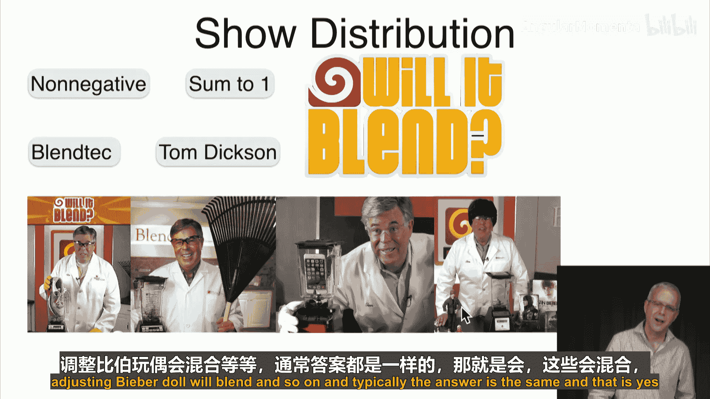

**概率与统计：P36：分布族**

在本节课中，我们将学习随机变量的一个重要概念——分布族。现实世界中遇到的随机变量通常属于某些特定的分布家族。我们将重点介绍其中理论意义重大且应用广泛的几个核心分布。

上一节我们介绍了随机变量，本节中我们来看看这些变量常见的分布类型。虽然存在许多分布族，但我们将聚焦于最自然、最重要的几个。

我们将要讨论的分布分为两类：离散分布和连续分布。

以下是离散分布部分我们将涵盖的内容：
*   **伯努利分布**
*   **二项分布**
*   **泊松分布**
*   **几何分布**

随后，我们将转向连续分布，并讨论以下类型：
*   **均匀分布**
*   **指数分布**
*   **正态分布**

对于以上每一种分布，我们的讲解将遵循一个清晰的框架。首先，我们会阐述其动机和应用场景。接着，给出该分布或分布族的数学**公式**定义。然后，通过可视化图表展示其形态，并辅以具体**示例**。最后，描述其关键性质，通常包括**均值**、**方差**和**标准差**，某些分布还会讨论其他特性。

此外，配套的Notebook中提供了**Python**代码实现，方便我们进一步绘制分布图、进行实验和探索。

现在，当我们想证明某个函数是一个概率分布时，需要确认两件事：函数值非负，以及所有可能取值的概率之和为1。证明非负性通常比较直观，而证明概率和为1则需要更多推导。

为了让这个过程不那么枯燥，我们借鉴一家名为Blendtec公司的创意。该公司生产一种相当标准的产品——搅拌机。为了吸引更多关注，他们发起了一场营销活动，由创始人汤姆·迪克森出镜，名为“它能被搅碎吗？”。在这系列广告中，汤姆·迪克森尝试搅拌各种物品，比如耐克鞋、花园耙子、iPhone甚至Justin Bieber的玩偶，而结果通常是肯定的——它们都能被搅碎。

我们将稍微模仿这个创意。当我们想验证某个概率分布的概率和是否为1时，我们会问：“**它能归一吗？**”，并检验这些概率值相加是否等于1。

接下来，我们将从第一个分布开始，即**伯努利分布**。