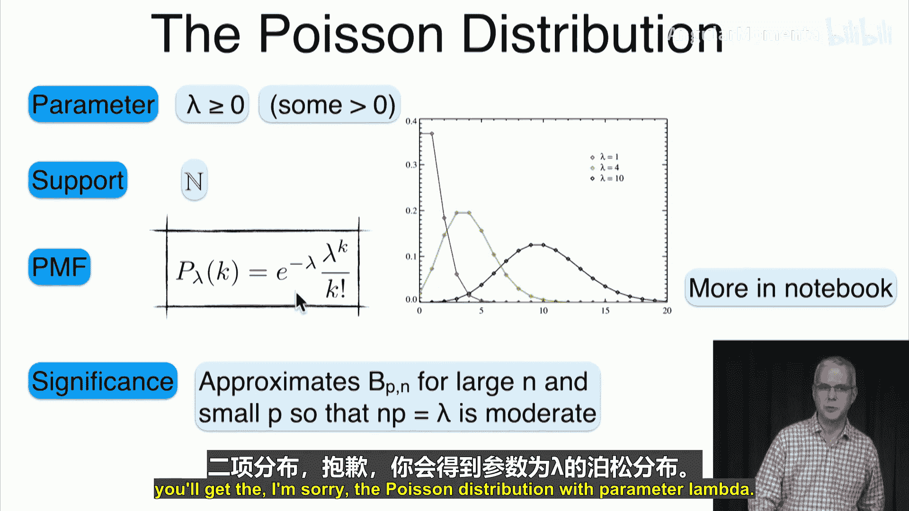
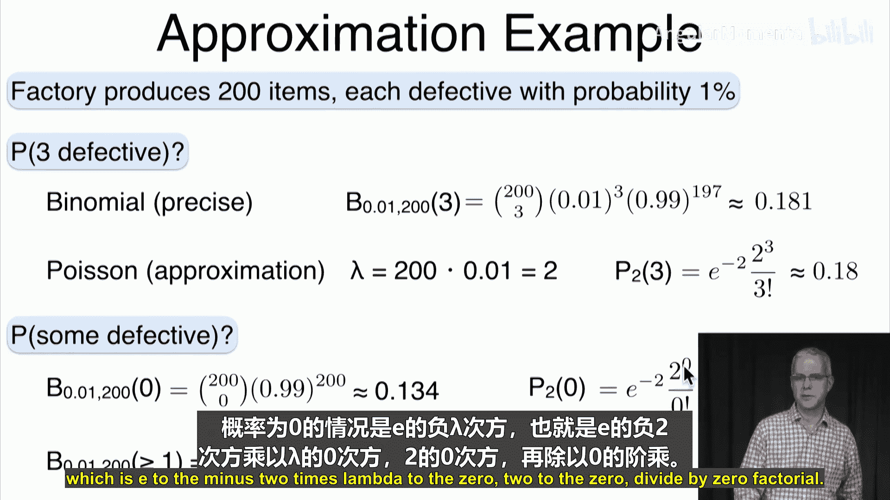
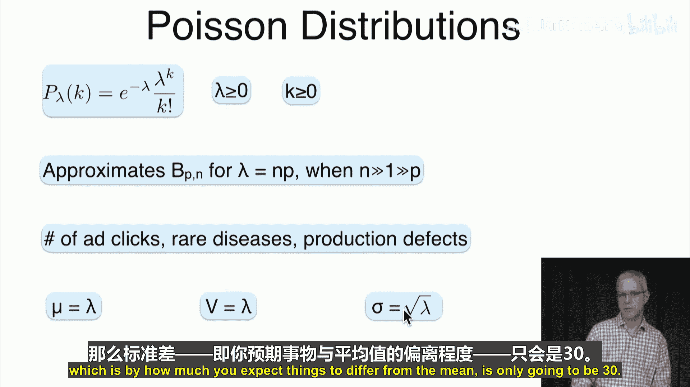

# 037：泊松分布 📊

在本节课中，我们将要学习泊松分布。泊松分布是二项分布的一种重要扩展，它适用于描述在大量试验中，但每次试验成功概率极低的事件发生次数。我们将定义泊松分布，探讨其应用场景，推导其来源，并计算其均值和标准差。

## 泊松分布的定义 📝

上一节我们介绍了二项分布，本节中我们来看看它的一个重要扩展——泊松分布。

泊松分布由一个参数 λ 定义，其中 λ ≥ 0（通常 λ > 0）。其取值范围是所有自然数（即从0开始的整数）。其概率质量函数由以下公式给出：

**公式：P(X = k) = (e^{-λ} * λ^{k}) / k!**

其中，k 是可能取到的值（0, 1, 2, ...）。下图展示了不同 λ 值下的泊松分布形态。

## 泊松分布的应用场景 🌍

泊松分布之所以重要，是因为它可以近似二项分布。当试验次数 n 很大，但每次试验的成功概率 p 很小，使得乘积 λ = n * p 保持在一个中等水平时，泊松分布就是二项分布的良好近似。

以下是泊松分布常见的一些应用场景：

*   **广告点击量**：大量用户浏览网站，但每个用户点击特定广告的概率很低。
*   **垃圾邮件回复数**：垃圾邮件发送给大量用户，但回复的用户极少。
*   **罕见疾病感染数**：全球人口众多，但每个人感染某种特定疾病的概率极低。
*   **商店顾客数**：城市人口众多，但在特定一天访问某家特定商店的人数很少。
*   **航班误机人数**：航班上乘客众多，但每位乘客误机的概率很低。
*   **页面印刷错误数**：一页文字中，出现某个特定印刷错误的概率很低。

## 泊松分布的推导 🔬

泊松分布可以从二项分布推导出来。让我们回顾一下二项分布的概率公式：

**公式：P(成功 k 次) = C(n, k) * p^{k} * (1-p)^{n-k}**

现在，我们设 λ = n * p，即 p = λ / n。将这个关系代入二项分布公式，并考虑当 n 趋近于无穷大（p 相应趋近于0），而 λ 保持固定时，经过一系列极限运算（具体步骤见课程推导），我们可以得到：

**公式：lim_{n→∞} [C(n, k) * (λ/n)^{k} * (1 - λ/n)^{n-k}] = (e^{-λ} * λ^{k}) / k!**

这正是泊松分布的概率质量函数。因此，泊松分布是二项分布在 n 很大、p 很小时的极限形式。

## 验证其为概率分布 ✅

一个有效的概率分布必须满足两个条件：所有概率非负，且所有概率之和为1。

1.  **非负性**：由于 e^{-λ} > 0，λ^{k} ≥ 0，k! > 0，因此 P(X = k) ≥ 0。
2.  **归一性（和为1）**：我们需要证明所有可能取值的概率之和为1。

根据指数函数 e^{x} 的泰勒级数展开：

**公式：e^{λ} = Σ_{k=0}^{∞} (λ^{k} / k!)**

现在计算泊松分布的概率和：

**公式：Σ_{k=0}^{∞} P(X = k) = Σ_{k=0}^{∞} (e^{-λ} * λ^{k} / k!) = e^{-λ} * Σ_{k=0}^{∞} (λ^{k} / k!) = e^{-λ} * e^{λ} = 1**

因此，泊松分布确实是一个有效的概率分布。

## 泊松分布的均值与方差 📈

由于泊松分布近似于参数为 (n, p) 的二项分布，且 λ = n * p，我们预期泊松分布的均值应为 λ。二项分布的方差为 n * p * (1-p) = λ * (1-p)。当 p 非常小时，(1-p) 接近1，因此方差也接近 λ。

通过计算（课程中使用了“阶乘矩”的技巧），我们可以精确得到：

*   **均值（期望值）**：E[X] = λ
*   **方差**：Var(X) = λ
*   **标准差**：σ = √λ

这意味着对于泊松分布，其均值和方差是相等的。这个性质非常独特。标准差 √λ 相对于均值 λ 来说较小，例如当 λ=1000 时，标准差约为31.6，这表明分布相对集中在均值附近。

## 泊松分布近似示例 🧮

让我们通过一个例子看看泊松分布如何近似二项分布。

**问题**：一个工厂生产200件产品，每件产品有1%的概率是次品。请问恰好有3件次品的概率是多少？

**精确计算（二项分布）**：
参数：n = 200, p = 0.01
P(X=3) = C(200, 3) * (0.01)^{3} * (0.99)^{197} ≈ 0.181

**泊松近似**：
参数：λ = n * p = 200 * 0.01 = 2
P(X=3) ≈ (e^{-2} * 2^{3}) / 3! ≈ 0.180

可以看到，泊松近似的结果 (0.180) 与精确结果 (0.181) 非常接近。

## 总结 📋

本节课中我们一起学习了泊松分布。

*   **定义**：泊松分布描述在固定时间或空间内，稀有事件发生的次数。其概率公式为 **P(X = k) = (e^{-λ} * λ^{k}) / k!**，其中 λ > 0，k = 0, 1, 2, ...
*   **来源**：它是二项分布在试验次数 n 很大、单次成功概率 p 很小，且 λ = n * p 保持恒定时的极限形式。
*   **应用**：广泛应用于描述低概率事件的发生次数，如网站点击、罕见病例、系统故障等。
*   **数字特征**：泊松分布的**均值 E[X] = λ**，**方差 Var(X) = λ**，**标准差 σ = √λ**。其均值和方差相等是一个重要特征。
*   **近似性**：在满足条件（n大，p小）时，泊松分布可以非常精确地近似二项分布，简化计算。

泊松分布为我们处理大量试验中的稀有事件提供了一个强大而简洁的模型。

