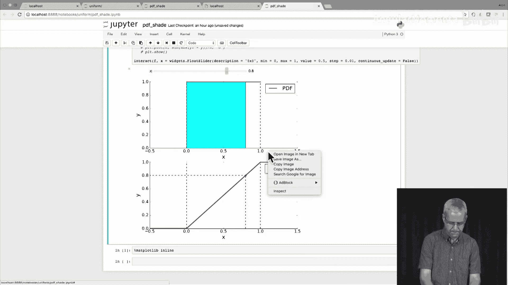
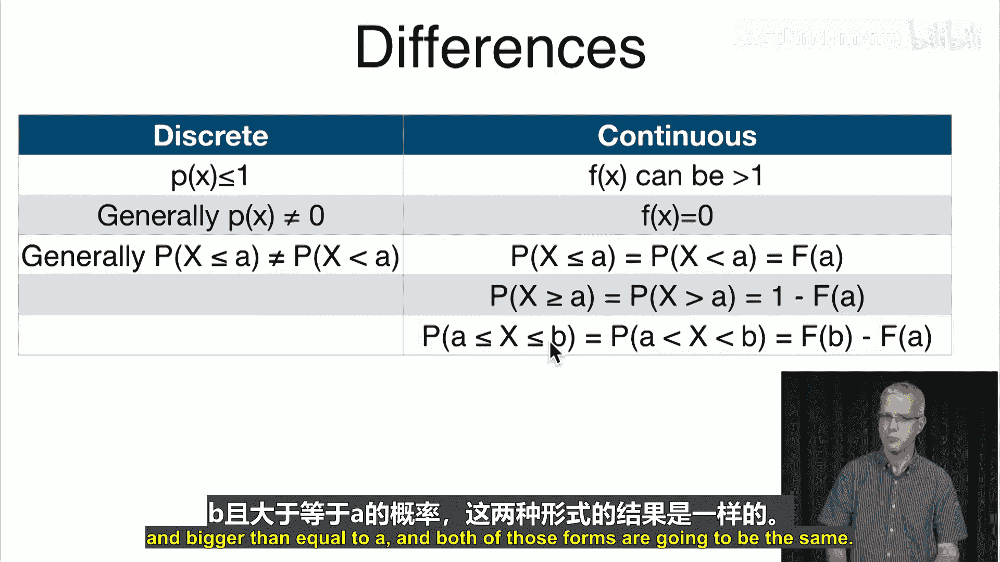
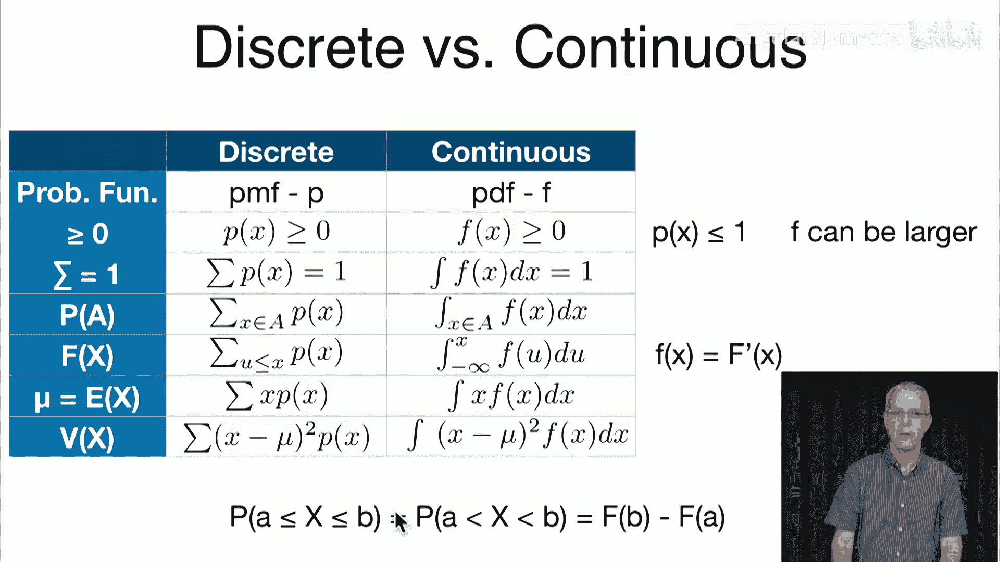
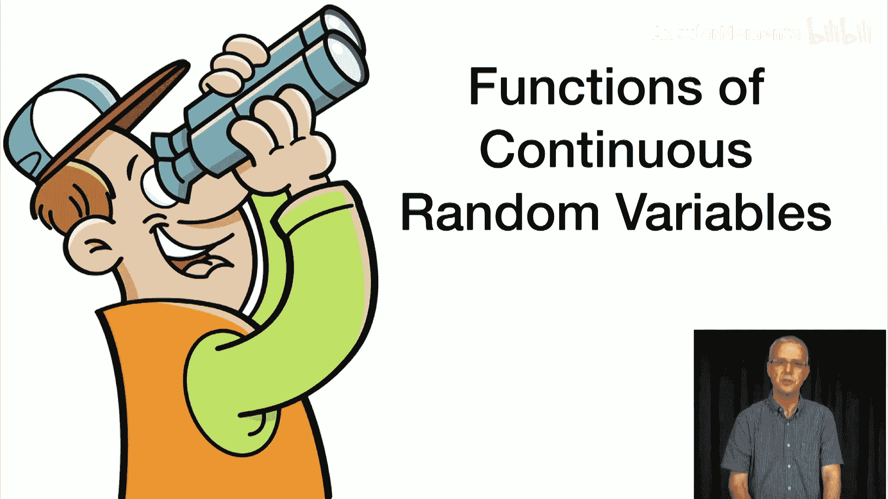

# 038：连续分布 📊

在本节课中，我们将学习连续分布。我们将了解什么是连续随机变量，如何通过概率密度函数描述它们，以及如何计算其累积分布函数、期望和方差。我们还会比较连续分布与之前学过的离散分布之间的异同。

## 从离散到连续 🔄

上一节我们介绍了离散分布，它处理的是可数个取值（如有限个或可数无限个）。本节中，我们来看看连续分布。连续分布处理的是不可数个取值，通常是像区间这样的连续量。

我们研究连续分布，是因为现实生活中的许多事物本质上是连续的。例如：
*   **时间**：航班的时长、快递的配送时间。
*   **空间度量**：人的身高、风暴的面积。
*   **质量**：宠物的体重、公司生产的饼干重量。
*   **温度**：气温、体温。

此外，还有一些量虽然不是严格连续，但取值非常多，我们也可以将其视为连续变量来处理，例如：
*   **价格**：股票、房屋、大宗商品的价格。
*   **比率**：利率、汇率、失业率。

## 概率密度函数 📈

对于连续分布，我们使用**概率密度函数** 来代替离散分布中的概率质量函数。

概率密度函数是一个非负函数 `f(x)`，它表示观测到值 `x` 或其附近值的相对可能性。其图像是一条曲线，`f(x)` 总是非负的。

PDF必须满足一个关键条件：曲线下的总面积等于1。用数学公式表示为：
`∫_{-∞}^{∞} f(x) dx = 1`

以下是连续分布与离散分布在核心概念上的对比：

| 特性 | 离散分布 (PMF) | 连续分布 (PDF) |
| :--- | :--- | :--- |
| **函数表示** | 概率质量函数 `P(x)` | 概率密度函数 `f(x)` |
| **非负性** | `P(x) ≥ 0` | `f(x) ≥ 0` |
| **归一化** | `∑ P(x) = 1` | `∫ f(x) dx = 1` |
| **事件概率** | `P(A) = ∑_{x∈A} P(x)` | `P(A) = ∫_{x∈A} f(x) dx` |
| **区间概率** | `P(a≤X≤b) = ∑_{x=a}^{b} P(x)` | `P(a≤X≤b) = ∫_{a}^{b} f(x) dx` |

对于连续分布，我们通常关心区间概率，即随机变量 `X` 落在某个区间 `[a, b]` 内的概率。这等于概率密度函数在该区间曲线下的面积。

## 累积分布函数 📊

累积分布函数 的定义对于离散和连续分布是统一的：`F(x) = P(X ≤ x)`。

然而，计算方式不同：
*   **离散分布**：`F(x) = ∑_{u ≤ x} P(u)`
*   **连续分布**：`F(x) = ∫_{-∞}^{x} f(u) du`

CDF 和 PDF 之间存在重要的微积分关系：
*   从 CDF 得到 PDF：`f(x) = d/dx F(x)`。PDF 是 CDF 的导数。
*   从 PDF 得到 CDF：`F(x) = ∫_{-∞}^{x} f(u) du`。CDF 是 PDF 的积分。

## 连续分布示例 🧪

现在，让我们通过几个具体的例子来理解这些概念。

### 示例1：均匀分布

均匀分布是最简单的连续分布之一。其概率密度函数在区间 `[0,1]` 内为常数，在其他地方为零。
`f(x) = 1, for 0 ≤ x ≤ 1`
`f(x) = 0, otherwise`

**验证**：`∫_{0}^{1} 1 dx = 1`，满足 PDF 条件。

**CDF 计算**：
*   当 `x < 0` 时，`F(x) = 0`
*   当 `0 ≤ x ≤ 1` 时，`F(x) = ∫_{0}^{x} 1 du = x`
*   当 `x > 1` 时，`F(x) = 1`

**验证导数关系**：在 `(0,1)` 区间内，`d/dx (x) = 1`，正好等于 `f(x)`。

### 示例2：三角分布

三角分布在区间 `[0,1]` 上呈线性增长。
`f(x) = 2x, for 0 ≤ x ≤ 1`
`f(x) = 0, otherwise`

**验证**：`∫_{0}^{1} 2x dx = [x^2]_{0}^{1} = 1`，满足条件。

**CDF 计算**：
*   当 `x < 0` 时，`F(x) = 0`
*   当 `0 ≤ x ≤ 1` 时，`F(x) = ∫_{0}^{x} 2u du = [u^2]_{0}^{x} = x^2`
*   当 `x > 1` 时，`F(x) = 1`

**验证导数关系**：在 `(0,1)` 区间内，`d/dx (x^2) = 2x`，正好等于 `f(x)`。

### 示例3：幂律分布（帕累托型）

这个分布的支撑集是 `[1, ∞)`，其概率密度函数随着 `x` 增大而衰减。
`f(x) = 1 / x^2, for x ≥ 1`
`f(x) = 0, for x < 1`

**验证**：`∫_{1}^{∞} (1 / u^2) du = [-1/u]_{1}^{∞} = 0 - (-1) = 1`，满足条件。

**CDF 计算**：
*   当 `x < 1` 时，`F(x) = 0`
*   当 `x ≥ 1` 时，`F(x) = ∫_{1}^{x} (1 / u^2) du = [-1/u]_{1}^{x} = 1 - 1/x`

**验证导数关系**：对于 `x ≥ 1`，`d/dx (1 - 1/x) = 1/x^2`，正好等于 `f(x)`。

## 连续分布的重要特性 ⚠️

理解了基本定义和例子后，我们需要特别注意连续分布与离散分布的一些关键区别。

以下是连续分布的几个重要特性：
1.  **概率密度值可以大于1**：`f(x)` 是“密度”而非概率。只要曲线下总面积为1，`f(x)` 在某个点上的值可以大于1。而离散分布中，单个点的概率 `P(x)` 永远不会超过1。
2.  **单点概率为零**：对于任何具体的值 `a`，`P(X = a) = 0`。这是因为概率是面积，而一个点的宽度为零，故面积为零。因此，在计算区间概率时，是否包含端点没有影响：
    `P(a ≤ X ≤ b) = P(a < X < b) = F(b) - F(a)`
3.  **CDF 的连续性**：由于单点概率为零，连续分布的 CDF 是连续函数。这意味着：
    `P(X ≤ a) = P(X < a) = F(a)`
    `P(X ≥ a) = P(X > a) = 1 - F(a)`

## 期望与方差 🧮

与离散分布类似，我们也可以计算连续随机变量的期望和方差。

**期望（均值）** 定义为：
`E[X] = μ = ∫_{-∞}^{∞} x * f(x) dx`
它代表了随机变量长期的平均值。如果 PDF 关于点 `α` 对称（即 `f(α+x) = f(α-x)`），那么期望值 `μ = α`。

**方差** 衡量了随机变量取值与其均值的偏离程度，定义为：
`Var(X) = E[(X - μ)^2] = ∫_{-∞}^{∞} (x - μ)^2 * f(x) dx`
与离散分布一样，方差还有一个更常用的计算公式：
`Var(X) = E[X^2] - (E[X])^2`
其中 `E[X^2] = ∫_{-∞}^{∞} x^2 * f(x) dx`。

**标准差** 是方差的平方根：`σ = √Var(X)`。

### 示例计算

让我们计算之前三个例子的期望和方差。

**均匀分布**：
*   `E[X] = ∫_{0}^{1} x * 1 dx = [x^2/2]_{0}^{1} = 1/2`
*   `E[X^2] = ∫_{0}^{1} x^2 * 1 dx = [x^3/3]_{0}^{1} = 1/3`
*   `Var(X) = E[X^2] - (E[X])^2 = 1/3 - (1/2)^2 = 1/3 - 1/4 = 1/12`
*   `σ = √(1/12) = 1/(2√3)`

**三角分布**：
*   `E[X] = ∫_{0}^{1} x * 2x dx = ∫_{0}^{1} 2x^2 dx = [2x^3/3]_{0}^{1} = 2/3`
*   `E[X^2] = ∫_{0}^{1} x^2 * 2x dx = ∫_{0}^{1} 2x^3 dx = [2x^4/4]_{0}^{1} = 1/2`
*   `Var(X) = 1/2 - (2/3)^2 = 1/2 - 4/9 = 1/18`
*   `σ = √(1/18) = 1/(3√2)`

**幂律分布**：
*   `E[X] = ∫_{1}^{∞} x * (1/x^2) dx = ∫_{1}^{∞} (1/x) dx = [ln x]_{1}^{∞} = ∞`
这个分布的期望是无穷大，这意味着它具有非常长的“厚尾”，平均值的概念在此失效。我们之后会看到具有有限期望的幂律分布。

## 总结 📝

本节课中，我们一起学习了连续分布的核心内容。我们首先了解了连续随机变量的概念及其应用场景。然后，我们引入了**概率密度函数** 和**累积分布函数**，并通过均匀分布、三角分布和幂律分布的例子加深了理解。

我们重点比较了连续分布与离散分布的区别：
*   使用 PDF 而非 PMF。
*   概率通过积分而非求和计算。
*   **单点概率恒为零**，这是连续分布最显著的特征之一。
*   CDF 与 PDF 通过微积分（积分与导数）相互关联。

最后，我们学习了如何计算连续随机变量的**期望**和**方差**，并完成了相关示例的计算。

掌握连续分布是理解许多现实世界数据和高级统计模型的基础。在接下来的课程中，我们将探讨连续随机变量的函数变换。