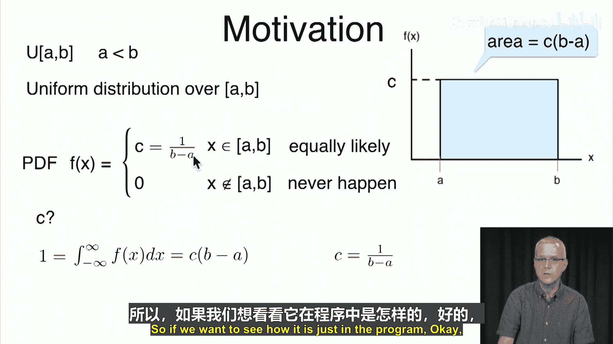
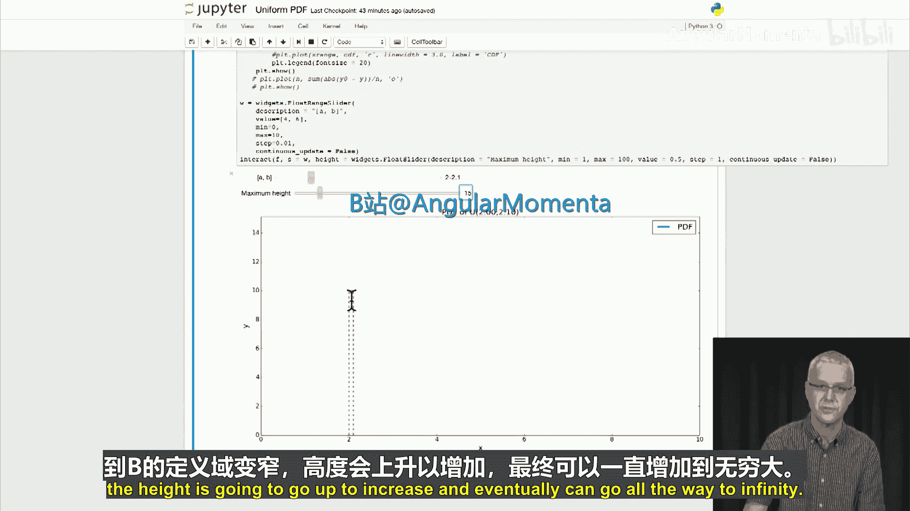
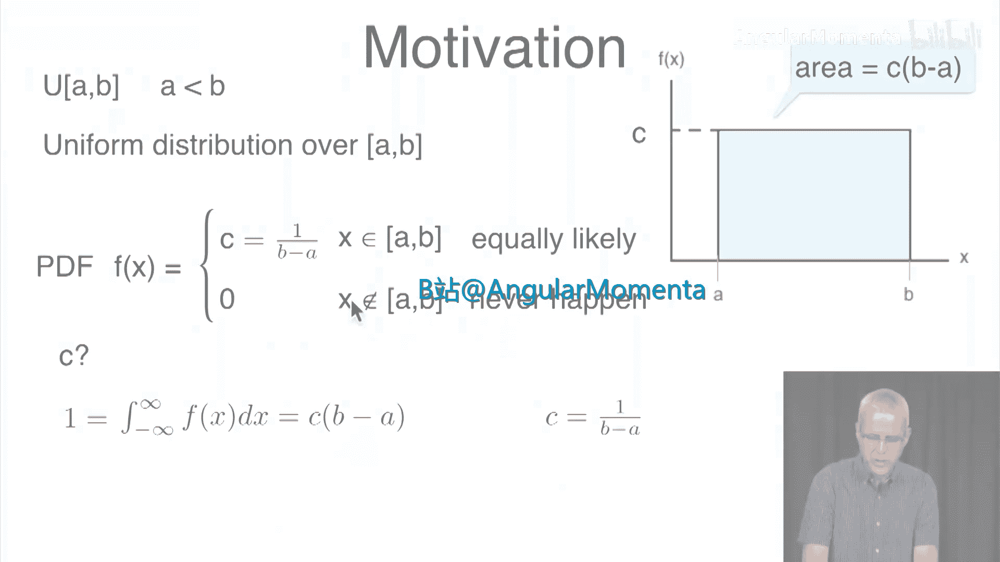
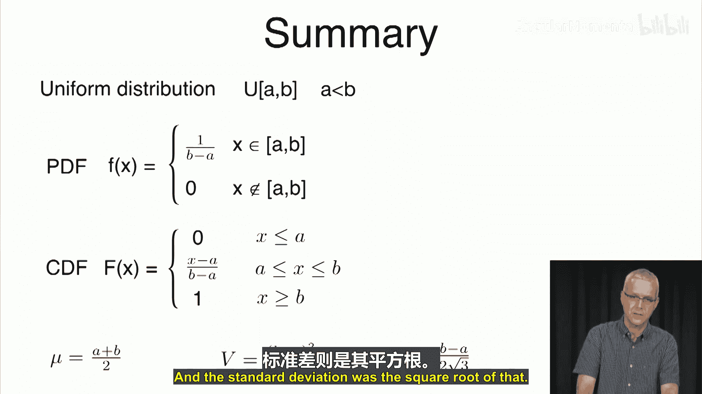

# 039：均匀分布 📊

在本节课中，我们将开始学习连续分布。我们将首先讨论**均匀分布**，这是一种在指定区间内概率密度恒定的分布。

## 均匀分布的定义

均匀分布记作 **U(a, b)**，其中 **a < b**。它表示在区间 **[a, b]** 上的均匀分布。如果随机变量 **X** 落在这个区间内，那么它在区间内任意一点出现的概率是相同的。对于区间外的值，其概率为零。

## 概率密度函数

均匀分布的概率密度函数（PDF）在区间 **[a, b]** 内是一个常数 **C**，在区间外则为零。其图像如下所示：

为了使其成为一个有效的概率分布，概率密度函数在整个实数域上的积分必须等于1。由于密度函数在区间外为零，我们只需计算区间 **[a, b]** 上的积分。

这个积分等于常数 **C** 乘以区间长度 **(b - a)**，即：
`面积 = C * (b - a)`

为了使总面积等于1，我们令：
`C * (b - a) = 1`

由此解出常数 **C**：
`C = 1 / (b - a)`

因此，均匀分布的概率密度函数为：
`f(x) = 1 / (b - a)`，当 `a ≤ x ≤ b`
`f(x) = 0`，其他情况

## 通过代码理解分布

我们可以通过Python代码直观地观察均匀分布。以下代码展示了如何绘制不同参数下的均匀分布概率密度函数图。

运行代码后，我们可以看到：
*   当区间为 **[4, 6]** 时，区间长度为2，因此概率密度函数的高度为 `1/2 = 0.5`。
*   如果将区间改为 **[4, 8]**，区间长度变为4，高度则变为 `1/4 = 0.25`。宽度与高度的乘积始终为1。
*   当区间变得非常窄，例如 **[2, 2.1]** 时，宽度为0.1，高度则变为10。此时需要调整绘图坐标轴以完整显示图像。

## 验证其为有效分布

一个有效的概率密度函数需要满足两个条件：
1.  **非负性**：`f(x) ≥ 0`。对于均匀分布，在区间内为正常数 `1/(b-a)`，在区间外为零，显然满足。
2.  **归一性**：积分等于1。我们通过选择常数 `C = 1/(b-a)` 已经确保了这一点。

## 均匀分布的应用场景

均匀分布虽然简单，但在一些场景中确实会出现：
*   **等待时间**：假设公交车每隔固定时间发车，你随机到达车站，那么你需要等待的时间（分钟数）可能服从一个区间上的均匀分布。
*   **缺陷位置**：电路芯片上缺陷出现的位置可能被视为在芯片面积上均匀分布。
*   **分子位置**：空间中的分子位置在某些简化模型下可视为均匀分布。

## 累积分布函数

累积分布函数（CDF）**F(x)** 定义为概率密度函数从负无穷到 **x** 的积分。对于均匀分布 **U(a, b)**，我们需要分段讨论：

1.  当 **x ≤ a** 时：
    `F(x) = ∫_{-∞}^{x} 0 du = 0`
2.  当 **a < x ≤ b** 时：
    `F(x) = F(a) + ∫_{a}^{x} (1/(b-a)) du = 0 + (x - a) / (b - a)`
3.  当 **x > b** 时：
    `F(x) = F(b) + ∫_{b}^{x} 0 du = 1 + 0 = 1`

因此，均匀分布的CDF图像是一条从点 **(a, 0)** 到点 **(b, 1)** 的直线，之后保持为1。

同样，我们可以用代码交互式地查看CDF的变化。

## 计算区间概率

利用累积分布函数，我们可以轻松计算随机变量落在某个区间的概率。对于连续分布，区间端点是否包含不影响概率值。

*   对于区间 **[α, β]** （其中 **a ≤ α < β ≤ b**）：
    `P(α ≤ X ≤ β) = F(β) - F(α) = (β - α) / (b - a)`
    这直观上就是区间长度占总长度的比例。
*   对于区间 **[β, ∞)**：
    `P(X ≥ β) = 1 - F(β) = (b - β) / (b - a)`
*   对于单点 **α**：
    `P(X = α) = 0` （连续分布中单点概率为零）

## 均值与方差

首先，我们计算标准均匀分布 **U(0, 1)** 的均值和方差。

*   **期望值 (均值)**：
    `E[X] = ∫_{0}^{1} x * 1 dx = [x^2/2]_{0}^{1} = 1/2`
*   **X²的期望值**：
    `E[X²] = ∫_{0}^{1} x² * 1 dx = [x³/3]_{0}^{1} = 1/3`
*   **方差**：
    `Var(X) = E[X²] - (E[X])² = 1/3 - (1/2)² = 1/12`
*   **标准差**：
    `Std(X) = √(Var(X)) = 1 / (2√3) ≈ 0.289`

接下来，推导一般均匀分布 **Y ~ U(a, b)** 的均值和方差。我们可以通过线性变换将 **Y** 与标准均匀分布 **X ~ U(0,1)** 联系起来：
`Y = (b - a) * X + a`

*   **期望值**：
    `E[Y] = E[(b-a)X + a] = (b-a)E[X] + a = (b-a)/2 + a = (a + b) / 2`
    均值正好是区间中点。
*   **方差**：
    `Var(Y) = Var((b-a)X + a) = (b-a)² * Var(X) = (b-a)² / 12`
*   **标准差**：
    `Std(Y) = (b - a) / (2√3) ≈ 0.289 * (b - a)`

## 总结 📝

本节课我们一起学习了**均匀分布**：
*   均匀分布记作 **U(a, b)**，在区间 **[a, b]** 内概率密度恒定。
*   其**概率密度函数**为：`f(x) = 1/(b-a)` (当 `a ≤ x ≤ b`)，否则为0。
*   其**累积分布函数**在 `x ≤ a` 时为0，在 `a < x ≤ b` 时线性增长至1，之后保持为1。
*   均匀分布的**均值**为区间中点 `(a+b)/2`。
*   均匀分布的**方差**为 `(b-a)² / 12`，**标准差**约为 `0.289 * (b-a)`。

在下一节课中，我们将讨论另一种重要的连续分布：**指数分布**。

