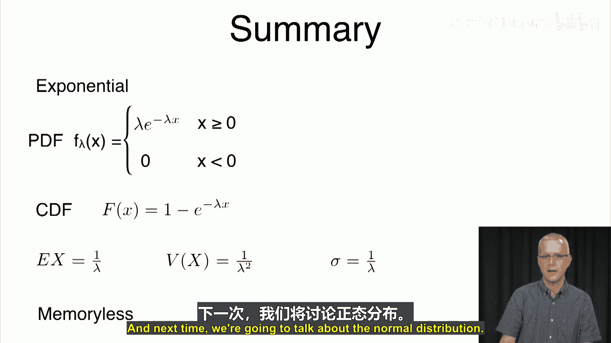

# 040：指数分布 📊

在本节课中，我们将学习指数分布。指数分布是几何分布在连续值上的扩展，常用于对电话通话时长、设备寿命、等待时间等连续随机事件进行建模。我们将从其定义、性质、期望与方差，以及一个关键特性——无记忆性——入手，并通过一个生动的例子来理解其应用。

## 概述 📖

指数分布的概率密度函数（PDF）定义如下：对于参数 λ > 0，其密度函数为：
`f(x) = λe^{-λx}`，当 x ≥ 0
`f(x) = 0`，当 x < 0

这是一个非负函数，并且其从0到无穷大的积分等于1，这验证了它是一个有效的概率分布。

## 概率密度函数可视化 📈

我们可以使用Python代码来绘制不同λ值下的指数分布密度函数图像，直观地观察其变化。

以下是绘制指数分布密度函数的Python代码示例：
```python
import numpy as np
import matplotlib.pyplot as plt

def plot_exponential(lambda_val, x_max=10):
    x = np.linspace(0, x_max, 1000)
    y = lambda_val * np.exp(-lambda_val * x)
    plt.plot(x, y, label=f'λ = {lambda_val}')
    plt.xlabel('x')
    plt.ylabel('f(x)')
    plt.title('Exponential Distribution PDF')
    plt.legend()
    plt.grid(True)
    plt.show()

# 示例：绘制λ=0.5, 1, 5时的图像
plot_exponential(0.5)
plot_exponential(1)
plot_exponential(5)
```
运行此代码可以看到，λ值越大，曲线下降得越陡峭，起始点也越高。反之，λ值越小，曲线下降越平缓。

## 累积分布函数与概率计算 🧮

上一节我们看到了密度函数的形态，本节中我们来看看如何计算具体的概率。这需要用到累积分布函数。

指数分布的累积分布函数（CDF）为：
`F(a) = P(X ≤ a) = 1 - e^{-λa}`，对于 a ≥ 0。

利用CDF，我们可以方便地计算各种区间概率。例如，计算X落在区间(a, b)内的概率：
`P(a < X < b) = F(b) - F(a) = e^{-λa} - e^{-λb}`。

## 期望与方差 🔢

了解了一个分布如何描述概率后，我们自然关心它的集中趋势和离散程度，即期望和方差。

指数分布的期望（均值）为：
`E[X] = 1/λ`

其方差为：
`Var(X) = 1/λ²`

因此，标准差也为 `1/λ`。这意味着，λ越大，不仅期望寿命越短，其波动性（标准差）也越小。

## 无记忆性 ⏳

指数分布有一个非常独特且重要的性质，称为“无记忆性”。这是它与许多其他分布的本质区别。

无记忆性是指：对于任意非负值a和b，有：
`P(X > a + b | X > a) = P(X > b)`

用生活中的例子解释：假设通话时长服从指数分布。如果你已经通话了a秒，那么通话再持续b秒的概率，与从一开始就算起、通话持续b秒的概率完全相同。过去的等待时间对未来没有影响。

这个性质也意味着，给定X > a的条件下，X的剩余寿命的分布与原始分布完全相同。

## 无记忆性的应用实例 🚗

为了加深对无记忆性的理解，我们来看一个具体的场景：在车管所（DMV）排队。

假设：
1.  有两个服务窗口，每个窗口的服务时间服从参数为λ的指数分布。
2.  你到达时，已有一人（A）在排队。
3.  随后，另一人（B）插队到了你前面。
4.  当有窗口空闲时，A首先开始服务。之后第二个窗口空闲时，B开始服务，最后才轮到你。

问题是：在服务时间服从指数分布（无记忆）的假设下，你最后一位结束服务的概率是多少？

以下是所有可能的完成顺序及其概率分析：
*   **A -> B -> 你**：概率 = (1/2) * (1/2) = 1/4
    *   A先于B结束的概率是1/2（无记忆性，从B开始服务时算起，两人剩余服务时间分布相同）。
    *   在A结束后，B和你的剩余服务时间分布相同，B先于你结束的概率也是1/2。
*   **A -> 你 -> B**：概率 = 1/4 （同理）
*   **B -> A -> 你**：概率 = 1/4 （同理）
*   **B -> 你 -> A**：概率 = 1/4 （同理）
*   **你 -> A -> B**：概率 = 0 （你必须等至少一个人结束才能开始服务）
*   **你 -> B -> A**：概率 = 0 （同上）

因此，你最后一位结束的概率是顺序“A -> B -> 你”和“B -> A -> 你”的概率之和，即 `1/4 + 1/4 = 1/2`。

**结论**：尽管有人先到且有人插队，但由于服务时间的无记忆性，你成为最后一名完成服务的概率只是从“三人随机服务”时的1/3增加到了1/2，而并非必然最后一名。这个例子生动地展示了无记忆性如何影响随机事件的排序概率。

## 总结 ✨

本节课中我们一起学习了指数分布。
*   **定义**：其概率密度函数为 `f(x) = λe^{-λx} (x≥0)`。
*   **性质**：累积分布函数为 `F(x) = 1 - e^{-λx}`，期望 `E[X] = 1/λ`，方差 `Var(X) = 1/λ²`。
*   **核心特性**：指数分布具有**无记忆性**，即 `P(X > a+b | X > a) = P(X > b)`。这意味着过去已等待的时间不会影响未来的剩余寿命分布。
*   **应用**：该分布常用于对寿命、等待时间等连续随机变量建模，其无记忆性在排队论等领域有重要应用。




下一讲，我们将探讨统计学中最重要的分布之一：正态分布。