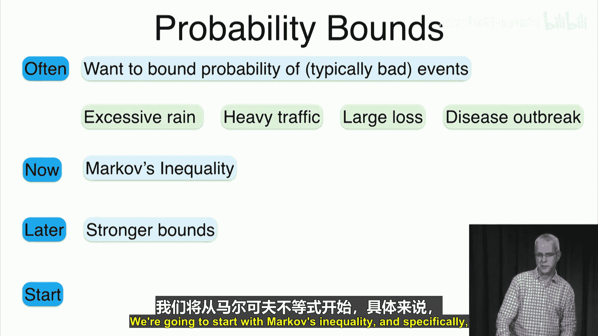
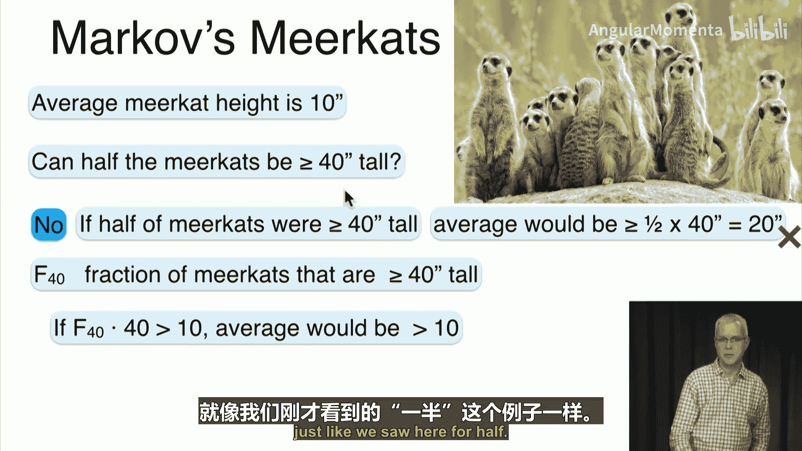
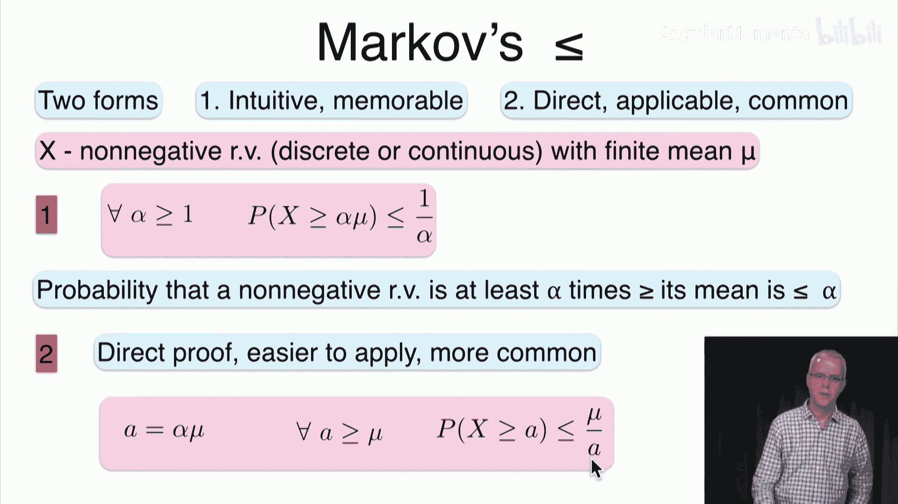
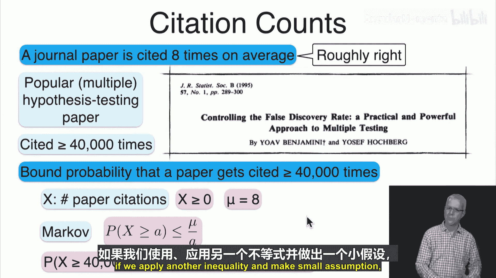
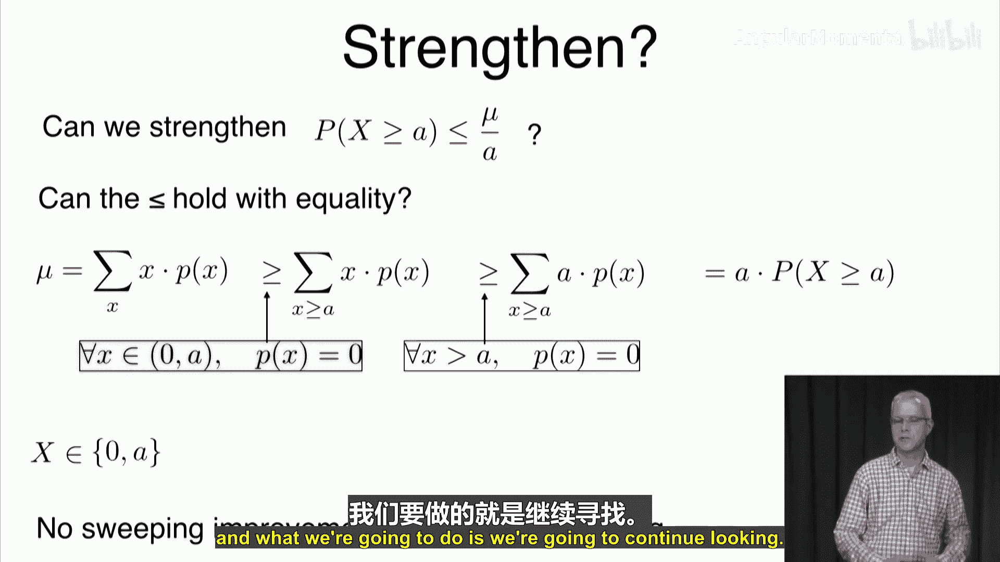
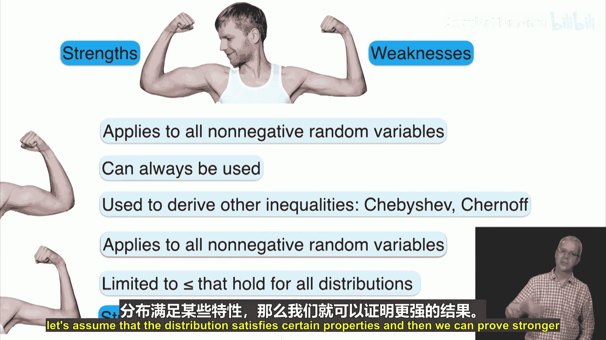

# 041：马尔可夫不等式 📊

在本节课中，我们将学习与概率分布相关的不等式。我们将从马尔可夫不等式开始，它是许多后续不等式的基础。我们将探讨其动机、提供直观解释、正式表述、证明过程、应用示例，并讨论其可能的扩展与局限性。

## 动机与直观解释 🧠

我们为什么需要不等式？通常，我们希望限定某些事件（尤其是“坏”事件）发生的概率。例如，我们希望确保暴雨、严重交通拥堵、公司巨额亏损或疾病爆发的概率很小。马尔可夫不等式是这类概率界限的基础。

为了直观理解，考虑一组身高为非负数的“马克夫”（Mucovs）。假设它们的平均身高是10英寸。那么，是否可能有一半的马克夫身高至少为40英寸？答案是否定的。因为如果一半的马克夫身高超过40英寸，仅这一半的平均身高就至少是20英寸（`(1/2) * 40 = 20`）。即使另一半身高为0，总平均也至少是20英寸，这与已知的平均10英寸矛盾。

更一般地，设平均身高为 `μ`。身高超过 `αμ`（其中 `α > 1`）的马克夫所占的比例 `f(αμ)` 必须满足：
`f(αμ) * αμ ≤ μ`
由此可得：
`f(αμ) ≤ 1/α`
这意味着，身高超过平均身高 `α` 倍的个体比例最多为 `1/α`。这就是马尔可夫不等式的核心思想。

## 正式表述与证明 📝

马尔可夫不等式有两种等价的表述形式，适用于任何具有有限均值 `μ` 的非负随机变量 `X`（可以是离散的或连续的）。

**第一种表述（更易记忆）：**
对于任意 `α > 1`，
`P(X ≥ αμ) ≤ 1/α`
它表明，一个非负随机变量至少是其均值 `α` 倍的概率最多是 `1/α`。

**第二种表述（更易应用）：**
对于任意 `a > μ`（或 `a ≥ μ`），
`P(X ≥ a) ≤ μ / a`
它直接给出了随机变量超过某个阈值 `a` 的概率上限。

以下是第二种表述的证明（以离散随机变量为例，连续情形只需将求和替换为积分）：

随机变量 `X` 的期望（均值）定义为：
`μ = E[X] = Σ_x x * P(X = x)`

现在考虑概率 `P(X ≥ a)`。我们可以通过以下步骤推导其上限：
`μ = Σ_x x * P(X = x)`
`≥ Σ_{x ≥ a} x * P(X = x)` （因为只对 `x ≥ a` 的部分求和，舍弃了非负项）
`≥ Σ_{x ≥ a} a * P(X = x)` （因为在 `x ≥ a` 的区域，用 `a` 替换 `x` 会使求和值变小）
`= a * Σ_{x ≥ a} P(X = x)`
`= a * P(X ≥ a)`

因此，我们得到：
`μ ≥ a * P(X ≥ a)`
移项后即得：
`P(X ≥ a) ≤ μ / a`
证明完毕。

## 应用示例 📄

考虑学术论文的引用次数。已知期刊论文的平均引用次数约为8次。我们想估算一篇论文被引用至少40,000次（如一篇关于假设检验的著名论文）的概率。

设 `X` 为一篇论文的引用次数。`X` 是非负的，且已知 `μ = 8`。应用马尔可夫不等式（第二种表述），取 `a = 40,000`：
`P(X ≥ 40,000) ≤ μ / a = 8 / 40,000 = 0.0002`
即概率不超过 **0.02%**。

虽然这个界限看起来已经很强，但后续我们会看到，在增加一些假设后，其他不等式（如切比雪夫不等式）可以提供更紧的界限。

## 扩展与讨论 🔍

在理解了马尔可夫不等式后，我们自然会问：它能否被推广或加强？

**1. 能否去掉“非负”的假设？**
不能。如果随机变量可以为负，我们可以构造分布，使得 `P(X ≥ a)` 任意接近1，同时均值 `μ` 保持为任意给定值。因此，非负条件是必要的。

**2. 能否加强不等式的界限（例如使上限更小）？**
通常不能。从证明过程可以看出，当随机变量 `X` 只以概率 `p` 取值 `a`，以概率 `1-p` 取值 `0`，且均值 `μ = p * a` 时，马尔可夫不等式取等号：`P(X ≥ a) = p = μ / a`。既然存在分布使等式成立，我们就无法在不增加额外假设的情况下得到一个普遍更小的上限。

## 优缺点总结 ⚖️

**优点：**
*   **适用性广：** 仅要求随机变量非负且有有限均值，对分布形式无任何其他要求，因此总是可以使用。
*   **基础性：** 它是推导其他更强不等式（如切比雪夫不等式、霍夫丁不等式）的基石。

**缺点：**
*   **界限可能较松：** 正因为它对所有分布都成立，所以对于某些具体分布（如方差很小的分布），它给出的概率上限可能远大于实际概率，不够精确。

## 课程总结 🎯

本节课我们一起学习了马尔可夫不等式。
*   我们通过“马克夫”身高的例子获得了直观理解。
*   我们学习了其两种等价表述形式并完成了证明。
*   我们通过论文引用次数的例子看到了它的应用。
*   我们讨论了其推广的局限性和无法普遍加强的原因。
*   最后，我们分析了该不等式的优点与缺点。

马尔可夫不等式虽然简单，但它是概率论中一个非常重要的工具。在下一讲中，我们将以此为基础，探讨更强大的**切比雪夫不等式**。