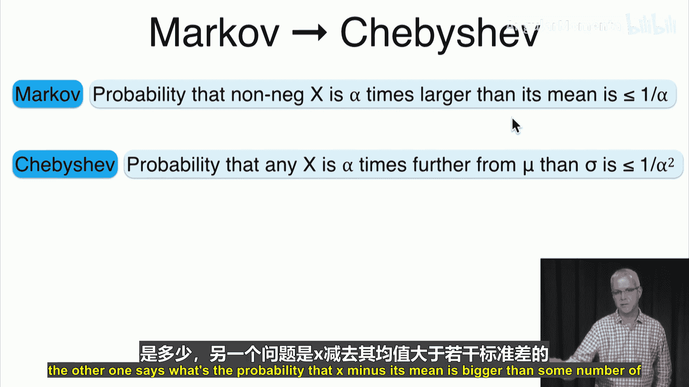
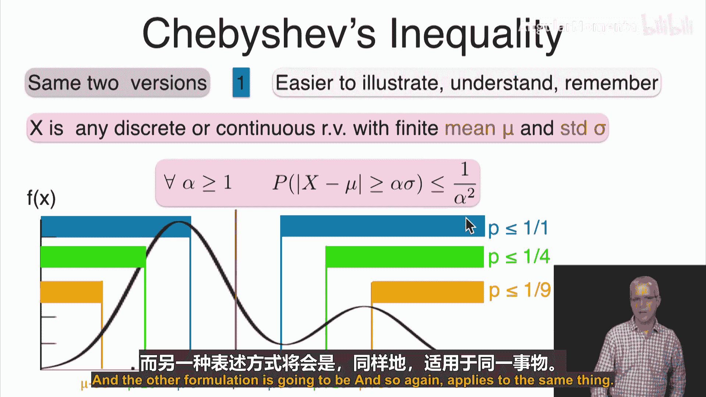
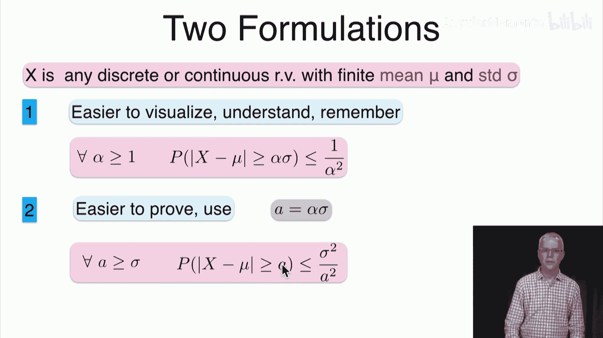
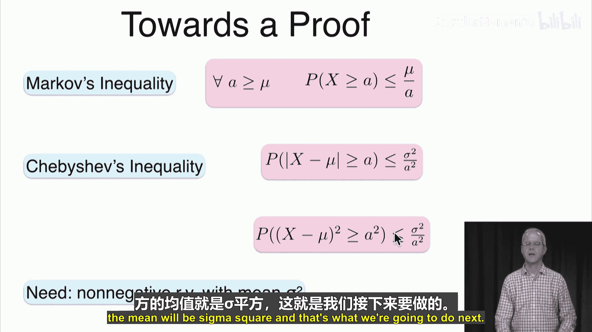
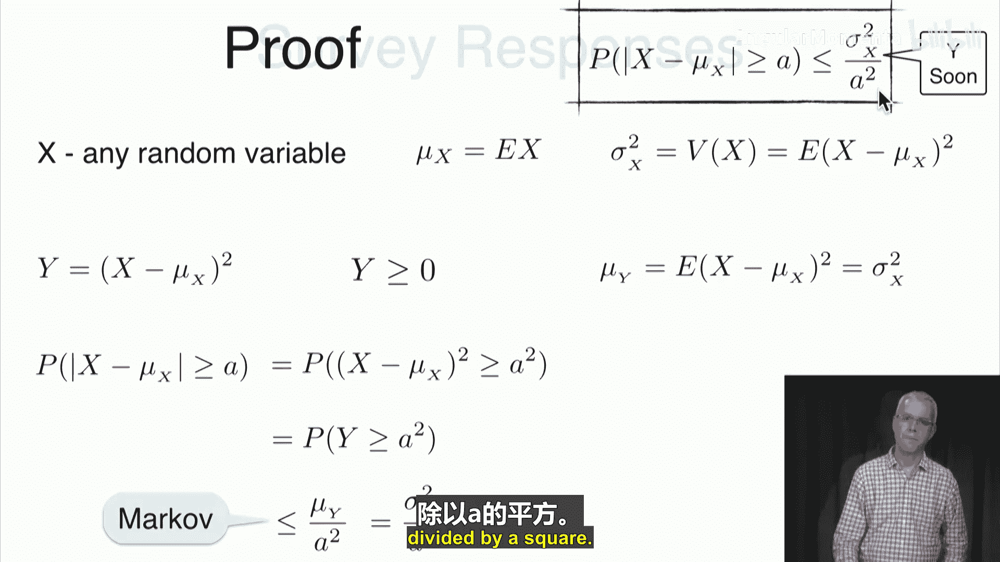
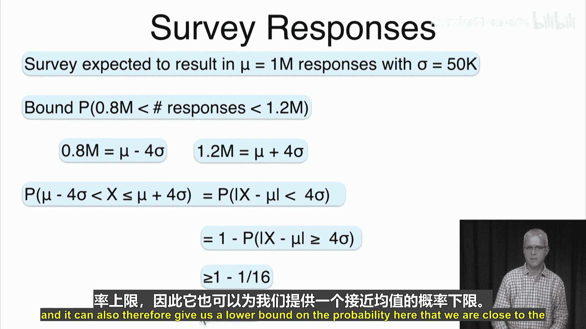
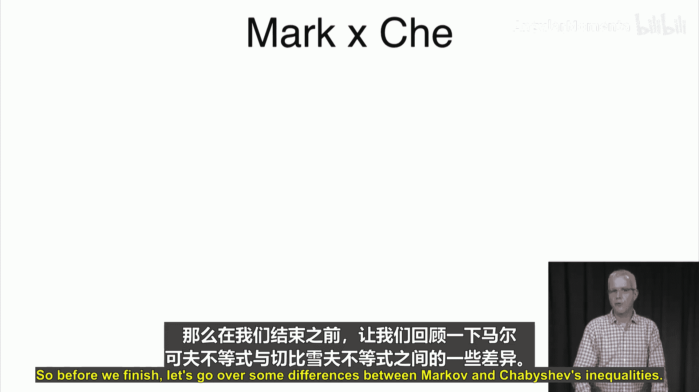
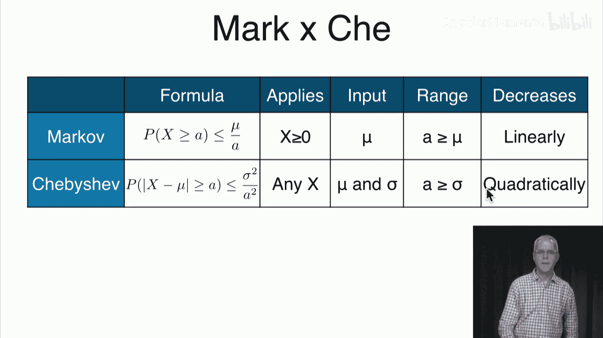

# 042：切比雪夫不等式 📊

在本节课中，我们将学习切比雪夫不等式。这是马尔可夫不等式的一个重要推论，用于估计随机变量偏离其均值的概率。我们将探讨其含义、证明过程，并通过实例来理解其应用。

上一节我们介绍了马尔可夫不等式，本节中我们来看看它的一个重要应用——切比雪夫不等式。切比雪夫是马尔可夫的导师，而切比雪夫不等式正是从马尔可夫不等式推导出来的。

## 从马尔可夫到切比雪夫 🔄

马尔可夫不等式描述了**非负**随机变量大于其均值特定倍数的概率上界。其公式为：
\[
P(X \geq \alpha \mu) \leq \frac{1}{\alpha}
\]
其中 \(X \geq 0\)，\(\alpha > 0\)。

切比雪夫不等式则适用于**任何**随机变量，它描述的是随机变量偏离其均值超过特定倍标准差的概率上界。其核心思想是：
\[
P(|X - \mu| \geq \alpha \sigma) \leq \frac{1}{\alpha^2}
\]
其中 \(\alpha > 1\)，\(\mu\) 是均值，\(\sigma\) 是标准差。

## 切比雪夫不等式的表述 📝

设 \(X\) 是任意具有有限均值 \(\mu\) 和标准差 \(\sigma\) 的离散或连续随机变量。

以下是切比雪夫不等式的两种等价表述：

**表述一（基于标准差倍数）：**
对于任意 \(\alpha > 1\)，随机变量偏离其均值至少 \(\alpha\) 个标准差的概率至多为 \(1/\alpha^2\)。
\[
P(|X - \mu| \geq \alpha \sigma) \leq \frac{1}{\alpha^2}
\]

**表述二（基于绝对距离）：**
对于任意 \(a > 0\)，随机变量偏离其均值至少 \(a\) 的概率至多为方差除以 \(a^2\)。
\[
P(|X - \mu| \geq a) \leq \frac{\sigma^2}{a^2}
\]
注意，当 \(a = \alpha \sigma\) 时，两种表述等价。

## 直观理解与图示 📈

为了更好地理解，我们可以将不等式可视化。假设有一个随机变量 \(X\)，其概率分布如图所示，均值 \(\mu\) 位于中心。

*   当 \(\alpha = 1\) 时，不等式给出 \(P(|X - \mu| \geq \sigma) \leq 1\)。这个结论比较平凡，因为任何概率都小于等于1。
*   当 \(\alpha = 2\) 时，不等式给出 \(P(|X - \mu| \geq 2\sigma) \leq 1/4\)。这意味着数据落在均值两侧两个标准差范围之外的概率不超过25%。
*   当 \(\alpha = 3\) 时，不等式给出 \(P(|X - \mu| \geq 3\sigma) \leq 1/9 \approx 11.1\%\)。这意味着数据落在“三西格玛”范围之外的概率相对较小。

由此可见，随着 \(\alpha\) 增大（即我们考虑更远的偏离），概率上界 \(1/\alpha^2\) 会迅速减小。

## 证明过程 🧠

切比雪夫不等式可以利用马尔可夫不等式简洁地证明。

**证明：**
设随机变量 \(X\) 的均值为 \(\mu_X\)，方差为 \(\sigma_X^2\)。
定义一个新的随机变量 \(Y = (X - \mu_X)^2\)。
显然，\(Y \geq 0\)，且 \(Y\) 的期望值为：
\[
E[Y] = E[(X - \mu_X)^2] = \sigma_X^2
\]
现在，考虑我们想要估计的概率：
\[
P(|X - \mu_X| \geq a) = P((X - \mu_X)^2 \geq a^2) = P(Y \geq a^2)
\]
由于 \(Y\) 是非负随机变量，我们可以对其应用马尔可夫不等式：
\[
P(Y \geq a^2) \leq \frac{E[Y]}{a^2} = \frac{\sigma_X^2}{a^2}
\]
因此，我们证明了：
\[
P(|X - \mu_X| \geq a) \leq \frac{\sigma_X^2}{a^2}
\]
证毕。

## 应用示例 💡

了解了原理和证明后，我们通过两个例子来看看如何应用切比雪夫不等式。

**示例1：估计高分概率**
假设某次考试的分数 \(X\) 平均分 \(\mu = 75\)，标准差 \(\sigma = 10\)。我们想估计分数超过90分的概率。
分数90分比均值高出了 \(90 - 75 = 15\) 分，即 \(a = 15\)。
根据切比雪夫不等式（表述二）：
\[
P(X \geq 90) \leq P(|X - 75| \geq 15) \leq \frac{10^2}{15^2} = \frac{100}{225} \approx 0.444
\]
因此，分数超过90的概率至多为44.4%。这是一个比较宽松的上界，实际概率通常会更低。

**示例2：估计调查响应数的范围**
假设进行一项调查，根据经验，预期响应数均值 \(\mu = 1,000,000\)，标准差 \(\sigma = 50,000\)。我们想估计实际响应数落在800,000到1,200,000之间的概率**下限**。
注意，800,000 = \(\mu - 4\sigma\)，1,200,000 = \(\mu + 4\sigma\)。
我们关心的事件是 \(|X - \mu| < 4\sigma\)，这是 \(|X - \mu| \geq 4\sigma\) 的补集。
根据切比雪夫不等式：
\[
P(|X - \mu| \geq 4\sigma) \leq \frac{1}{4^2} = \frac{1}{16}
\]
因此，
\[
P(|X - \mu| < 4\sigma) = 1 - P(|X - \mu| \geq 4\sigma) \geq 1 - \frac{1}{16} = \frac{15}{16} = 0.9375
\]
所以，响应数落在该范围内的概率至少为93.75%。切比雪夫不等式不仅可以给出“偏离”概率的上界，还可以通过补集得到“靠近”概率的下界。

## 与马尔可夫不等式的比较 ⚖️

为了更好地理解切比雪夫不等式，我们将其与马尔可夫不等式进行对比：

以下是两者的核心区别：

*   **适用对象**：马尔可夫不等式要求随机变量**非负**；切比雪夫不等式适用于**任何**随机变量。
*   **所需信息**：马尔可夫不等式只需要均值；切比雪夫不等式需要均值和方差（或标准差）。
*   **边界形式**：马尔可夫不等式给出 \(P(X \geq a) \leq \mu / a\)，概率上界随 \(a\) **线性（1/a）** 下降；切比雪夫不等式给出 \(P(|X-\mu| \geq a) \leq \sigma^2 / a^2\)，概率上界随 \(a\) **平方（1/a²）** 下降，下降速度更快，因此通常能给出更紧（在某些情况下）或有用的界限。
*   **有效范围**：马尔可夫不等式在 \(a > \mu\) 时提供有意义（≤1）的界限；切比雪夫不等式在 \(a > \sigma\) 时提供有意义的界限。

## 总结 📚

本节课中我们一起学习了切比雪夫不等式。
我们首先了解了它如何从马尔可夫不等式衍生而来，并比较了两者的异同。
然后，我们学习了切比雪夫不等式的两种表述形式，并通过图示直观理解了其含义：它限制了随机变量偏离其均值超过一定范围的概率。
接着，我们利用马尔可夫不等式完成了其简洁的证明。
最后，通过两个实际例子，我们演示了如何应用该不等式来估计概率的上界或下界，并总结了它与马尔可夫不等式的关键区别。

切比雪夫不等式是概率论中一个非常强大的工具，它仅利用均值和方差就对随机变量的分布做出了普适性的概率断言。下次课，我们将探讨切比雪夫不等式的一个重要应用——**大数定律**。