# 044：矩生成函数 📊

在本节课中，我们将学习矩生成函数。矩生成函数是一个强大的工具，它能生成随机变量的所有矩，并为后续学习更强大的概率不等式奠定基础。

## 什么是矩？

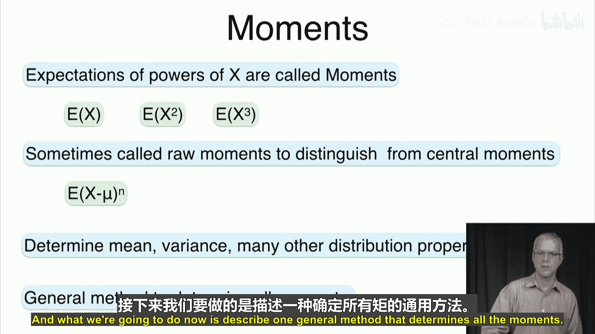

上一节我们介绍了马尔可夫和切比雪夫不等式，本节中我们来看看矩的概念。矩是随机变量幂的期望值。

*   **原始矩**：`E[X^n]` 被称为第 `n` 阶原始矩。例如，一阶矩 `E[X]` 是均值，二阶矩 `E[X^2]` 与方差有关。
*   **中心矩**：`E[(X - μ)^n]` 被称为第 `n` 阶中心矩，其中 `μ = E[X]`。例如，二阶中心矩就是方差 `Var(X)`。

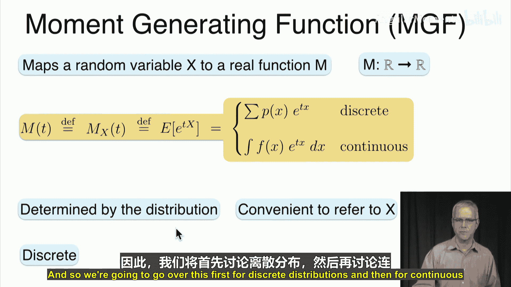

矩决定了分布的许多性质，如均值、方差等。现在，我们将介绍一个能确定所有矩的通用方法。

## 矩生成函数的定义

矩生成函数将一个随机变量 `X` 映射为一个实函数 `M(t)`。

其定义为随机变量 `e^(tX)` 的期望值：
`M_X(t) = E[e^(tX)]`

这个定义对离散和连续分布都适用。

*   对于离散分布：`M_X(t) = Σ p(x) * e^(t*x)`
*   对于连续分布：`M_X(t) = ∫ f(x) * e^(t*x) dx`

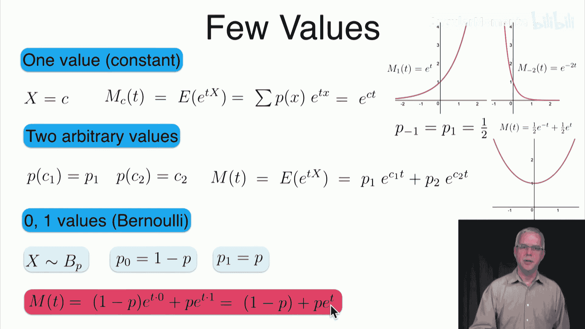

矩生成函数 `M_X(t)` 由 `X` 的分布决定。

## 矩生成函数示例

让我们从最简单的分布开始看一些例子。

### 常数随机变量

如果 `X` 恒等于常数 `c`，那么它的矩生成函数是：
`M_X(t) = E[e^(t*c)] = e^(c*t)`

例如，若 `X = 1`，则 `M_X(t) = e^t`；若 `X = -2`，则 `M_X(t) = e^(-2t)`。矩生成函数总是非负的，并且在 `t=0` 时值为1。

### 两点分布（推广的伯努利）

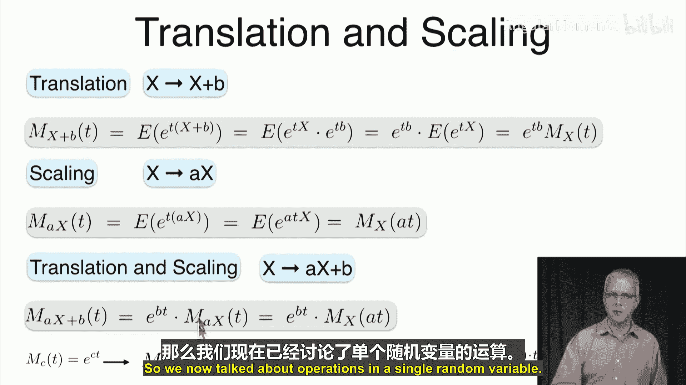

考虑一个随机变量，以概率 `p1` 取值 `c1`，以概率 `p2` 取值 `c2`（`p1 + p2 = 1`）。其矩生成函数为：
`M_X(t) = p1 * e^(c1*t) + p2 * e^(c2*t)`

一个特例是取值为 `1` 和 `-1`，概率各为 `1/2`，则 `M_X(t) = (e^t + e^(-t))/2`。

### 伯努利分布

如果 `X ~ Bernoulli(p)`，即 `P(X=1)=p`, `P(X=0)=1-p`，那么其矩生成函数为：
`M_X(t) = (1-p)*e^(0*t) + p*e^(1*t) = 1-p + p*e^t`

## 矩生成函数的性质

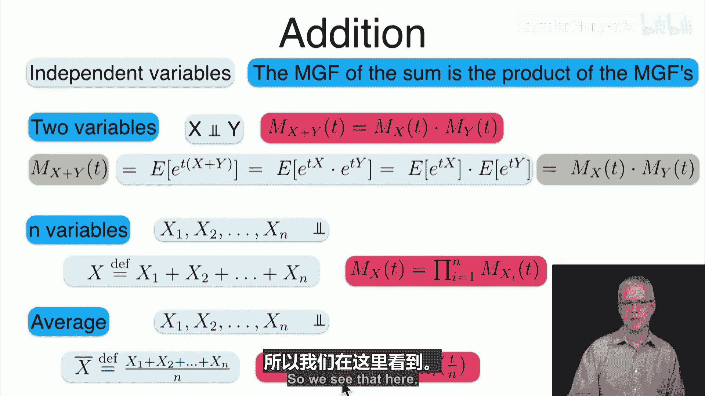

了解了基本定义和例子后，我们来看看矩生成函数的一些重要性质。

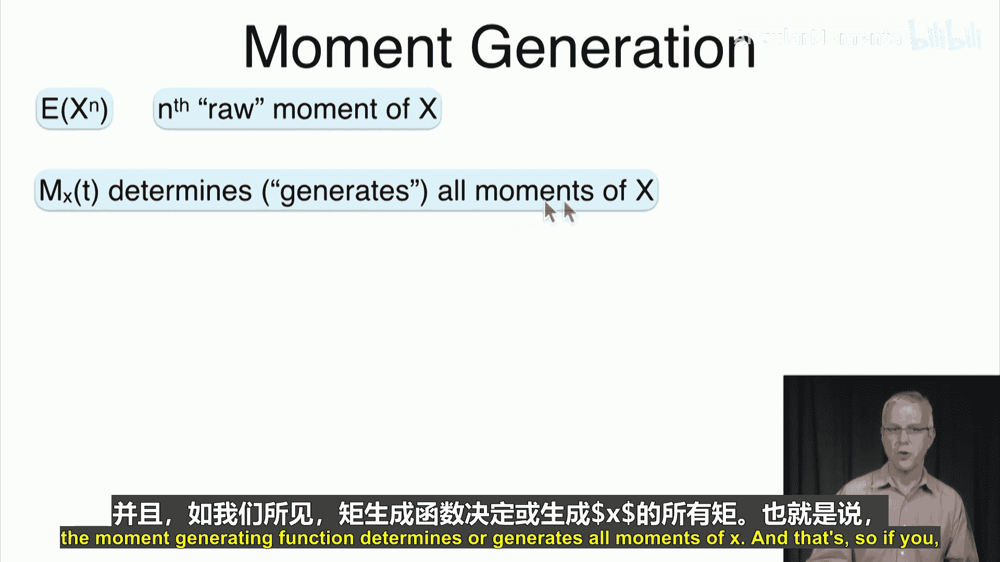

### 基本性质

*   **非负性**：对于所有 `t`，`M_X(t) > 0`。
*   **在零点的值**：`M_X(0) = E[e^(0*X)] = E[1] = 1`。

### 平移与缩放

以下是随机变量经过线性变换后，其矩生成函数的变化。

*   **平移**：若 `Y = X + b`，则 `M_Y(t) = e^(b*t) * M_X(t)`。
*   **缩放**：若 `Y = a*X`，则 `M_Y(t) = M_X(a*t)`。
*   **线性变换**：结合以上两者，若 `Y = a*X + b`，则 `M_Y(t) = e^(b*t) * M_X(a*t)`。

**示例**：常数 `c` 的矩生成函数为 `e^(c*t)`。对于 `Y = a*c + b`，利用性质可得 `M_Y(t) = e^(b*t) * e^(c*a*t) = e^((a*c+b)*t)`，这与将 `Y` 视为常数直接计算的结果一致。

### 独立随机变量之和

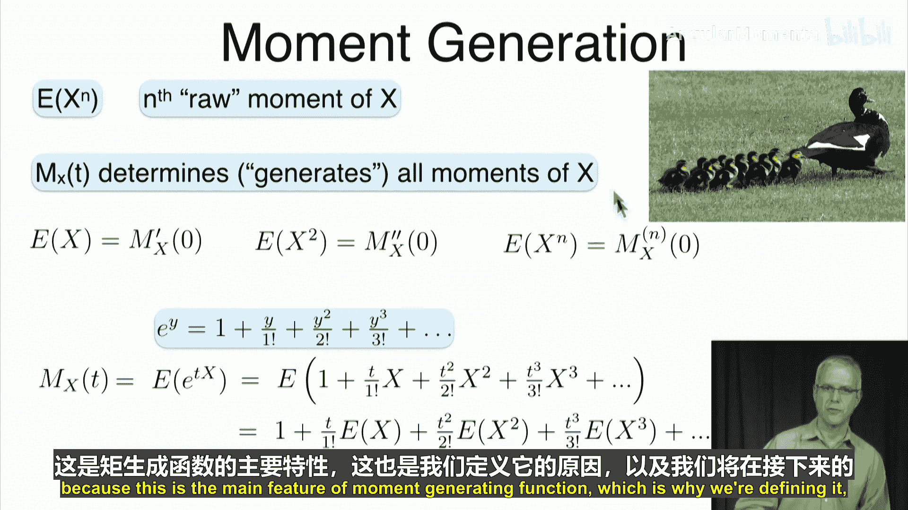

矩生成函数在处理独立随机变量和时表现出极好的性质。

如果 `X` 和 `Y` 相互独立，那么 `X+Y` 的矩生成函数是它们各自矩生成函数的乘积：
`M_(X+Y)(t) = M_X(t) * M_Y(t)`

**证明**：`M_(X+Y)(t) = E[e^(t(X+Y))] = E[e^(tX) * e^(tY)]`。由于 `X` 和 `Y` 独立，`e^(tX)` 和 `e^(tY)` 也独立，因此期望等于各自期望的乘积，即 `M_X(t) * M_Y(t)`。

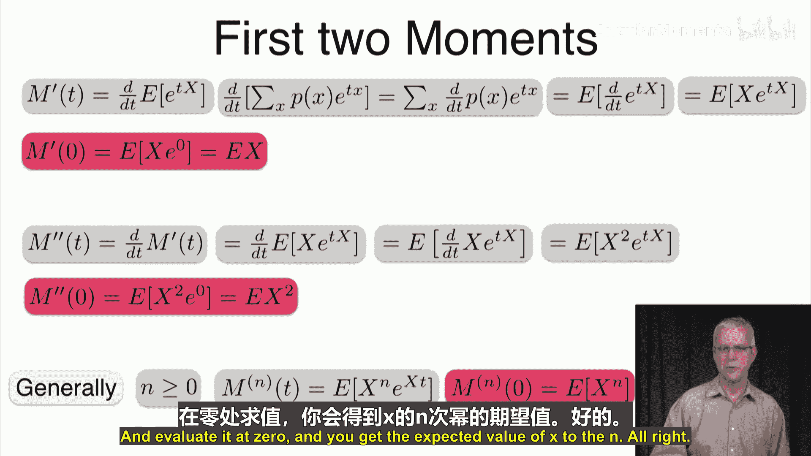

这个性质可以推广到 `n` 个独立随机变量的和或平均值。

## 矩生成函数如何“生成”矩

矩生成函数的核心价值在于其名称所揭示的：它能生成随机变量的所有矩。

第 `n` 阶原始矩 `E[X^n]` 等于矩生成函数的 `n` 阶导数在 `t=0` 处的值：
`E[X^n] = M_X^(n)(0)`

**直观理解**：将 `e^(tX)` 用泰勒级数展开：
`e^(tX) = 1 + tX + (t^2 X^2)/2! + (t^3 X^3)/3! + ...`
两边取期望（利用期望的线性性质）：
`M_X(t) = E[e^(tX)] = 1 + tE[X] + (t^2 E[X^2])/2! + (t^3 E[X^3])/3! + ...`
可以看到，各阶矩 `E[X]`, `E[X^2]`, ... 作为系数隐藏在 `M_X(t)` 的级数展开中。对 `M_X(t)` 求 `n` 阶导数并令 `t=0`，就能提取出 `E[X^n]`。

**前两阶矩的推导**：
*   **一阶矩（均值）**：
    `M_X'(t) = d/dt E[e^(tX)] = E[ d/dt e^(tX) ] = E[X * e^(tX)]`
    令 `t=0`，得 `M_X'(0) = E[X * e^(0)] = E[X]`。
*   **二阶矩**：
    `M_X''(t) = d/dt M_X'(t) = E[ d/dt (X * e^(tX)) ] = E[X^2 * e^(tX)]`
    令 `t=0`，得 `M_X''(0) = E[X^2 * e^(0)] = E[X^2]`。

## 更多分布的矩生成函数

现在，让我们计算一些更常见分布的矩生成函数。

### 二项分布

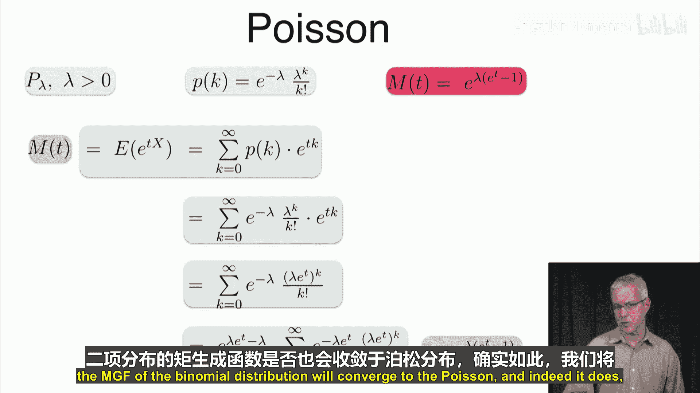

设 `X ~ Binomial(n, p)`。其矩生成函数为：
`M_X(t) = [1 + p(e^t - 1)]^n = (1-p + p*e^t)^n`

**推导**：
`M_X(t) = Σ_{k=0}^n C(n,k) p^k (1-p)^(n-k) e^(t*k) = Σ_{k=0}^n C(n,k) (p e^t)^k (1-p)^(n-k)`
根据二项式定理 `(a+b)^n = Σ C(n,k) a^k b^(n-k)`，这里 `a = p e^t`, `b = 1-p`，因此上式等于 `(p e^t + 1-p)^n`。

**验证均值**：对 `M_X(t)` 求导并令 `t=0`：
`M_X'(t) = n * (1-p + p e^t)^(n-1) * p e^t`
`M_X'(0) = n * (1-p + p)^(n-1) * p * 1 = n * 1^(n-1) * p = n p`
这正是二项分布的均值 `E[X] = np`。

### 泊松分布

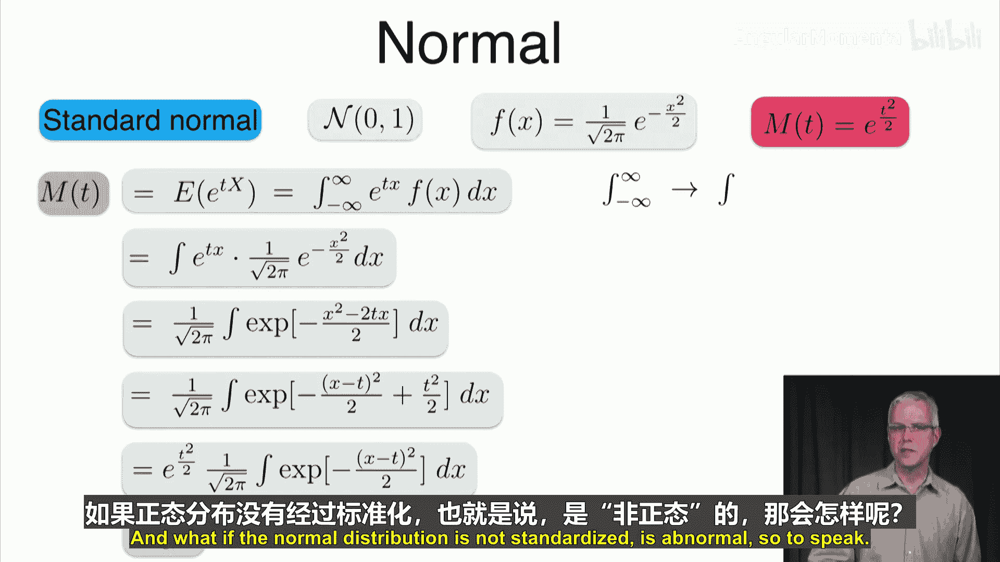

设 `X ~ Poisson(λ)`。其矩生成函数为：
`M_X(t) = e^{λ(e^t - 1)}`

**推导**：
`M_X(t) = Σ_{k=0}^∞ e^{-λ} λ^k / k! * e^(t*k) = e^{-λ} Σ_{k=0}^∞ (λ e^t)^k / k!`
注意到 `Σ_{k=0}^∞ (λ e^t)^k / k! = e^{λ e^t}`，因此 `M_X(t) = e^{-λ} * e^{λ e^t} = e^{λ(e^t - 1)}`。

### 正态分布

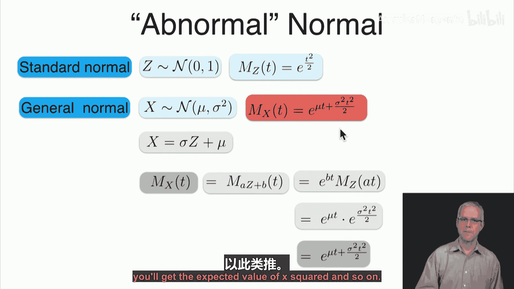

首先看标准正态分布 `Z ~ N(0,1)`。其矩生成函数为：
`M_Z(t) = e^{t^2/2}`

**推导**：
`M_Z(t) = ∫_{-∞}^{∞} e^{t*z} * (1/√(2π)) e^{-z^2/2} dz = (1/√(2π)) ∫_{-∞}^{∞} e^{-(z^2/2 - t*z)} dz`
通过配方：`-(z^2/2 - t*z) = -[(z-t)^2 - t^2]/2 = -(z-t)^2/2 + t^2/2`
因此，`M_Z(t) = e^{t^2/2} * (1/√(2π)) ∫_{-∞}^{∞} e^{-(z-t)^2/2} dz`。积分项是均值为 `t`、方差为1的正态分布密度函数的积分，结果为1。故 `M_Z(t) = e^{t^2/2}`。

对于一般正态分布 `X ~ N(μ, σ^2)`，我们可以将其写为 `X = σZ + μ`。利用线性变换的性质：
`M_X(t) = e^{μ*t} * M_Z(σ*t) = e^{μ*t} * e^{(σ*t)^2/2} = e^{μ*t + σ^2 t^2/2}`

## 矩生成函数的进一步性质（概述）

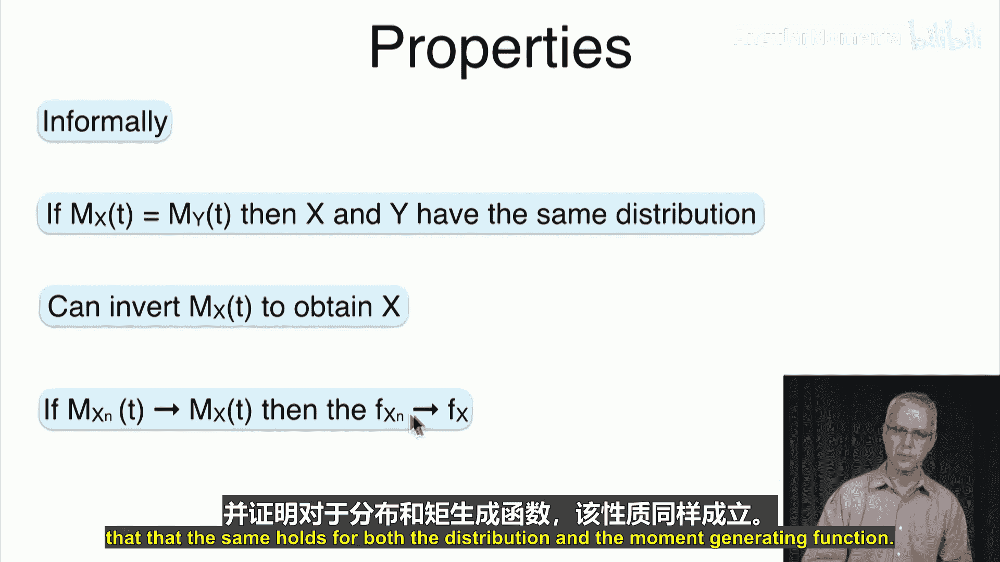

最后，我们简要提及矩生成函数的一些更深层次的性质，这些性质说明了它的重要性。

1.  **唯一性**：如果两个随机变量 `X` 和 `Y` 有相同的矩生成函数（在包含0的某个区间内），那么它们具有相同的分布（在几乎处处相等的意义下）。这意味着分布由其矩生成函数唯一确定。
2.  **可逆性**：理论上，可以从矩生成函数反推出随机变量的分布。
3.  **收敛性**：如果一列随机变量 `{X_n}` 的矩生成函数逐点收敛到某个随机变量 `X` 的矩生成函数，那么 `{X_n}` 的分布函数也收敛到 `X` 的分布函数。

**示例：二项分布收敛到泊松分布**
我们知道，当 `n` 很大且 `p` 很小使得 `np = λ` 时，二项分布 `Binomial(n, λ/n)` 近似于泊松分布 `Poisson(λ)`。这一收敛性也体现在矩生成函数上：
二项分布的矩生成函数为 `[1 + (λ/n)(e^t - 1)]^n`。
利用极限公式 `lim_{n→∞} (1 + a/n)^n = e^a`，令 `a = λ(e^t - 1)`，则当 `n→∞` 时：
`[1 + (λ/n)(e^t - 1)]^n → e^{λ(e^t - 1)}`
这正是泊松分布 `Poisson(λ)` 的矩生成函数。

## 总结

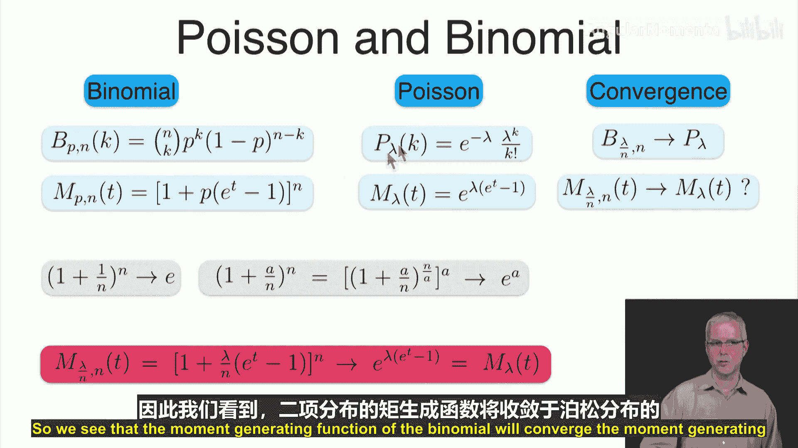

本节课中我们一起学习了矩生成函数。我们首先回顾了矩的概念，然后定义了矩生成函数 `M_X(t) = E[e^(tX)]`，并通过多个例子（如常数、伯努利、二项、泊松、正态分布）计算了它的具体形式。我们探讨了它的重要性质，包括在 `t=0` 处的值、平移缩放效应、以及对于独立随机变量之和的可乘性。最重要的是，我们揭示了矩生成函数如何通过求导来“生成”随机变量的各阶矩。最后，我们概述了矩生成函数的唯一性、可逆性和收敛性，这些性质使其成为概率论中一个非常核心的工具。在接下来的课程中，我们将利用矩生成函数来推导更强大的概率不等式。