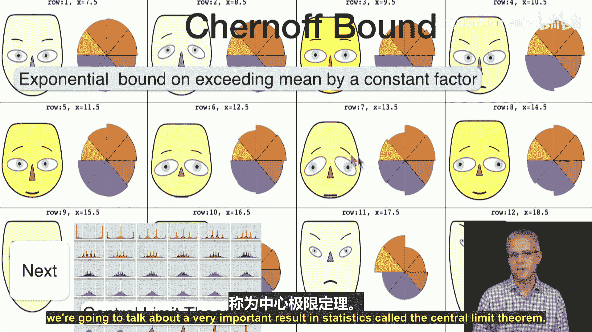

# 045：切尔诺夫界 🎯

在本节课中，我们将学习一个比之前讨论过的马尔可夫不等式和切比雪夫不等式**更强**的概率界——切尔诺夫界。我们将了解其证明过程，并看到一个实际应用案例。

## 概述

在前面的课程中，我们介绍了马尔可夫不等式和切比雪夫不等式。它们都用于界定一个随机变量取值远离其均值的概率。本节课，我们将探讨一个显著更强的界，称为切尔诺夫界。该界以赫尔曼·切尔诺夫的名字命名，他是一位至今健在的统计学家，以其对统计学领域的广泛贡献而闻名。

切尔诺夫界特别适用于二项分布，它表明随机变量超过均值某个比例的概率会随着样本量增加而**指数级下降**，这比马尔可夫不等式（概率界为常数）和切比雪夫不等式（概率界线性下降）要强大得多。

## 切尔诺夫界的推导

上一节我们回顾了马尔可夫不等式和切比雪夫不等式的基本思想。本节中，我们来看看如何通过“指数化”技巧，从马尔可夫不等式出发推导出切尔诺夫界。

### 核心思路：指数化与马尔可夫不等式

设随机变量 **X** 服从参数为 **(n, p)** 的二项分布，其均值 **μ = np**。我们希望界定 **P(X ≥ (1+δ)μ)** 的概率，其中 **δ ≥ 0**。

证明的关键步骤如下：

1.  **指数变换**：对于任意 **t ≥ 0**，事件 **{X ≥ a}** 等价于事件 **{e^(tX) ≥ e^(ta)}**。
2.  **应用马尔可夫不等式**：对非负随机变量 **e^(tX)** 应用马尔可夫不等式，得到：
    **P(X ≥ a) = P(e^(tX) ≥ e^(ta)) ≤ E[e^(tX)] / e^(ta)**
3.  **计算矩母函数**：我们需要计算 **E[e^(tX)]**，这正是二项分布的矩母函数。
    *   将 **X** 视为 **n** 个独立的伯努利随机变量 **X_i** 之和。
    *   因此，**E[e^(tX)] = E[∏ e^(tX_i)] = ∏ E[e^(tX_i)]** （由独立性可得）。
    *   对于伯努利变量，**E[e^(tX_i)] = (1-p) + pe^t**。
    *   所以，**E[e^(tX)] = [(1-p) + pe^t]^n**。
4.  **对上界进行放缩**：利用不等式 **1+x ≤ e^x**，我们可以得到：
    **E[e^(tX)] ≤ [e^{p(e^t - 1)}]^n = e^{np(e^t - 1)} = e^{μ(e^t - 1)}**
5.  **代入并优化参数 t**：将上界代入步骤2的不等式，并令 **a = (1+δ)μ**，得到：
    **P(X ≥ (1+δ)μ) ≤ e^{μ(e^t - 1)} / e^{t(1+δ)μ} = e^{μ[e^t - 1 - t(1+δ)]}**
    这个不等式对任意 **t ≥ 0** 都成立。为了得到最紧的界，我们选择 **t** 来最小化指数部分 **f(t) = e^t - 1 - t(1+δ)**。
6.  **求解最优 t**：对 **f(t)** 求导并令其为零：
    **f'(t) = e^t - (1+δ) = 0** ⇒ **t = ln(1+δ)**
    可以验证这是最小值点。
7.  **得到切尔诺夫界**：将最优 **t** 代回，经过化简（利用不等式 **ln(1+x) ≥ x/(1+x/2)**），最终得到：
    **P(X ≥ (1+δ)μ) ≤ exp( - (δ² / (2+δ)) μ )**

类似地，对于另一侧，有：
**P(X ≤ (1-δ)μ) ≤ exp( - (δ² / 2) μ )**

## 切尔诺夫界的应用示例

我们已经推导出了切尔诺夫界。本节中，我们通过一个民意调查的例子来看看它的实际威力。

假设某次选举中，实际支持候选人D的选民比例为 **p = 47%**。我们随机调查 **n = 6000** 人。令 **X** 为调查中支持D的人数，则 **X ~ Binomial(n=6000, p=0.47)**，期望值 **μ = np = 2820**。

调查结果出错（即错误地认为D的支持率超过50%）的条件是：**X > 3000**（因为 3000/6000 = 50%）。

我们想计算 **P(X > 3000)** 的上界。

以下是计算步骤：
1.  首先找到对应的 **δ**，使得 **(1+δ)μ = 3000**。
    *   **1+δ = 3000 / 2820 ≈ 1.0638**
    *   因此，**δ ≈ 0.0638**
2.  应用切尔诺夫界：
    **P(X > 3000) = P(X > (1+δ)μ) ≤ exp( - (δ² / (2+δ)) μ )**
    **≈ exp( - (0.0638² / (2+0.0638)) * 2820 )**
    **≈ exp(-5.57) ≈ 0.0038 = 0.38%**

这意味着，仅凭6000人的随机样本，错误判断D支持率超过50%的概率**低于0.38%**。

作为对比：
*   **马尔可夫不等式**给出的界是 **1/(1+δ) ≈ 1/1.0638 ≈ 94%**，这非常宽松。
*   **切比雪夫不等式**给出的界会随着 **n** 线性下降，但仍远不如切尔诺夫界的指数下降速度快。

这个例子清晰地展示了切尔诺夫界在处理此类“尾部概率”问题时的强大能力。

## 总结

本节课中，我们一起学习了：
1.  **切尔诺夫界**：一个针对二项分布（以及更一般的独立随机变量和）的强大概率不等式，它表明随机变量偏离其均值一定比例的概率会随样本量**指数级衰减**。
2.  **推导过程**：我们通过**指数变换**技巧，结合**马尔可夫不等式**和**矩母函数**的计算，并优化参数 **t**，最终推导出了切尔诺夫界。
3.  **实际应用**：我们通过一个民意调查的例子，演示了如何使用切尔诺夫界来计算错误估计概率的一个紧致上界，并对比了其与马尔可夫不等式、切比雪夫不等式在效果上的显著优势。

切尔诺夫界是理解大量独立随机试验集中现象的重要工具，也是学习后续更高级主题（如大数定律的收敛速率）的基础。在下节课中，我们将探讨统计学中另一个极其重要的定理——中心极限定理。