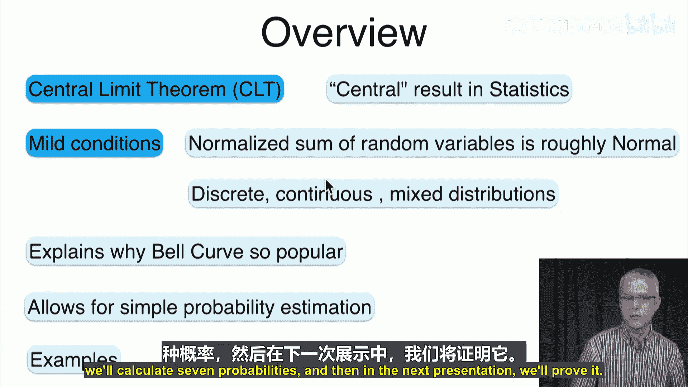
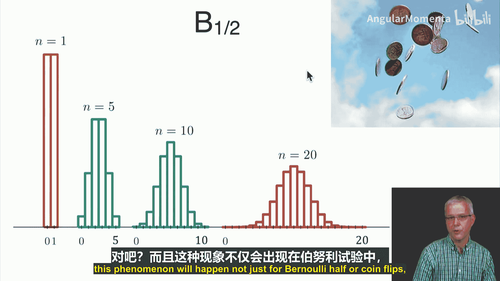
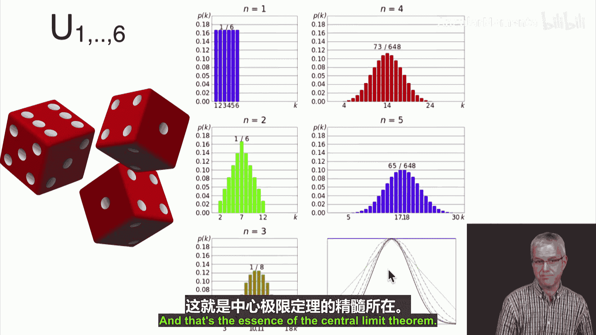
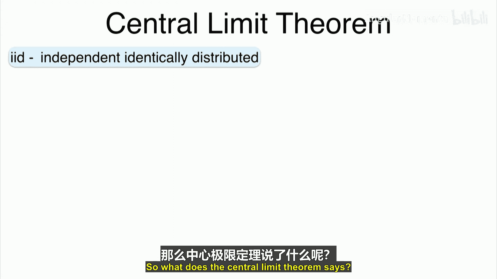
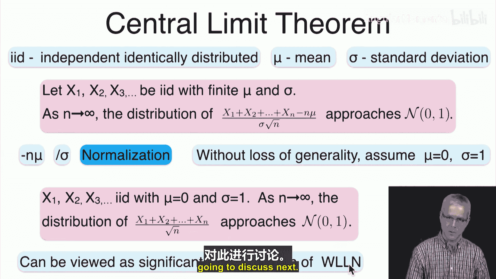
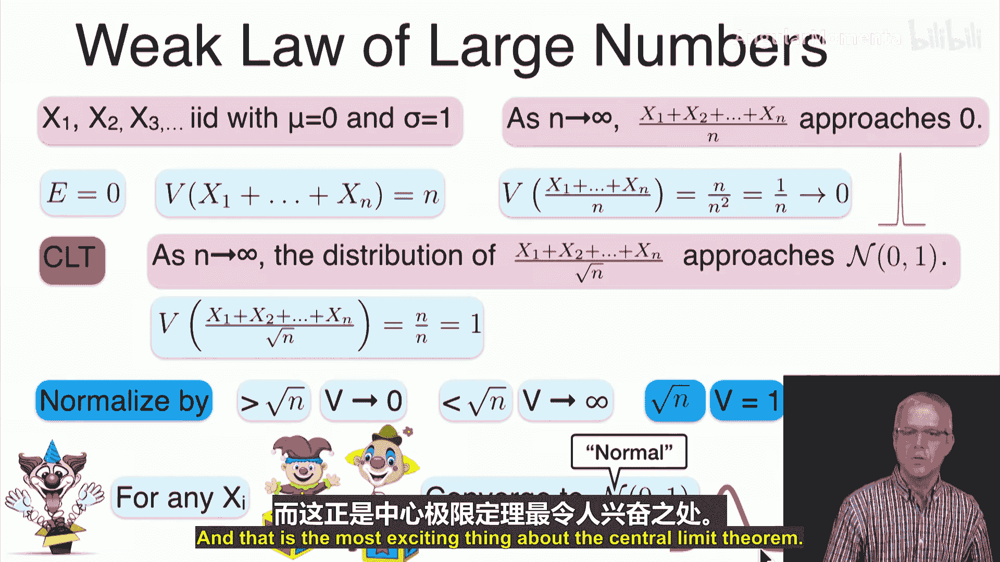
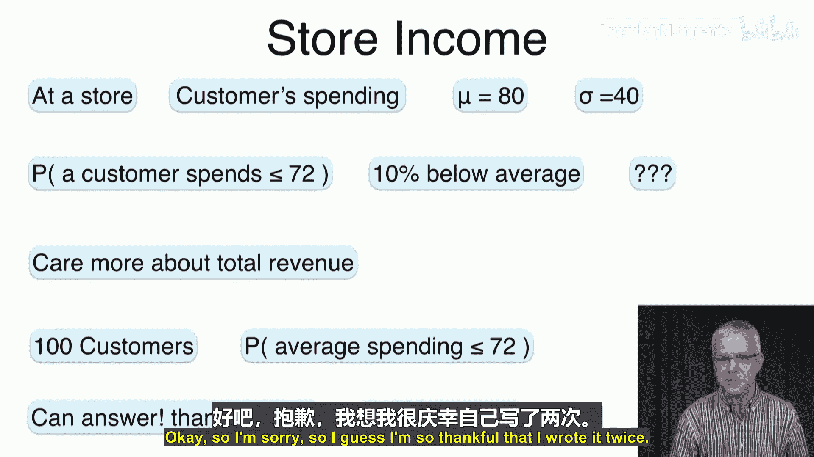
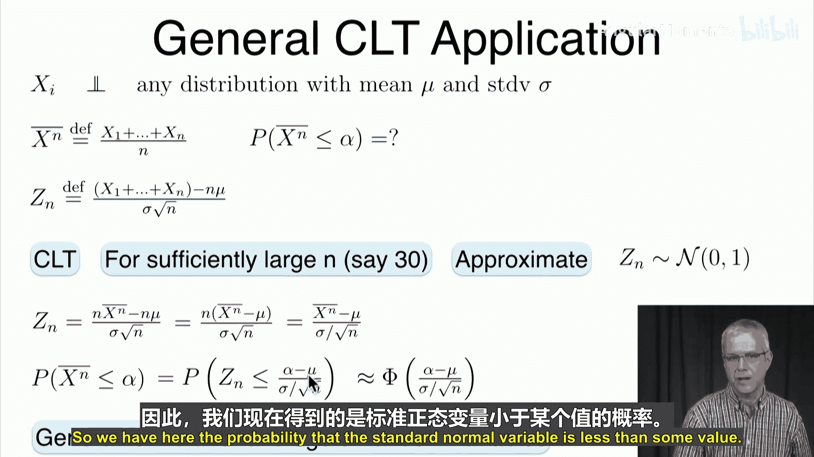
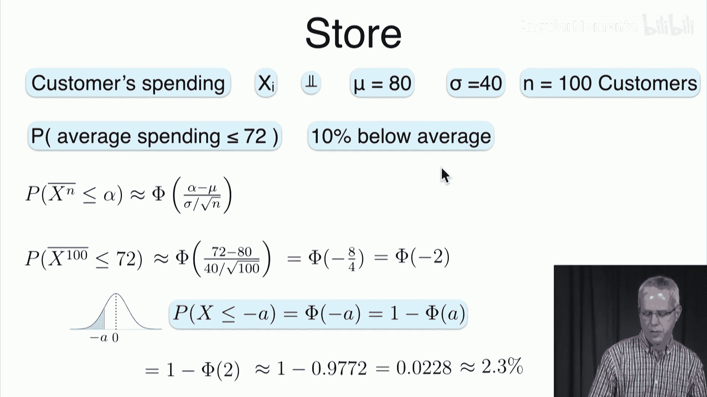

# 046：中心极限定理 🎯

在本节课中，我们将要学习概率论与统计学中最重要的成果之一——中心极限定理。我们将了解其核心思想，并通过具体示例学习如何应用它来解决实际问题。

## 概述

上一节我们介绍了几种概率界限。本节中，我们来看看中心极限定理。中心极限定理是统计学中的核心结果之一。它表明，在非常温和的条件下，随机变量的归一化和近似服从正态分布。这适用于所有类型的分布，无论是离散的、连续的还是混合的。这也解释了为什么钟形曲线如此流行，以及为什么我们在众多应用中都能观察到它。更重要的是，当我们不知道底层分布时，它允许我们对许多事件进行简单的概率估计。

## 从示例开始

首先，让我们通过一些例子来直观感受中心极限定理。

### 抛硬币示例

假设我们抛硬币，随机变量服从伯努利分布（概率为0.5）。
*   如果只抛一枚硬币（n=1），我们得到两个可能的值：0和1，每个概率为0.5。这显然不像高斯分布。
*   如果抛五次硬币，并统计得到“1”的次数，其概率分布看起来像绿色的直方图。得到2或3次“1”的概率最高，得到0次或5次“1”的概率较低。
*   如果抛十次硬币，分布看起来更像一个三角形。得到“1”的次数范围是0到10，5次最有可能。
*   如果抛二十次硬币，分布开始看起来像一个高斯分布（钟形曲线）。

这种现象不仅发生在伯努利分布（抛硬币）中，也几乎适用于任何分布。

### 掷骰子示例

假设我们掷一个或多个骰子。
*   如果掷一个骰子，得到的是1到6之间的均匀分布。
*   如果掷两个骰子并求和，总和范围从2（1+1）到12（6+6），分布形状如图所示。
*   掷三个骰子时，总和范围从3到18，分布形状开始变化。
*   随着骰子数量增加到四个、五个，其总和的分布越来越接近高斯分布。对于五个骰子，分布已经非常像高斯分布了。

这就是中心极限定理的本质：独立同分布随机变量之和的分布会收敛到高斯分布。

### 连续分布示例

对于连续分布，结论同样成立。以下是三个非常不同的连续分布示例：均匀分布、双峰分布和偏斜分布。
*   如果只取一个样本，它们看起来各不相同。
*   如果取五个样本并求和，其分布开始发生变化。
*   如果取三十个样本并求和，你会发现所有分布看起来本质上都是高斯分布。

实际上，人们常说，如果你有30次重复（样本），你基本上可以假设其和服从高斯分布。虽然没有绝对的保证（取决于具体分布），但对于大多数合理的分布，在添加30个独立样本后，你会得到非常接近高斯分布的结果。

### 混合分布示例

这个结论同样适用于混合分布。你可以从一个具有两个尖峰和中间连续部分的混合分布开始。随着样本数量从1个增加到2个、30个，其和的分布也会越来越像高斯分布。

## 中心极限定理的正式表述

那么，中心极限定理具体说了什么呢？

首先，我们定义一些符号：
*   **IID** 代表独立同分布。
*   **μ** 代表均值。
*   **σ** 代表标准差。

定理表述如下：
设 **X₁, X₂, X₃, ...** 是一列独立同分布的随机变量。我们并不关心它们的具体分布是什么，只要求该分布具有有限的均值 **μ** 和有限的标准差 **σ**。

随着样本数量 **n** 趋向于无穷大，如果我们对这个和进行归一化处理，那么这个归一化的和将趋近于一个均值为0、标准差为1的正态分布（标准正态分布）。

归一化的具体方式如下：
1.  每个 **Xᵢ** 的均值是 **μ**，所以我们减去 **nμ** 以使总和均值为0。
2.  每个 **Xᵢ** 的标准差是 **σ**，所以我们除以 **σ** 来标准化尺度。
3.  一个可能不太直观但非常重要的步骤是：我们除以 **√n**，而不是 **n**。

**公式表示如下：**
`Zₙ = (X₁ + X₂ + ... + Xₙ - nμ) / (σ√n)`
当 **n → ∞** 时，**Zₙ** 的分布趋近于标准正态分布 **N(0,1)**。

我们可以这样理解：总和 `Sₙ = X₁ + ... + Xₙ` 的均值是 `nμ`，方差是 `nσ²`（因为独立随机变量和的方差等于方差之和）。因此，`Sₙ` 的标准差是 `σ√n`。我们的归一化过程 `(Sₙ - nμ) / (σ√n)` 正是减去均值后，再除以其标准差，从而得到一个均值为0、方差为1的随机变量。

为了简化讨论，我们可以不失一般性地假设随机变量原本就是均值为0、标准差为1。这样，中心极限定理的表述就变成了：对于独立同分布且均值为0、标准差为1的随机变量序列 **X₁, X₂, ...**，当 **n** 很大时，`(X₁ + ... + Xₙ) / √n` 的分布近似于 **N(0,1)**。通常，**n=30** 就足以得到相当好的近似。

## 与大数定律的比较

中心极限定理可以看作是大数定律的一个重要深化。让我们回顾一下（弱）大数定律。

大数定律指出，对于独立同分布、均值为0、标准差为1的随机变量序列 **X₁, X₂, ...**，样本平均值 `(X₁ + ... + Xₙ)/n` 会依概率收敛到总体均值0。这意味着，随着 **n** 增大，这个平均值偏离0的概率会变得任意小。

**证明思路：** `(X₁+...+Xₙ)/n` 的期望是0，方差是 `1/n`（因为方差为1的独立变量和的方差是n，再除以n，方差变为 `1/n`）。当 **n** 很大时，方差趋近于0，所以分布会集中在一个点（0）附近。

相比之下，中心极限定理考虑的是不同的归一化方式：我们除以 **√n** 而不是 **n**。中心极限定理说，`(X₁+...+Xₙ)/√n` 的分布会趋近于 **N(0,1)**。

**关键洞察：** 如果我们除以一个比 **√n** 大得多的数（例如 `n^(3/4)`），方差会趋近于0，就像大数定律一样。如果我们除以一个比 **√n** 小得多的数（例如 `n^(1/4)`），方差会趋近于无穷大。**√n** 是一个“恰到好处”的尺度，使得归一化后的方差恰好稳定在1。

但中心极限定理真正令人惊讶和强大之处在于：无论你从什么样的分布开始（无论它看起来多奇怪、多复杂），只要满足独立同分布且方差有限，其归一化和最终都会收敛到同一个“无聊”的标准正态分布。这是中心极限定理最激动人心的地方。

## 中心极限定理的应用

现在，我们来看一个如何应用中心极限定理的例子。这个例子非常通用，展示了中心极限定理的强大威力。

### 商店收入示例

假设你拥有一家商店。根据历史数据，你知道：
*   每位顾客的平均消费额 **μ = $80**。
*   消费额的标准差 **σ = $40**。

注意，我们并不知道顾客消费的具体分布，只知道其均值和标准差。

**问题：** 你不太关心单个顾客的消费情况，而是更关心商店的日总收入。假设某天有 **n = 100** 位顾客光顾。你想知道，当天平均每位顾客消费额低于 **$72** 的概率是多少？这等价于当天总收入低于 `100 * $72 = $7200` 的概率，即比日均收入 (`100 * $80 = $8000`) 低10%。

对于单个顾客，我们无法准确计算 `P(X < 72)`，因为不知道分布。但利用中心极限定理，我们可以对100位顾客的平均消费额做出很好的概率估计。

### 一般应用公式

首先，我们推导出应用中心极限定理的一般公式。

设 **X₁, X₂, ..., Xₙ** 是独立同分布随机变量，均值为 **μ**，标准差为 **σ**。
定义样本平均值为：`X̄ₙ = (X₁ + ... + Xₙ) / n`。
我们关心的是概率：`P(X̄ₙ ≤ α)`，其中 **α** 是某个阈值。

根据中心极限定理，我们构造：
`Zₙ = (X₁ + ... + Xₙ - nμ) / (σ√n)`
当 **n** 足够大（如≥30）时，**Zₙ** 近似服从标准正态分布 **N(0,1)**。

我们可以将 **Zₙ** 用 **X̄ₙ** 表示：
`Zₙ = (nX̄ₙ - nμ) / (σ√n) = (X̄ₙ - μ) / (σ/√n)`

因此，我们关心的概率可以转化为：
`P(X̄ₙ ≤ α) = P( Zₙ ≤ (α - μ) / (σ/√n) ) ≈ Φ( (α - μ) / (σ/√n) )`
其中，**Φ(z)** 是标准正态分布的累积分布函数。

**核心公式：**
`P(X̄ₙ ≤ α) ≈ Φ( (α - μ) / (σ/√n) )`

这个公式非常强大。只要我们知道样本的均值 **μ**、标准差 **σ** 和样本量 **n**，我们就可以估计样本平均值低于任何阈值 **α** 的概率，而无需知道原始分布的具体形式。

### 回到商店示例

现在，我们将这个公式应用到商店问题中。
已知：**μ = 80**, **σ = 40**, **n = 100**, **α = 72**。

计算：
`(α - μ) / (σ/√n) = (72 - 80) / (40/√100) = (-8) / (40/10) = (-8) / 4 = -2`

所以，`P(平均消费 ≤ $72) ≈ Φ(-2)`。

我们需要计算标准正态分布变量小于等于-2的概率 **Φ(-2)**。

**关于Φ函数的提醒：**
*   **Φ(z)** 表示标准正态变量 **Z** 小于等于 **z** 的概率。
*   由于正态分布的对称性，有 **Φ(-z) = 1 - Φ(z)**。

查标准正态分布表可知，**Φ(2) ≈ 0.9772**。
因此，**Φ(-2) = 1 - Φ(2) ≈ 1 - 0.9772 = 0.0228**。

**结论：** 在有100位顾客的日子里，平均消费额低于$72（即总收入低于$7200，比预期低10%）的概率大约为 **2.28%**。这个概率相当低，或许你不需要过于担心。

这个结果之所以可能，完全归功于中心极限定理。原始分布的标准差很大（$40），但当我们观察100位顾客的平均值时，其标准差缩小为 `σ/√n = 40/10 = $4`。这使得平均值偏离均值$8（即2个标准差单位）的概率变得很小。

## 总结

本节课中，我们一起学习了中心极限定理。
*   我们通过抛硬币、掷骰子等例子，直观地理解了独立同分布随机变量之和的分布会随着样本量增加而趋近于正态分布。
*   我们学习了中心极限定理的正式表述：对于独立同分布且方差有限的随机变量，其归一化和 `(ΣXᵢ - nμ)/(σ√n)` 近似服从标准正态分布。
*   我们将其与大数定律进行了比较，认识到中心极限定理揭示了分布形态的收敛，而不仅仅是均值的收敛。
*   最重要的是，我们推导并应用了一个强大的公式 `P(X̄ₙ ≤ α) ≈ Φ( (α - μ) / (σ/√n) )`。这个公式允许我们在不知道总体具体分布的情况下，仅利用均值、标准差和样本量，对样本平均值的概率进行估计。我们通过商店收入的例子具体演示了这一应用。

中心极限定理是统计学推断的基石，它为参数估计、假设检验等方法提供了理论依据。在接下来的课程中，我们将证明这个重要的定理。