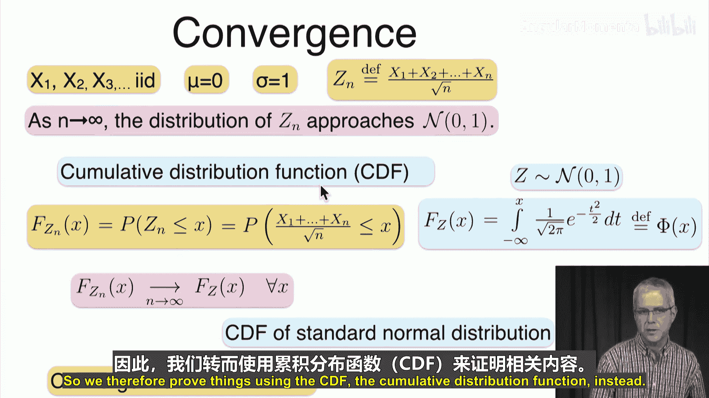
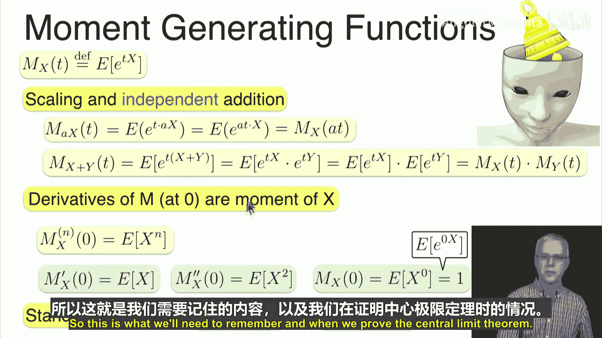
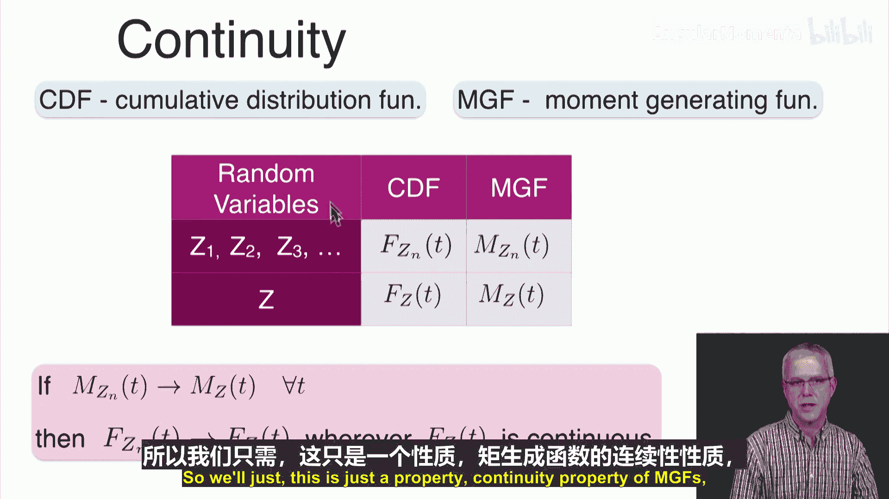
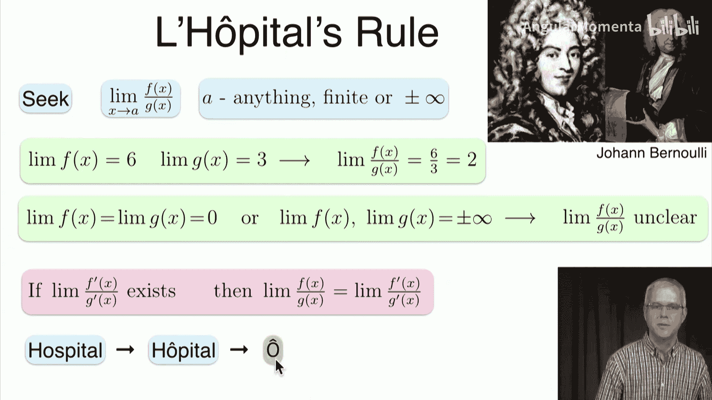
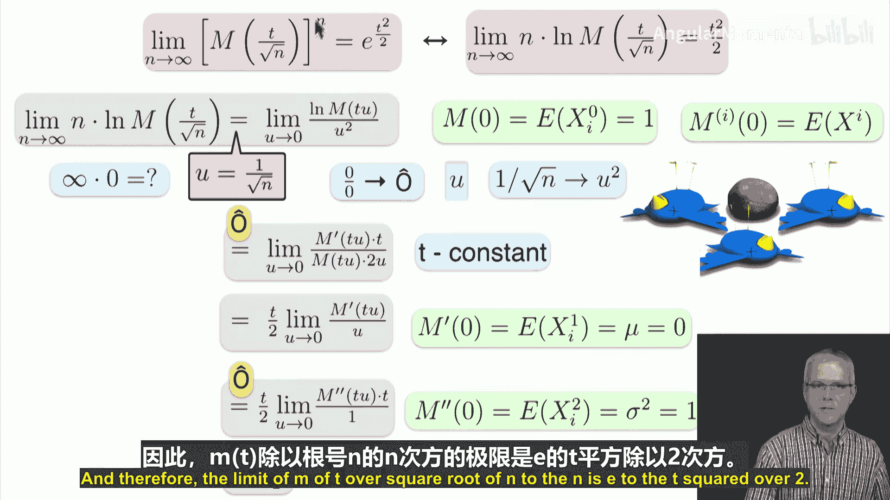
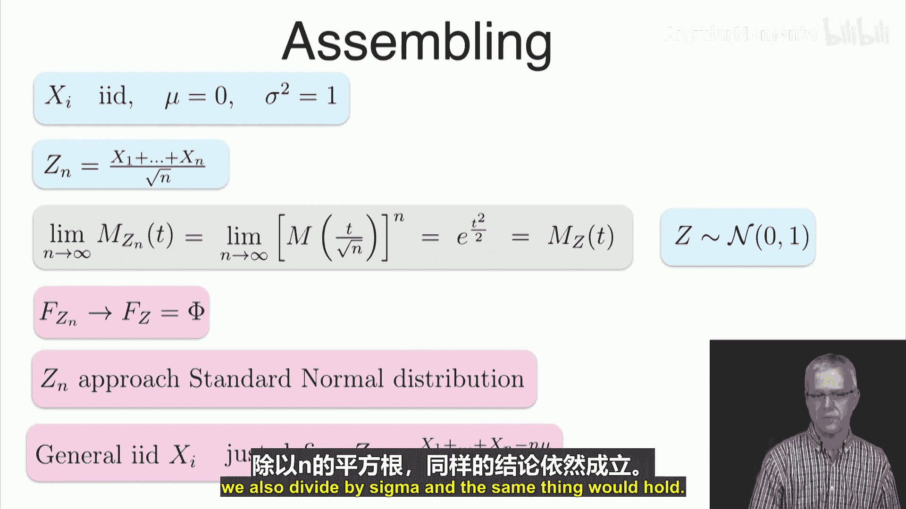
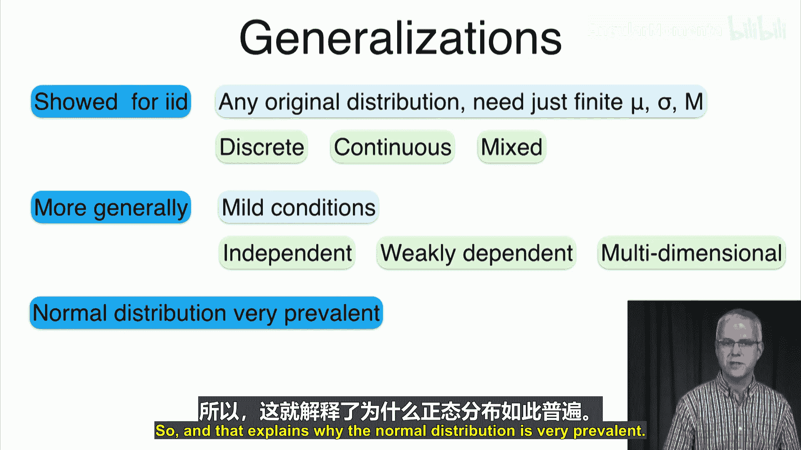

# 047：中心极限定理的证明 📚

在本节课中，我们将学习如何证明中心极限定理。上一节我们介绍了中心极限定理的内容，本节中我们将通过数学推导来证明它。我们将使用矩母函数这一工具，并借助洛必达法则来完成证明。

## 概述

中心极限定理指出，对于独立同分布的随机变量，其标准化和的分布随着样本量的增加，会趋近于标准正态分布。我们将通过证明其累积分布函数的收敛性来证实这一点。

## 证明思路与定义

我们有一系列独立同分布的随机变量 **X₁, X₂, X₃, ...**，其均值为 **μ = 0**，标准差为 **σ = 1**。我们定义标准化和 **Zₙ** 为：

**Zₙ = (X₁ + X₂ + ... + Xₙ) / √n**

我们的目标是证明，当 **n → ∞** 时，**Zₙ** 的分布趋近于标准正态分布 **N(0, 1)**。我们将通过证明其累积分布函数 **F_{Zₙ}(x)** 收敛于标准正态分布的累积分布函数 **Φ(x)** 来实现。

**F_{Zₙ}(x) = P(Zₙ ≤ x)**
**Φ(x) = (1/√(2π)) ∫_{-∞}^{x} e^{-t²/2} dt**

这种收敛被称为“依分布收敛”。

## 矩母函数简介

为了证明，我们将使用矩母函数。矩母函数是概率论中的一个有力工具，它能简化独立随机变量和的分布分析。

以下是矩母函数的关键性质：

*   **定义**：随机变量 **X** 的矩母函数 **M_X(t)** 定义为 **E[e^{tX}]**。
*   **线性变换**：对于常数 **a**，有 **M_{aX}(t) = M_X(at)**。
*   **独立和**：若 **X** 与 **Y** 独立，则 **M_{X+Y}(t) = M_X(t) * M_Y(t)**。
*   **矩的生成**：**M_X^{(n)}(0) = E[X^n]**，即 **n** 阶导数在 **0** 点的值等于 **n** 阶矩。
*   **标准正态分布的MGF**：若 **Z ~ N(0,1)**，则其矩母函数为 **M_Z(t) = e^{t²/2}**。

我们将利用一个关键结论：如果一系列随机变量的矩母函数收敛于某个随机变量的矩母函数，并且在收敛点对应的累积分布函数是连续的，那么它们的累积分布函数也会收敛。

## 证明过程

我们的计划是证明 **Zₙ** 的矩母函数 **M_{Zₙ}(t)** 收敛于标准正态分布的矩母函数 **e^{t²/2}**。

首先，写出 **Zₙ** 的矩母函数。由于 **Zₙ** 是独立随机变量的和，其矩母函数是各个随机变量矩母函数的乘积：

**M_{Zₙ}(t) = [M_X(t/√n)]^n**

这里 **M_X(t)** 是 **X_i** 共同的矩母函数。

因此，我们需要证明的极限是：

**lim_{n→∞} [M_X(t/√n)]^n = e^{t²/2}**

为了处理这个 **n** 次幂，我们考虑对其取自然对数，等价地证明：

**lim_{n→∞} n * ln[M_X(t/√n)] = t²/2**

我们已知 **M_X(0) = 1**（因为 **E[e^{0*X}] = 1**），且 **M_X'(0) = E[X] = 0**。

令 **u = 1/√n**，则当 **n → ∞** 时，**u → 0⁺**。原极限变为：

**lim_{u→0⁺} [ln M_X(tu)] / u²**

这是一个 **0/0** 型未定式，可以应用洛必达法则。

第一次应用洛必达法则：

**lim_{u→0⁺} [d/du ln M_X(tu)] / [d/du u²] = lim_{u→0⁺} [ (M_X'(tu) * t) / M_X(tu) ] / (2u) = (t/2) * lim_{u→0⁺} [ M_X'(tu) / (u * M_X(tu)) ]**

由于 **M_X(0)=1** 且 **M_X'(0)=0**，分子分母仍趋于0，需再次应用洛必达法则。

第二次应用洛必达法则，对分子 **M_X'(tu)** 和分母 **u * M_X(tu)** 分别求导（关于 **u**）：

*   分子导数：**M_X''(tu) * t**
*   分母导数：**M_X(tu) + u * M_X'(tu) * t**

因此，极限变为：

**(t/2) * lim_{u→0⁺} [ M_X''(tu) * t ] / [ M_X(tu) + u * M_X'(tu) * t ]**

代入 **u = 0**：
*   **M_X''(0) = E[X²] = σ² = 1**（因为方差为1）
*   **M_X(0) = 1**
*   **M_X'(0) = 0**

所以极限值为：

**(t/2) * [ (1 * t) / (1 + 0) ] = t²/2**

这就证明了 **lim_{n→∞} n * ln[M_X(t/√n)] = t²/2**，从而 **lim_{n→∞} [M_X(t/√n)]^n = e^{t²/2}**。

## 结论与推广

因此，我们证明了 **Zₙ** 的矩母函数收敛于标准正态分布的矩母函数。根据矩母函数与累积分布函数收敛性的关系，可以得出 **Zₙ** 的累积分布函数 **F_{Zₙ}(x)** 收敛于标准正态分布的累积分布函数 **Φ(x)**。即：

**Zₙ → N(0, 1) in distribution**

对于更一般的情况，若随机变量 **X_i** 具有均值 **μ** 和方差 **σ²**，我们可以构造 **Zₙ = (ΣX_i - nμ) / (σ√n)**，同样的证明过程（经过适当的缩放平移）将显示其收敛于 **N(0,1)**。

中心极限定理是统计学的基石，它解释了为何正态分布在自然界和科学实验中如此普遍。定理可以进一步推广到非独立同分布、多维随机变量等更一般的情形。

## 总结

本节课中我们一起学习了中心极限定理的证明。我们通过定义标准化和 **Zₙ**，利用矩母函数的性质将其和的矩母函数转化为乘积形式，并通过取对数和两次应用洛必达法则，证明了其矩母函数收敛于标准正态分布的矩母函数 **e^{t²/2}**，从而完成了定理的证明。这个证明过程展示了概率论中如何将复杂的分布收敛问题转化为更易处理的函数极限问题。