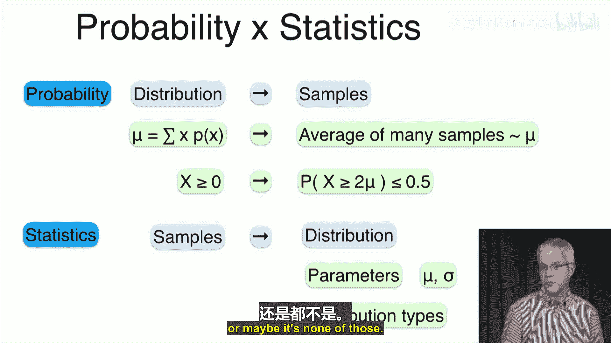
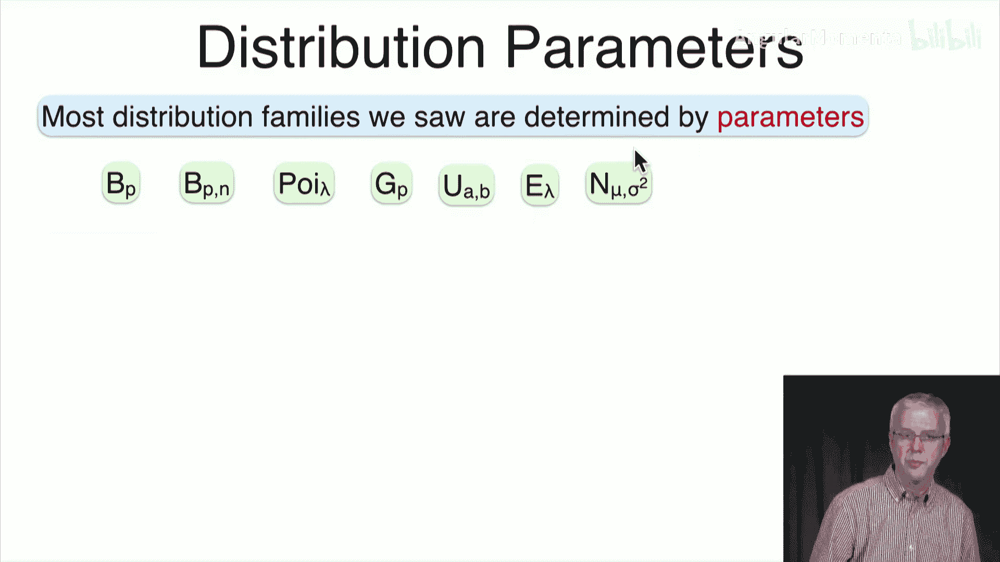
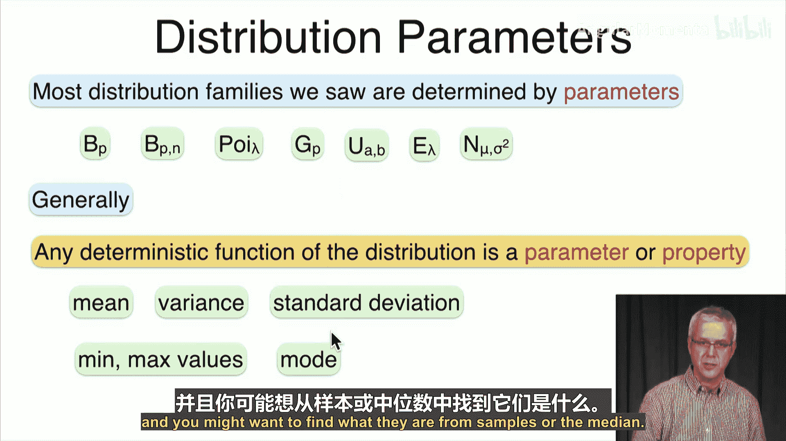
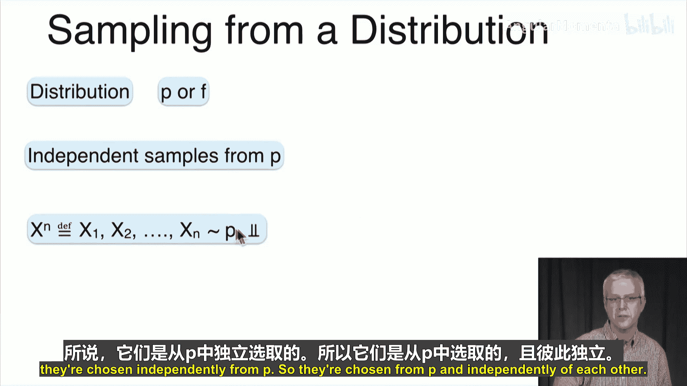
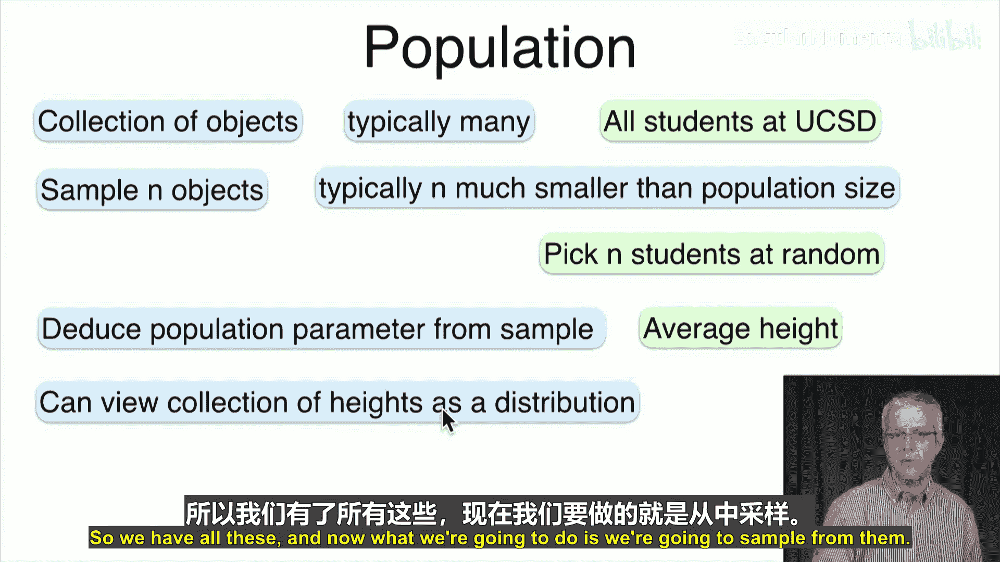
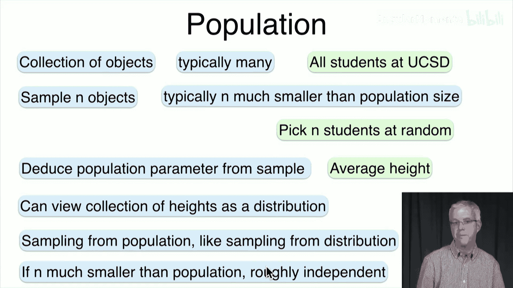
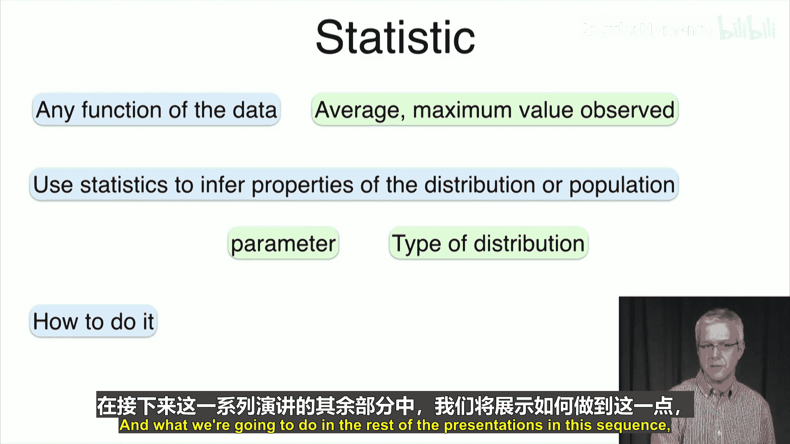

# 048：统计学入门 🎯

在本节课中，我们将从概率论过渡到统计学。我们将探讨如何从现实世界的不完美数据中，推断出潜在分布或总体的特性。

上一节我们介绍了概率论，其中我们定义了精确的分布（如均匀分布、几何分布），并分析了其性质。本节中我们来看看统计学，它处理的是来自现实世界、不完全符合预设模型的样本数据。

## 从概率到统计 🔄

在概率论中，我们假设一个已知的分布，然后推导其样本的性质。例如，对于一个分布，我们可以定义其均值 **μ** 为：
`μ = Σ [x * P(x)]`
然后我们说，如果取很多样本，样本的平均值将大致等于 **μ**。

在统计学中，过程是相反的。我们获得样本，并希望从这些样本中推断出分布的性质或其参数。例如，我们想推断分布的均值、标准差，或者判断它属于哪种分布类型（高斯分布、几何分布等）。

## 分布参数与总体参数 📊

大多数分布族由参数决定。例如：
*   伯努利分布由成功概率 **p** 决定。
*   二项分布由 **p** 和试验次数 **n** 决定。
*   泊松分布由均值参数 **λ** 决定。

参数也可以更广泛地看作是分布的任意确定性函数，有时也称为分布的性质。例如，分布的均值、方差、标准差、最小值、最大值、众数或中位数。

我们的目标是通过从分布中抽样来估计这些参数。我们用 **P**（离散分布的PMF）或 **F**（连续分布的PDF）表示分布。

然后，我们从中抽取独立样本，记为 **X^n**（即 **X1, X2, ..., Xn**），它们独立同分布于 **P** 或 **F**。

## 从总体中抽样 👥

通常，我们更关心的是从总体中推断性质。总体是对象的集合（例如，一所大学的所有学生）。我们不想调查整个总体，而是从中抽取一小部分样本（样本量 **n** 远小于总体大小）。

以下是此过程的关键点：
*   我们从总体中随机抽取 **n** 个对象。
*   目标是利用这个样本来推断总体的参数（例如，所有学生的平均身高）。

虽然从总体中抽样（通常无放回）与从分布中独立抽样在技术上略有不同，但当样本量 **n** 远小于总体规模时，重复抽取同一个体的概率很小。因此，我们可以近似地将其视为独立抽样。在这个假设下，估计总体参数的问题就转化为了估计分布参数的问题。

## 统计量 📈

当我们获得一个样本后，我们会查看数据的函数。任何基于样本数据的函数都称为**统计量**。例如：
*   样本中所有值的平均值（样本均值）。
*   样本中观测到的最大值。

我们希望通过这些统计量来推断分布或总体的性质。例如，我们可能想用样本均值来估计分布的真实均值，或者用样本最大值来估计总体中的最大值。

在接下来的课程中，我们将探讨如何有效地进行这种推断。下一讲，我们将从可能最简单的问题开始：如何估计一个分布的均值。

本节课中我们一起学习了统计学的基本目标：从样本数据推断总体或分布的性质。我们理解了概率（从模型到数据）与统计（从数据到模型）的对偶关系，认识了分布参数与总体参数的概念，并了解了通过抽样和构建统计量进行推断的基本框架。