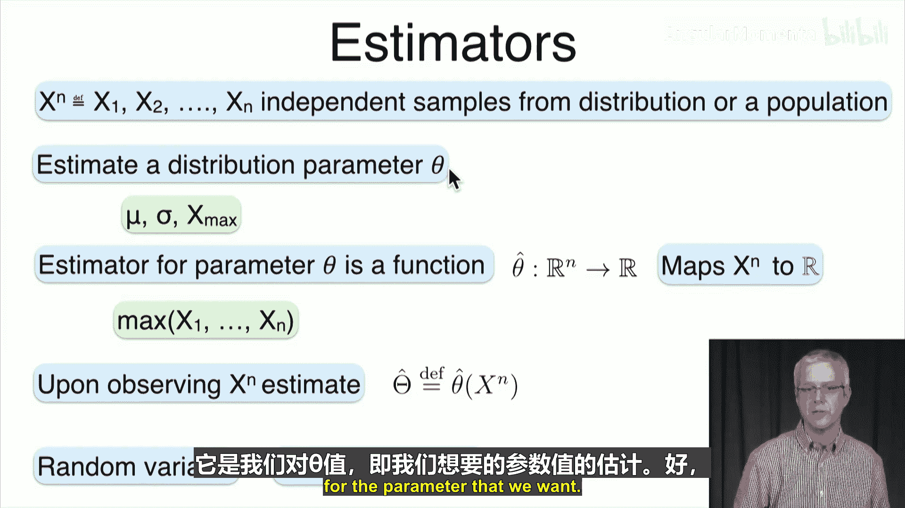
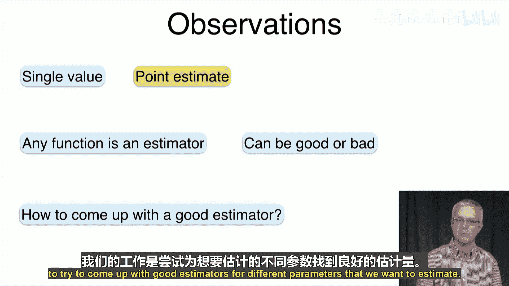
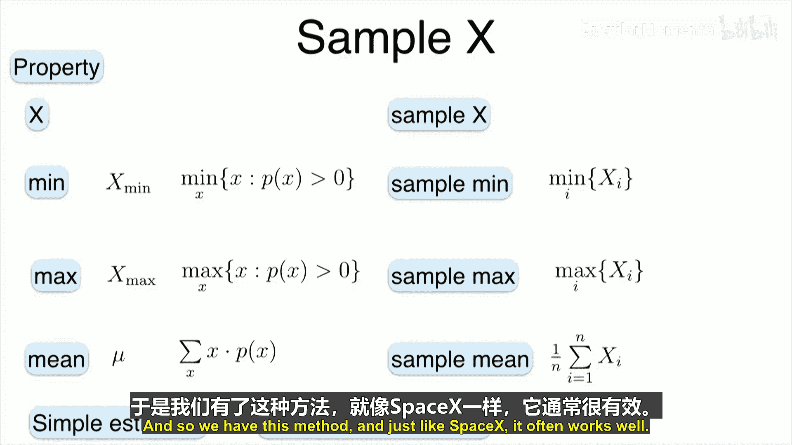
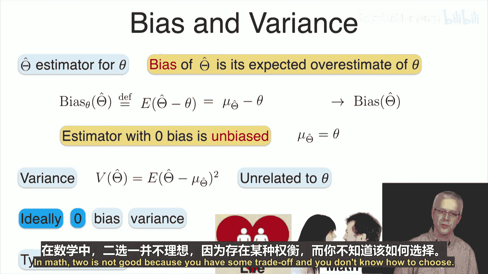
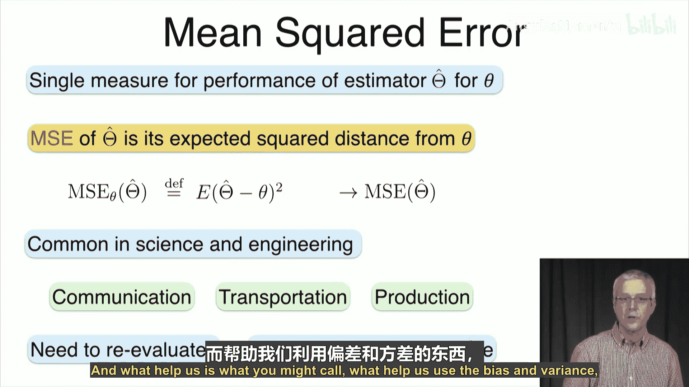
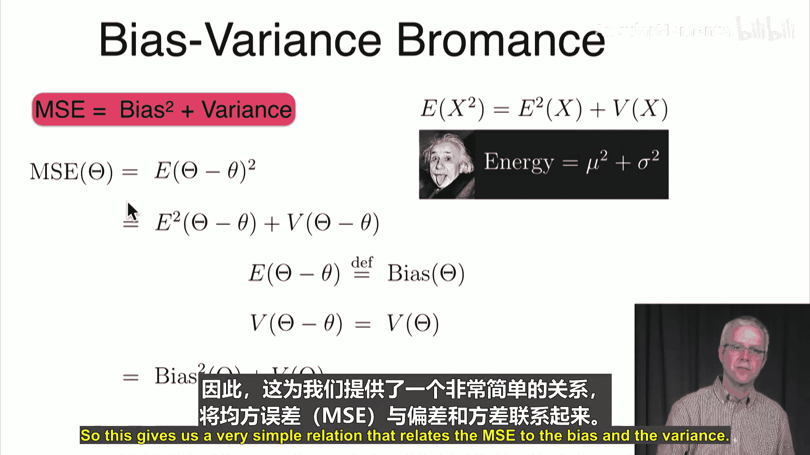
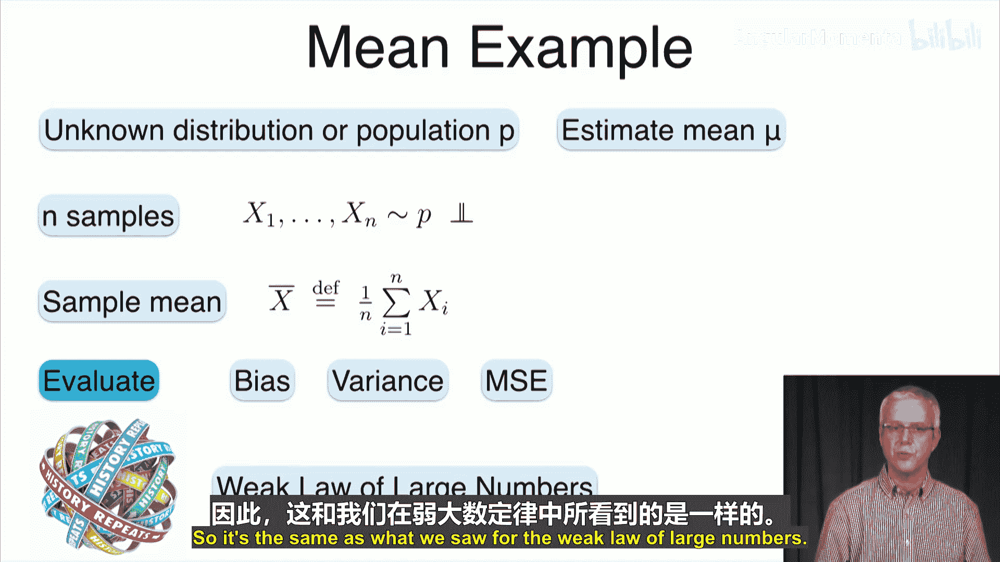
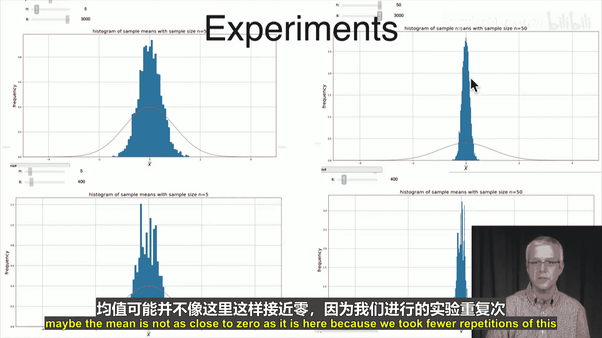
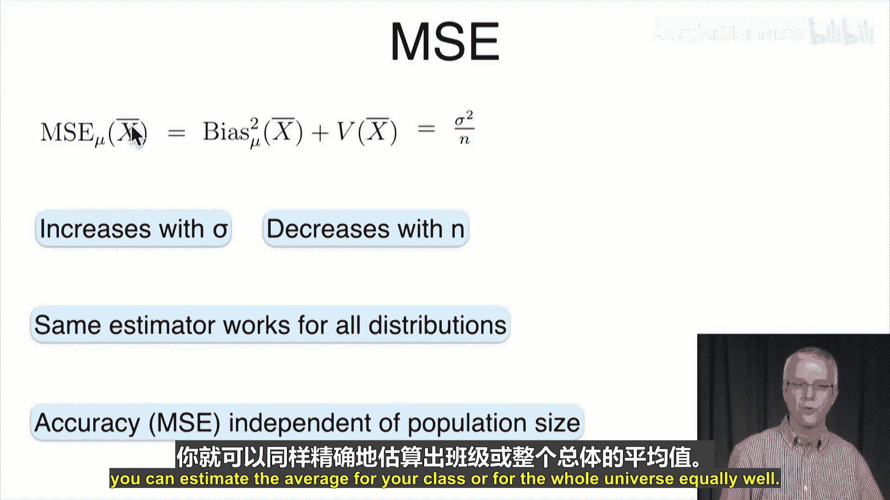

# 049：均值与方差 📊

在本节课中，我们将学习参数估计的基本概念，特别是如何估计一个分布的均值。我们将介绍什么是估计量，如何评估估计量的好坏，并通过一个具体的例子——样本均值——来演示这些概念。

## 参数估计与估计量

上一节我们介绍了参数估计的目标。本节中，我们来看看如何构建一个估计量。

我们从总体或分布中抽取一个样本，这个样本是独立同分布的随机变量序列，记作 **X^N = (X₁, X₂, ..., Xₙ)**。我们的目标是估计分布的一个参数 **θ**，例如均值、标准差或最大值。

我们通过一个**估计量**来实现。参数 **θ** 的估计量 **θ̂** 是一个函数，它将我们观测到的 **n** 个样本值映射为一个实数，作为参数的估计值。

**公式：θ̂ = f(X₁, X₂, ..., Xₙ)**

例如，我们可以取观测值的最大值或平均值作为估计量。当我们观测到具体的样本序列 **x^N** 时，我们将函数 **θ̂** 应用于它，得到估计值。由于样本是随机的，因此估计量 **θ̂** 本身也是一个随机变量。

## 评估估计量：偏差与方差

我们已经知道如何构建估计量。接下来，我们需要评估一个估计量的质量。以下是两个关键的评估指标。

*   **偏差**：估计量的期望值与真实参数值之间的差异。
    **公式：Bias(θ̂) = E[θ̂] - θ**
    如果偏差为0，则称该估计量为**无偏估计量**。

*   **方差**：估计量自身的离散程度。
    **公式：Var(θ̂) = E[(θ̂ - E[θ̂])²]**

理想情况下，我们希望估计量同时具有零偏差和零方差，但这通常难以实现。因此，我们需要在偏差和方差之间进行权衡。

## 综合评估：均方误差

由于偏差和方差是两个独立的指标，为了综合评估估计量的性能，我们引入**均方误差**。

均方误差衡量的是估计值与真实参数值之间的平均平方距离。
**公式：MSE(θ̂) = E[(θ̂ - θ)²]**

一个重要的结论是，均方误差可以分解为偏差的平方加上方差。
**公式：MSE(θ̂) = [Bias(θ̂)]² + Var(θ̂)**

这个关系式表明，一个好的估计量需要在偏差和方差之间取得平衡。

## 一个通用方法：样本X法

面对一个需要估计的参数，我们如何构造一个估计量呢？这里介绍一个简单通用的方法——**样本X法**。

其核心思想是：对于总体分布的某个性质（例如最小值、最大值、均值），我们对观测到的样本计算同样的性质，并将其作为该参数的估计量。

*   若要估计总体最小值 **x_min**，则使用**样本最小值**。
*   若要估计总体最大值 **x_max**，则使用**样本最大值**。
*   若要估计总体均值 **μ**，则使用**样本均值**。

这种方法通常能提供有效的估计量。

## 核心案例：估计均值

现在，让我们应用以上概念来详细分析一个具体案例：使用样本均值估计总体均值。

假设我们有一个未知分布 **P**，其均值为 **μ**，方差为 **σ²**。我们独立抽取 **n** 个样本 **X₁, ..., Xₙ**。根据样本X法，我们使用**样本均值**作为 **μ** 的估计量：
**公式：X̄ = (1/n) * Σᵢ Xᵢ**

### 样本均值的偏差

首先计算样本均值的期望值：
**E[X̄] = E[(1/n) Σ Xᵢ] = (1/n) Σ E[Xᵢ] = (1/n) Σ μ = μ**

因此，样本均值的偏差为：
**Bias(X̄) = E[X̄] - μ = μ - μ = 0**
这表明**样本均值是总体均值的一个无偏估计量**。

### 样本均值的方差

接下来计算样本均值的方差。利用样本的独立性：
**Var(X̄) = Var((1/n) Σ Xᵢ) = (1/n²) Σ Var(Xᵢ) = (1/n²) Σ σ² = σ² / n**

其标准差为 **σ / √n**。可以看到，估计量的方差随着样本量 **n** 的增加而减小。

### 样本均值的均方误差

由于偏差为0，样本均值的均方误差就等于其方差：
**MSE(X̄) = [Bias(X̄)]² + Var(X̄) = 0 + σ²/n = σ²/n**

这个结果非常简洁：估计的精度（MSE）取决于总体本身的方差 **σ²** 和样本量 **n**，而与总体的大小无关。这意味着，只要样本量足够，估计一个班级的平均身高和估计全国的平均身高可以达到相同的精度。

### 实验观察

通过模拟实验可以直观验证上述理论：
1.  从一个均值为0、标准差为1的正态分布中反复抽取样本（例如样本量n=5），并计算每次的样本均值。
2.  将这个过程重复多次（例如3000次），绘制出这些样本均值的分布。
3.  可以观察到，这个分布的均值大约在0附近（无偏性），并且分布较宽（方差较大）。
4.  如果将样本量增加到n=50，重复上述实验，会发现样本均值的分布变得更为集中（方差减小），但其中心依然在0附近。

这生动地展示了**大数定律**在起作用：随着样本量增加，样本均值以更高的概率接近真实总体均值。

## 总结

本节课中，我们一起学习了参数估计的基础知识：
1.  我们定义了**估计量**，它是一个将样本数据映射为参数估计值的函数。
2.  我们介绍了评估估计量质量的三个核心指标：**偏差**、**方差**和**均方误差**，并知道了它们之间的关系（MSE = 偏差² + 方差）。
3.  我们学习了一个构造估计量的通用方法——**样本X法**。
4.  我们深入分析了一个经典案例：使用**样本均值**估计**总体均值**。我们证明了样本均值是无偏的，计算了它的方差和均方误差，并通过模拟实验观察了其性质。

下一节课，我们将把注意力转向另一个重要参数——方差，并学习如何估计它。