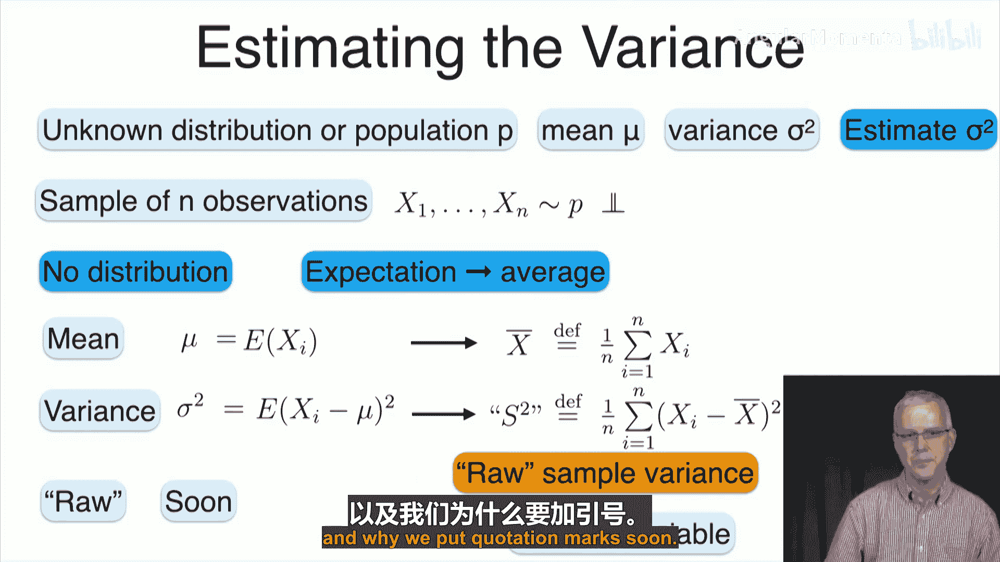
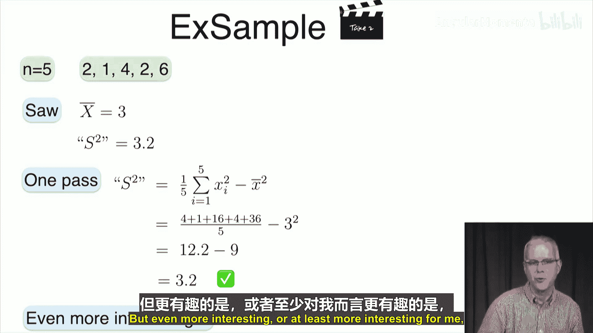
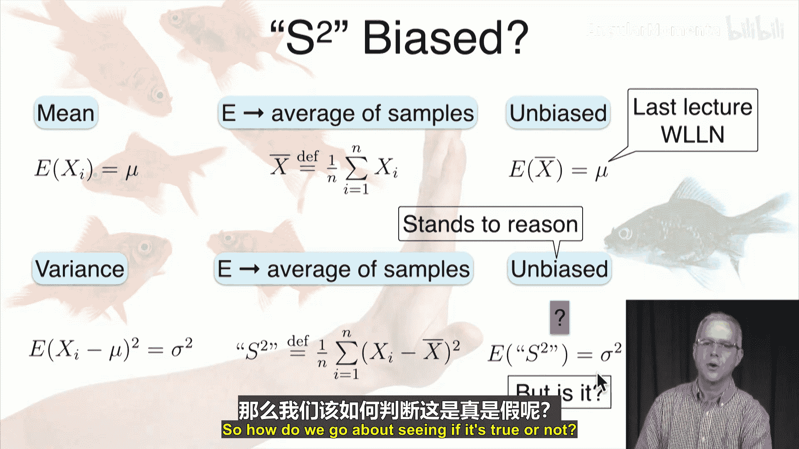
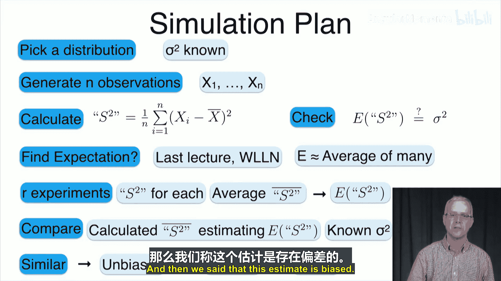
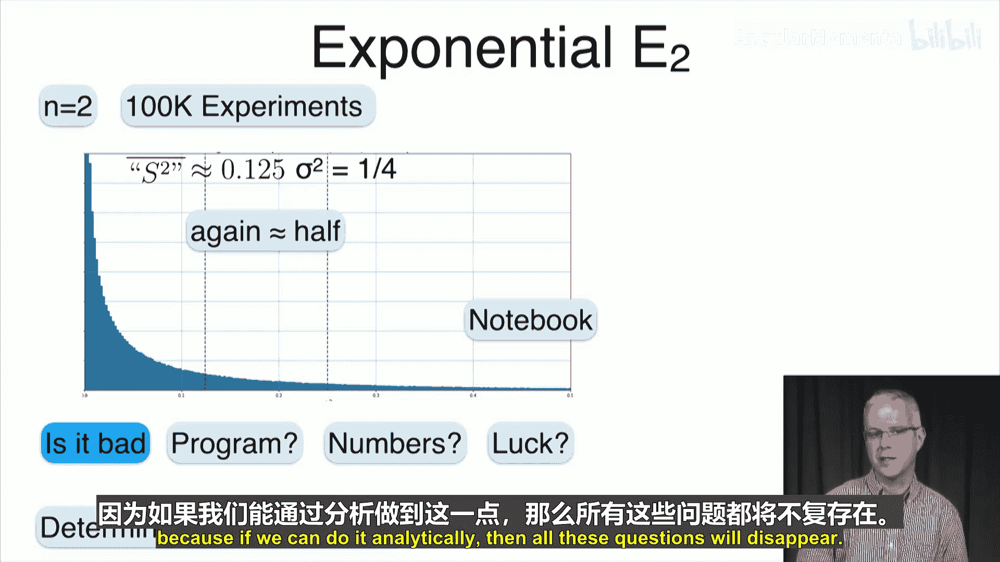
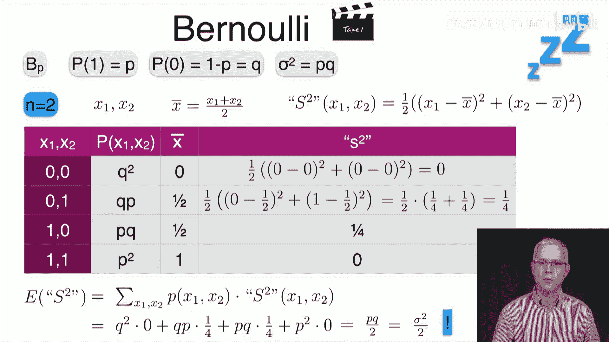
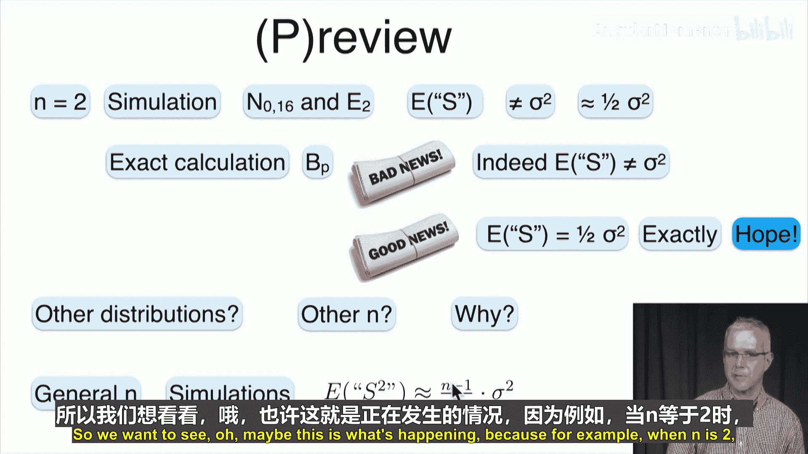

# 050：方差估计 📊

在本节课中，我们将学习如何估计一个未知分布的方差。上一节我们介绍了如何估计分布的均值，本节中我们来看看如何估计方差。我们将遵循早期数据科学家夏洛克·福尔摩斯的思路，展示一种近乎基础的方法。

首先，我们定义一个自然的估计量，并探讨两种计算方式。接着，我们将检验这个估计量是否存在偏差，并揭示一个将在下一讲中解决的小谜题。

## 估计方差的方法

我们有一个未知的总体分布 \( P \)，其均值 \( \mu \) 和方差 \( \sigma^2 \) 均未知。上一讲我们学习了如何估计均值，现在希望估计方差。

我们的做法是：从该分布中抽取一个包含 \( n \) 个观测值的样本 \( X_1, X_2, ..., X_n \)。每个 \( X_i \) 都独立地服从分布 \( P \)。由于我们不知道分布 \( P \)，无法通过计算 \( \sum P(x) \cdot x \) 等方式直接得到均值，因此需要用样本信息来学习。我们将用样本均值来近似总体期望，因为期望本质上是大量样本平均值的代表。

对于均值，我们知道每个 \( X_i \) 的期望 \( E[X_i] = \mu \)。因此，我们取多个样本并计算样本均值：
\[
\bar{X} = \frac{1}{n} \sum_{i=1}^{n} X_i
\]

对于方差，我们观察到 \( E[(X_i - \mu)^2] = \sigma^2 \) 就是总体方差。但我们无法直接获取概率分布。因此，我们再次利用样本，计算样本方差来代替总体方差。

样本方差定义为每个观测值与样本均值之差的平方的平均值：
\[
S^2_{\text{raw}} = \frac{1}{n} \sum_{i=1}^{n} (X_i - \bar{X})^2
\]

注意，我们不知道真实的 \( \mu \)，所以用样本均值 \( \bar{X} \) 代替。我们称这个量为“原始”样本方差（加引号以示特殊），稍后会解释原因。同时，样本方差本身也是一个随机变量，每次抽样都会得到不同的值。这是我们对方差 \( \sigma^2 \) 的估计。

## 计算样本方差示例

让我们通过一个具体例子来演示如何计算样本方差。我们将多次计算，每次稍作修改，本节是第一次计算。

假设我们有一个包含5个观测值的样本，即 \( n = 5 \)，样本值为：2, 1, 4, 2, 6。

首先计算样本均值：
\[
\bar{X} = \frac{1}{5} (2 + 1 + 4 + 2 + 6) = \frac{15}{5} = 3
\]
这是我们对该分布均值的估计。

接着计算“原始”样本方差：
\[
S^2_{\text{raw}} = \frac{1}{5} \left[ (2-3)^2 + (1-3)^2 + (4-3)^2 + (2-3)^2 + (6-3)^2 \right]
\]
\[
= \frac{1}{5} (1 + 4 + 1 + 1 + 9) = \frac{16}{5} = 3.2
\]
这是我们对方差的估计。

注意这里的类比：总体方差是 \( E[(X - \mu)^2] \)，而我们做的是 \( (X - \hat{\mu})^2 \) 的样本平均。回忆一下，方差还有另一种计算方式：\( \text{Var}(X) = E[X^2] - (E[X])^2 \)。我们有理由假设样本方差也存在类似的简化公式。

## 样本方差的单次遍历计算法

确实，样本方差有另一种计算方式，可以减少减法运算次数，并且可以单次遍历样本完成计算。

推导过程如下。考虑求和项：
\[
\sum_{i=1}^{n} (X_i - \bar{X})^2
\]
展开平方：
\[
= \sum (X_i^2 - 2X_i\bar{X} + \bar{X}^2)
\]
拆开求和：
\[
= \sum X_i^2 - 2\bar{X} \sum X_i + \sum \bar{X}^2
\]
注意 \( \bar{X} \) 不依赖于 \( i \)，可以提到求和外面。并且 \( \sum X_i = n\bar{X} \)，\( \sum \bar{X}^2 = n\bar{X}^2 \)。代入得：
\[
= \sum X_i^2 - 2\bar{X} (n\bar{X}) + n\bar{X}^2 = \sum X_i^2 - 2n\bar{X}^2 + n\bar{X}^2 = \sum X_i^2 - n\bar{X}^2
\]

因此，样本方差可以写为：
\[
S^2_{\text{raw}} = \frac{1}{n} \sum_{i=1}^{n} (X_i - \bar{X})^2 = \frac{1}{n} \sum X_i^2 - \bar{X}^2
\]

这个公式允许我们单次遍历样本：遍历时累加 \( X_i \) 和 \( X_i^2 \)，最后用累加的 \( \sum X_i^2 \) 除以 \( n \) 再减去 \( \bar{X}^2 \) 即可。

让我们用之前的例子验证一下。样本为：2, 1, 4, 2, 6。
*   \( \sum X_i^2 = 4 + 1 + 16 + 4 + 36 = 61 \)
*   \( \frac{1}{n} \sum X_i^2 = 61 / 5 = 12.2 \)
*   \( \bar{X}^2 = 3^2 = 9 \)
*   \( S^2_{\text{raw}} = 12.2 - 9 = 3.2 \)

结果与之前一致。

## 样本方差是否有偏？

比如何计算更有趣的问题是：样本方差 \( S^2_{\text{raw}} \) 是否是总体方差 \( \sigma^2 \) 的无偏估计？

对于均值，样本均值 \( \bar{X} \) 是无偏的，即 \( E[\bar{X}] = \mu \)。对于方差，\( \sigma^2 = E[(X - \mu)^2] \)。很自然地，我们取多个样本，对每个样本计算 \( (X - \bar{X})^2 \) 再取平均，并希望它能收敛到 \( \sigma^2 \)。因此，似乎有理由认为样本方差也是无偏的。

但事实果真如此吗？我们还没有证明。让我们引用夏洛克·福尔摩斯在《血字的研究》中的一句话：“在掌握所有证据之前就进行理论假设，是一个严重的错误，因为它会使判断产生偏差。” 我们想看看样本方差是否有偏，而福尔摩斯会用放大镜寻找更多证据。在21世纪，我们的“放大镜”就是模拟。

我们的模拟计划是：选择一个已知方差的分布，从中生成 \( n \) 个观测值 \( X_1, ..., X_n \)，计算样本方差 \( S^2_{\text{raw}} \)，然后检查 \( E[S^2_{\text{raw}}] \) 是否等于已知的总体方差。由于期望是随机变量多次重复的平均值，我们将进行多次独立实验（每次实验得到一个包含 \( n \) 个观测值的样本并计算其样本方差），然后计算这些样本方差的平均值。根据大数定律，这个平均值将收敛到 \( E[S^2_{\text{raw}}] \)。最后，我们将这个平均值与真实的总体方差进行比较。

以下是两个分布的模拟结果：

1.  **正态分布 \( N(0, 16) \)**：方差为16。我们取 \( n=2 \)，进行100,000次实验。结果显示，样本方差的平均值（红色线）约为8，大约是真实方差（绿色线，16）的一半。
2.  **指数分布 \( \text{Exp}(2) \)**：方差为 \( 1/4 = 0.25 \)。同样取 \( n=2 \)，进行100,000次实验。结果显示，样本方差的平均值约为0.125，同样是真实方差（0.25）的一半。

模拟结果表明，样本方差似乎是有偏的，其期望值大约是真实方差的一半。为了得到确切结论，我们需要进行解析计算。

## 解析计算：伯努利分布案例

我们选择最简单的伯努利分布进行精确计算。设 \( P(X=1)=p \)，\( P(X=0)=q=1-p \)，其方差为 \( \sigma^2 = pq \)。我们取样本量 \( n=2 \)，观测值为 \( X_1, X_2 \)。

我们需要计算样本方差 \( S^2_{\text{raw}} \) 在所有可能样本组合下的期望值。以下是所有可能情况：

| \( X_1, X_2 \) | 概率 | 样本均值 \( \bar{X} \) | 样本方差 \( S^2_{\text{raw}} \) |
| :--- | :--- | :--- | :--- |
| (0, 0) | \( q^2 \) | 0 | \( \frac{1}{2}[(0-0)^2+(0-0)^2] = 0 \) |
| (0, 1) | \( qp \) | 0.5 | \( \frac{1}{2}[(0-0.5)^2+(1-0.5)^2] = 0.25 \) |
| (1, 0) | \( pq \) | 0.5 | \( \frac{1}{2}[(1-0.5)^2+(0-0.5)^2] = 0.25 \) |
| (1, 1) | \( p^2 \) | 1 | \( \frac{1}{2}[(1-1)^2+(1-1)^2] = 0 \) |

现在计算 \( S^2_{\text{raw}} \) 的期望值：
\[
E[S^2_{\text{raw}}] = q^2 \cdot 0 + qp \cdot 0.25 + pq \cdot 0.25 + p^2 \cdot 0 = \frac{pq}{2}
\]
而真实方差 \( \sigma^2 = pq \)。因此，\( E[S^2_{\text{raw}}] = \frac{\sigma^2}{2} \)。

这个解析结果证实了我们的模拟观察：对于 \( n=2 \) 的情况，样本方差的期望值确实是总体方差的一半，而不是等于总体方差。这意味着我们定义的“原始”样本方差是一个有偏估计量。

## 总结与展望

本节课我们一起学习了方差估计。

我们首先定义了一个自然的估计量——“原始”样本方差 \( S^2_{\text{raw}} = \frac{1}{n} \sum (X_i - \bar{X})^2 \)，并介绍了两种计算方法：直观的双次遍历法（先求均值，再求差方和）和高效的单次遍历法（利用公式 \( \frac{1}{n}\sum X_i^2 - \bar{X}^2 \)）。

接着，我们探讨了这个估计量是否有偏。通过模拟（正态分布和指数分布）以及对伯努利分布的精确计算，我们发现对于样本量 \( n=2 \) 的情况，\( E[S^2_{\text{raw}}] = \frac{\sigma^2}{2} \)。更一般地，对于任意 \( n \)，有 \( E[S^2_{\text{raw}}] = \frac{n-1}{n} \sigma^2 \)（当 \( n=2 \) 时即为一半）。

这引出了新的问题：为什么会出现因子 \( \frac{n-1}{n} \)？我们能否构造一个无偏的方差估计量？在下一讲中，我们将推导方差的**无偏估计量**，并深入分析其性质。