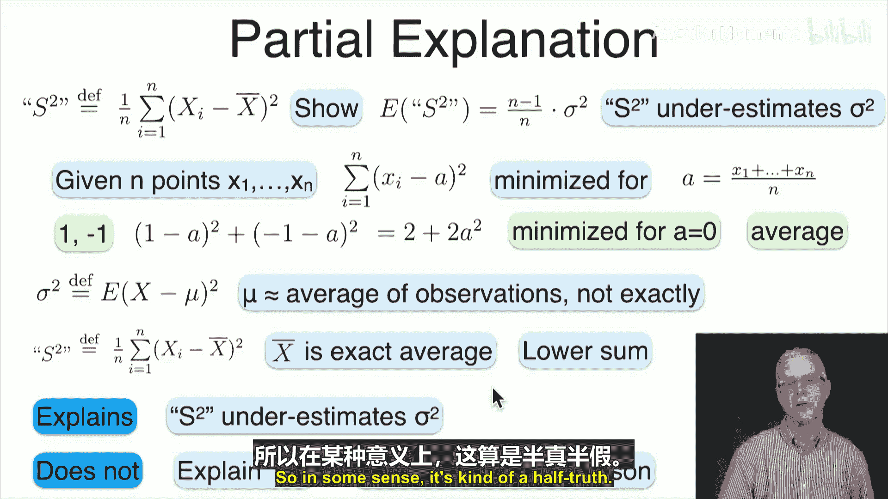
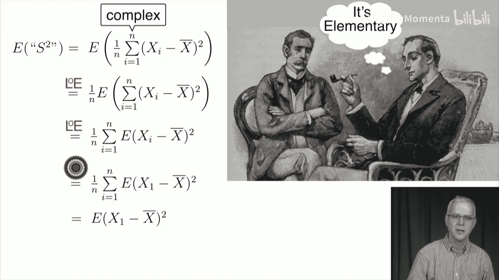
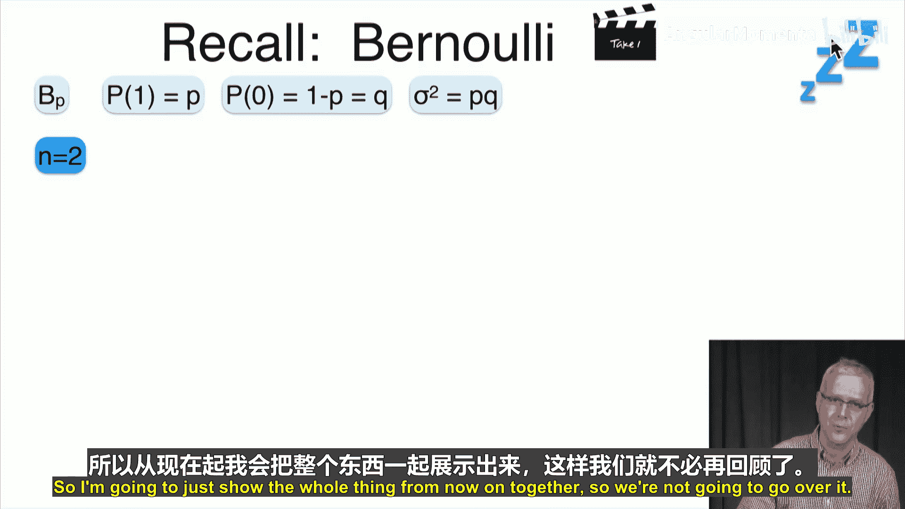
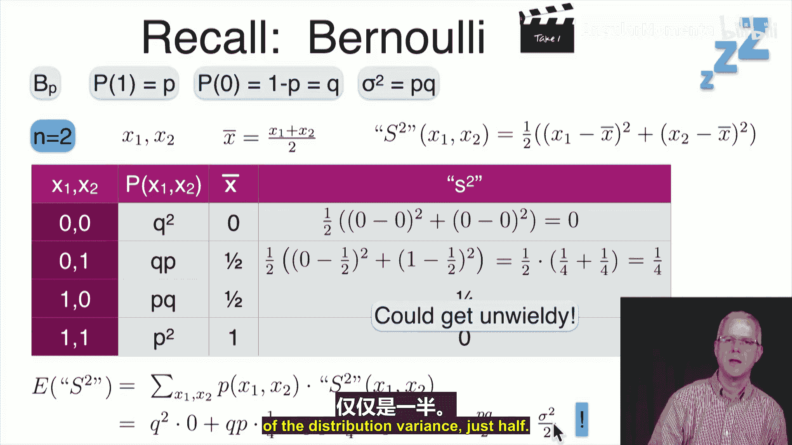
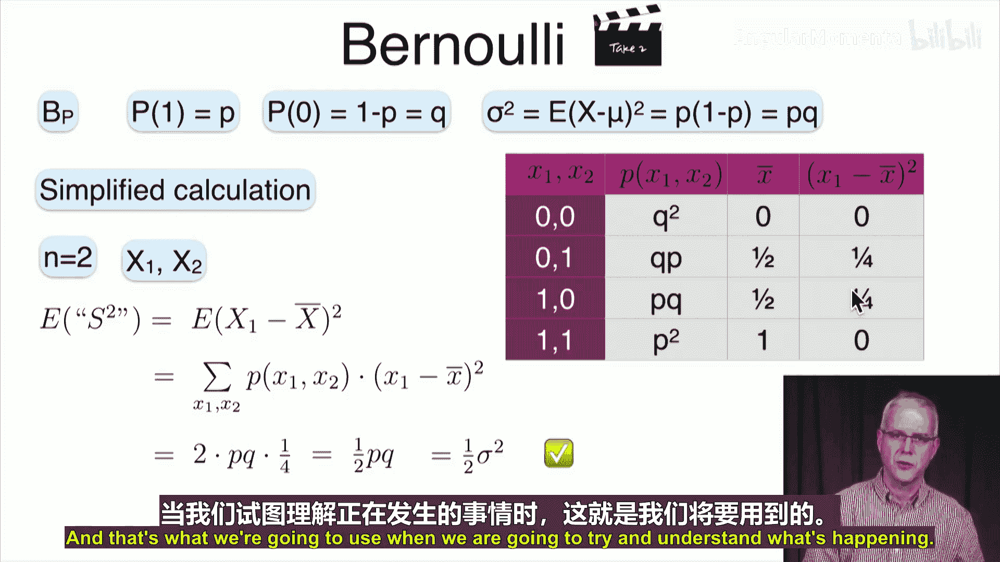
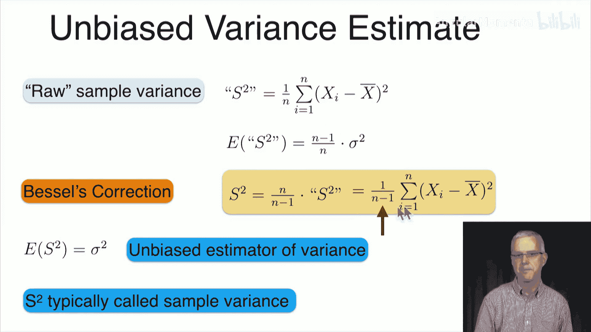
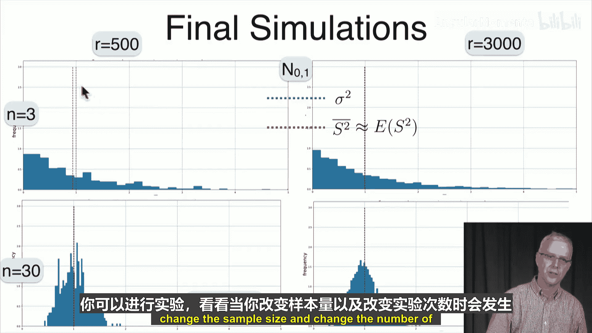

# 051：无偏估计 📊

在本节课中，我们将要学习方差的无偏估计。我们将评估上节课介绍的原始方差估计量的偏差，理解其行为，并最终描述一个无偏估计量。这将帮助我们解开“为什么分母是n-1而不是n”的谜团，并澄清一个常见的误解。

## 偏差的来源与初步解释

上一节我们介绍了样本均值是总体均值的无偏估计。本节中，我们来看看方差的估计情况。

我们定义**原始样本方差**为：
`s^2 = (1/n) * Σ (X_i - X̄)^2`
其中，`X̄` 是样本均值。

通过实验和简单计算，我们发现这个原始样本方差的期望值并不是总体方差 `σ^2`，而是 `(n-1)/n * σ^2`。因此，这个估计量是有偏的，它倾向于低估真实的方差。

以下是关于这种低估的一个初步（但不完整）的解释：
*   **核心观察**：给定一组数据点 `X_1, ..., X_n`，平方和 `Σ (X_i - a)^2` 在 `a` 等于样本均值 `X̄` 时达到最小。
*   **与真实方差的对比**：真实方差计算的是 `(X_i - μ)^2` 的期望，其中 `μ` 是固定的总体均值。而样本方差计算的是 `(X_i - X̄)^2`，其中 `X̄` 是样本数据的平均值。由于 `X̄` 是为了最小化样本内的平方和而“定制”的，因此 `Σ (X_i - X̄)^2` 通常会小于 `Σ (X_i - μ)^2`。这就解释了为什么原始样本方差会偏小。

然而，这个解释只说明了偏差的存在，并没有精确地解释为什么偏差因子恰好是 `(n-1)/n`。它只是一个“半真相”。

## 精确计算原始样本方差的期望

为了精确理解偏差，让我们来计算原始样本方差 `s^2` 的数学期望 `E[s^2]`。

首先，利用期望的线性性质和样本的对称性，我们可以将复杂的求和式简化：
`E[s^2] = E[ (1/n) * Σ (X_i - X̄)^2 ] = E[ (X_1 - X̄)^2 ]`
这个简化非常关键，它让我们只需关注单个样本点 `X_1` 与样本均值 `X̄` 的差距。

我们的目标是证明：
`E[ (X_1 - X̄)^2 ] = (n-1)/n * σ^2`

为了建立联系，我们将 `(X_1 - X̄)` 与 `(X_1 - μ)` 关联起来。关键在于将 `X_1` 从样本均值 `X̄` 中“解耦”出来：
`X_1 - X̄ = X_1 - (X_1 + X_2 + ... + X_n)/n = ((n-1)/n) * (X_1 - (X_2+...+X_n)/(n-1))`

令 `Y = (X_2+...+X_n)/(n-1)`，它是除去 `X_1` 后剩余样本的均值。则：
`X_1 - X̄ = ((n-1)/n) * (X_1 - Y)`

现在，对两边取平方的期望：
`E[(X_1 - X̄)^2] = ((n-1)/n)^2 * E[(X_1 - Y)^2]`

注意，`X_1` 和 `Y` 是独立的，且 `E[X_1] = μ`, `E[Y] = μ`。因此 `(X_1 - Y)` 的均值为0，其平方的期望就是它的方差：
`E[(X_1 - Y)^2] = Var(X_1 - Y)`

由于独立性，`Var(X_1 - Y) = Var(X_1) + Var(Y)`。
*   `Var(X_1) = σ^2`
*   `Y` 是 `(n-1)` 个独立同分布随机变量的均值，因此 `Var(Y) = σ^2/(n-1)`

所以：
`E[(X_1 - Y)^2] = σ^2 + σ^2/(n-1) = (n/(n-1)) * σ^2`

将其代回原式：
`E[(X_1 - X̄)^2] = ((n-1)/n)^2 * (n/(n-1)) * σ^2 = (n-1)/n * σ^2`

因此，我们最终证明了：
`E[s^2] = (n-1)/n * σ^2`

## 构建无偏估计量：贝塞尔校正

既然我们知道了原始样本方差 `s^2` 的期望是 `(n-1)/n * σ^2`，那么构造一个无偏估计量就很简单了：只需将 `s^2` 乘以 `n/(n-1)` 即可。

我们定义**（无偏）样本方差** `S^2` 为：
`S^2 = (n/(n-1)) * s^2 = (1/(n-1)) * Σ (X_i - X̄)^2`

显然，`E[S^2] = (n/(n-1)) * E[s^2] = (n/(n-1)) * ((n-1)/n * σ^2) = σ^2`。因此，`S^2` 是总体方差 `σ^2` 的一个无偏估计量。

这也就解开了最初的谜团：在计算样本方差时，我们除以 `(n-1)` 而不是 `n`，这个操作被称为**贝塞尔校正**。它校正了因为使用样本均值 `X̄`（而不是真实均值 `μ`）作为参考点所带来的系统性低估。

## 实例与模拟验证

让我们通过一个具体例子和模拟来巩固理解。

**计算示例**：
假设我们有一个样本：`[2, 1, 1, 4, 6]`。
*   样本均值 `X̄ = (2+1+1+4+6)/5 = 2.8`。
*   原始样本方差 `s^2 = [(2-2.8)^2 + (1-2.8)^2 + (1-2.8)^2 + (4-2.8)^2 + (6-2.8)^2] / 5 = 3.36`。
*   无偏样本方差 `S^2 = 3.36 * (5/4) = 4.2`，或者直接计算：`S^2 = 上述平方和 / 4 = 16.8 / 4 = 4.2`。

**模拟验证**：
我们可以用Python进行模拟。从标准正态分布 `N(0,1)`（方差 `σ^2=1`）中重复抽取样本。
1.  每次抽取一个大小为 `n` 的样本。
2.  计算该样本的无偏方差 `S^2`。
3.  重复很多次（例如3000次），计算所有这些 `S^2` 值的平均值。

模拟结果会显示，这个平均值非常接近1，从而验证了 `S^2` 的无偏性。当样本量 `n` 很小时，单次估计的波动很大，但大量重复后的平均值会稳定在理论值附近。

## 总结

本节课中我们一起学习了方差的无偏估计。
1.  我们首先指出，直接使用样本内平方和除以 `n` 得到的原始样本方差 `s^2` 是一个有偏估计，其期望为 `(n-1)/n * σ^2`。
2.  我们通过严谨的数学推导证明了这一偏差因子。
3.  为了获得无偏估计，我们引入了贝塞尔校正，定义了无偏样本方差 `S^2 = (1/(n-1)) * Σ (X_i - X̄)^2`，并证明了 `E[S^2] = σ^2`。
4.  这解释了在统计学中，计算样本方差时通常除以 `n-1` 而非 `n` 的根本原因，它校正了因使用样本均值而损失的一个“自由度”。

下一节，我们将探讨如何估计标准差。