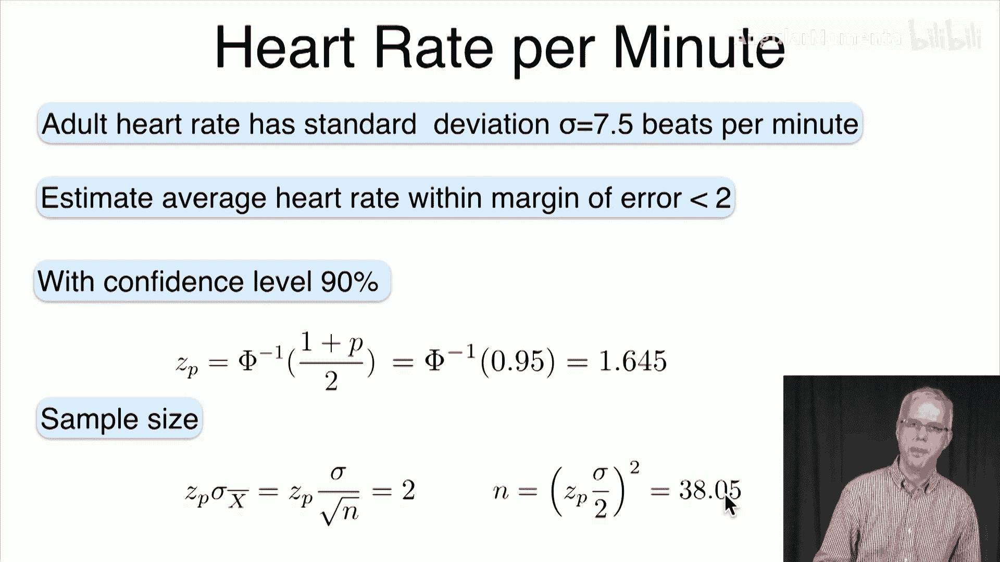

# 053：均值置信区间 📊


在本节课中，我们将学习如何为总体均值构建**置信区间**。我们将从点估计（给出一个具体数值）转向区间估计（给出一个范围），并说明我们对该范围包含真实参数的**置信度**。

## 从点估计到区间估计

上一节我们介绍了参数估计，目标是找到参数的最佳单一估计值。本节中，我们来看看如何不追求一个精确值，而是构建一个我们**相当有信心**包含真实参数的区间。

*   点估计（如均值估计为3.14）非常**精确**，但几乎可以肯定是**错误**的。
*   区间估计（如均值在3.1到3.18之间）牺牲了部分精度，但增加了我们对估计结果的**信心**。

我们希望得到类似这样的结论：“我们有95%的置信度，总体均值μ落在区间[3.1, 3.18]内。”这里的置信度可以理解为概率。

## 理论基础：中心极限定理与正态分布

为了理解置信区间，我们需要回到基础，即**中心极限定理**。该定理指出，对于足够大的样本量n（通常n≥30），样本均值`X̄`的分布近似服从正态分布。

具体来说，如果我们有n个独立同分布的随机变量`X₁, X₂, ..., Xₙ`，其总体均值为μ，标准差为σ，那么样本均值`X̄`的分布近似为：
`X̄ ~ N(μ, σ²/n)`

这意味着`X̄`的期望是μ，其标准差（称为**标准误**）是`σ/√n`。这个标准误会随着样本量n的增大而减小。

## 标准正态分布的区间预测

首先，我们考虑一个简单情况：预测一个标准正态随机变量`Z ~ N(0,1)`的值。

*   如果进行点估计，最可能的值是0，但这几乎肯定是错的。
*   更好的方法是给出一个区间`[-a, a]`，并计算`Z`落在此区间内的概率。

`Z`落在区间`[-a, a]`内的概率计算公式为：
`P(-a ≤ Z ≤ a) = 2Φ(a) - 1`
其中，`Φ(a)`是标准正态分布的累积分布函数在`a`处的值。

我们可以使用Python轻松计算`Φ(a)`：

```python
from scipy.stats import norm
# 计算 Φ(1)，即 P(Z ≤ 1)
prob = norm.cdf(1)
print(prob)  # 输出约为 0.8413
```

以下是几个常见的概率值（68-95-99.7法则的更精确版本）：

*   `P(-1 ≤ Z ≤ 1) ≈ 0.682` (68%置信度)
*   `P(-1.96 ≤ Z ≤ 1.96) ≈ 0.95` (95%置信度)
*   `P(-2.576 ≤ Z ≤ 2.576) ≈ 0.99` (99%置信度)

## 构建置信区间：从概率到区间

在实际应用中，我们通常先确定想要的置信水平（例如95%），然后反推出对应的区间边界`a`。

给定置信水平`P`，我们需要找到`Z_P`，使得`P(-Z_P ≤ Z ≤ Z_P) = P`。
通过公式`P = 2Φ(Z_P) - 1`，可以推导出：
`Z_P = Φ⁻¹((1+P)/2)`

我们可以使用Python计算`Φ⁻¹`（即百分位点函数PPF）：

```python
from scipy.stats import norm
# 计算 Z_P，使得 P(-Z_P ≤ Z ≤ Z_P) = 0.95
Z_P = norm.ppf((1 + 0.95) / 2)
print(Z_P)  # 输出约为 1.96
```

常见置信水平对应的`Z_P`值如下：

*   90% 置信度: `Z_P ≈ 1.645`
*   95% 置信度: `Z_P ≈ 1.96`
*   98% 置信度: `Z_P ≈ 2.326`
*   99% 置信度: `Z_P ≈ 2.576`

## 总体均值的置信区间（σ已知）

现在我们将上述原理应用于总体均值μ的估计。假设我们已知总体标准差σ。

根据中心极限定理，样本均值`X̄`近似服从`N(μ, σ²/n)`。因此，`(X̄ - μ) / (σ/√n)`近似服从标准正态分布`N(0,1)`。

由此可以推导出，在置信水平`P`下，总体均值μ的置信区间为：
`[ X̄ - Z_P * (σ/√n), X̄ + Z_P * (σ/√n) ]`

其中：
*   `X̄`是样本均值。
*   `Z_P`是对应置信水平`P`的标准正态分布临界值。
*   `σ/√n`是样本均值的标准误。
*   `Z_P * (σ/√n)`被称为**边际误差**。


### 示例1：计算置信区间

假设推特用户每日推文数的标准差为σ=2。我们抽取了n=121名用户，得到样本均值`X̄=3.7`。求总体均值μ的95%置信区间。

**计算步骤：**
1.  确定`Z_P`：对于95%置信度，`Z_P = 1.96`。
2.  计算标准误：`σ/√n = 2 / √121 = 2/11 ≈ 0.1818`。
3.  计算边际误差：`Z_P * (σ/√n) = 1.96 * (2/11) ≈ 0.356`。
4.  构建区间：下限 `3.7 - 0.356 = 3.344`，上限 `3.7 + 0.356 = 4.056`。

**结论：** 我们有95%的置信度认为，所有推特用户日均推文数的总体均值在3.344到4.056条之间。

### 示例2：确定所需样本量

有时我们需要先确定边际误差和置信水平，然后反推需要多大的样本量。

假设成人静息心率的标准差σ=7.5次/分钟。我们希望估计总体心率均值，要求边际误差不超过2次/分钟，且置信水平为90%。需要多大的样本量n？

**计算步骤：**
1.  确定`Z_P`：对于90%置信度，`Z_P = 1.645`。
2.  根据边际误差公式：`边际误差 = Z_P * (σ/√n) ≤ 2`。
3.  解出n：`√n ≥ (Z_P * σ) / 2` => `n ≥ [(Z_P * σ) / 2]²`。
4.  代入数值：`n ≥ [(1.645 * 7.5) / 2]² ≈ (12.3375 / 2)² ≈ 38.05`。

**结论：** 我们需要至少抽取39个样本（向上取整），才能以90%的置信度保证估计的边际误差在2次/分钟以内。

## 总结

本节课中我们一起学习了：
1.  **置信区间**的概念：用一个区间而非单一值来估计参数，并附上置信水平。
2.  构建置信区间的**理论基础**：中心极限定理和标准正态分布的性质。
3.  如何计算标准正态分布的**累积概率**和**逆函数**（使用`norm.cdf`和`norm.ppf`）。
4.  在**总体标准差σ已知**的情况下，计算总体均值μ的置信区间的公式：`X̄ ± Z_P * (σ/√n)`。
5.  如何利用该公式进行**两个方向的计算**：
    *   根据样本数据计算置信区间。
    *   根据要求的精度（边际误差）和置信水平，确定必要的样本量。



下一讲，我们将探讨当总体标准差σ未知时，如何构建均值的置信区间，这将引入t分布的概念。