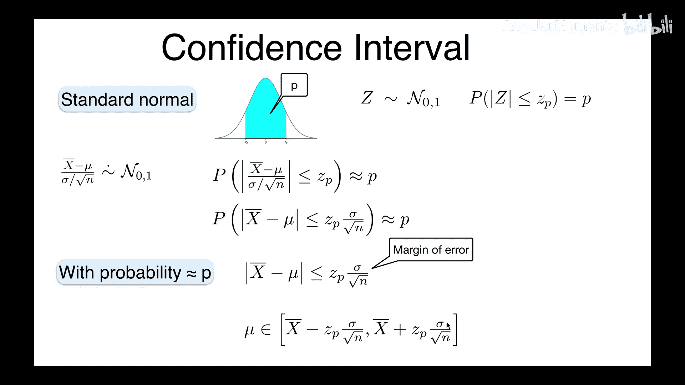
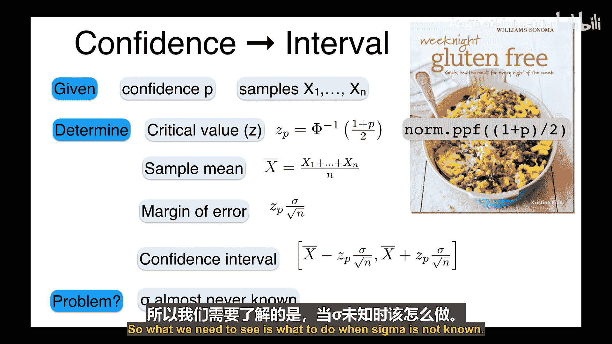
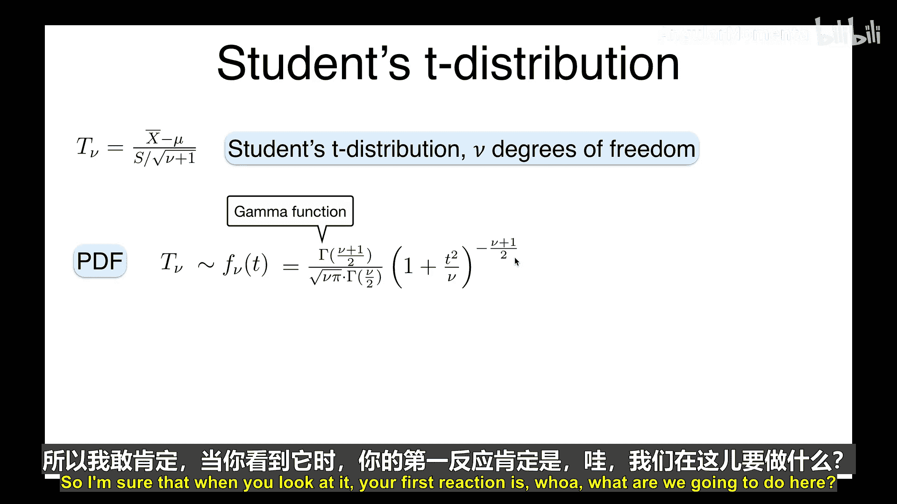
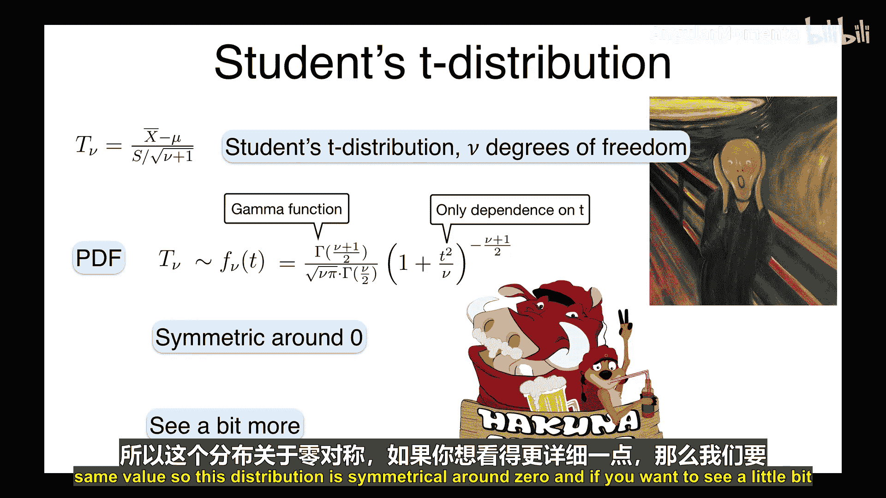
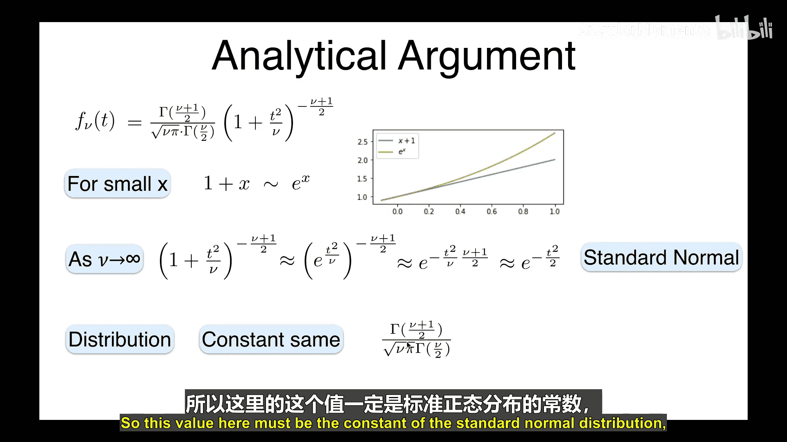
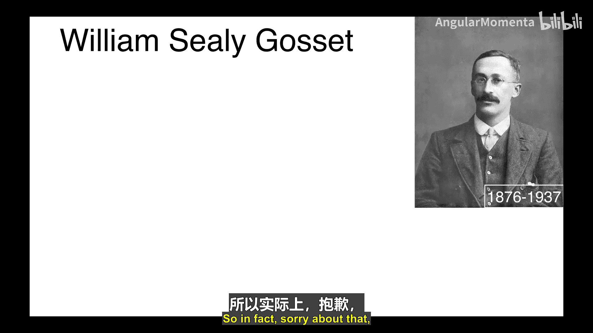
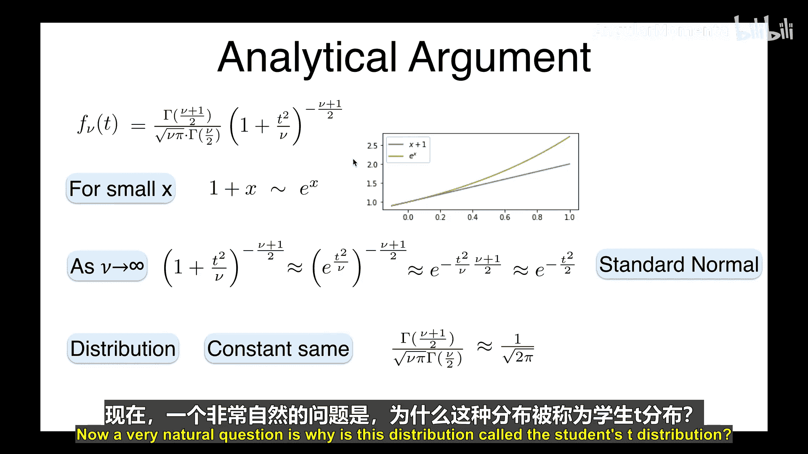
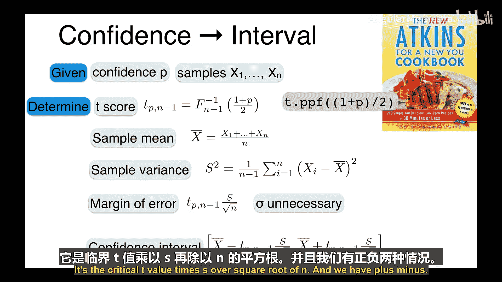
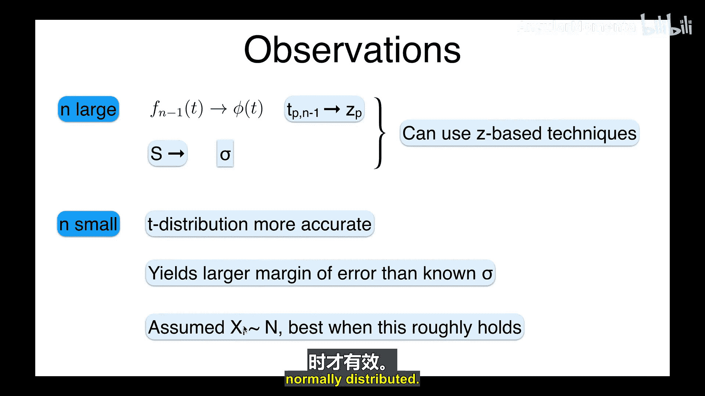

# 054：总体标准差未知时的置信区间（第一部分） 📊

在本节课中，我们将要学习当总体标准差未知时，如何构建置信区间。上一节我们介绍了在已知总体标准差（σ）的情况下构建置信区间的方法。然而，在实际应用中，σ几乎总是未知的。本节中，我们将探讨如何在这种情况下，通过估计标准差并使用学生t分布来构建置信区间。

## 已知σ时的置信区间回顾 🔄

首先，让我们快速回顾一下已知总体标准差（σ）时的标准方法。

我们定义标准正态分布 `Z ~ N(0, 1)`。对于一个给定的概率 `P`（例如0.95），我们可以找到临界值 `Z_P`，使得 `Z` 落在 `[-Z_P, Z_P]` 区间内的概率为 `P`。其计算公式为：
`Z_P = Φ^{-1}((1+P)/2)`
其中 `Φ` 是标准正态分布的累积分布函数（CDF）。

当我们从均值为 `μ`、标准差为 `σ` 的总体中抽取 `n` 个独立同分布样本 `X_1, X_2, ..., X_n` 时，样本均值 `X̄` 的期望和标准差为：
`E[X̄] = μ`
`σ_{X̄} = σ / √n`

根据中心极限定理，标准化后的样本均值近似服从标准正态分布：
`(X̄ - μ) / (σ/√n) ~ N(0, 1)`

因此，我们可以构建置信区间：
`μ ∈ [ X̄ - Z_P * (σ/√n), X̄ + Z_P * (σ/√n) ]`
其中 `Z_P * (σ/√n)` 被称为误差幅度。

## 当σ未知时的问题 ❓

然而，上述方法的核心问题在于，我们几乎永远无法知道真实的总体标准差 `σ`。因此，我们需要一种新的方法来处理这种不确定性。

## 引入学生t分布 📈

当σ未知时，一个自然的想法是用样本标准差 `S` 来估计它。样本方差 `S²` 的无偏估计为：
`S² = (1/(n-1)) * Σ_{i=1}^{n} (X_i - X̄)²`

我们用 `S` 代替 `σ` 来标准化样本均值，得到一个新的统计量：
`T = (X̄ - μ) / (S/√n)`

这个统计量不再服从标准正态分布，而是服从**学生t分布**，其自由度为 `ν = n - 1`。学生t分布的概率密度函数（PDF）为：
`f_ν(t) = (Γ((ν+1)/2)) / (√(νπ) * Γ(ν/2)) * (1 + t²/ν)^{-(ν+1)/2}`
其中 `Γ` 是伽马函数。

以下是关于学生t分布的几个关键点：
*   **对称性**：它像正态分布一样，关于 `t=0` 对称。
*   **与正态分布的关系**：当自由度 `ν` 增大时，t分布越来越接近标准正态分布。当 `n` 很大时（例如 > 30），两者几乎相同。
*   **更宽的尾部**：对于较小的样本量（`n` 小），t分布的尾部比正态分布更厚，这反映了由于估计 `σ` 所带来的额外不确定性。

## 构建置信区间的步骤 📝

现在，我们可以给出当σ未知时，构建置信区间的具体步骤。

以下是构建置信区间的详细步骤：
1.  **确定临界值 `t_{P, ν}`**：根据所需的置信水平 `P`（如95%）和自由度 `ν = n-1`，查找t分布的临界值。该值满足 `P(|T| ≤ t_{P, ν}) = P`。计算公式为：`t_{P, ν} = F_ν^{-1}((1+P)/2)`，其中 `F_ν` 是自由度为 `ν` 的t分布的CDF。
2.  **计算样本均值 `X̄`**：`X̄ = (1/n) * Σ_{i=1}^{n} X_i`
3.  **计算样本标准差 `S`**：`S = √[ (1/(n-1)) * Σ_{i=1}^{n} (X_i - X̄)² ]`
4.  **计算误差幅度**：`误差幅度 = t_{P, n-1} * (S / √n)`
5.  **构建置信区间**：`μ ∈ [ X̄ - 误差幅度, X̄ + 误差幅度 ]`

## 应用示例：计算大象鼻子长度的置信区间 🐘

假设我们想估计成年非洲象鼻子的平均长度。我们随机测量了8头大象的鼻子长度（单位：英尺），数据如下：`[5.62, 6.07, 5.93, 6.38, 6.15, 5.82, 6.25, 5.48]`。我们希望构建一个95%的置信区间。

以下是计算过程：
1.  **确定临界值**：置信水平 `P=0.95`，样本量 `n=8`，自由度 `ν=7`。计算 `t_{0.95, 7} = F_7^{-1}((1+0.95)/2) = F_7^{-1}(0.975)`。使用Python的 `scipy.stats.t.ppf(0.975, 7)` 可得 `t ≈ 2.3646`。
2.  **计算样本均值**：`X̄ = (5.62+6.07+...+5.48)/8 = 6.095`
3.  **计算样本标准差**：`S = √[ (1/7)*((5.62-6.095)² + ... + (5.48-6.095)²) ] ≈ 0.4130`
4.  **计算误差幅度**：`误差幅度 = 2.3646 * (0.4130 / √8) ≈ 0.3453`
5.  **构建置信区间**：`μ ∈ [6.095 - 0.3453, 6.095 + 0.3453] = [5.7497, 6.4403]`

因此，我们有95%的信心认为，成年非洲象鼻子的真实平均长度在5.75英尺到6.44英尺之间。

## 总结与要点 📚

本节课中我们一起学习了当总体标准差未知时构建置信区间的方法。

我们了解到，由于σ未知，需要用样本标准差 `S` 进行估计，这导致标准化统计量服从学生t分布而非正态分布。我们介绍了学生t分布的特性，并给出了构建置信区间的完整步骤。最后，通过一个测量大象鼻子长度的例子，演示了该方法的具体应用。

关键要点总结如下：
*   **核心区别**：用 `S` 代替 `σ`，用 `t` 分布代替 `Z` 分布。
*   **t分布**：形状类似正态但尾部更厚，自由度 `ν = n-1`。样本量越大，越接近正态分布。
*   **更宽的区间**：对于小样本，t分布的临界值大于Z分布的临界值，导致置信区间更宽，这合理反映了更大的不确定性。
*   **应用前提**：本方法在样本数据本身近似服从正态分布时效果最好。对于严重偏离正态的数据，可能需要其他方法。

下一节，我们将开始学习假设检验的基本概念。