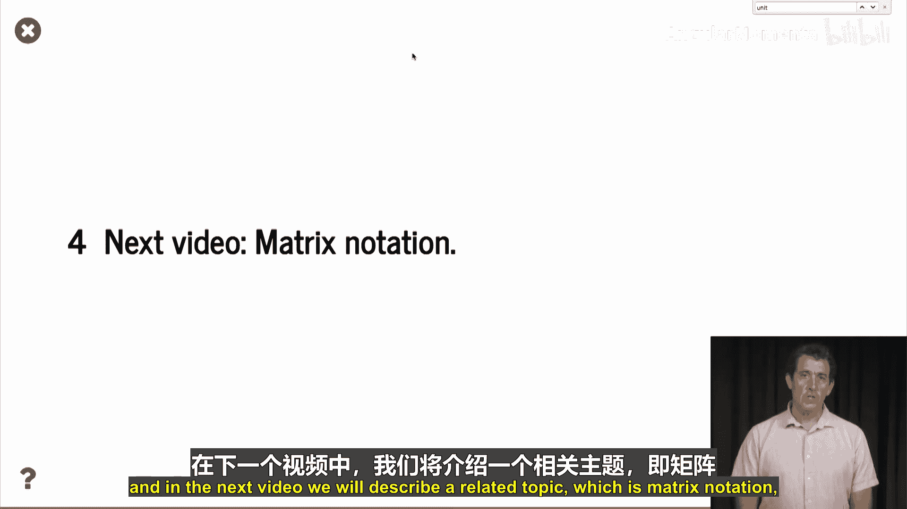

# 055：线性代数回顾 📚


在本节课中，我们将回顾线性代数的核心概念，为后续学习回归分析打下基础。线性代数是理解数据科学中许多高级方法的关键，特别是处理多维数据时。我们将从向量开始，逐步介绍其运算、性质以及如何用它们表示空间。

## 向量基础

上一节我们介绍了课程目标，本节中我们来看看线性代数的基本元素——向量。向量可以表示箭头、速度、方向或空间中的位置。在数据科学中，向量通常代表一个数据点，其每个分量对应一个特征。

一个二维向量可以表示为平面上的一个箭头，具有方向和长度。例如，向量 **a** = [1, π] 或 **b** = [-1.56, 1.2]。更一般地，一个 D 维向量是实数集 **R^D** 中的一个元素，由 D 个实数组成。

在 Python 中，我们使用 NumPy 数组来处理向量。需要注意的是，数组的“维度”有两种含义：向量本身的维度和数组的数据结构维度。

```python
import numpy as np
# 定义一个四维向量（用一维数组表示）
vector_4d = np.array([1, 2, 3, 4])
# 定义一个 2x2 矩阵（用二维数组表示）
matrix_2x2 = np.array([[1, 2], [3, 4]])
```

## 向量运算

理解了向量的表示后，我们来看看能对向量进行哪些基本操作。以下是三种核心运算：

1.  **向量加法**：将两个向量的对应分量相加。要求两个向量维度相同。几何上，这相当于将第二个向量的起点平移到第一个向量的终点。
2.  **标量乘法**：将一个向量乘以一个实数（标量）。这相当于缩放向量的长度，如果标量为负，则方向反转。
3.  **内积（点积）**：两个向量的点积运算得到一个标量。计算方式为对应分量相乘后求和。公式为：**a · b** = Σ (a_i * b_i)。

```python
v1 = np.array([1, 2])
v2 = np.array([-1, 1])
# 向量加法
v_sum = v1 + v2  # 结果为 [0, 3]
# 标量乘法
v_scaled = 0.5 * v1  # 结果为 [0.5, 1.0]
# 内积
dot_product = np.dot(v1, v2)  # 结果为 1
```

## 向量范数与单位向量

点积引出了一个重要的概念——向量的范数（或长度）。向量的范数衡量其大小。

*   **范数计算**：向量 **v** 的范数（通常指 L2 范数）是其与自身点积的平方根。公式为：||**v**|| = √(**v · v**)。
*   **单位向量**：范数为 1 的向量称为单位向量。任何非零向量都可以通过除以自身的范数来“归一化”，从而得到指向相同方向的单位向量。

```python
v = np.array([3, 4])
# 计算范数
norm_v = np.linalg.norm(v)  # 结果为 5.0
# 或手动计算：np.sqrt(np.dot(v, v))
# 生成单位向量
unit_v = v / norm_v  # 结果为 [0.6, 0.8]
```

## 投影与正交性

基于点积和单位向量，我们可以定义投影和正交性，这是理解坐标变换的基础。

*   **投影**：向量 **v** 在单位向量 **u** 方向上的投影是一个新向量，其长度为 **v · u**，方向与 **u** 相同。公式为：proj_u(**v**) = (**v · u**) * **u**。
*   **正交性**：如果两个向量的点积为零，则它们正交（垂直）。即，**a · b** = 0 ⇔ **a** 与 **b** 正交。

## 标准正交基与基变换

最后，我们将上述概念组合起来，介绍如何用一组向量作为“尺子”来度量整个空间，以及如何在不同的“尺子”系统间转换。

*   **标准正交基**：一组向量 {**u1**, **u2**, ..., **uD**} 如果满足（1）每个都是单位向量（**ui · ui** = 1），（2）彼此两两正交（**ui · uj** = 0, i≠j），则构成空间 **R^D** 的一个标准正交基。
*   **标准基**：最常用的基是标准基 **e1**=[1,0,...], **e2**=[0,1,...], ...。向量在此基下的坐标就是其本身的分量。
*   **基变换与重构**：给定一个标准正交基，任何向量 **v** 都可以唯一地表示为基向量的线性组合。系数通过计算 **v** 与每个基向量的点积得到（即投影长度）。然后，可以用这些系数和基向量完美地重构出原向量 **v**：**v** = Σ (**v · ui**) * **ui**。从一个基变换到另一个基称为基变换。



本节课中我们一起学习了线性代数的核心概念：向量的定义与表示、基本运算（加法、标量乘法、点积）、范数与单位向量、投影与正交性，以及最重要的标准正交基与基变换原理。掌握这些知识是理解后续回归分析中矩阵运算和几何解释的关键。在下一个视频中，我们将学习矩阵表示法，它能让我们更简洁地处理大量的向量方程。