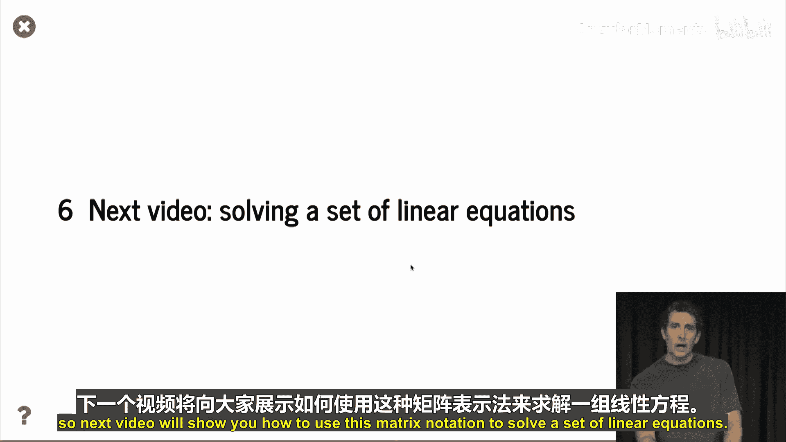

# 056：矩阵表示法与运算

## 概述
在本节课中，我们将要学习矩阵的基本概念、表示法及其核心运算。矩阵是统计学和数值计算中极为有用的工具，我们将通过Python的NumPy库来演示这些操作。

## 什么是矩阵？🧮
矩阵本质上是一个由数字组成的矩形阵列。它有水平的行和垂直的列。如果一个矩阵有M行和N列，我们称它为M×N矩阵。

MATLAB大量使用矩阵表示法。在Python中，我们可以通过名为NumPy的库使用非常相似的表示法，这也是我们今天要做的。

## 矩阵转置
一个非常简单的操作是矩阵转置。假设有一个矩阵A，它有两列三行。它的转置矩阵则有两行三列。本质上，我们交换了行和列，得到了一个新的矩阵，记作 **A^T**。

以下是在NumPy中如何实现转置的示例。我们有一个2×3的矩阵，取其转置后，得到一个3×2的矩阵。具体代码请下载配套的笔记本来查看。

## 向量：矩阵的特殊形式
在矩阵表示法中，向量有两种形式：列向量和行向量。列向量中的所有元素垂直排列，而行向量中的所有元素水平排列。

我们可以将向量视为一种特殊的矩阵：列向量是一个D×1的矩阵，而行向量是一个1×D的矩阵。

将矩阵视为向量的集合是矩阵操作强大力量的来源。例如，一个2×3的矩阵可以看作是三个列向量的集合，也可以看作是两个行向量的集合。

以下是我们的矩阵A。以下操作展示了如何将A拆分为三个列向量。现在，我们得到了一个包含三个列向量的列表。我们可以使用`concatenate`函数将这些列向量重新组合，得到原始矩阵。我们可以检查重构的矩阵与原始矩阵是否相等，结果所有对应项都是`True`。

## 矩阵与标量的运算
标量就是一个单一的数字。矩阵与标量相加，意味着将标量加到矩阵的每一个元素上。减法同理。矩阵乘以标量，意味着矩阵的每个元素都乘以该标量。

我们也可以定义除法，例如 `a / 5` 等价于 `a * (1/5)`，即矩阵的每个元素乘以五分之一。但是，`5 / a` 是没有定义的。

## 矩阵与矩阵的运算
首先，矩阵的加法和减法要求两个矩阵形状相同（即行数和列数相同）。然后，我们取对应元素的差，例如 `a11 - b11`，`a12 - b12`，依此类推。

接下来，我们讨论矩阵乘法，这是核心操作。让我们从“瘦”矩阵——向量开始。我们知道两个向量的点积计算方式。在矩阵表示法中，有一个约定：点积中的第一个向量必须是行向量，第二个必须是列向量。这个约定虽然看起来有些奇怪，但它能让我们用极简的符号完成非常强大的操作。

现在，让我们看看如何将其推广到非“瘦”矩阵。假设我们想将一个2×3的矩阵乘以一个维度为3的列向量。我们的做法是将矩阵A视为两个行向量的列，然后分别用每个行向量与列向量C做点积，得到结果。

我们甚至可以进一步推广，讨论矩阵与矩阵的乘法。这里有一个三行两列的矩阵A和一个两行三列的矩阵C。我们要计算A和C的乘积。首先需要检查A的列数是否等于C的行数。

为了计算乘积，我们将A视为行向量的列，将C视为列向量的行。当我们计算矩阵A乘以矩阵C时，我们取这些行向量与列向量的点积组合。展开后，你会得到大量的运算项，这也正是矩阵表示法方便之处——我们只需写成 `A * C`。

## 正交矩阵与基变换
现在，我们利用矩阵和向量的乘法知识，重新实现上一视频末尾的内容：使用正交矩阵进行基变换。

回忆一下正交基的定义：它是一组D个向量，每个向量的长度为1，且彼此正交。这里我们将使用行向量表示法来表示每个基向量，然后将所有这些行向量组合成一个矩阵。

我们的矩阵U的每一行都是一个正交基向量。要验证这是一组正交基向量，只需计算 `U * U^T`，并检查结果是否为单位矩阵。单位矩阵是什么？我们接下来会检查。

一旦有了这个表示法，对向量v进行基变换就简化为从左侧用U乘以v：`U * v`。如果我们想在新基下重构原向量，只需计算 `U * U^T * v`。正如我们所知，`U * U^T` 是单位矩阵，因此我们得到v本身。

## 单位矩阵与矩阵的逆
单位矩阵在矩阵乘法中的作用类似于数字1在标量乘法中的作用。如果用一个矩阵乘以单位矩阵，结果等于原矩阵。单位矩阵是一个方阵，除了主对角线上的元素为1外，其他元素均为0。根据矩阵乘法的定义，可以验证 `A * I = I * A = A`。

接下来，我们讨论一个更复杂的操作：矩阵求逆。这在下一个视频中会很有用。在标量乘法中，a的逆是 `1/a`，记作 `a^{-1}`。`a^{-1}` 的性质是 `a * a^{-1} = 1`。并非所有元素都有乘法逆元，例如0就没有。

类似地，某些方阵具有乘法逆矩阵，记作 `A^{-1}`，满足 `A * A^{-1} = A^{-1} * A = I`（单位矩阵）。寻找矩阵的逆被称为矩阵求逆。

这里给出了一个2×2矩阵求逆的公式。这是一个足够小的矩阵，可以显式写出其逆矩阵。你会发现，本质上交换了 `a22` 和 `a11` 的位置，并对 `a12` 和 `a21` 取负号，然后除以一个表达式。这个表达式也揭示了矩阵何时没有逆：当 `a11*a22 - a12*a21 = 0` 时，该矩阵没有逆矩阵。

以下是一些NumPy代码，展示了如何对一个随机的2×2矩阵求逆。你可以看到矩阵C和它的逆矩阵 `C_inv`。在笔记本中，你可以验证 `C` 和 `C_inv` 的点积确实是单位矩阵。

正如所说，并非所有矩阵都有逆矩阵。那些没有逆矩阵的矩阵被称为奇异矩阵。这里有一个奇异矩阵的例子：一个第一行和第二行都是 `[1, 0]` 的矩阵是奇异的，如果我尝试求逆，会得到一个异常，说明无法对此矩阵求逆。请记住，不是所有矩阵都可逆。

## 总结
本节课中，我们一起学习了矩阵的基本概念、表示方法以及核心运算，包括转置、标量运算、矩阵加减法、矩阵乘法、单位矩阵和矩阵求逆。我们还了解了如何用矩阵表示正交基并进行基变换。矩阵表示法极大地简化了复杂的线性运算，是数据科学和统计学中不可或缺的工具。在下一个视频中，我们将学习如何利用这些矩阵知识来求解线性方程组。