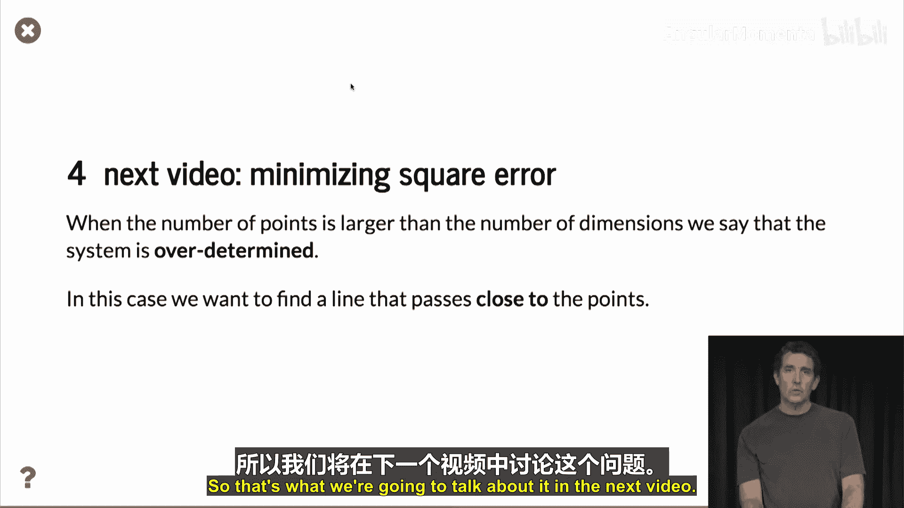

# 057：求解线性方程组 📐


在本节课中，我们将学习如何使用矩阵来求解线性方程组。我们将从最简单的两个方程两个未知数的情况开始，了解其几何意义，并学习如何用Python的NumPy库进行计算。

## 概述

上一节我们介绍了矩阵的基本概念。本节中，我们来看看矩阵的第一个实际应用：求解线性方程组。我们将从一个简单的例子入手，即寻找一条穿过两个给定点的直线，并学习如何将其转化为矩阵问题并求解。

## 通过两点确定一条直线

线性方程组最简单的形式是包含两个方程和两个未知数。这对应于在平面上找到一条穿过两个给定点的直线。

假设我们有两个点：(-1, 2) 和 (1, 1)。我们的目标是找到一条穿过这两点的直线。

在平面上，任何非垂直的直线都可以用以下表达式表示：
`y = w0 + w1 * x`
其中，`w0` 是直线与y轴的截距，`w1` 是直线的斜率。`x` 和 `y` 是直线上点的坐标。

为了找到穿过给定两点的直线，我们需要找到满足这两个点约束条件的 `w0` 和 `w1`。

对于点 (-1, 2)，代入方程得到：
`w0 + w1 * (-1) = 2`，即 `w0 - w1 = 2`

对于点 (1, 1)，代入方程得到：
`w0 + w1 * 1 = 1`，即 `w0 + w1 = 1`

这样我们就得到了一个包含两个方程和两个未知数的线性方程组。

## 将方程组写成矩阵形式

我们可以将这个方程组用矩阵形式更简洁地表示出来。

以下是表示方法：
```
[ 1  -1 ]   [ w0 ]   =   [ 2 ]
[ 1   1 ]   [ w1 ]       [ 1 ]
```
如果我们计算第一行和第二行的点积，就能得到之前列出的两个方程。

我们可以将其概括为：
`A * w = B`
其中：
*   `A` 是系数矩阵。
*   `w` 是未知的参数向量 `[w0, w1]`。
*   `B` 是因变量或常数项向量 `[2, 1]`。

## 求解矩阵方程

我们的目标是找到满足 `A * w = B` 的向量 `w`。

如果矩阵 `A` 是方阵且可逆（在本例中正是如此），我们就可以在等式两边同时左乘 `A` 的逆矩阵 `A^{-1}`：
`A^{-1} * A * w = A^{-1} * B`
因为 `A^{-1} * A` 等于单位矩阵 `I`，所以左边简化为 `w`：
`w = A^{-1} * B`

以下是使用NumPy进行计算的步骤：

首先，定义矩阵 `A` 和向量 `B`。
```python
import numpy as np

A = np.array([[1, -1],
              [1,  1]])
B = np.array([2, 1])
```

接着，计算矩阵 `A` 的逆矩阵。
```python
A_inv = np.linalg.inv(A)
```
我们可以验证 `A_inv` 确实是 `A` 的逆矩阵，因为 `A * A_inv` 的结果接近单位矩阵。
```python
print(A @ A_inv) # 输出应接近 [[1., 0.], [0., 1.]]
```

最后，解出向量 `w`。
```python
w = A_inv @ B
print(w) # 输出: [1.5, -0.5]
```

或者，NumPy提供了更直接的求解函数 `np.linalg.solve`。
```python
w = np.linalg.solve(A, B)
print(w) # 输出: [1.5, -0.5]
```

我们得到的解是 `w0 = 1.5`, `w1 = -0.5`。

## 验证结果并绘图

现在我们已经得到了参数向量 `w`，可以定义这条直线了。
```python
def line(x):
    w0, w1 = w
    return w0 + w1 * x
```

验证这条直线是否穿过给定的两个点：
```python
print(line(-1)) # 输出: 2.0
print(line(1))  # 输出: 1.0
```
结果符合预期，证明我们找到了正确的直线。

将其绘制出来，可以直观地看到这条直线确实穿过了点 (-1, 2) 和 (1, 1)。

## 超定方程组简介

以上是两个点确定一条直线的完美情况。但在现实中，我们常常会遇到多于两个点的情况。

考虑在之前两个点的基础上增加第三个点，例如 (0, 0)。在二维平面上，如果点数超过两个，并且这些点不共线，那么就不存在一条能同时穿过所有点的直线。

当方程的数量（点数）超过未知数的数量（维度）时，我们称这个系统为**超定**的。这意味着没有精确解能使所有方程同时成立。

然而，我们仍然希望找到一条能“尽可能接近”所有点的直线。这引出了“最佳拟合”或“最小二乘解”的概念，我们将在下一节视频中详细讨论。

## 总结



本节课中，我们一起学习了如何使用矩阵求解线性方程组。
1.  我们将“寻找穿过两点的直线”问题转化为一个包含两个方程和两个未知数的线性方程组。
2.  我们学会了将方程组写成矩阵形式 `A * w = B`。
3.  我们掌握了利用矩阵的逆（`w = A^{-1} * B`）或使用NumPy的 `np.linalg.solve` 函数来求解未知向量 `w` 的方法。
4.  最后，我们了解了当点数多于两个时，系统会变成超定方程组，并为下一节学习最小二乘法拟合做了铺垫。