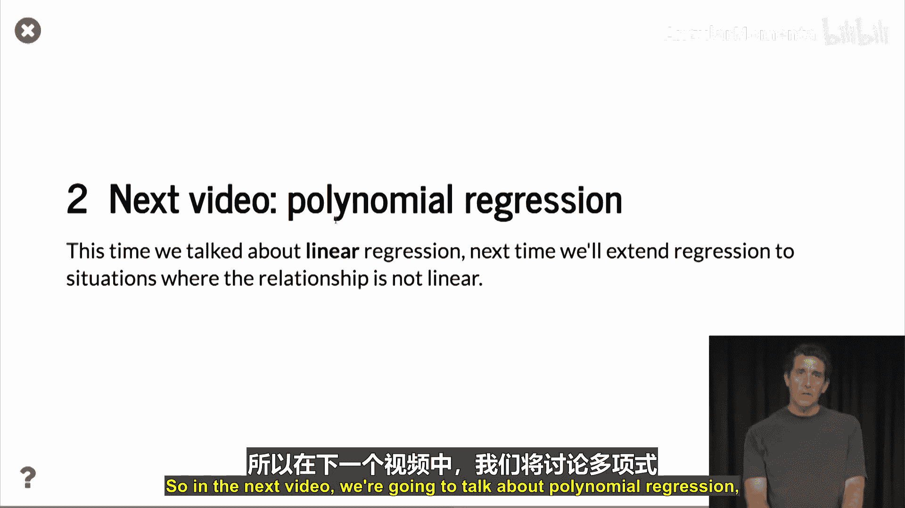
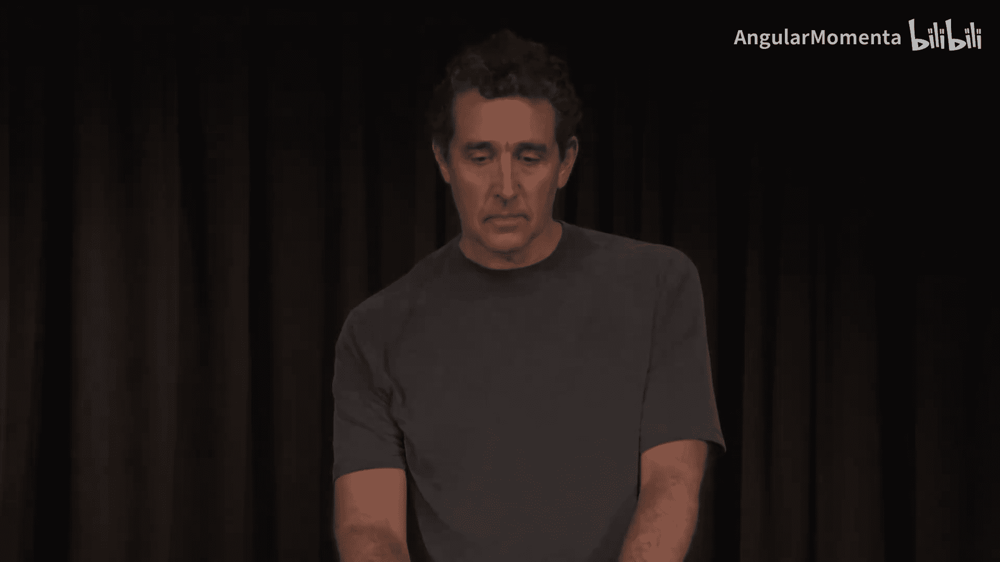

# 058：线性回归 📈


在本节课中，我们将要学习线性回归的核心概念。这是一种用于寻找数据点之间线性关系的基本方法。我们将从简单的两点拟合开始，逐步扩展到处理多个数据点的情况，并学习如何使用最小二乘法找到最佳拟合线。

## 从两点到多点拟合

上一节我们介绍了如何找到一条穿过平面上两个点的直线。本节中我们来看看，当数据点多于两个时，我们能否找到一条接近所有这些点的直线。这就是回归分析的基本思想。

当平面上有多个点时，通常不存在一条能穿过所有点的直线。然而，我们常常可以找到一条非常接近所有点的直线。例如，下图展示了九个点，虽然它们不在同一条直线上，但显然存在一条向上倾斜的直线非常接近它们。


## 定义目标与成本函数

我们的目标是找到一条形式为 `y = w0 + w1 * x` 的直线。这意味着我们需要确定截距 `w0` 和斜率 `w1`。

由于没有直线能精确穿过所有点，我们需要定义“接近”的含义。我们将使用平方差的概念：对于每个数据点 `(xi, yi)`，我们计算直线在该 `x` 处的预测值，然后计算其与实际 `y` 值的差，并将此差值平方。

我们将其平方的原因是为了确保差值始终为正。当预测完全准确时，差值为零。这个平方成本函数的值会随着预测点与实际点距离的增大而增大。我们的目标就是找到使这个总平方差最小的 `w0` 和 `w1`。

这种寻找最小化平方差的方法被称为**最小二乘法**，我们寻找的解称为最小二乘解。

## 使用矩阵和NumPy求解

我们可以使用矩阵表示法和 `numpy.linalg` 库来找到最小化平方误差的最优权重向量 `W`。

以下是涉及的矩阵：
*   我们定义矩阵 `A`，其中第一列全是1，第二列是所有 `x` 值。
*   我们有一个包含所有 `y` 值的列向量 `y`。
*   我们有一个包含两个值（`w0` 和 `w1`）的列向量 `W`，即我们要寻找的权重向量。

此时，误差向量 `D` 可以表示为 `D = A * W - y`。这个向量包含了每个点的预测误差。我们感兴趣的是误差平方和，这恰好等于误差向量 `D` 的范数（长度）的平方。因此，我们的目标是找到使向量 `D` 长度最短的 `W`。

在NumPy中，我们可以轻松实现这一过程。以下是关键步骤：

```python
import numpy as np

# 假设 X 是包含所有x值的数组，Y 是包含所有y值的数组
# 构建矩阵A：第一列为1，第二列为X
A = np.vstack([np.ones(len(X)), X]).T

# 调用numpy的最小二乘函数求解
w, residuals, rank, s = np.linalg.lstsq(A, Y, rcond=None)
# w 就是包含 w0 和 w1 的向量
w0, w1 = w[0], w[1]
```

在一个包含9个点的玩具示例中，求解得到的权重向量 `W` 可能是 `[1.9, 0.7166]`，其中 `1.9` 是截距 `w0`，`0.7166` 是斜率 `w1`。将这条直线绘制在散点图上，可以看到它确实非常接近所有点，而图中绿色的短线段则代表了每个点的误差（残差）。

## 真实数据案例：身高与体重

在现实中，我们通常处理的是海量数据点。例如，一个包含25,000人身高（英寸）和体重（磅）的数据集。对这些数据应用最小二乘线性回归，我们可以得到一条最佳拟合线（红色直线）。



这条红线表明，随着身高增加，体重也倾向于增加。然而，它并不能解释所有的体重变化，因为对于相同身高的人，体重也存在很大差异。这条线就是我们所说的**线性回归线**。

为了更细致地理解这条线，我们可以绘制**均值图**。具体做法是将身高按一定区间（例如每1英寸）分组，然后计算每个区间内体重的平均值，并将这些平均值用红点标出。

观察均值图可以发现，我们通过最小化所有点的平方误差得到的黑色回归线，确实很好地穿过了这些红点（平均值点）的中心。只有在数据非常少的身高极端值区域（如特别矮或特别高的人），才会出现明显的偏离。这表明，在忽略这些异常值的情况下，线性模型能够很好地代表数据的平均趋势。

## 回归的方向性

在像身高-体重这样的二维问题中，实际上存在两条回归线，这取决于预测的方向：
1.  根据身高预测体重（`体重 = f(身高)`）。
2.  根据体重预测身高（`身高 = g(体重)`）。

这两条线通常并不重合。下图展示了这一结果：红线是根据身高预测体重的回归线，而黑线是根据体重预测身高的回归线。



## 总结


本节课中我们一起学习了线性回归的基础知识。我们了解到，当数据点无法被一条直线完美穿过时，可以使用最小二乘法来寻找最佳拟合线，即最小化所有数据点预测误差的平方和。我们通过矩阵运算和NumPy库实现了这一过程，并在一个真实的身高-体重数据集上进行了应用。最后，我们认识到回归具有方向性，根据预测目标的不同，会得到不同的回归线。


在接下来的课程中，我们将探讨多项式回归，这是在线性回归不足以描述数据关系时，我们所需要使用的更复杂的方法。