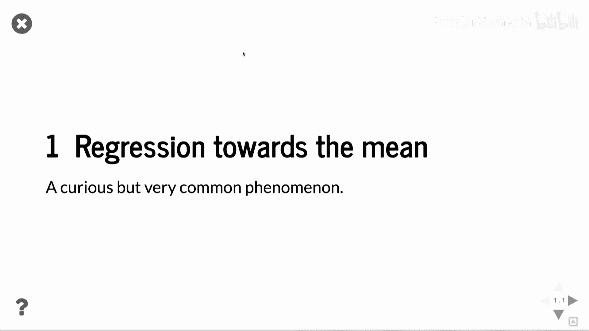
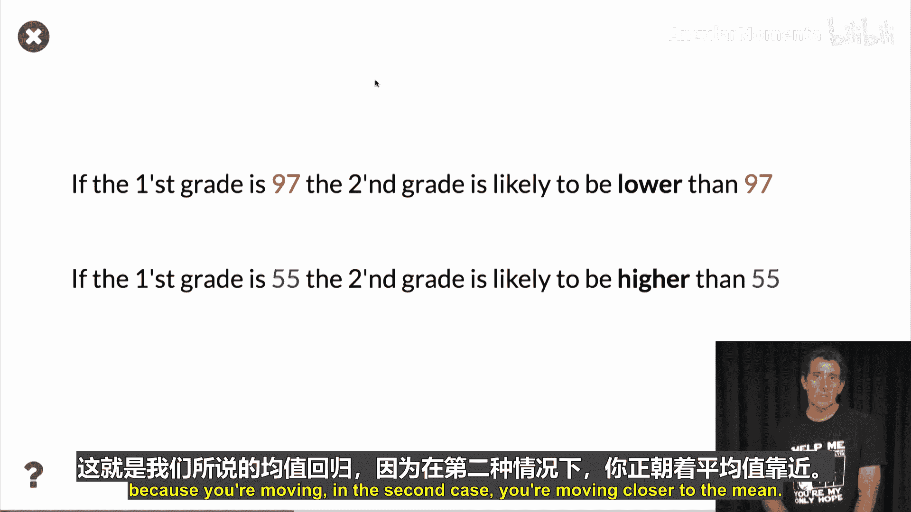
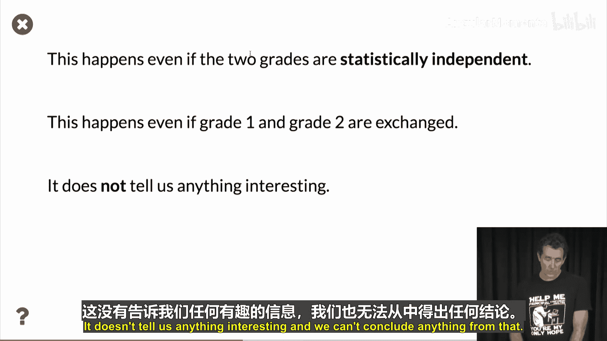
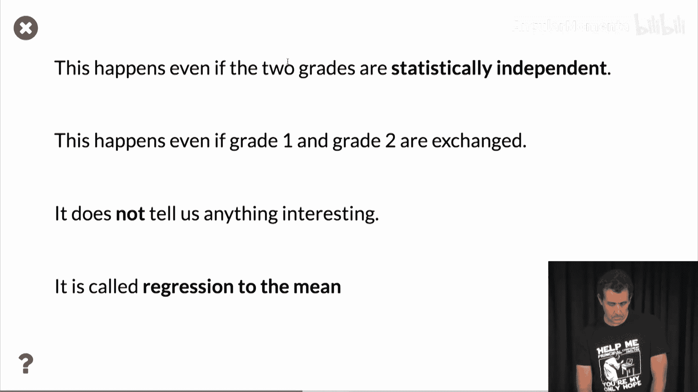
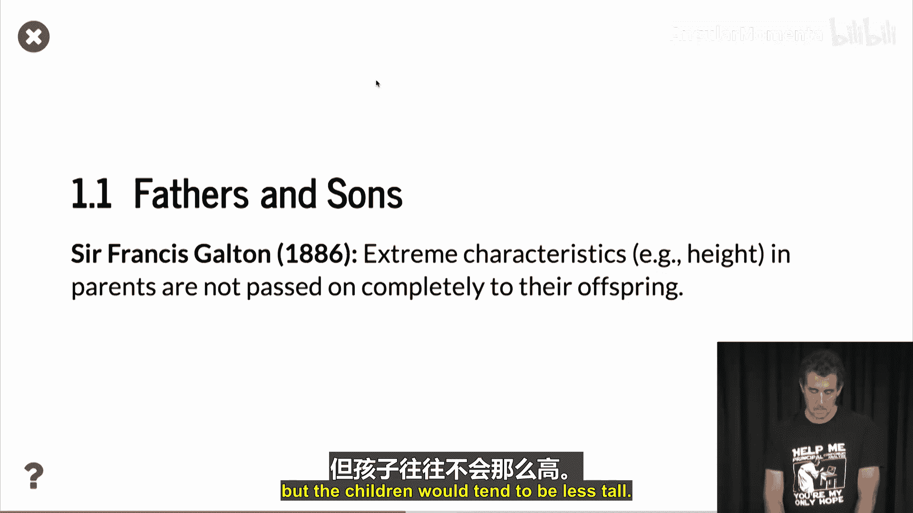
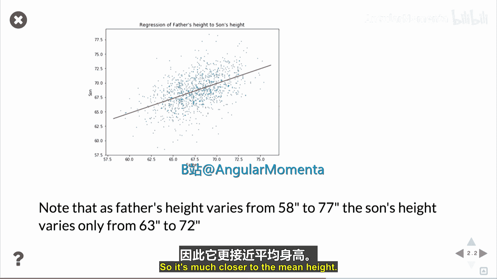
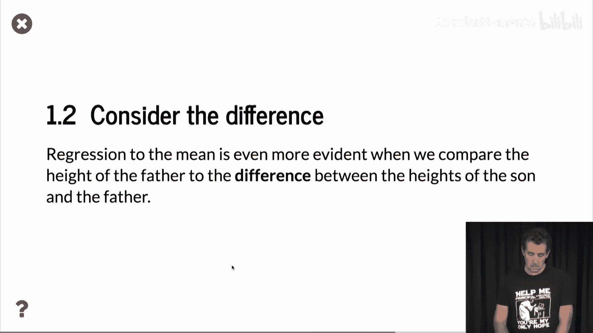
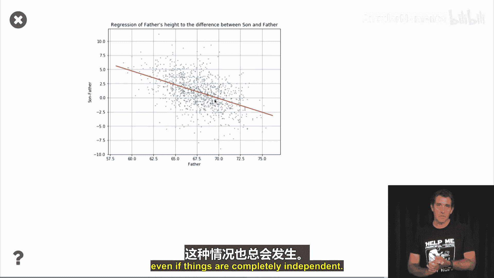
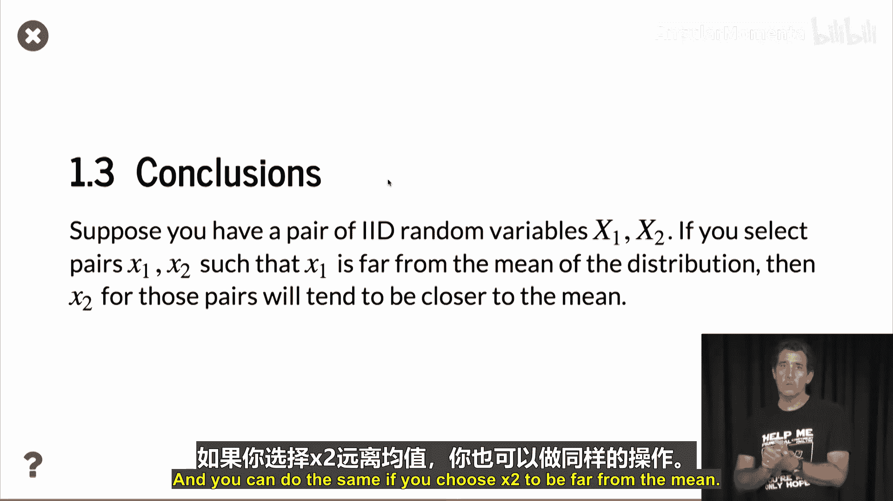

# 060：均值回归 📉

在本节课中，我们将要学习一个统计学中既有趣又令人好奇的现象——均值回归。这个现象揭示了统计结果有时会与直觉相悖，并且非常普遍，因此值得深入了解。

## 什么是均值回归？ 🤔

均值回归描述了一种现象：当某个变量的极端观测值出现后，其后续的观测值往往会向该变量的平均值靠拢。

为了理解这个概念，我们来看一个例子。假设学生们在两个时间点参加同一标准化考试，例如在一个季度前后。他们获得两个分数，分数范围是0到100，平均分是70分。

以下是通常会发生的现象：
*   如果某个学生第一次考试得了97分（远高于平均分），那么他第二次考试的分数**很可能低于97分**。
*   反之，如果某个学生第一次考试只得了55分（远低于平均分），那么他第二次考试的分数**很可能高于55分**。

这种现象被称为“回归到均值”，因为第二次的分数在向平均值70分移动。

## 均值回归的关键特性 🔑

上一节我们介绍了均值回归的现象，本节中我们来看看它的几个关键特性，这些特性使其显得“反直觉”。

需要特别注意的是，均值回归的发生**与学生学习与否无关**。即使两次考试的分数在统计上完全独立，这种现象也会发生。

此外，这种关系是对称的。如果我们已知第二次考试得了97分，那么第一次考试的分数也倾向于低于97分。

因此，均值回归本身**并不传递任何因果信息**。它不能说明最初成绩好的学生变差了，或者最初成绩差的学生变好了。这纯粹是统计学上的现象，我们不能从中得出任何有趣的结论。

## 经典案例：身高研究 📏

均值回归的一个著名早期研究是关于父子身高的，由弗朗西斯·高尔顿爵士在1886年完成。

研究的基本结论是：父母的极端特征（例如身高）不会完全遗传给子女。你可能会认为高个子父母倾向于有高个子孩子，这没错，但这些孩子的身高往往会比父母**更接近平均身高**。

以下是用于研究的数据可视化：
*   **X轴**：父亲的身高。
*   **Y轴**：儿子的身高。

图中显示，随着父亲身高增加，儿子的身高也增加，两者存在明确关系。但观察具体数值会发现，父亲的身高范围（例如从58到77英寸）远大于对应儿子身高的范围（例如从63到72英寸）。儿子的身高更紧密地聚集在平均身高附近。

## 另一种视角：差异分析 🔍

理解均值回归的一个有效方法是观察差异，而不是绝对值。

我们可以绘制另一张图，其Y轴不再是儿子的绝对身高，而是**儿子身高与父亲身高的差值**。

在这张图中，趋势更加明显：**父亲越高，儿子身高相对于父亲的“劣势”就越大**（即差值越负）。再次强调，这与遗传限制等因素无关，纯粹是均值回归的结果，即使变量完全独立也会发生。

## 核心概念总结 📝

本节课中我们一起学习了均值回归的原理和案例。我们可以用以下公式来总结其核心概念：

假设有一对**独立同分布**的随机变量 **X1** 和 **X2**。
*   如果我们筛选出 **X1** 远高于（或低于）分布均值的样本对，那么这些样本对中的 **X2** 值将倾向于更接近均值。
*   反之亦然，如果我们筛选出 **X2** 为极端值的样本对，那么对应的 **X1** 也会更接近均值。

简而言之，当基于一个变量的极端值进行筛选时，另一个相关联的变量会表现出向均值“回归”的趋势。

---
**下节课预告**：在下一讲中，我们将探讨主成分分析。