# 061：主成分分析 📊

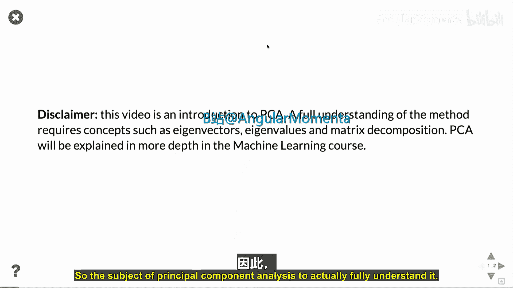

在本节课中，我们将学习回归主题的最后一个重要概念——主成分分析。我们将探讨其基本思想、与线性回归的区别，以及它在数据标准化和降维中的应用。

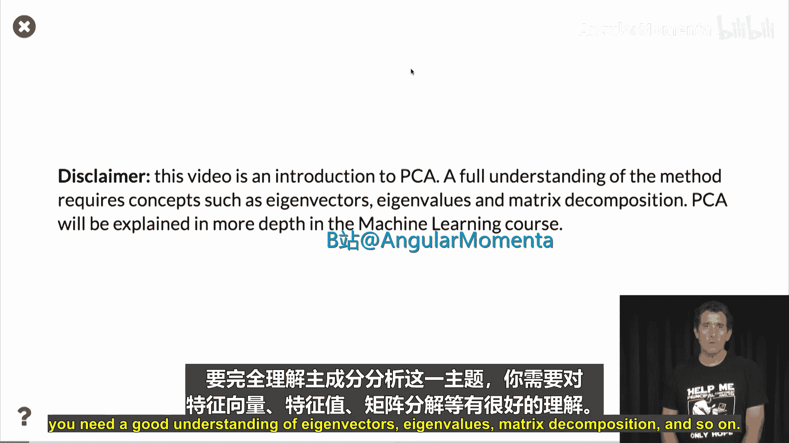

---

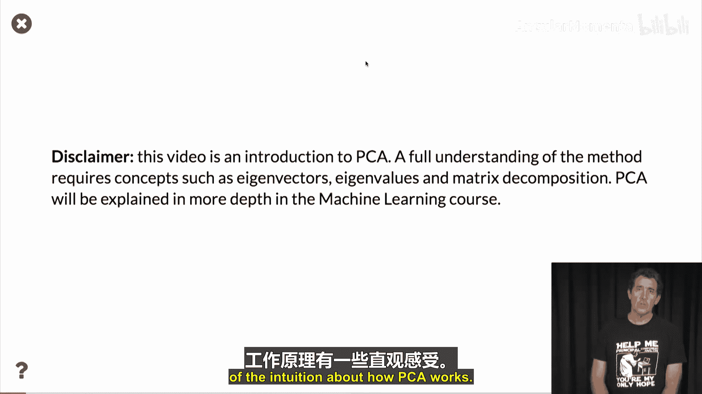

## 线性回归回顾 📈

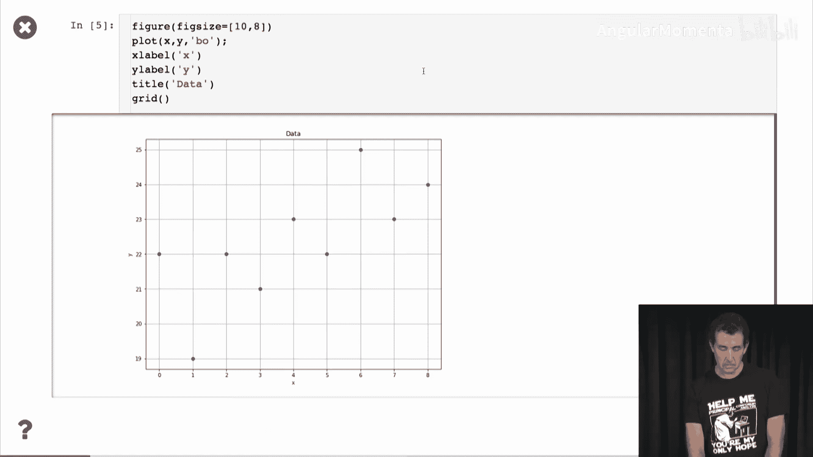

上一节我们介绍了线性回归。本节中我们来看看一个简单的例子。

假设平面上有九个点。这些点并不完全在一条直线上，但整体趋势是从左到右向上延伸。也就是说，y值倾向于随着x的增加而增加。

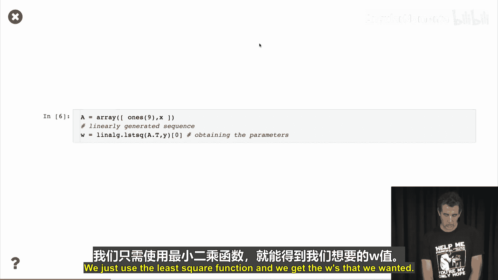

我们希望找到一条直线来拟合这些数据。这条直线的公式为：
`y = w0 + w1 * x`
我们的目标是找到参数 `w0` 和 `w1`。

使用NumPy的最小二乘法函数可以轻松计算出这些参数。当我们绘制出这条回归线时，可以看到每个数据点到直线的垂直距离（误差）。线性回归的目标就是最小化这些垂直误差的平方和。

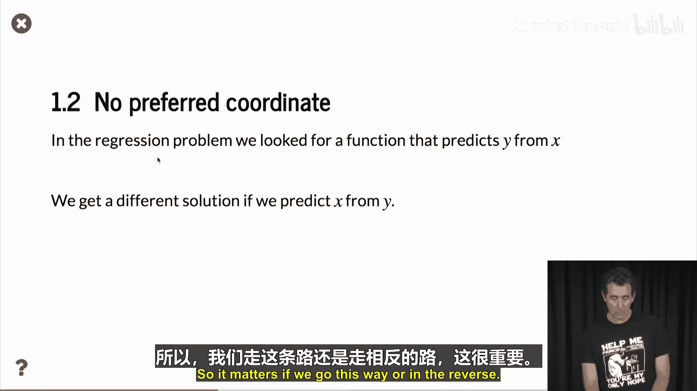

在回归问题中，我们试图用x预测y。如果我们反过来，尝试用y预测x，会得到一条不同的直线。因此，预测的方向很重要。

---

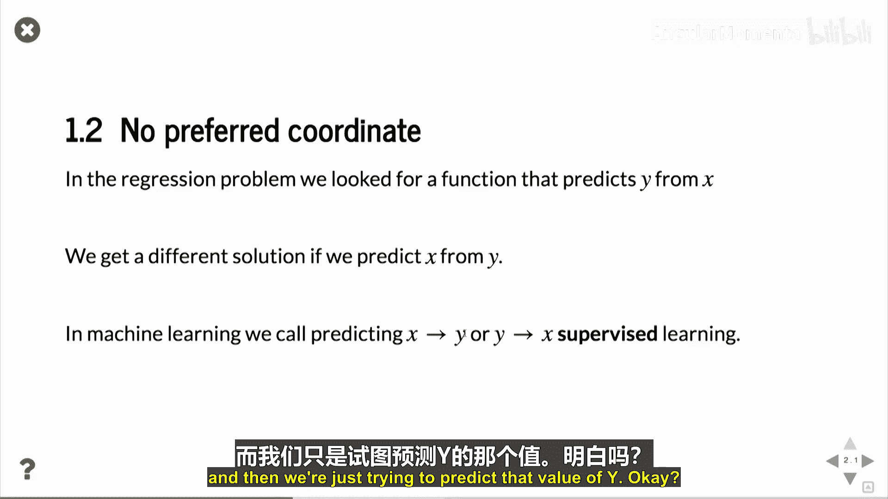

## 从监督学习到无监督学习 🔄

通常，这类预测问题在机器学习中被称为**监督学习**。之所以称为“监督”，是因为我们试图预测的输出值y是由“监督者”（即已知正确答案的数据）提供的。

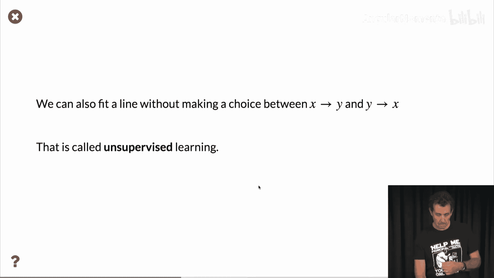

然而，我们也可以在不指定预测方向的情况下拟合一条直线。这种方法不关心我们选择x还是y作为预测目标，甚至不关心坐标系如何旋转。这被称为**无监督学习**，因为我们只是给定数据，没有指定任何特定的预测目标。

---

## 主成分分析介绍 🎯

如果我们想使用平方误差进行无监督的线性拟合，这种方法就叫做**主成分分析**。

主成分分析和回归都最小化相同的损失函数——均方根误差，但两者对“误差”的定义不同。

以下是两者的关键区别：
*   回归线（黑色）的误差是数据点到直线的**垂直距离**（绿色线段）。
*   PCA线（红色）的误差是数据点到直线的**正交（垂直）距离**（蓝色线段）。

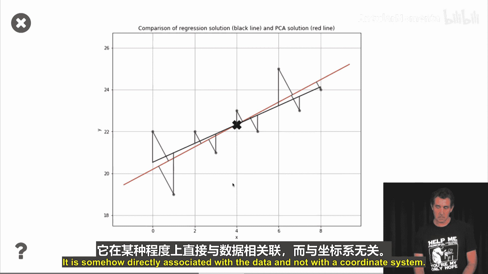

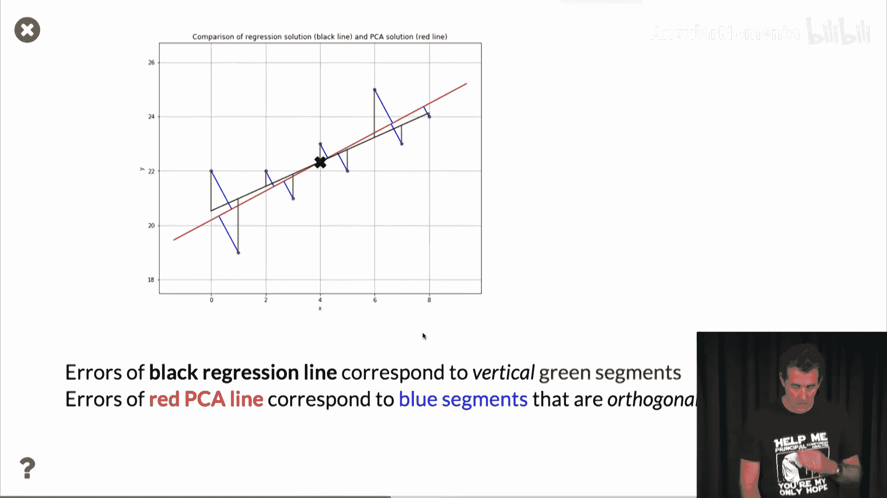

当我们最小化正交误差时，得到的红线与回归的黑线不同。更重要的是，如果我们旋转坐标系，回归的结果会改变，但PCA的结果不会改变。PCA的结果直接与数据本身相关，而与坐标系的选择无关。

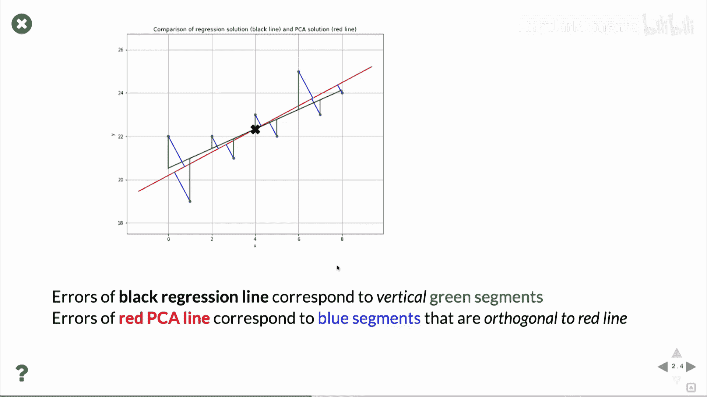

---

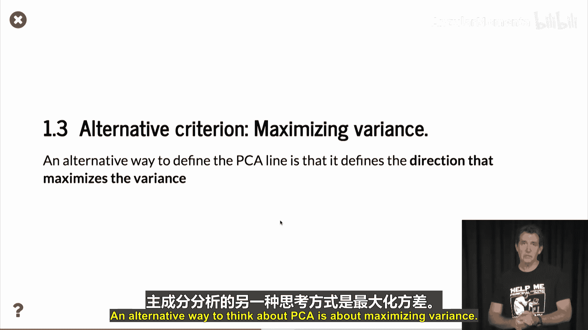

## 理解PCA：方差最大化视角 📐

理解PCA的另一种方式是**最大化方差**。

假设我们有一组向量 `x1` 到 `xn`。我们取一个单位向量 `U`（长度为1），计算每个向量与 `U` 的点积，得到一个数值。我们可以计算这些数值的均值和方差，我们特别关注**方差**，它反映了数据在这个投影方向上的分散程度。

例如，沿着红色方向投影，数据点离均值较远，方差大。沿着与之垂直的方向投影，数据点更聚集，方差小。

如果我们考虑所有可能的方向（在二维情况下就是0到360度），为每个方向计算标准差（方差的平方根），并以该距离在方向上标出一个点，所有这些点的集合会形成一个**椭圆**。

这个椭圆的长轴方向对应**最大方差**的方向，这就是PCA的**第一主成分（特征向量）**。椭圆的短轴方向对应**最小方差**的方向，即与第一主成分正交的**第二主成分**。

这种方法的美妙之处在于它不限于二维，可以推广到高维。第一主成分是方差最大的方向，第二主成分是在与第一主成分正交的前提下方差最大的方向，依此类推。这描述了一个高维空间中的椭球体，它代表了数据的分布。

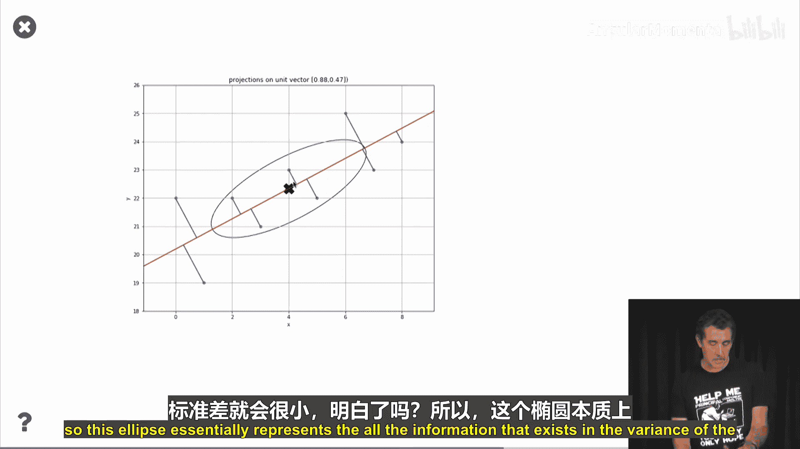

---

## PCA的实际应用示例 👥

让我们看一个二维的真实例子。我们回到包含25，000人身高和体重的数据集。

以下是PCA分析的第一主成分方向。这是将数据投影上去时，能获得**最高方差**的方向。直观来看，数据在这个方向上分布得最广。

---

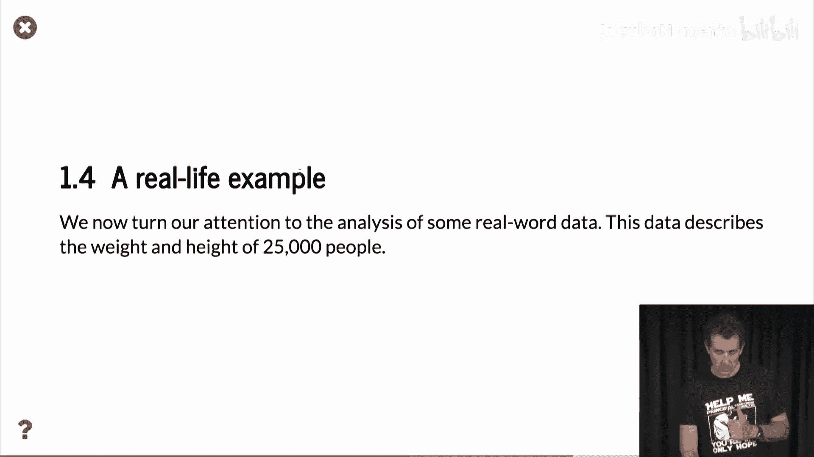

## 使用PCA进行数据标准化 ⚙️

这种看待PCA的方式提供了一种常见的数据标准化方法。标准化数据非常有用，因为它将数据的部分变化归入特定参数，便于后续研究。

以下是使用PCA标准化数据的步骤：
1.  **减去均值**：通过减去均值，使新数据的均值为零。
2.  **旋转数据**：将数据旋转，使得新坐标轴的方向就是特征向量（主成分）的方向。

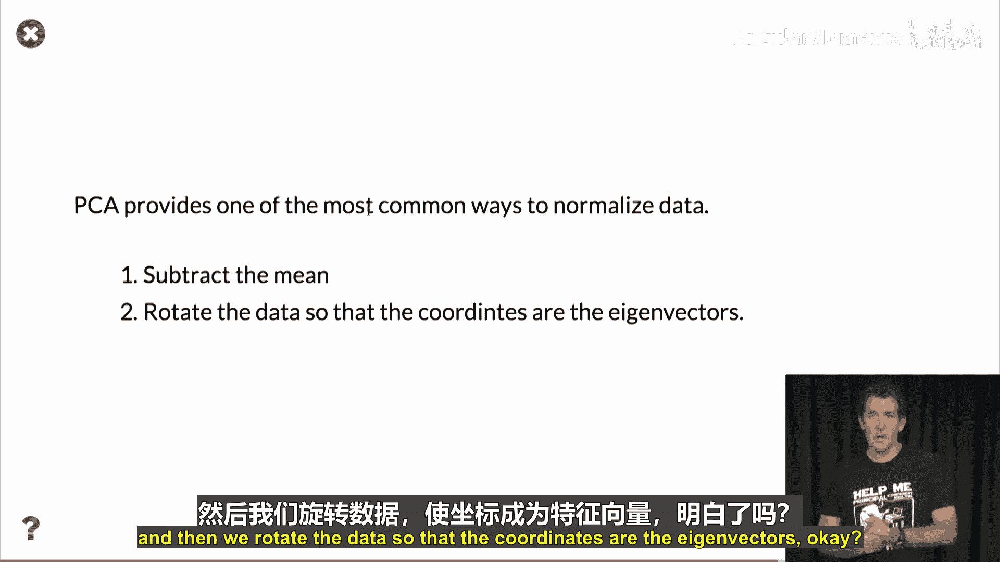

具体过程如下：原始数据的均值在某个位置，减去均值后，均值变为(0， 0)。然后旋转数据，使得最大方差方向沿着新x轴，较小方差方向沿着新y轴。这种做法非常普遍。

---

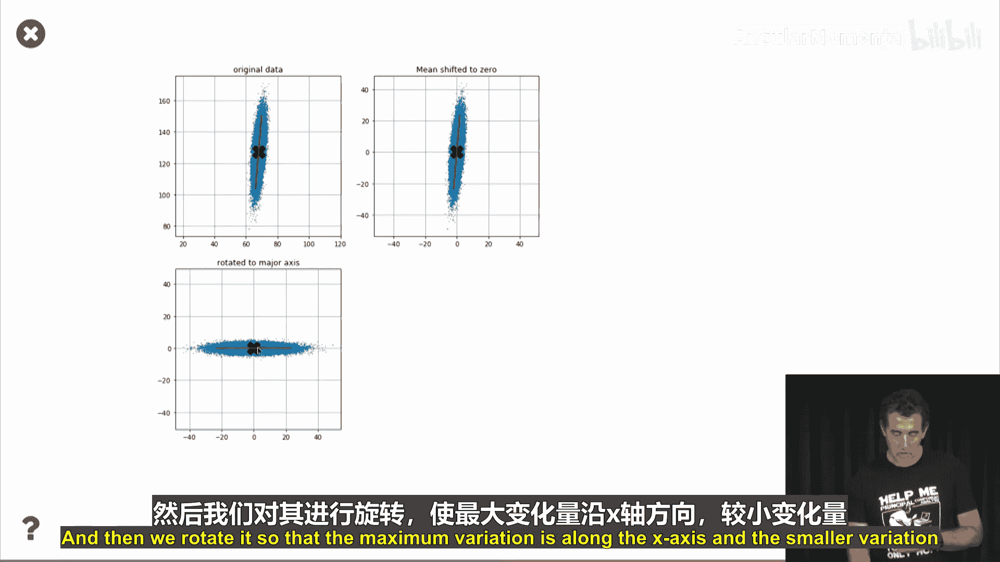

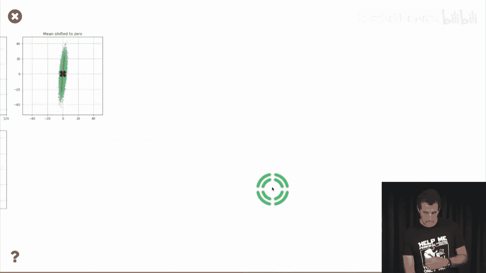

## PCA在计算机视觉中的应用示例 👁️

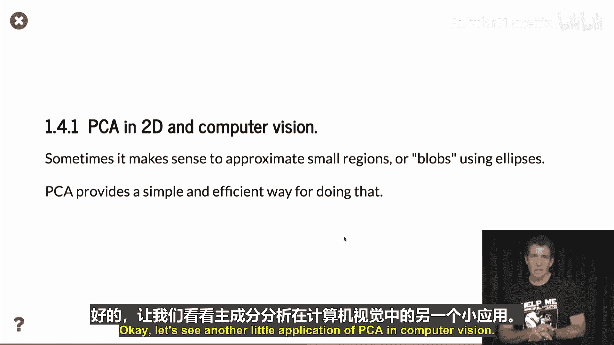

让我们看看PCA在计算机视觉中的一个小应用。

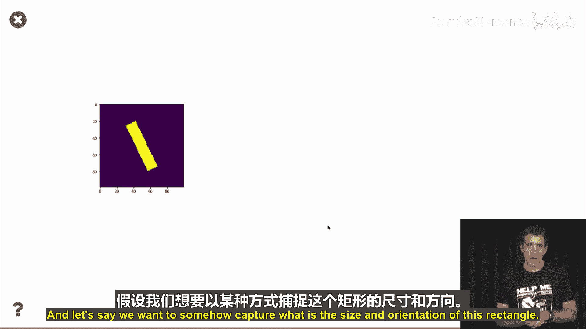

假设图像中有一个矩形斑点。我们想捕捉这个矩形的大小和方向。

我们可以将这个问题映射到PCA上：图像中所有属于该斑点的像素点（蓝色点）就是我们的数据。进行PCA分析后，我们发现特征向量基本沿着矩形的长轴方向，其标准差（或相关度量）反映了斑点在这个方向上的大小（延伸程度）。这种方法适用于任何形状。

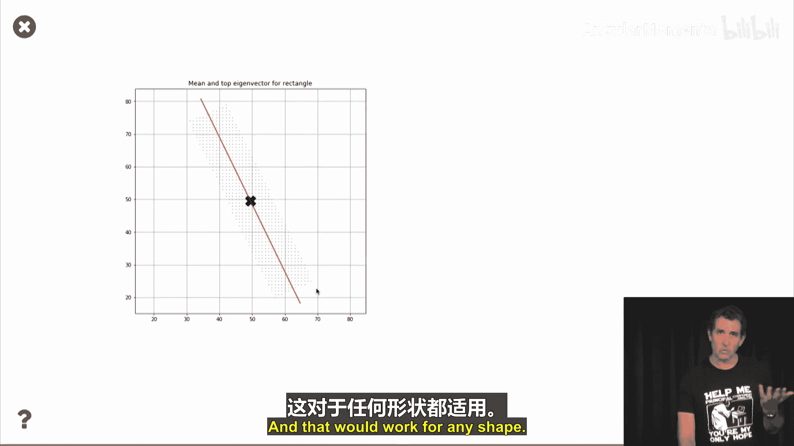

---

## 总结 📝

本节课中我们一起学习了主成分分析与回归。

*   两者都是通过最小化均方根误差来建模数据的方法。
*   **回归是监督方法**，你必须选择要预测的目标变量。
*   **主成分分析是无监督方法**。无监督方法通常在获得原始数据后使用，用于总结数据或降低其维度，以便更有效地进行后续的监督学习任务。
*   两种方法都基于线性代数，因此是非常高效的方法，远比依赖梯度下降等方法高效。

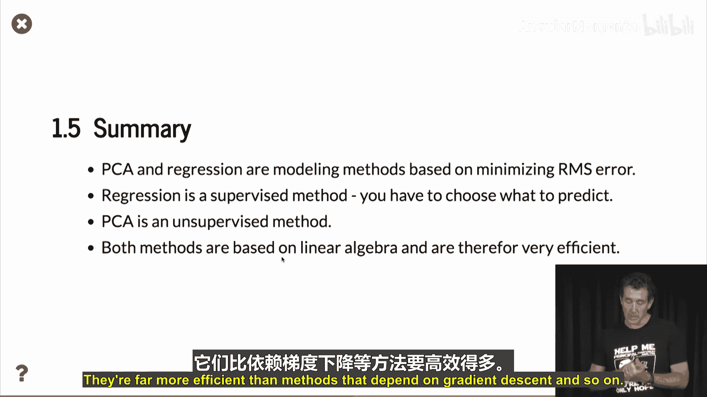

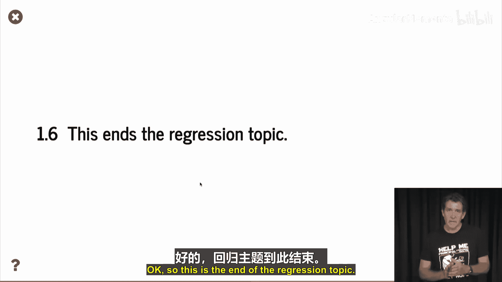

这就是回归主题的结束。希望你觉得它很有趣。我们下周继续。