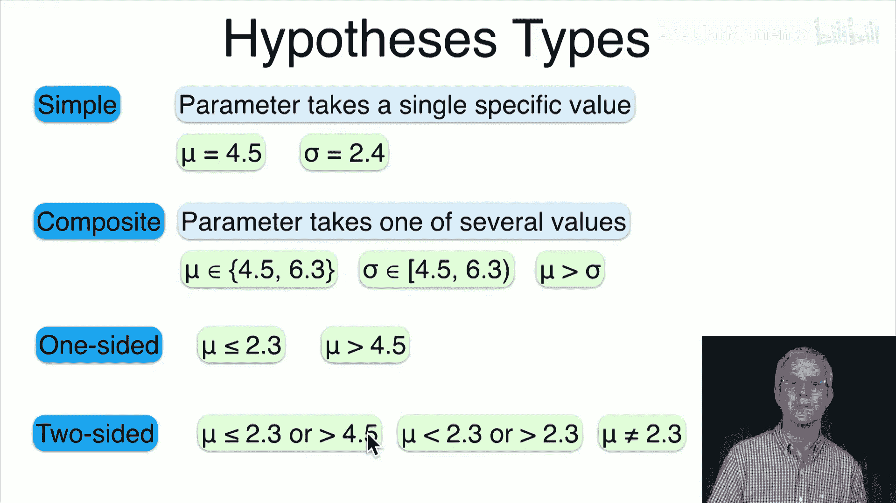
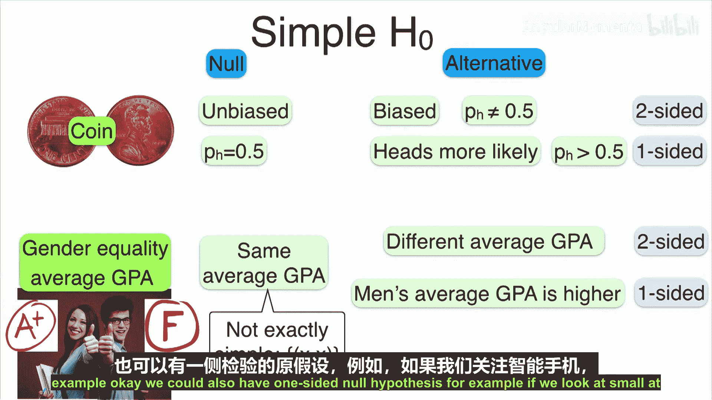
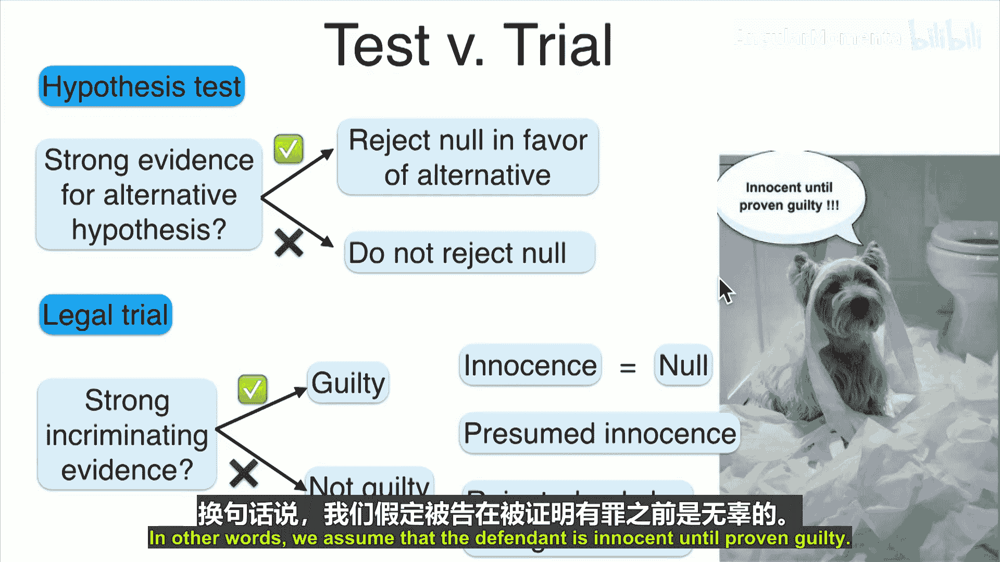
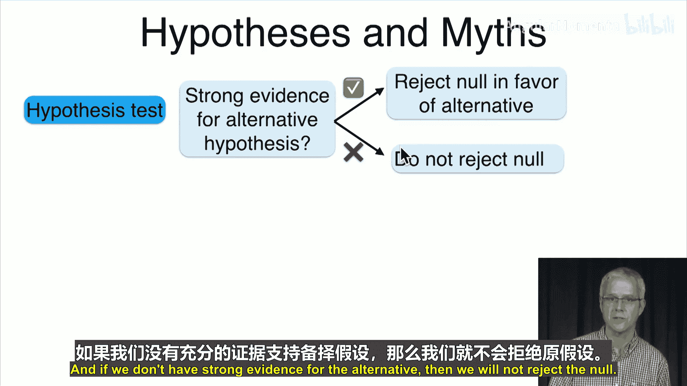
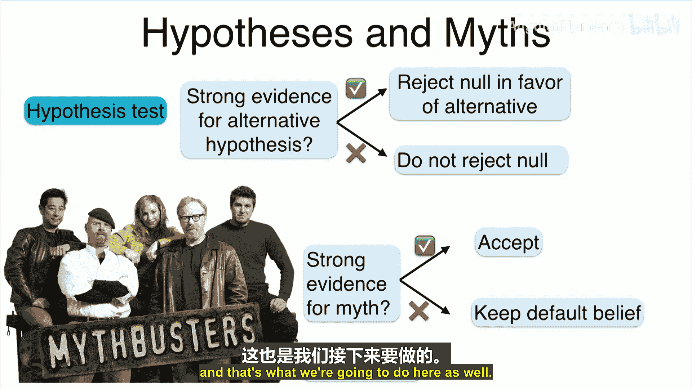
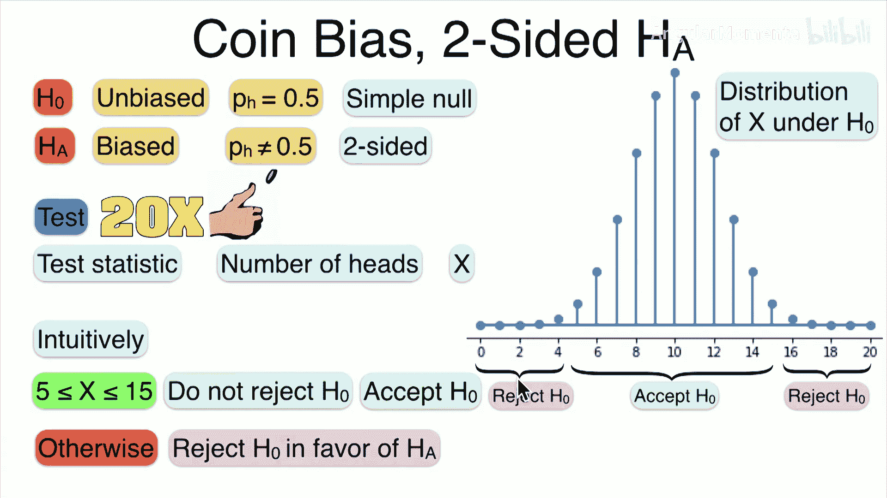

# 062：假设检验 🧪

## 概述
在本节课中，我们将要学习假设检验。假设检验是统计学中用于判断关于总体参数的某个假设是否成立的重要方法。我们将介绍假设的基本概念、类型，以及如何进行检验。

## 从参数估计到假设检验
上一节我们介绍了置信区间，它为我们提供了参数可能取值的一个范围。本节中，我们来看看假设检验。假设检验与参数估计不同，它旨在检验关于参数的某个具体陈述（即假设）是否成立。我们可以将假设检验看作是“流言终结者”的科学方法，只不过我们称之为假设检验。

## 什么是假设？
假设是关于参数的陈述或假设。参数可以是某个分布的参数（例如正态分布的均值），也可以是总体的某个特征（例如人口的平均收入）。

以下是几个假设的例子：
*   一枚硬币是有偏的，即正面朝上的概率 **p ≠ 0.5**。
*   入门课程的平均绩点 **μ = 3.0**。
*   亚马逊的平均送货时间 **t ≤ 2** 天。
*   男性平均每天玩电子游戏的时间 **t_men > t_women**。

## 假设的类型
假设可以分为简单假设和复合假设。

### 简单假设
简单假设为参数指定一个**单一、具体的值**。
*   例如：均值 **μ = 4.5**，或标准差 **σ = 2.4**。

### 复合假设
复合假设允许参数在**多个值或一个范围内**取值。
*   例如：均值 **μ = 4.5 或 μ = 6.3**。
*   例如：标准差 **4.5 ≤ σ ≤ 6.3**。
*   例如：均值大于标准差 **μ > σ**。

复合假设还可以进一步分为单侧假设和双侧假设。

**单侧假设**：参数位于某个给定值的一侧。
*   例如：均值 **μ ≤ 2.3** 或 **μ > 4.5**。

**双侧假设**：参数不等于某个给定值。
*   例如：均值 **μ ≠ 2.3**。

## 零假设与备择假设
在假设检验中，我们通常会设定两个对立的假设。

**零假设 (H₀)**：通常代表现状、默认的或被广泛接受的观点。我们倾向于认为它是真的，除非有强有力的证据反驳它。
*   例如：地球是圆的。

**备择假设 (H₁ 或 Hₐ)**：代表我们希望验证或研究的新观点，通常是零假设的补充或对立面。
*   例如：地球是平的。

以下是几个例子：

**例1：硬币公平性（简单零假设）**
*   **H₀**: 硬币是公平的，即 **p = 0.5**。
*   **H₁ (双侧)**: 硬币是有偏的，即 **p ≠ 0.5**。
*   **H₁ (单侧)**: 硬币偏向正面，即 **p > 0.5**。

**例2：性别与平均绩点**
*   **H₀**: 男性和女性的平均绩点相同，即 **μ_men = μ_women**。
*   **H₁ (双侧)**: 男性和女性的平均绩点不同，即 **μ_men ≠ μ_women**。
*   **H₁ (单侧)**: 男性的平均绩点高于女性，即 **μ_men > μ_women**。

**例3：智能手机市场份额（单侧零假设）**
*   **H₀**: 至少60%的人使用iPhone，即 **p ≥ 0.6**。
*   **H₁**: 至多60%的人使用iPhone，即 **p ≤ 0.6**。

## 如何进行假设检验？
一旦我们提出了假设，下一步就是检验它。检验的过程类似于设计一个科学实验。

1.  **设计实验并收集数据**。
2.  **定义检验统计量 (T)**：这是一个从数据中计算出的数值，它与我们的假设相关。
3.  **确定零假设下检验统计量的分布**：我们假设 **H₀** 为真，然后计算出检验统计量 **T** 可能取值的概率分布。
4.  **根据观测数据计算检验统计量的实际值 (t)**。
5.  **做出决策**：
    *   如果观测到的结果 **t** 在 **H₀** 下发生的**概率很大**，则数据与 **H₀** 一致，我们**不拒绝零假设**。
    *   如果观测到的结果 **t** 在 **H₀** 下发生的**概率很小**，并且更符合 **H₁**，则数据与 **H₀** 不一致，我们**拒绝零假设，支持备择假设**。

这个过程的核心思想是**保守性**：我们只在证据非常有力时，才拒绝零假设（现状）。这类似于司法系统中的“无罪推定”：被告在被证明有罪之前被视为无罪。

## 直观示例
让我们通过两个简单的硬币实验来直观理解这个过程。

### 示例1：单侧备择假设
*   **H₀**: 硬币公平，**p = 0.5**。
*   **H₁**: 硬币偏向正面，**p > 0.5**。

**实验**：抛掷硬币20次。
**检验统计量 (T)**：正面朝上的次数 **X**。
在 **H₀** 下，**X** 服从二项分布 `X ~ Binomial(n=20, p=0.5)`。

**决策的直观想法**：
*   如果正面次数 **X** 很大（例如 ≥ 16），这在公平硬币下概率很小，但在 **p > 0.5** 下概率更大。因此，我们可能**拒绝 H₀**。
*   如果正面次数 **X** 较小（例如 ≤ 15），我们**不拒绝 H₀**。

### 示例2：双侧备择假设
*   **H₀**: 硬币公平，**p = 0.5**。
*   **H₁**: 硬币有偏，**p ≠ 0.5**。

**实验与统计量**：同上。

**决策的直观想法**：
*   如果正面次数 **X** 接近10（例如在5到15之间），这与公平硬币的预期相符，我们**不拒绝 H₀**。
*   如果正面次数 **X** 非常小（例如 ≤ 4）或非常大（例如 ≥ 16），这在公平硬币下概率很小，我们**拒绝 H₀**，认为硬币有偏（可能是正面多或反面多）。

## 总结
本节课中我们一起学习了假设检验的基础知识。我们介绍了假设的概念及其类型（简单/复合，单侧/双侧），明确了零假设与备择假设的角色。我们了解了假设检验的基本流程：提出假设、设计实验、定义检验统计量、并在零假设下评估观测数据的可能性。通过硬币实验的直观示例，我们初步体会了如何根据数据做出“拒绝”或“不拒绝”零假设的决策。下一讲，我们将进一步形式化这个过程，并介绍一个关键概念——P值。