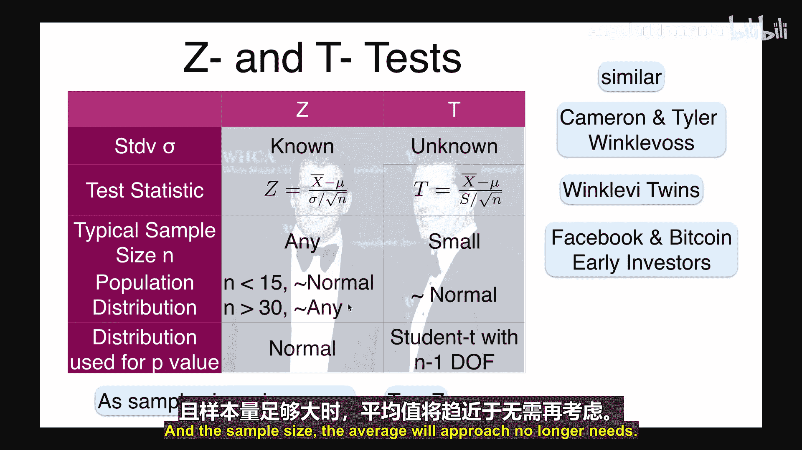

# 063：假设检验 - Z检验与T检验（第一部分）


## 概述

在本节课中，我们将学习两种重要的假设检验方法：Z检验和T检验。这两种方法适用于数据分布为正态或近似正态的情况。我们将探讨它们的使用场景、计算步骤，并通过具体示例来理解如何应用它们。

## 正态分布与中心极限定理回顾

上一节我们讨论了经典的假设检验。本节中，我们来看看当数据分布为正态或近似正态时，如何进行假设检验。这需要回顾中心极限定理。

中心极限定理指出，如果我们从任意分布（均值为 μ，标准差为 σ）中独立抽取 n 个样本，那么当 n 足够大（通常 n ≥ 30）时，样本均值 `x̄` 的分布将近似于正态分布。

具体公式如下：
*   样本均值：`x̄ = (Σx_i) / n`
*   样本均值的期望：`E(x̄) = μ`
*   样本均值的方差：`Var(x̄) = σ² / n`
*   样本均值的标准差：`σ_x̄ = σ / √n`

为了标准化，我们构造一个统计量 Z：
`Z = (x̄ - μ) / (σ / √n)`
这个统计量将近似服从标准正态分布（均值为0，方差为1）。请注意，这个公式要求我们知道总体的标准差 σ。

## Z检验：已知标准差的情况

当总体标准差 σ 已知，且样本量足够大或数据本身近似正态时，我们可以使用Z检验来检验关于总体均值 μ 的假设。

一个典型的应用场景是：我们有一个未知总体，但出于某些原因（例如，已知测量仪器的精度），我们知道其标准差 σ。零假设 `H₀` 可能设定总体均值为某个特定值（例如 μ = 5），备择假设 `H₁` 则可能设定均值大于、小于或不等于该值。

以下是进行Z检验的步骤：

1.  **设定假设与显著性水平**：确定零假设 `H₀`（如 μ = μ₀）和备择假设 `H₁`（如 μ > μ₀, μ < μ₀, 或 μ ≠ μ₀）。选择显著性水平 α（通常为 5% 或 1%）。
2.  **计算检验统计量**：根据样本数据计算 Z 值：`Z = (x̄ - μ₀) / (σ / √n)`。
3.  **做出决策**：比较计算出的 Z 值与临界值 `Z_α`，或计算 P 值。
    *   **临界值法**：对于给定的 α，找到标准正态分布上的临界值 `Z_α`（例如，α=0.05 的单侧检验，`Z_α ≈ 1.645`）。如果计算出的 Z 值超过 `Z_α`（对于右侧检验），则拒绝零假设。
    *   **P值法**：P 值是在零假设成立的前提下，观察到当前样本结果或更极端结果的概率。对于右侧检验，`P = P(Z ≥ z_observed)`。如果 `P < α`，则拒绝零假设。


根据备择假设的形式，检验可以分为以下三种类型：

*   **右侧检验（单尾）**：
    *   `H₀: μ = μ₀`， `H₁: μ > μ₀`
    *   P 值 = `P(Z ≥ z_observed)`
*   **左侧检验（单尾）**：
    *   `H₀: μ = μ₀`， `H₁: μ < μ₀`
    *   P 值 = `P(Z ≤ z_observed)`
*   **双侧检验（双尾）**：
    *   `H₀: μ = μ₀`， `H₁: μ ≠ μ₀`
    *   P 值 = `P(|Z| ≥ |z_observed|) = 2 * P(Z ≥ |z_observed|)`


## Z检验示例：巧克力中的可可含量


**（声明：以下数据仅用于演示目的）**

假设Trader Joe's出售一种黑巧克力棒，声称含有85克可可。我们怀疑其实际含量少于85克。

*   **零假设 H₀**：平均可可含量为 85 克。
*   **备择假设 H₁**：平均可可含量 **小于** 85 克。
*   **显著性水平 α**：5%。
*   **已知信息**：假设我们已知每块巧克力棒可可含量的标准差 σ = 0.5 克。
*   **样本**：我们购买了 n = 30 块巧克力并测量，得到样本平均含量 `x̄ = 84.83` 克。

**计算检验统计量 Z：**
`Z = (84.83 - 85) / (0.5 / √30) ≈ -1.86`

**计算 P 值（左侧检验）：**
P 值是标准正态随机变量小于 -1.86 的概率。
```python
from scipy.stats import norm
p_value = norm.cdf(-1.86) # 计算累积分布函数在-1.86的值
print(p_value) # 输出约为 0.0314，即 3.14%
```
由于 P 值 (3.14%) < α (5%)，我们拒绝零假设，接受备择假设。有证据表明平均可可含量可能低于85克。

**如果进行双侧检验呢？**
*   `H₀`: μ = 85 克， `H₁`: μ ≠ 85 克。
*   使用相同的 Z = -1.86。
*   P 值 = `P(|Z| ≥ 1.86) = 2 * P(Z ≥ 1.86) = 2 * (1 - norm.cdf(1.86)) ≈ 2 * 0.0314 = 0.0628` (6.28%)。
*   由于 P 值 (6.28%) > α (5%)，我们无法拒绝零假设。

这个例子展示了**相同的Z值，在不同的备择假设下可能导致不同的结论**。单侧检验的拒绝域更集中，因此有时更敏感。

## T检验：未知标准差的情况

在现实中，我们通常不知道总体标准差 σ。这时，我们需要使用T检验。它由威廉·戈塞特（笔名“Student”）提出。

当我们从正态总体（均值为 μ，标准差 σ 未知）中抽取样本时，可以定义以下统计量：
`t = (x̄ - μ₀) / (s / √n)`
其中，`s` 是样本标准差：`s = √[ Σ(x_i - x̄)² / (n-1) ]`。

在零假设成立且数据来自正态总体（或近似正态）的前提下，这个统计量 `t` 服从**自由度为 `n-1` 的 t 分布**。

T检验的步骤与Z检验类似，只是用于计算P值的分布从标准正态分布换成了t分布。

## T检验示例：特斯拉加速时间

假设特斯拉声称Model X从0加速到60英里/小时的平均时间 **不超过4秒**。我们想检验这个说法。

*   **零假设 H₀**：平均加速时间 ≤ 4 秒。
*   **备择假设 H₁**：平均加速时间 > 4 秒。
*   **显著性水平 α**：5%。
*   **假设**：加速时间大致服从正态分布，且标准差 σ 未知。
*   **样本**：我们进行了 n = 8 次测试，得到时间（秒）为：[4.1, 4.0, 4.3, 4.2, 4.1, 4.0, 4.2, 4.1]。


**计算样本统计量：**
```python
import numpy as np
sample = np.array([4.1, 4.0, 4.3, 4.2, 4.1, 4.0, 4.2, 4.1])
x_bar = np.mean(sample) # 4.125
s = np.std(sample, ddof=1) # 0.097 (样本标准差，使用 ddof=1 进行无偏估计)
n = len(sample) # 8
```
**计算检验统计量 t：**
`t = (4.125 - 4) / (0.097 / √8) ≈ 1.1206`


**计算 P 值（右侧检验，自由度为 n-1=7）：**
P 值是自由度为7的t分布中，大于1.1206的概率。
```python
from scipy.stats import t
p_value = 1 - t.cdf(1.1206, df=7)
print(p_value) # 输出约为 0.149，即 14.9%
```
由于 P 值 (14.9%) > α (5%)，我们无法拒绝零假设。没有足够的证据反驳特斯拉“平均加速时间不超过4秒”的说法。

## Z检验与T检验的比较与总结

本节课中，我们一起学习了Z检验和T检验。它们就像一对“双胞胎”，核心区别在于是否已知总体标准差。

以下是它们的核心对比：

| 特征 | Z检验 | T检验 |
| :--- | :--- | :--- |
| **标准差** | 总体标准差 **σ 已知** | 总体标准差 **σ 未知**，使用样本标准差 `s` 估计 |
| **检验统计量** | `Z = (x̄ - μ₀) / (σ/√n)` | `t = (x̄ - μ₀) / (s/√n)` |
| **适用样本量** | 大样本 (n ≥ 30)，或小样本但总体正态且σ已知 | 小样本 (n < 30) 且总体需近似正态；大样本时也适用 |
| **所用分布** | **标准正态分布** | **t 分布** (自由度 df = n-1) |
| **关系** | 当样本量 n 很大时，t 分布接近标准正态分布，T检验结果趋近于Z检验 |

**关键要点：**
1.  **Z检验**适用于总体标准差已知的情况，或样本量非常大（n ≥ 30）时，根据中心极限定理，可以用样本标准差近似总体标准差。
2.  **T检验**更通用，适用于总体标准差未知的情况，尤其在小样本检验中占主导地位。但它要求数据本身近似正态分布。
3.  选择单侧还是双侧检验，取决于备择假设的具体形式，这会直接影响P值的计算和最终结论。
4.  P值法是现代统计中更常用的决策方式，它提供了反对零假设的证据强度的连续度量。




在下一部分，我们将继续深入探讨假设检验的其他方面。