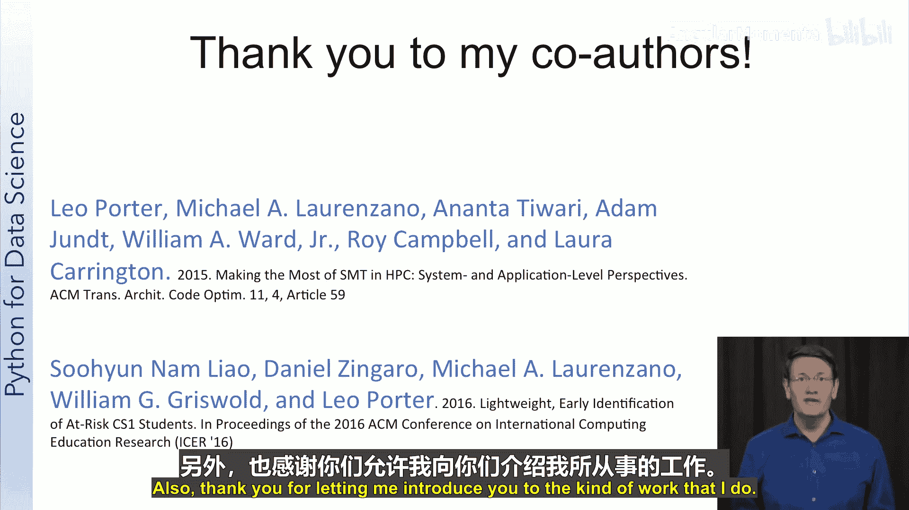
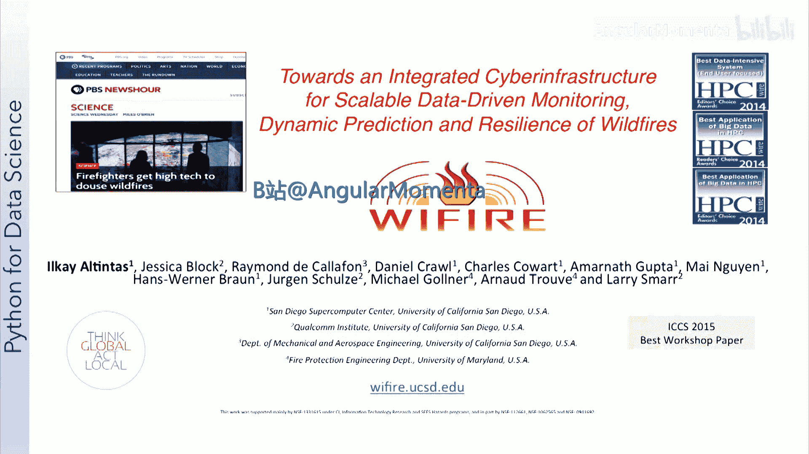

# 002：讲师介绍与数据科学应用实例

在本节课中，我们将了解本课程的两位讲师——Leo Porter和Ilkay Altintas——的背景，并通过他们分享的研究项目实例，初步认识数据科学在计算机架构和教育等领域的实际应用。

## Leo Porter：计算机科学教育研究者

上一节我们介绍了课程的基本信息，本节中我们来认识第一位讲师。我是Leo Porter，是加州大学圣地亚哥分校计算机科学与工程系的助理教授。

我的专业背景是计算机架构，这是一个专注于处理器高层设计与性能的计算机科学领域。在该领域，我的研究旨在使处理器运行更快、能效更高，或同时实现这两个目标。

目前，我将大部分时间用于研究学生如何学习计算机科学，以及如何改善他们的学习过程。我的工作主要侧重于通过采用一种名为“同伴教学”的循证教学实践来提升学生的学习成果。此外，我也致力于识别学生常见的误解，并对学生的学习成效进行有意义的评估。

在这两个研究领域中，我都运用了数据科学和机器学习的技能来指导并开展研究。以下是两个具体的例子。

**以下是来自计算机架构领域的例子：**

我们希望能够预测一个程序在具备特定架构特征的高性能计算集群上的运行情况。具体来说，我们想知道启用或禁用某个特定的硬件优化，哪个选择对运行该软件更有利。

为了解决这个问题，我们收集了大量程序的统计数据，并利用机器学习构建了一个性能预测模型。随后，我们可以将单个程序的统计数据输入该模型，模型便会输出该程序在该系统上可能表现的预测。事实证明，对于我们试图解决的这个问题，模型的预测相当准确。

**以下是来自计算机科学教育领域的例子：**

我们想探究是否可以利用数据来预测哪些学生有课程不及格的风险。在加州大学圣地亚哥分校的许多课程中，我们使用如图所示的课堂应答器（clicker）。学生在学期中使用应答器回答问题，我们想知道这些回答数据能否告诉我们谁可能面临不及格的风险。

我们拥有的数据是：每个学生整个学期的应答器回答记录，以及他们的期末考试成绩。与架构研究的例子类似，我们将这些数据输入一个旨在预测学生学习成果的机器学习模型。然后，我们取一门新课最初几周的应答器回答数据，将其输入预测模型，便能识别出哪些学生可能遇到困难。同样，该预测模型相当准确，使得教师有可能对处于风险中的学生进行干预。

对于这项工作以及之前的研究，我想强调计算机科学研究通常是一项高度协作的工作，并感谢在这些项目中的合作者们。同时，也感谢大家让我介绍我所从事的工作类型。

## Ilkay Altintas：数据科学工作流研究者

认识了Leo Porter的研究后，我们再来认识另一位讲师。大家好，我是Ilkay Altintas。和Leo一样，我想向大家介绍一下我在圣地亚哥超级计算机中心和加州大学圣地亚哥分校的工作。

你可能会想，超级计算机中心与数据科学有什么关系？让我来告诉你。正如你可能听说的，在大数据时代，数据科学正在催生许多令人兴奋的不同应用。

我是SDSC的首席数据科学官，领导我们的协作数据科学中心活动。同时，我也领导我们的研究、开发和教育部门，负责监督许多激动人心的研究项目。此外，我热衷于担任“数据科学工作流研究中心”的负责人，该中心是我自2001年加入加州大学圣地亚哥分校SDSC以来，逐步建立并专注的研究领域。

在我的一些教育活动中，我是加州大学圣地亚哥分校“数据科学与工程高级研究硕士”项目的联合主任，并在该项目中教授一门顶点项目课程。我也在计算机科学与工程系担任讲师，并作为其他在线和线下课程项目的一部分，讲授大数据相关课程。

所有这些角色的共同点是，我从事**跨学科研究**。作为我核心研究、开发和教学活动的一部分，我致力于构建方法论和工具，使大数据、数据科学和计算科学能够有效地服务于动态的、数据驱动的科学应用。在这些领域，我与加州大学圣地亚哥分校的许多中心合作。

我和同事们致力于应对科学和工程所有领域的许多重大数据科学应用挑战，包括基因组学、地理信息学、气象数据科学或智慧城市、能源管理、生物医学、个性化健康等，这些都是我们数据科学中心工作的一部分。所有这些应用的共同点是，它们以独特的方式将新的数据模式和计算研究模式结合在一起。因此，这一切都关乎**协作**。而超级计算机中心为此带来的，正是计算和数据管理的专业知识。

我日常的工作是思考如何让一群非常聪明的人协作解决数据科学挑战。我关注诸如“我们如何将数据科学方法、工具、计算与数据系统以及领域专家形成一个闭环？”等问题。这些问题也被我的研究小组转化为数据科学的研究挑战和工具箱。我们的主要目标是开发方法和工具，以在大数据和高性能计算平台上构建自动化、可操作、由工作流驱动的解决方案架构。这适用于许多科学学科。

**以下是一个我们参与的典型项目实例：**

这是一个关于野火分析的项目，分为两个主要部分：**预测**和**应急响应**。

WiFIRE是一个由美国国家科学基金会资助的协作项目，旨在构建一个用于野火监测、预测和恢复的网络基础设施。这是一个带来了非常有价值见解的研究项目。

在WiFIRE中，我们构建了一个可扩展的网络基础设施，能够利用任何高端计算、云和大数据平台，进行动态的、大数据驱动的火灾建模与预测。该方法的核心是使用实时数据来了解火灾行为和环境动态，并利用数据科学技术将我们学到的东西同化到火灾模型中，以适应随时间变化的情况。在这里，数据科学方法和工作流被用于系统集成和动态应用扩展。

所有被使用的数据、模型和计算系统在WiFIRE项目之前就已存在，但缺乏一种能够匹配应用需求的可编程系统集成方案。数据科学使得这样的计算能力能够为火灾响应、研究和规划社区所用。事实上，该系统已被一些消防部门用作态势感知工具，我们对此感到非常高兴。

WiFIRE代表了一类广泛的应用，即实时大数据可以与建模和仿真工具相结合，以实现更好的态势感知和动态决策支持。试想一下，数据科学在未来将如何帮助消防工作：许多数据流将汇聚在3D显示界面中，能够同时展示所有相关信息以及天气和火灾预测，这将是数据科学产生社会影响的绝佳应用。毋庸置疑，如果没有许多个人的协作，这一切都不可能实现，这正显示了跨学科协作对数据科学的重要性。

希望你们喜欢了解我的工作。我期待在接下来的10周里与你们分享更多令人兴奋的数据科学应用案例。

## 总结

本节课中，我们一起认识了本课程的两位讲师Leo Porter和Ilkay Altintas。通过他们分享的在**计算机架构性能预测**、**教育风险学生识别**以及**野火预测与应急响应系统**等领域的实际项目，我们看到了数据科学和机器学习技术如何解决现实世界中的复杂问题，并深刻理解了**跨学科协作**在数据科学项目中的核心价值。这些实例为我们后续深入学习Python数据科学工具和方法提供了具体的背景和动力。