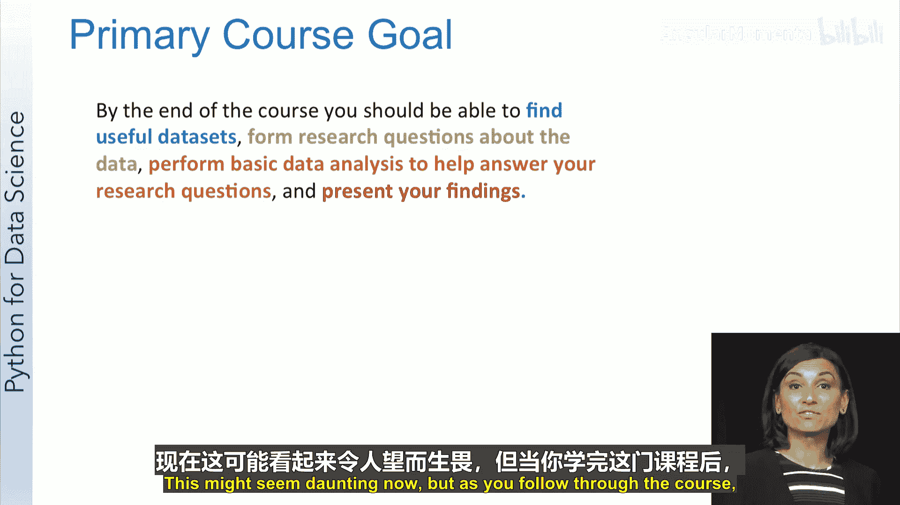
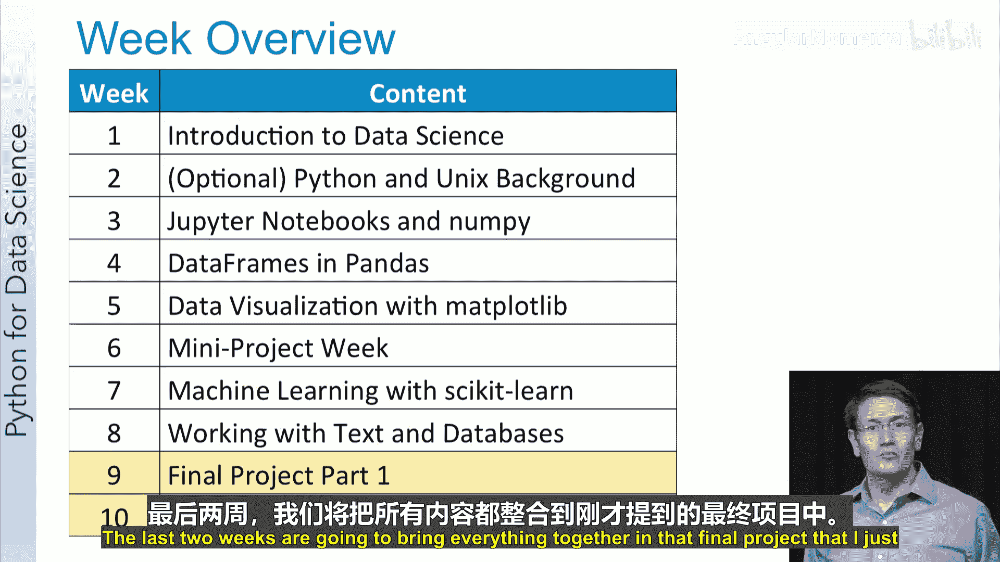
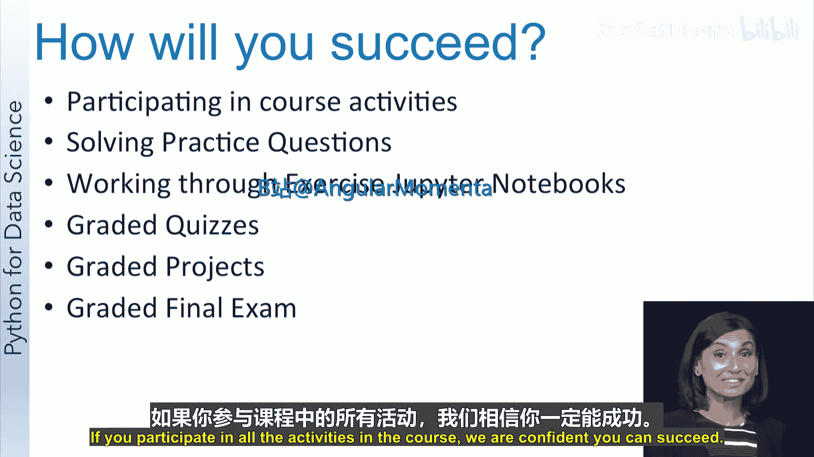
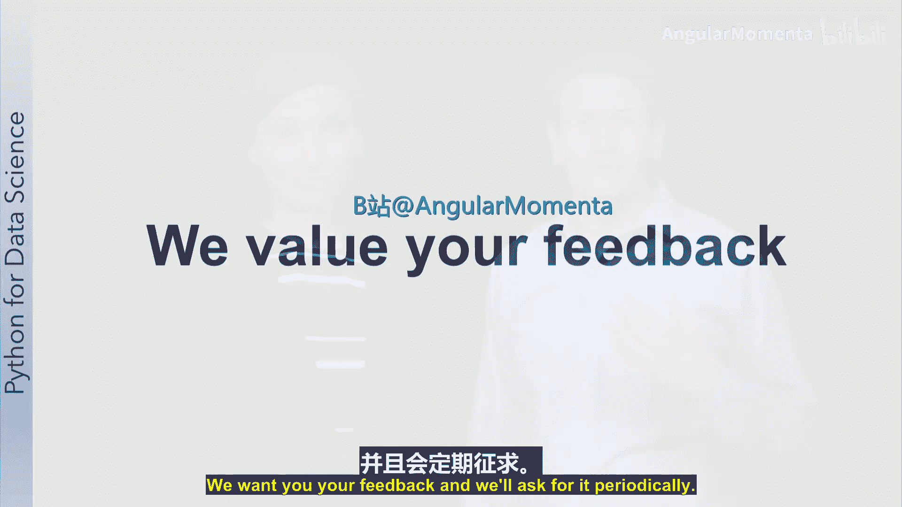
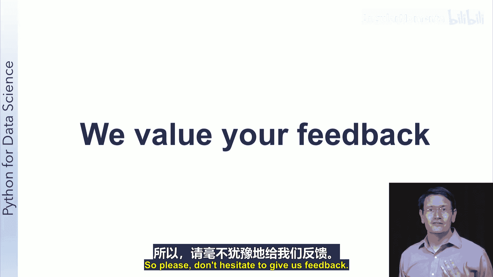

# 003：课程概览 🗺️

在本节课中，我们将为您概述这门课程的结构、目标以及帮助您成功的各项安排。

## 课程核心目标 🎯

上一节我们介绍了课程的基本信息，本节中我们来看看课程的核心目标。我们为您设定了一个主要目标，这是一个宏大的目标。

我们希望到课程结束时，您能够找到一个开放的数据集，并运用本课程所学的工具进行探索。在探索之前或探索过程中，提出一个能够通过该数据集解答的有意义的研究问题。接着，进一步探索或分析数据，以找到您的研究问题的答案。根据您的发现，您应该能够准确地呈现您的结果。

这听起来可能有些艰巨，但只要您坚持完成课程，您将为进行此类数据分析做好充分准备。事实上，您的期末项目正是要求您完成这项任务。

## 课程周度安排 📅

为了了解我们将如何帮助您做好准备，让我们看看您将在课程中做些什么。

以下是我们的周度概览：
*   **第一周**：我们将从数据科学和大数据领域的介绍开始。
*   **可选周**：如果您的背景语言不是Python，或者您对Unix系统经验不足，这一周将为您提供在课程中取得成功所需的背景知识。
*   **第二、三周**：这两周将专注于在Jupyter笔记本中使用NumPy和pandas处理和操作数据。您将能够读取数据、清理和组织数据，并探索数据。
*   **第五周**：本周全部关于数据可视化。我们将向您介绍数据可视化领域的一些核心概念，并向您展示如何使用Matplotlib在笔记本中生成可视化图表。
*   **第六周**：届时您已经掌握了许多关于如何分析数据和呈现结果的知识，因此下一步是花时间在一个小型Jupyter笔记本项目中，使用我们已经展示过的数据集，亲自进行数据分析。
*   **第七、八周**：这两周将向您介绍数据科学中更高级的主题。第一周侧重于机器学习和scikit-learn库；下一周您将深入学习处理来自网络和数据库的文本，以及使用自然语言处理工具包进行基本的自然语言处理。
*   **最后两周**：这两周将通过我刚才提到的期末项目，将所有内容整合在一起。

## 如何取得成功 🏆

了解了课程安排后，我们来看看如何确保您能顺利完成课程并取得成功。

首先，我们真诚地希望您能完成课程。我们热爱数据科学，并希望您能像我们一样学会欣赏这个领域。我们也知道你们中的许多人时间紧张。为了帮助您保持进度并取得成功，课程中安排了多种活动，包括视频、讨论和练习题。这些活动将为您完成课程提供学分，以激励您不断取得进展。

我们还想让您练习在Jupyter笔记本中工作，因此您会发现带有内置测试的练习笔记本，以帮助您获得关于代码的反馈。在大多数周结束时，您会找到一个分级测验，该测验将基于练习题和练习笔记本的内容。如果您一直在课程中取得进展，您应该能在这些测验中取得成功。但考虑到每个人偶尔都会有状态不佳的时候，您可以放弃最低分的那次测验成绩。

Leo已经谈到了项目，这些项目对于测试您的新技能至关重要。最后，当您完成了课程中的所有其他内容后，您将参加一次期末考试，以获得关于您对课程最终理解的反馈。如果您参与了课程中的所有活动，我们相信您能够取得成功。

## 反馈与支持 💬

最后还有一个关键点。我们希望得到您的反馈，并且会定期征求。我们两人都有构建在线课程的经验，我们知道课程在首次推出后总会有需要调整的地方。我们致力于解决您发现的任何问题，并在您遇到困难时为您提供所需的帮助。因此，请不要犹豫，随时给我们反馈。

## 总结 📝

本节课中我们一起学习了本课程的核心目标、详细的周度安排以及为确保您成功而设计的各种学习活动和评估方式。我们感谢您加入本课程，并请您查阅接下来的阅读材料以获取更多关于教学大纲的详细信息。