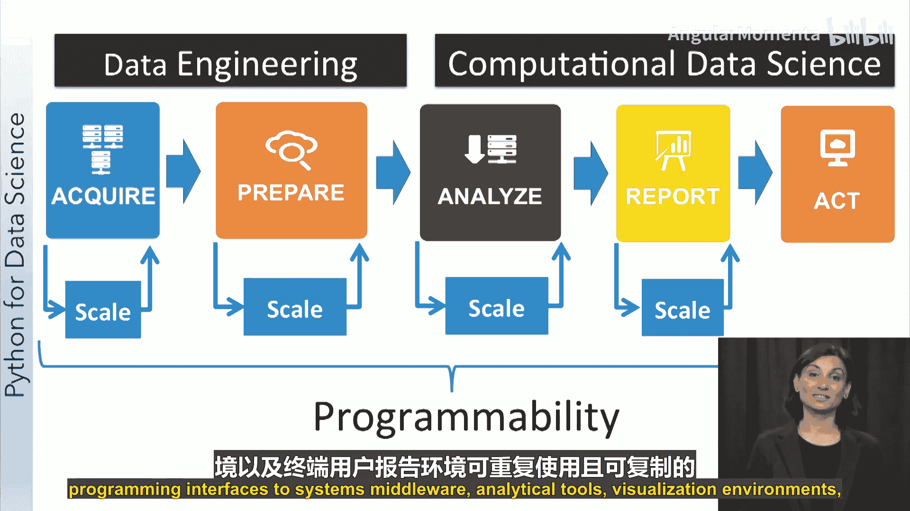
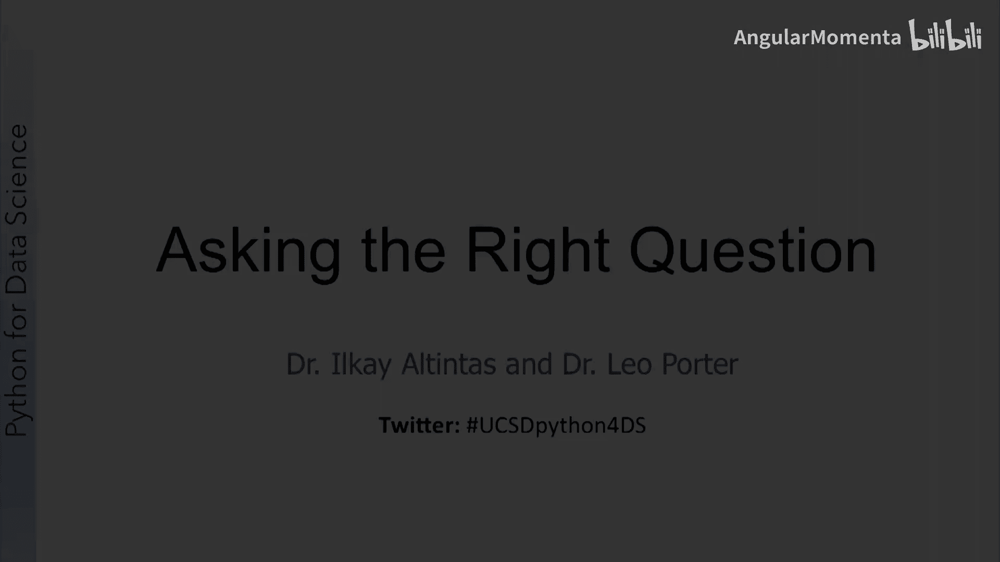
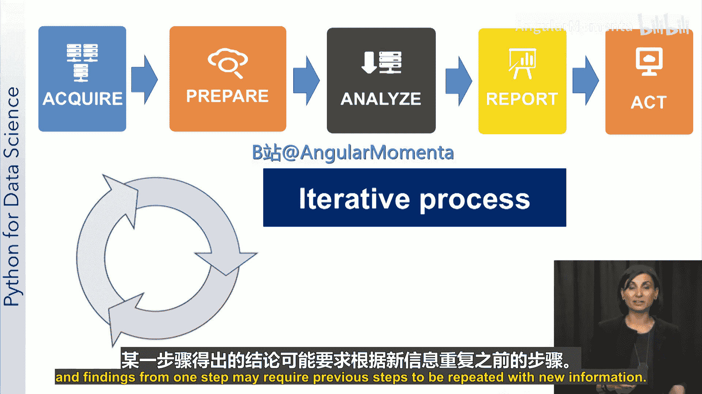

Python数据科学：P6：数据科学如何运作

在本节课中，我们将学习数据科学项目从提出问题到获得洞察的完整流程。我们将探讨数据科学的关键维度，学习如何清晰地定义问题，并详细拆解数据科学过程的五个核心步骤。

---

现在我们已经明确了数据科学的定义，让我们回到如何利用数据科学从数据中提取价值或解决问题。

数据科学过程是如何从提出问题到回答问题的？换句话说，我们能否将之前数据分析示例中看到的步骤进行归纳，看看数据科学是如何得出洞察的？

通过本视频，你将能够列举现代数据科学的一些维度，并理解分析这些维度对我们作为数据科学家的重要性。

我们构建和观察成功数据科学项目的经验，可以总结为一项包含几个不同组成部分的技艺。这些组成部分可以被定义为数据科学的关键特征或维度。

总结之前的内容，我们将数据科学定义为一门多学科的技艺，它结合了跨学科的团队和特定的应用目的。

一般来说，数据科学始于一个团队、一个宏观的广泛问题，当然，还有一些待探索的数据。可以说，我们从**数据**和**问题**开始，并围绕如何得出数据驱动的洞察来构建一个过程。

过程在最初是一个概念实体，它定义了解决问题的核心步骤。然后，这个过程会细化到许多专业领域，步骤之间的界限常常是模糊的。

看待这个过程的方式有很多。一种方式是将它视为两个不同的活动：主要是**数据工程**和**数据分析**（或我称之为**计算大数据科学**），因为在这个阶段通常进行的不仅仅是简单的分析。

更详细地看待这个过程，可以揭示数据科学过程的五个不同步骤或活动，即：**获取**、**准备**、**分析**、**报告**和**行动**。

我们可以简单地说，数据科学发生在所有这些步骤的交界处。理想情况下，这个过程应支持在大数据和云平台上的实验性工作和动态扩展。

在现实的大数据应用中，如果我们加上不同工具之间的依赖关系，这个五步过程可以以其他方式使用。大数据的影响推动了在过程的每一步采用可替代的扩展性方法。

另一种看待这个过程的方式是，看到所有这些步骤都有不同形式的报告需求。或者，将所有这些活动视为一个迭代过程，包括针对大数据步骤的**构建**、**探索**和**扩展**。

可扩展的数据分析需要替代性的数据管理技术、系统、分析工具和方法，以及基于动态数据和计算负载的可扩展性节点。物理基础设施的变化，以及由特殊事件引发的流数据特定紧迫性，也需要考虑。

为简化起见，在本课程介绍中，我们将这个过程称为一组按顺序进行并迭代的五项活动。然而，归根结底，可扩展的过程应该能够通过利用可重用和可复现的系统、中间件、分析工具、可视化环境和最终用户报告环境的编程接口来进行编程。

这个最终的维度，即用Python对数据科学步骤进行编程，将是本课程的重点。我们将使用Python模块进行数据分析、数据处理和可视化的示例。

---

现在，我们将重点放在如何清晰地表述一个数据科学问题上。

通过本视频，你将能够描述构成数据科学问题的要素，列举他人为从数据中获取价值而提出的一些问题，并制定正确的问题来指导你的数据科学过程。

任何过程的第一步都是定义你要解决的问题是什么。需要解决什么问题？或者需要把握什么机会？没有这一点，你就没有明确的目标，也不知道何时解决了问题。

例如，一个问题可能是：**如何结合销售数据和呼叫中心日志来评估任何新产品？** 或者在制造过程中：**如何利用设备上多个传感器的数据来检测设备故障？** 再或者：**我们如何更好地了解客户和市场，以实现有效的精准营销？**

接下来，你需要根据你定义的问题或机会来评估现状。这是一个需要谨慎行事的步骤，需要分析风险、成本、收益、应急措施、法规、资源和情况要求。

问题的要求是什么？假设和约束条件是什么？你可用的资源有哪些？这包括人员和资本（如计算机系统、设备等）。与该项目相关的主要成本是什么？潜在的收益是什么？执行项目存在哪些风险？针对潜在风险的应急措施是什么？回答这些问题将帮助你更好地了解全局，更好地理解项目涉及的内容，以及如何指导你的编程，在考虑所有这些因素的情况下解决项目。

然后，你需要定义你的目标和目的。定义成功标准也非常重要。你希望在项目结束时实现什么？明确的目标和成功标准将帮助你在整个项目生命周期中评估项目。

一旦你知道了要解决的问题，并理解了约束条件和目标，你就可以制定计划来得出答案，即解决你的业务问题或实现你试图达成的分析目标。

总而言之，定义你希望找到答案的问题是任何数据科学项目成功的重要因素。通过遵循上述步骤，你可以制定更好的问题，利用分析技能来解决，并将其与科学和商业价值联系起来。

---

现在，让我们深入了解数据科学过程的基本步骤。在本课程讨论的所有案例研究中，我们将持续应用这些步骤中的部分或全部。

通过本视频，你将能够识别数据科学过程中的步骤，并理解每个步骤涉及的内容。我们已经看到了数据科学过程的一个简单线性形式，包括五个相互依赖的不同活动。

在深入每个细节之前，让我们进一步总结每一项活动。

**获取** 包括任何使我们检索数据的活动，包括查找、访问、获取和移动数据。它包括识别和验证所有相关数据的访问权限，将数据从不同来源传输过来，以及将数据子集化并匹配到感兴趣的区域或时间（有时我们称之为地理空间查询）。

我们根据活动的性质，将**准备数据**分为两个步骤。数据准备的第一步是实际查看数据以了解其性质、含义、质量和格式。这通常需要对数据或数据样本进行初步分析才能理解。因此，这个步骤被称为**准备/探索**。一旦我们通过探索性分析对数据有了更多了解，下一步就是为分析进行数据预处理。它包括清理数据、子集化或过滤数据，以及通过将原始数据建模为更明确的数据模型或使用特定的数据格式进行打包，来创建程序可以读取和理解的数据。如果涉及多个数据集，此步骤还包括整合来自不同数据源或流的数据。

准备好的数据随后会传递到**分析**步骤，该步骤涉及选择要使用的分析技术、构建数据模型和分析结果。这个步骤本身可能需要进行几次迭代，或者可能需要数据科学家回到步骤1和2以获取更多数据或以不同方式打包数据。

第四步是**沟通结果**。它包括评估分析结果，以可视化方式呈现它们，并创建包含针对成功标准的结果评估报告。每个步骤中的活动通常可以用解释、总结、可视化和后处理等术语来指代。

最后一步是将我们带回到最初进行数据科学的目的。报告分析中的洞察，并根据最初定义的目的从洞察中确定行动，这就是我们所说的**行动**步骤。

我们现在已经看到了典型数据科学过程中的所有步骤。请注意，这是一个迭代过程，一个步骤的发现可能需要根据新信息重复之前的步骤，而这正是数据科学中的“科学”所在。

---

本节课中，我们一起学习了数据科学项目的运作流程。我们从数据科学的多维度特性开始，探讨了如何清晰地定义和评估一个数据科学问题。随后，我们详细拆解了数据科学过程的五个核心步骤：**获取**、**准备**、**分析**、**报告**和**行动**，并理解了它们之间的迭代关系。掌握这个流程是成功开展任何数据科学项目的基础。