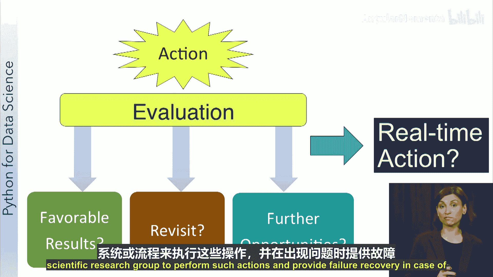

# 007：数据科学流程详解

在本节课中，我们将系统性地学习数据科学项目的完整流程，从数据采集到最终将洞察转化为行动。我们将了解每个步骤的目标、常用技术以及需要注意的关键问题。

## 步骤一：数据采集

数据科学流程的第一步是获取数据。在本节中，我们将学习如何访问和检索所需数据的技术与工具，并描述一个从多种来源获取数据的示例场景。

数据采集意味着在分析或处理数据之前，需要先获得原始材料。第一步是确定有哪些数据可用。在寻找合适的数据源时，我们需要做到全面无遗漏。我们的目标是识别与问题相关的合适数据，并利用所有相关数据进行分析。有时，即使遗漏一小部分重要数据也可能导致错误的结论。

数据来源广泛，包括本地和远程，形式多样，有结构化和非结构化之分，并且数据流的速度（即数据流的速度）也各不相同。访问这些不同类型的数据有多种技术和工具。

以下是几种常见的数据访问方式：

*   **关系型数据库**：许多数据存在于传统的关系型数据库中，例如来自组织的结构化数据。访问数据库数据的首选工具是**结构化查询语言（SQL）**，它被所有关系数据库管理系统支持。此外，大多数数据库系统都配有图形化应用程序环境，允许用户查询和探索数据库中的数据。
*   **文件**：数据也可以存在于文件中，例如文本文件和Excel电子表格。通常使用脚本语言从文件中获取数据。像**Python**这样的脚本语言是一种高级编程语言，可以是通用型的，也可以专用于特定功能。其他支持文件处理的常见脚本语言包括JavaScript、PHP、Perl、R、Octave和MATLAB等。
*   **网站**：从网站获取数据是一种日益流行的方法。网页使用万维网联盟（W3C）批准的一套标准编写，包括各种格式和服务。常见的格式有**XML（可扩展标记语言）** 或**JSON**，它们都使用标记符号和标签来描述网页内容。许多网站还提供Web服务，以编程方式访问其数据。Web服务有几种类型，最流行的是**REST**，因为它易于使用。REST代表表述性状态转移，是一种考虑性能、可扩展性和可维护性的Web服务实现方法。**WebSocket**服务也越来越受欢迎，因为它们允许从网站进行实时通知。
*   **NoSQL存储系统**：NoSQL存储系统越来越多地用于管理各种数据类型。这些数据存储是不以传统关系数据库的列和行表格格式表示数据的数据库。这类数据存储的例子包括Cassandra、MongoDB和HBase。NoSQL数据存储提供API供用户访问数据，这些API可以直接使用，也可以在需要访问数据的应用程序（如Python脚本）中使用。此外，大多数NoSQL系统通过Web接口（如REST）提供数据访问。

**示例场景：野火数据分析**

在我们圣地亚哥超级计算机中心的一个应用项目中，我们使用野火数据分析来预测火灾方向和蔓延速度。这个项目需要使用几种不同的机制来获取数据。

该项目本身将气象站的历史传感器数据存储在关系数据库中。我们使用**SQL**从数据库中检索这些数据，以创建模型来识别与火灾天气条件相关的天气模式。为了确定特定气象站当前是否正在经历火灾天气条件，我们使用**WebSocket服务**访问实时数据。一旦开始监听此服务，我们就能在气象站测量数据发生时接收它们。然后处理这些数据，并与模型发现的模式进行比较，以确定气象站是否正在经历圣安娜风或火灾天气条件。

同时，使用与该地区发生的任何火灾相关的标签来检索推文。推文消息通过**Twitter REST服务**检索。目的是确定这些推文的情绪，看看人们是表达恐惧、愤怒，还是对附近的火灾漠不关心。传感器数据和推文情绪的结合有助于我们了解火灾情况的紧迫性。

**总结**：数据可以来自许多地方。在开始获取数据之前，找到并评估所有对我们分析有用的数据非常重要。根据数据的来源和结构，有不同的访问方式，我们将在接下来的Python课程中了解所有这些访问方法。

## 步骤二：数据探索

上一节我们介绍了如何获取数据，本节中我们来看看获取数据后的重要步骤——数据探索。在本节中，您将能够解释探索数据的重要性，并识别对数据进行初步分析的方法。

在收集了应用程序所需的数据之后，您可能会忍不住立即开始构建模型来分析数据。我们必须抵制这种诱惑。获取数据后的第一步是探索数据，因为探索数据是两步数据准备活动的重要组成部分。您需要进行一些初步调查，以便更好地了解数据的具体特征。在此步骤中，您将寻找诸如相关性、总体趋势、异常值等特征。如果没有这一步，您将无法有效地使用数据。

以下是数据探索中常用的几种方法：

*   **相关性图**：可用于探索不同变量之间的依赖关系。
*   **总体趋势图**：向您展示数据随时间变化的简单图表。
*   **异常值检测**：向您展示远离其他数据点的数据点。绘制异常值将帮助您仔细检查由于测量导致的数据错误。在某些情况下，非错误的异常值可能会让您发现罕见事件。
*   **汇总统计**：提供描述数据的数值。汇总统计量是用单个数字或一小组数字来捕捉一组值的各种特征的量。您应该为数据集计算的一些基本汇总统计量包括**均值**、**中位数**、**众数**、**极差**和**标准差**。均值和中位数是特定值位置的度量。众数是数据集中出现最频繁的值。极差和标准差是数据离散程度的度量。查看这些度量可以让您了解数据的性质。它们可以告诉您数据是否存在问题，例如，如果数据中年龄值的范围包括负数或远大于100的数字，则数据中存在可疑之处，需要检查。Python提供了函数和方法，我们可以快速探索数据并提供这些统计信息，我们将在本课程结束时了解所有这些内容。

可视化技术也提供了快速有效、总体上非常有用的方式来查看数据，在这个初步分析步骤中非常有用。例如，热图可以快速让您了解热点在哪里。

可以使用许多不同类型的图表。直方图显示数据的分布，可以显示偏度或异常离散。箱线图是另一种显示数据分布的图表类型。折线图有助于查看数据中的值如何随时间变化。数据中的峰值也易于发现。散点图可以显示两个变量之间的相关性。总的来说，有许多类型的数据可视化图表，它们在帮助您理解所拥有的数据方面非常有用。展望未来，我们实际上将花费近一周的时间专门关注有效的数据可视化方法。

**总结**：通过探索数据，您将获得对所处理数据复杂性的更好理解。这反过来将指导流程的其余部分。既然我们在探索数据后对其复杂性有了更多了解，接下来我们将讨论数据预处理或转换，使其为分析做好准备。

## 步骤三：数据预处理

上一节我们探讨了数据，本节我们将学习如何对数据进行预处理，使其适合分析。在本节中，您将能够识别现实世界数据的一些问题，并描述将原始数据转换为可用于分析的数据所需的工作。

直接从来源获取的原始数据永远不会是进行分析所需的格式。数据预处理步骤有两个主要目标：第一是清理数据以解决数据质量问题；第二是转换数据以使其适合分析。

数据准备的一个非常重要的部分是解决数据中的质量问题。现实世界的数据是混乱的。来自实际应用的数据存在许多质量问题的例子，包括：

*   **不一致的数据**：例如，在两个不同销售地点记录的同一客户有两个不同的地址，但这些记录不一致。
*   **缺失值**：例如，在人口统计研究中缺少客户年龄。
*   **无效值**：例如，一个六位数的邮政编码。
*   **异常值**：例如，传感器故障导致一段时间内的值远高于或低于预期。

由于我们是下游获取数据，通常对数据如何收集控制有限。在数据收集时预防数据质量问题通常不是一种选择。因此，我们必须通过检测和纠正来处理我们获得的数据中的质量问题。

以下是一些我们可以用来解决这些数据质量问题的方法：

*   **删除缺失值的记录**。
*   **合并重复记录**：这需要一种方法来确定如何解决冲突值。也许在有冲突时保留最新值是合理的。
*   **替换无效值**：可以使用合理值的最佳估计作为替换。例如，可以根据对员工雇佣时长的合理估计来填补员工的缺失年龄值。
*   **移除异常值**：如果它们对任务不重要，也可以移除。

为了有效解决所有这些数据质量问题，关于应用程序的知识（例如数据如何收集、用户群体、应用程序的预期用途等）非常重要。这种领域知识对于就如何处理不完整或不正确的数据做出明智决策至关重要。您还需要小心所做的更改，以避免得出错误的结论，并务必记录所做的更改。

数据准备的第二部分是将清理后的数据操作成分析所需的格式。这一步有许多名称：数据操作、数据预处理、数据整理，可能我最喜欢的是数据混合。这种数据混合、整理、预处理的操作包括缩放、转换、特征选择、降维和数据操作。

让我们进一步详细看看这些操作：

*   **缩放**：涉及将值的范围更改为指定范围之间，例如从0到1。这样做是为了避免某些具有大值的特征主导结果。例如，在分析身高和体重数据时，体重值的数量级远大于身高值的数量级。因此，将所有值缩放到0到1之间将使身高和体重特征的贡献均等化。
*   **转换**：可以对数据执行各种转换以减少噪声和变异性。一种这样的转换称为**聚合**。聚合数据通常会产生变异性较小的数据，从长远来看可能有助于分析。例如，每日销售数据可能有许多虚假变化，将值聚合为每周或每月销售数据将产生更平滑的数据。其他过滤技术也可用于消除数据中的变异性。当然，这是以数据细节减少为代价的，因此必须针对特定应用权衡这些因素。
*   **特征选择**：可以涉及移除冗余或不相关的特征、组合特征以及创建新特征。在探索数据步骤中，您可能发现两个特征高度相关，在这种情况下，可以移除其中一个特征而不会对分析结果产生负面影响。例如，产品的购买价格和支付的销售税额可能高度相关。那么，消除销售税额将是有益的。移除冗余或不相关的特征将使后续分析更简单。在其他情况下，您可能希望组合特征或创建新特征，例如，在贷款审批申请中添加申请人的教育水平作为特征是有意义的。还有一些算法可以根据各种数学属性自动确定最相关的特征。
*   **降维**：当数据集具有大量维度时非常有用。它涉及找到一个较小的维度子集，以捕获数据中的大部分变化。这减少了数据的维度，同时消除了不相关的特征，并使分析更简单。一种常用的降维技术称为**主成分分析（PCA）**。
*   **数据操作**：原始数据通常需要操作才能成为分析的正确格式。例如，从记录每日股价变化的样本中，我们可能希望捕获特定市场板块（例如房地产或医疗保健）的价格变化。这需要确定哪些股票属于哪个市场板块，将它们分组在一起，并可能计算每个组的均值、极差和标准差。

**总结**：数据准备是数据科学流程中非常重要的一部分。事实上，在任何数据科学工作中，您将把大部分时间花在这上面。这可能是一个乏味的过程，但却是关键的一步。请始终记住，在数据处理方面，垃圾进，垃圾出。如果您不花时间和精力为分析创建良好的数据，那么无论您的数据分析技术多么复杂，都不会得到好的结果。

## 步骤四：数据分析

现在我们已经准备好了数据，终于可以进行分析了。在本节中，您将能够描述将分析技术应用于数据所涉及的内容，并列出三种基本的分析技术。

现在您已经准备好了数据，下一步是分析数据。数据分析涉及从您的数据（称为输入数据）构建模型。输入数据被分析技术用来构建模型。您的模型生成的是输出数据。有不同类型的问题，因此也有不同类型的分析技术。

分析技术的主要类别包括分类、回归、聚类、关联分析和图分析。我们现在将描述每一种。

*   **分类**：目标是预测输入数据的类别。一个例子是预测天气为晴天、雨天、有风或多云。在这种情况下，要预测的类别是晴天、雨天、有风和多云。另一个例子是将肿瘤分类为良性或恶性。在这种情况下，由于只有两个类别，该分类被称为**二元分类**。但您也可以有许多类别，例如这里显示的具有四个不同类别的天气预测问题。另一个例子是将手写数字识别为10个类别（即0到9）之一。
*   **回归**：当您的模型必须预测数值而不是类别时，任务就变成了回归问题。回归的一个例子是预测股票随时间变化的价格。股票价格是数值，不是类别，因此这是一个回归任务，而不是分类任务。回归的其他例子包括：估计任何新产品的每周销售额，以及预测测试分数。
*   **聚类**：在聚类中，目标是将相似的项目组织成组。一个例子是将公司的客户群划分为不同的细分市场，以便进行更有效的定向营销，例如老年人、成人和青少年。其他例子包括：为土地利用应用识别具有相似地形（例如山脉、沙漠平原）的区域，以及确定不同的天气模式组（如雨天、寒冷或下雪）。
*   **关联分析**：目标是提出一组规则来捕捉项目或事件之间的关联。这些规则用于确定项目或事件何时一起发生。关联分析的一个常见应用称为**市场篮子分析**，用于理解客户购买行为。例如，关联分析可以揭示，拥有定期存款账户（CDs）的银行客户也往往对其他投资工具（如货币市场账户）感兴趣。这些信息可用于交叉销售。如果您向拥有CDs的客户宣传货币市场账户，他们很可能会开设此类账户。根据数据挖掘的传说，一家超市连锁店使用关联分析发现了两种看似无关的产品之间的联系。他们发现，许多在周日深夜去超市购买尿布的顾客也倾向于购买啤酒。然后，这些信息被用来在周日将啤酒和尿布放在一起。他们看到这两种商品的销量都出现了跃升。这就是著名的“尿布与啤酒”关联。
*   **图分析**：当您的数据可以转换为具有节点和链接的图表示时，您希望使用图分析来分析您的数据。当您拥有大量实体以及这些实体之间的连接时（如社交网络），就会出现这种数据。图分析可能有用的例子包括：通过分析医院和医生记录来探索疾病或流行病的传播；通过监控社交媒体、电子邮件和文本数据来识别安全威胁；以及优化移动通信网络流量以确保数据质量并减少掉话。

建模首先根据您所处理问题的类型，从我们列出的这些技术中选择一种作为适当的分析技术。然后，使用您准备好的数据构建模型。为了验证模型，您将其应用于新的数据样本。这是为了评估模型在用于构建它的数据上的表现。常见的做法是将准备好的数据分为用于构建模型的数据集和保留一些数据用于在模型构建后评估模型。您也可以使用以与构建模型数据相同方式准备的新数据。

模型的评估取决于您使用的分析技术类型。让我们简要看看如何评估每种技术：

*   **对于分类和回归**：您的输入数据中每个样本都有正确的输出。比较正确输出和模型预测的输出提供了一种评估模型的方法。
*   **对于聚类**：应检查聚类产生的组，看看它们对您的应用是否有意义。例如，客户细分是否反映了您的客户群？它们对用于定向营销活动是否有帮助？
*   **对于关联分析和图分析**：需要进行一些调查，看看结果是否正确。例如，需要调查网络流量延迟，看看您的模型预测的是否实际发生，以及延迟的来源是否如预测的那样存在于真实系统中。

在评估了模型以了解其在您数据上的性能后，您将能够确定后续步骤。需要考虑的一些问题包括：是否应该使用更多数据进行分析以获得更好的模型性能？使用不同的数据是否有帮助？例如，在您的聚类结果中，是否难以区分来自不同地区的客户？或者是否需要将邮政编码添加到输入数据中以帮助生成更细粒度的客户细分？分析结果是否表明需要对问题的某些方面进行更详细的研究？例如，预测晴天天气效果很好，但雨天天气预测效果一般。这意味着您应该更仔细地查看雨天天气的样本，也许这些样本中存在一些异常，或者为了完全捕捉雨天天气，需要包含一些缺失的数据。理想的情况是，您的模型在项目开始时定义问题所确定的成功标准方面表现非常好。在这种情况下，您就可以继续沟通并根据分析获得的结果采取行动了。

**总结**：数据分析涉及为问题选择合适的技术，构建模型，然后评估结果。由于存在不同类型的问题，也存在不同类型的分析技术，我们需要了解这些技术，以确保我们将正确的技术应用于我们的数据集和问题。

## 步骤五：报告洞察

上一节我们完成了数据分析，本节我们将学习如何报告从分析中获得的洞察。在本节中，您将能够确定在报告发现时应呈现的内容，并识别沟通结果的技术。

数据科学流程的第四步是报告从分析中获得的洞察。这是沟通您的洞察并为后续应采取的行动提供依据的重要一步。它可以根据您的受众进行调整，不应掉以轻心。

那么，我们如何开始呢？第一件事是查看您的结果并决定呈现什么。这意味着确定您的分析中哪一部分最重要，能为您的科学界、公司、行业或特定受众提供最大价值。

在决定呈现什么时，您应该问自己这些问题：我的重点是什么？换句话说，主要结果是什么？基于我工作的特定领域和引导我提出问题的应用，这些结果提供了什么价值？模型如何增强这个应用？换句话说，结果与项目开始时为该应用特定目的确定的成功标准相比如何？您需要在报告或演示中包含这些问题的答案。因此，让这些问题和答案成为主要主题，并务必有数据或可视化来支持它们。

请记住，并非所有的分析结果都可能是乐观的。这通常很难沟通。您的分析可能显示出与您希望发现的结果相反的结果，或者结果不确定或令人困惑。您也需要展示这些结果。与您合作的领域专家可能会发现其中一些结果令人困惑。不确定的发现会导致额外的分析。请记住，报告发现的目的是确定下一步应该做什么。必须呈现所有发现，以便做出明智的决策。如果您仔细想想，最大的危险是让您的结果看起来讲述了一个清晰的故事，而实际上并非如此。如果您的结论后来被发现是错误的，您的可信度可能会受到严重损害。最好讲述一个完整而真实的故事，即使它不是很清晰，也不要试图粉饰事物，让它们听起来比实际情况更清晰。

可视化是呈现结果的重要工具。我们在探索数据时讨论的技术也可以在这里使用。散点图、折线图、热图和其他类型的图表是直观呈现结果的有效方式。您还应该有包含分析细节的表格作为备份，如果有人想更深入地研究结果。

有许多可用的可视化工具。这里列出了一些最受欢迎的开源工具，包括：**R**，一个用于数据分析的软件包，具有强大的可视化功能；**Python**，我们将在本课程中看到，它是一种通用编程语言或脚本语言，允许您使用许多包来支持数据分析和图形；**D3**，一个用于生成基于Web的交互式可视化和数据驱动文档的JavaScript库；**Leaflet**，一个轻量级、移动友好的JavaScript库，用于创建交互式地图；最后，**Tableau**和**Google Charts**允许您在个人资料中创建可视化，以便分享或将它们放在网站或博客上，并且它们提供跨平台兼容性到移动设备；**Timeline**是一个JavaScript库，允许您根据这些结果创建时间线。我们将使用与Python的Jupyter笔记本良好连接的工具，并将在即将到来的一周专注于可视化。

**总结**：您希望通过呈现结果和使用可视化工具来报告您的发现，以帮助您有效地做到这一点。

## 步骤六：将洞察转化为行动

上一节我们讨论了如何报告结果，本节我们将学习如何将洞察转化为实际行动。在本节中，您将能够解释将洞察转化为行动的含义，并将您的结果与您的业务或科学问题联系起来。

现在您已经评估了分析结果，并就结果的潜在价值生成了报告，下一步是根据获得的洞察确定应采取什么行动。

请记住我们最初为什么要汇集大型数据集进行分析。目标是找到可操作的洞察，以帮助回答科学或商业问题。

例如，在商业中：您的流程中是否存在应该改变以消除瓶颈的问题？是否应该向您的应用添加数据以提高其准确性？或者您是否应该将人群划分为更明确的组以进行更有效的定向营销？同样，在科学中：药物试验的益处是否具有统计学意义？森林砍伐的当前速度是多少？您能预测15年后将剩下多少森林吗？再举一个例子，您可以问这样的问题：您能根据望远镜图像对遥远的行星进行聚类吗？

既然您从数据中获得了一些洞察，下一步就是将其转化为行动。根据您的发现，您现在很可能可以采取一些行动来改善业务、更好地治疗患者或改善环境。现在您需要弄清楚如何实施这些行动，将这一行动添加到您的流程或应用中需要什么。如果可以，应该如何实现自动化？利益相关者需要被识别并参与到这一变革中，就像任何流程改进变革一样。我们需要监控和衡量该行动对流程或应用的影响。务必考虑在变革期间和之后应收集哪些数据以正确评估其影响。对已实施行动结果的评估将决定您的后续步骤。是否需要执行额外的分析以获得更好的结果？应该重新审视哪些数据？是否有其他机会应该探索？

例如，我们不要忘记大数据使我们能够做什么。我们可以基于快速流动的信息采取实时行动。在商业中，我们需要定义业务的哪部分需要实时行动，以便能够影响运营或与客户的互动。在公共服务中，我们需要知道在数据中观察到某些事件时应采取什么行动。一旦我们定义了这些实时行动，我们需要确保在我们的组织或科学研究小组中有自动化系统或流程来执行此类行动，并在出现问题时提供故障恢复。

**总结**：大数据和数据科学只有在洞察能够转化为行动时才是有用的，并且应该仔细定义和评估行动。

---

我们现已完成了数据科学流程的描述。在接下来的九周里，我们将使用Python和Jupyter笔记本，在学习可用于数据科学项目的关键Python库的同时，将此流程应用于案例研究。在10周结束时，您可以确信您将能够将这些技能添加到您的简历中。希望您和我们一样享受Python和数据科学的乐趣。