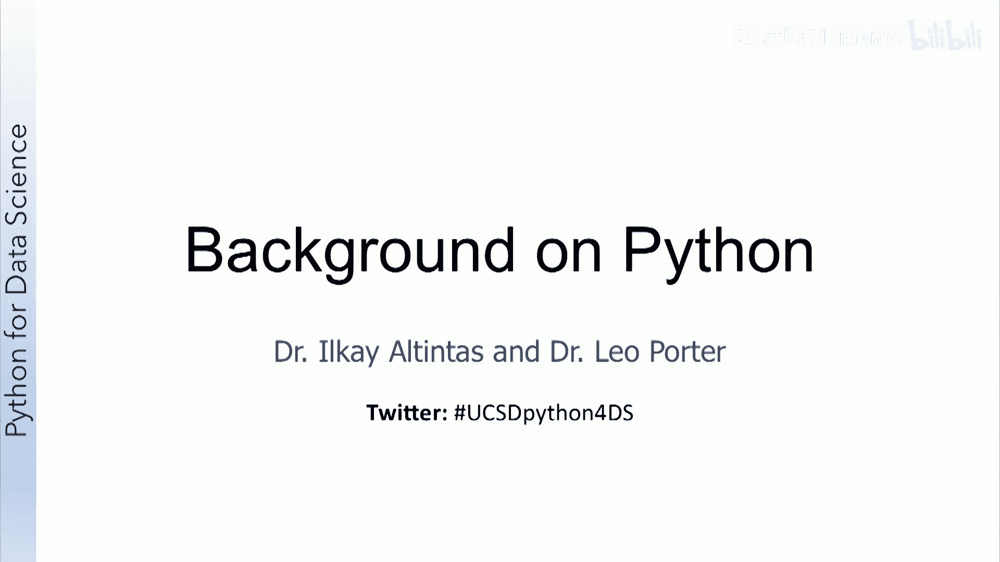

# 008：导论 📘

在本节课中，我们将要学习第二周课程的整体安排与目标。本周内容专注于Python和Unix的基础知识，旨在帮助有不同背景的学习者快速上手或巩固知识。

欢迎来到Python数据科学课程的第二周。

本周的重点是Python和Unix的基础知识。对于已经具备这两方面背景的学习者，本周内容完全是可选的。

Python部分专为那些有其他语言编程经验，但需要快速教程以掌握用Python编写程序的学习者设计。

对于那些有一些Python经验，但认为额外帮助仍有价值的学习者，可以自由选择观看哪些视频，或者直接跳到Python课程结束时的可选编程作业。

对于Unix部分，我们将介绍一些在本课程中你可能希望使用的工具。同样，如果你已经熟悉Unix，可以自由跳过。如果你遇到困难，以后随时可以回头参考这些资源。

---

上一节我们介绍了本周课程的整体定位，本节中我们来看看课程内容的具体构成与学习建议。

以下是针对不同背景学习者的具体学习路径建议：

*   **有其他语言编程经验者**：建议重点观看Python部分的视频，以快速适应Python语法。
*   **有少量Python经验者**：可以挑选性地观看视频，或直接通过编程作业进行实践。
*   **熟悉Unix系统者**：可以跳过Unix部分，或在需要时将其作为参考资料。

---

本节课中我们一起学习了第二周课程的导论内容，明确了Python和Unix基础部分的学习目标，并了解了根据个人背景选择学习路径的建议。