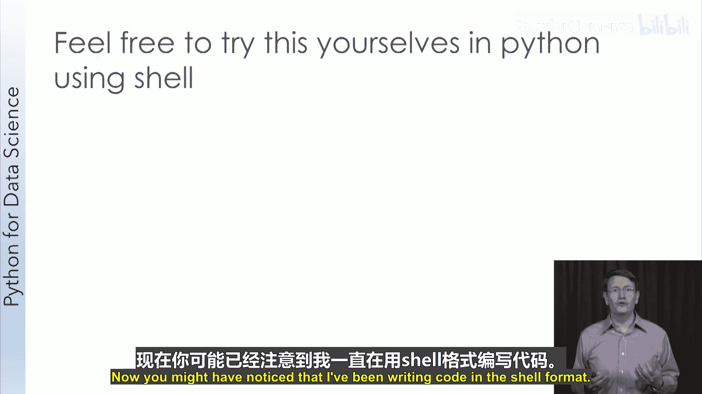
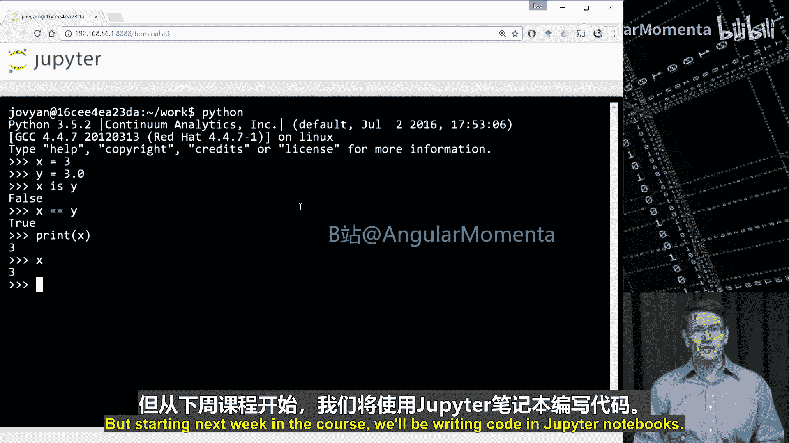
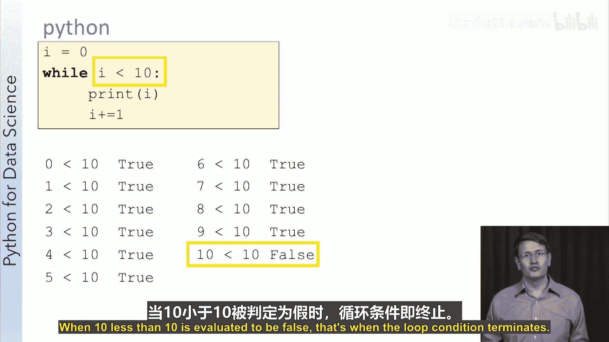
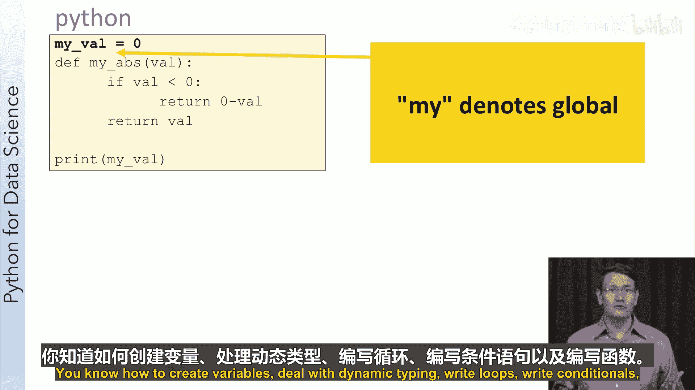

# 009：Python概述

在本节课中，我们将要学习为什么选择Python作为数据科学的编程语言，并掌握Python编程的基础知识，包括变量、对象、循环、条件语句、函数和作用域。

## 为什么选择Python？ 🐍

上一节我们介绍了本课程将使用的Jupyter环境。本节中我们来看看为什么选择Python作为核心编程语言。

Python自1991年诞生以来，已成为全球最流行的编程语言之一。Python官网阐述了其优势：

*   **强大**：用Python只需几行代码就能完成的任务，在其他语言（如Java或C++）中可能需要三到五倍的代码量。
*   **快速**：作为一种解释型语言，Python的速度令人惊讶。它通过调用用C或C++编写的高度优化库来实现高性能。
*   **兼容性好**：Python能很好地与其他语言协作，常被用作“胶水语言”，连接用不同语言编写的组件。
*   **可移植**：由于是解释型语言，只要有Python解释器，任何Python程序都能运行。
*   **易于学习**：动态类型和自动内存管理等特性使Python易于学习和阅读。
*   **开源**：Python是开源的，无需担心许可费用，并且社区活跃。

此外，Python拥有庞大的工具生态系统，可以连接和处理来自不同领域的真实世界数据，这使得掌握Python的数据科学家在就业市场上极具竞争力。

## Python在数据科学中的应用实例 📊

为了展示Python在数据科学中的实际应用，我们来看一个在线教育领域的研究案例。

该研究分析了862个慕课（MOOC）视频的观看日志数据，涉及超过127,000名学生和690万次视频观看会话。研究流程如下：

1.  **数据提取**：使用`PyMongo`库从MongoDB数据库中提取数据。
2.  **数据分析**：使用`NumPy`库进行数值分析。
3.  **统计检验**：使用`SciPy`库进行统计学检验。
4.  **数据可视化**：使用`Matplotlib`库生成图表。
5.  **组织分析**：使用Jupyter Notebook组织整个分析流程。

以下是部分核心发现：

*   **视频时长与观看时长**：6至9分钟的视频，观众平均观看时间较长。超过9分钟的视频，观看时长显著下降。
*   **视频完成率**：对于6至9分钟的视频，观众观看了大部分内容。而对于9至12分钟或更长的视频，观众观看不足一半甚至仅四分之一。

这些结论已被广泛应用于慕课制作中，现在制作5分钟左右的短视频已成为标准实践。

## Python编程基础：变量与动态类型 🧮

在上一节中，我们了解了Python的优势。本节中我们开始学习Python编程的基础——变量。

Python代码简洁明了。例如，打印“Hello World”只需一行代码：`print("Hello World")`。Python语句末尾不需要分号，并且使用缩进而非花括号来定义代码块。

在Python中创建变量非常简单，例如 `x = 3`。与C++或Java等强类型语言不同，Python是**动态类型**语言，变量在声明时无需指定类型。

Python支持多种内置数据类型，包括整数（`int`）、浮点数（`float`）、列表（`list`）、字节（`bytes`）、布尔值（`bool`）和字符串（`str`）。



动态类型意味着你可以轻松地改变变量所指向的数据类型，例如：
```python
x = 3    # x 现在是一个整数
x = 4.5  # x 现在是一个浮点数，不会报错
```



## 深入理解：Python中的对象 🧠

上一节我们介绍了变量的动态类型。本节中我们来探讨其背后的原理：**在Python中，一切皆对象**。

对象是包含数据（属性）和可执行操作（方法）的实体。即使是像整数这样的基本类型，在Python中也是对象（例如 `PyIntObject`）。

当我们执行 `x = 3` 时，Python会在内存中创建一个值为3的 `PyIntObject` 对象，然后让变量 `x` 指向这个对象。当执行 `x = 4.5` 时，会创建一个新的 `PyFloatObject` 对象，并让 `x` 指向它，之前无人引用的 `PyIntObject` 对象会被垃圾回收器自动清理。

要检查两个变量是否指向同一个对象，使用 `is` 操作符。要检查两个对象的值是否相等，使用 `==` 操作符。
```python
x = 3
y = 3.0
print(x is y)      # 输出: False，指向不同对象
print(x == y)      # 输出: True，值相等
```

## 使用对象与方法 🛠️

我们已经知道Python中一切都是对象。本节中我们学习如何调用对象的方法。

以字符串对象为例，字符串在Python中是不可变的。调用其方法会返回一个新的字符串对象，而不会修改原字符串。
```python
x = "Hello"
print(x.upper())   # 输出: HELLO
print(x)           # 输出: Hello，x本身未改变
```
要改变变量 `x` 的值，需要将方法返回的新对象赋值给它：
```python
x = "Hello"
x = x.lower()      # 创建新对象并让x指向它
print(x)           # 输出: hello
```
方法调用的格式为：`变量名.方法名(参数)`。

一个常见的误区是关于变量赋值。`y = x` 并不意味着 `y` 和 `x` 永久绑定，它只是让 `y` 暂时指向 `x` 当前所指的对象。之后 `x` 的改变不会影响 `y`。
```python
x = 7
y = x   # y 指向 7
x = 3   # x 指向新的对象 3
print(x, y) # 输出: 3 7
```

## 控制流程：循环 🔁

循环是编程中的基本结构。本节中我们学习Python中的 `for` 循环和 `while` 循环。




`for` 循环常与 `range()` 函数搭配使用。`range(start, stop, step)` 生成一个从 `start` 到 `stop-1`，步长为 `step` 的数字序列。
```python
for i in range(0, 10, 2): # 从0开始，到9结束，步长为2
    print(i)               # 输出: 0, 2, 4, 6, 8
```
`while` 循环在条件为真时重复执行代码块。
```python
i = 0
while i < 5:
    print(i)
    i += 1  # 输出: 0, 1, 2, 3, 4
```
关于循环条件评估次数的一个关键点：条件检查的次数比循环体执行的次数多一次（最后一次检查结果为 `False` 时终止循环）。

## 控制流程：条件语句 🔀

本节我们学习使用 `if`、`elif` 和 `else` 语句来控制程序分支。

条件语句的基本结构如下：
```python
if 条件:
    # 条件为真时执行的代码
elif 另一个条件:
    # 上一个if为假，且此条件为真时执行
else:
    # 所有以上条件都为假时执行
```
例如，打印0到4之间的偶数，并将奇数加10后打印：
```python
for i in range(5):
    if i % 2 == 0:       # 检查是否为偶数
        print(i)
    else:                # 否则（即为奇数）
        print(i + 10)    # 输出: 0, 11, 2, 13, 4
```

## 代码复用：函数 📦

函数将子任务抽象成独立的代码块。本节中我们学习如何定义和调用Python函数。

使用 `def` 关键字定义函数。Python是动态类型的，所以无需指定参数和返回值的类型。
```python
def my_abs(v):  # 定义函数，参数为 v
    if v < 0:
        return -v
    else:
        return v

print(my_abs(-7)) # 输出: 7
```
**重要概念：Python的参数传递是“按对象引用传递”**。函数内对参数重新赋值（使用 `=`）不会影响外部变量。因为这只是让参数变量指向了一个新对象。
```python
def increment_value(val):
    val = val + 1  # val 指向了新对象，外部x不变

x = 7
increment_value(x)
print(x)  # 输出: 7
```
**打印（`print`）和返回（`return`）是不同的**。函数需要返回值供调用者使用，而打印只是将内容输出到屏幕。

## 变量作用域 🎯

变量的作用域决定了它在程序中的可访问范围。本节中我们学习Python的作用域规则。

在函数内部定义的变量是**局部变量**，只能在函数内部访问。
```python
def my_func():
    local_var = 10

print(local_var) # 错误！NameError: name 'local_var' is not defined
```
在函数外部定义的变量是**全局变量**，可以在整个文件（模块）中访问。但在函数内部若要修改全局变量，需要使用 `global` 关键字声明。不过，过度使用全局变量可能导致代码难以维护，一些编程规范建议避免使用。



本节课中我们一起学习了Python作为数据科学语言的优势、一个实际应用案例，以及Python编程的核心基础：变量与动态类型、对象模型、循环、条件语句、函数和作用域。掌握这些基础知识是后续学习NumPy、Pandas等数据科学库的关键。