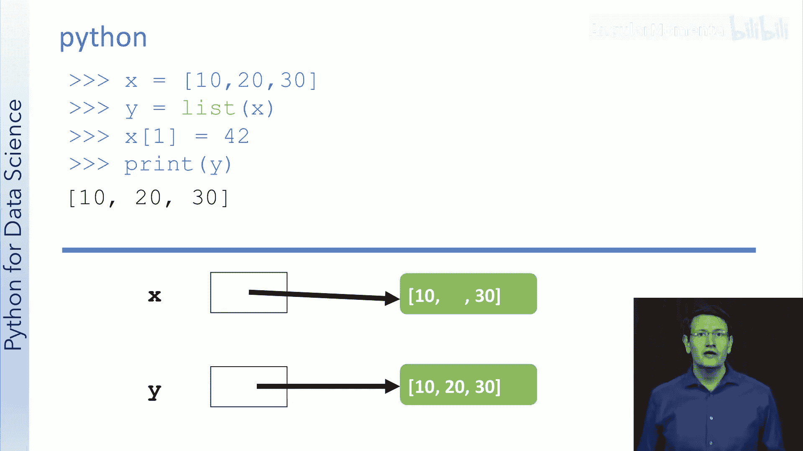
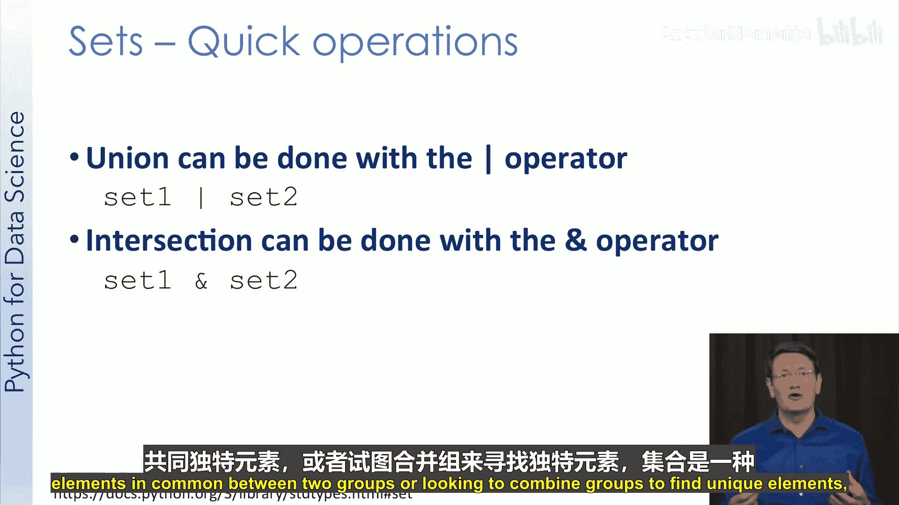

# 010：Python中的数据结构与基础库

在本节课中，我们将学习Python中用于数据科学的核心数据结构与基础库。我们将从字符串操作开始，逐步深入到列表、元组、字典、集合以及列表和字典推导式。掌握这些知识是进行后续数据科学分析的基础。

## 字符串常用函数 🧵

上一节我们介绍了课程概述，本节中我们来看看Python中处理文本数据的基础——字符串的常用函数。

字符串是Python中用于表示文本的数据类型。Python的字符串库提供了丰富的函数来操作字符串。虽然本节会介绍许多常用函数，但请注意，字符串库中还有更多函数。如果你需要对字符串进行某种操作，建议首先查阅库的文档，很可能已经有现成的函数能满足你的需求。

以下是改变字符串大小写的函数：

*   `lower()`: 返回一个新字符串，其中原字符串的所有字符都转换为小写。
*   `upper()`: 返回一个新字符串，其中原字符串的所有字符都转换为大写。

字符串是不可变的，因此本节讨论的所有函数都会返回新的字符串。

如果你想拼接两个字符串，可以使用连接操作。使用加号 `+` 可以将两个字符串连接起来。

```python
string1 = “Hello”
string2 = “World”
result = string1 + “ “ + string2  # 结果为 “Hello World”
```

如果你想重复一个字符串多次，可以使用复制操作。使用乘号 `*` 可以复制字符串。

```python
string = “Hi”
result = string * 3  # 结果为 “HiHiHi”
```

你可以结合连接和复制操作来构建更复杂的字符串。

`strip()` 函数在数据科学中非常有价值。你经常会发现数据值周围有多余的空格或换行符，这些无用空白会影响分析。`strip()` 函数可以去除这些空白。

```python
text = “  example\n”
clean_text = text.strip()  # 结果为 “example”
```

你并不总是想去除空格，`strip()` 函数可以接受一个参数，指定要去除的字符。

```python
text = “**10**”
clean_text = text.strip(“*”)  # 结果为 “10”
```

有时你需要将一个长字符串分割成多个子字符串。`split()` 函数可以实现这个功能，它会返回一个列表（列表可以容纳多个元素）。

```python
sentence = “This is a sentence”
words = sentence.split(“ “)  # 结果为 [‘This‘， ‘is‘， ‘a‘， ‘sentence‘]
```

你也可以用逗号或其他分隔符来分割字符串。

```python
data = “Jane Doe，Cars，5”
fields = data.split(“，“)  # 结果为 [‘Jane Doe‘， ‘Cars‘， ‘5‘]
```

通过索引获取字符串的一部分称为切片。我们以单词 “Hello” 为例，其字符索引从0开始。

```python
word = “Hello”
sub1 = word[1:3]  # 结果为 “el“ （索引1包含，索引3不包含）
sub2 = word[4:]   # 结果为 “o“ （从索引4到末尾）
sub3 = word[-4:-1] # 结果为 “ell“ （负索引从末尾开始计数）
```

有两种简单的方法可以检查一个字符串是否包含某个子串。第一种是使用 `in` 关键字。

```python
word = “Hello”
print(“HE“ in word)  # 输出 False
print(“He“ in word)  # 输出 True
```

如果你想找到子串在字符串中的位置，可以使用 `find()` 方法。它返回子串起始的最低索引，如果子串不存在则返回 -1。

```python
word = “Hello”
position = word.find(“el“)  # 结果为 1
```

结合切片使用 `find()` 会很有用，因为你可以先找到子串的起始位置，然后从那里开始提取字符。

在本课程中，我们既会处理文本数据也会处理数值数据，因此需要知道如何在字符串和数字之间转换。

```python
str_num = “1234”
int_num = int(str_num)      # 转换为整数 1234
float_num = float(str_num)  # 转换为浮点数 1234.0
```

如果你尝试将非数字文本转换为整数，将会引发错误。

最后，你可能有一个大段文本，并想在其中插入一些字符串。这时可以使用 `format()` 函数。

```python
template = “I love {} and {}.“
result = template.format(“data“， “analysis“)  # 结果为 “I love data and analysis.“
```

你可以为占位符编号，以更精确地控制替换顺序。

```python
template = “I love {1} and {0}.“
result = template.format(“analysis“， “data“)  # 结果为 “I love data and analysis.“
```

当输入数据的顺序与你想要的字符串顺序不同时，这会非常有用。

本节我们讨论了许多字符串函数。请记住，还有更多函数可以应用于字符串，因此在以特定方式操作字符串时，请务必查阅文档。

## 列表数据结构 📋

在上一节中，我们学习了如何操作字符串。本节中，我们将学习Python中用于存储数据集合的核心数据结构——列表。

列表类似于Java中的ArrayList或C++中的vector。这意味着它是可调整大小的，底层由数组实现。通过本节学习，你将能够使用列表存储数据、使用循环遍历列表，并识别一些常见的列表函数。

让我们从创建一个包含值11、22和33的列表开始。

```python
my_list = [11， 22， 33]
```

列表元素有索引，和字符串一样，索引从0开始。如果我们请求索引为1的元素，将得到22。

```python
print(my_list[1])  # 输出 22
```

如果你尝试访问超出列表范围的索引，将会引发错误。

要打印列表中的所有元素，可以使用循环进行遍历。

```python
for item in my_list:
    print(item)
```

对于更熟悉C或Java风格循环的人，也可以这样写：

```python
for i in range(len(my_list)):
    print(my_list[i])
```

`len()` 函数返回列表中项目的数量。我们鼓励你使用第一种循环方式，因为它更不易出错且更易读。

与字符串不同，你可以更改列表元素的内容。

```python
my_list[1] = 95
print(my_list)  # 输出 [11， 95， 33]
```

列表是可调整大小的，这意味着我们可以在列表末尾追加值。

```python
my_list.append(44)
print(my_list)  # 输出 [11， 95， 33， 44]
```

你可以添加元素，也可以移除元素。`pop()` 方法通过索引移除元素并返回它。

```python
removed_item = my_list.pop(2)  # 移除索引为2的元素（33）
print(my_list)  # 输出 [11， 95， 44]
```

`remove()` 方法通过值移除元素。

```python
my_list.remove(95)  # 移除值为95的元素
print(my_list)  # 输出 [11， 44]
```

有时你想合并两个列表。如果合并只是简单地将一个列表添加到另一个列表的末尾，可以使用 `extend()` 方法。

```python
list1 = [1， 2， 3]
list2 = [4， 5， 6]
list1.extend(list2)
print(list1)  # 输出 [1， 2， 3， 4， 5， 6]
```




注意不要混淆 `append()` 和 `extend()`。`append()` 将一个元素（即使是列表）添加到末尾，而 `extend()` 将一个列表的所有元素添加到另一个列表中。

你经常需要同时处理两个列表，这时可以使用 `zip()` 函数。

```python
list1 = [1， 2， 3]
list2 = [‘a‘， ‘b‘， ‘c‘]
for x， y in zip(list1， list2):
    print(x， y)  # 输出 1 a， 2 b， 3 c
```

我们刚刚介绍了列表的常用方法，但还有更多。例如，你可以像切片字符串一样切片列表。更多示例请查阅文档。

接下来我们做一个快速测验。问题是：以下代码会输出什么？

```python
x = [10， 20， 30]
y = x
x[1] = 42
print(y)
```

答案是 `[10， 42， 30]`。因为 `y = x` 使得 `y` 和 `x` 指向内存中的同一个列表对象。列表是可变的，所以通过 `x` 修改列表也会影响 `y`。

如果你希望 `y` 是 `x` 的一个独立副本，需要显式地创建副本：

```python
y = list(x)
```

知道何时创建副本或使用相同引用可能会困扰经验丰富的程序员，但如果你放慢速度并画一个简单的内存图，就能快速发现错误。

## 元组数据结构 🔒

在上一节视频中，我们学习了如何使用列表存储数据集合。列表是可变的，这意味着你可以随时更改其元素。在本节中，我们将学习元组。

元组是一种组合数据的方式，但由于其不可变性，在数据分析的许多情况下很有价值。你不需要了解很多关于元组的细节就能有效使用它们，因此这将是一个相当简短的介绍。通过本节学习，你将知道如何创建元组并执行一些基本的元组操作。

让我们从创建一个元组开始。元组通常用于将某些方面相关联的信息组合在一起。

```python
car_info = (“Honda“， “Civic“， 4， 2017)
```

和列表一样，可以通过索引访问元素。

```python
print(car_info[0])  # 输出 “Civic“
print(len(car_info)) # 输出 4
```

也可以使用循环遍历元组。

```python
for item in car_info:
    print(item)
```

与列表不同的是，如果你尝试更改元组，会引发错误。

```python
car_info[3] = 2018  # 这行代码会引发 TypeError
```

这看似不便，但实际上非常重要。元组的不可变性意味着你可以信任它永远不会改变。

不可变性在两个方面至关重要。第一个更通用，涉及并行计算。在并行计算中，可以更改的数据会使并行计算变得更困难，因为必须确保处理问题的每个人都看到这些更改。但如果数据不能更改，你可以将其副本发送到计算节点，而无需担心它在计算过程中发生变化。

我们关心的第二个原因更具体，实际上适用于我们的下一个视频：元组可以用作字典的键。因为元组不会改变，字典可以根据其初始值进行组织，而无需担心持有其引用的任何人更改键。

现在我们了解了元组，接下来可以学习字典了。

## 字典数据结构 🗂️

在本节视频中，我们将学习Python中的字典。字典是我最喜欢的数据结构之一。通过本节学习，你将知道如何创建和使用字典，识别常见的字典陷阱，并理解无序集合的固有局限性。

字典本质上就是Python对“映射”的术语。如果你使用过Java或C++，可能接触过Map接口，并且很可能使用哈希映射实现。字典存储键值对的组合。

```python
student_dict = {“A123“: “Alice“， “B456“: “Bob“}
```

键必须是不可变类型，而值可以是任何对象，包括列表或其他字典。

```python
course_instructors = {“CSE101“: [“Dr. Smith“， “Prof. Lee“]}
movie_ratings = {(“Ghostbusters“， 1984): 7.8， (“Ghostbusters“， 2016): 5.4}
```

让我们看看如何创建和使用字典。

```python
movies = {(“Ghostbusters“， 1984): 7.8， (“Ghostbusters“， 2016): 5.4}
print(movies)
```

使用键来查找值。

```python
rating = movies[(“Ghostbusters“， 1984)]  # 结果为 7.8
print(len(movies))  # 输出 2
```

向字典中添加新条目很简单。

```python
movies[(“Cars“， 2006)] = 7.1
print(movies)
```

字典是无序集合，其内部项目没有固有的顺序，并且你不能依赖其内部顺序保持不变。这种无序性是字典提供快速性能的部分原因。如果你的问题需要以某种方式保持顺序，字典可能不是理想选择。

使用括号访问键的值时需小心。如果键不存在，会引发运行时错误。

更安全的方法是使用 `get()` 方法或 `in` 关键字。

```python
# 使用 get()
rating = movies.get((“Toy Story“， 1995))  # 键不存在，返回 None
# 使用 in 关键字
if (“Toy Story“， 1995) in movies:
    rating = movies[(“Toy Story“， 1995)]
```

可以使用 `pop()` 方法移除字典中的项，它会返回被移除键对应的值。

```python
removed_rating = movies.pop((“Ghostbusters“， 2016))  # 返回 5.4
```

也可以使用 `del` 语句，如果你不关心返回值。

可以遍历字典的键、值或键值对。

```python
# 遍历键
for key in movies:
    print(key)
# 遍历键值对
for key， value in movies.items():
    print(key， value)
```

不能在迭代字典时修改它（添加或删除项），否则会引发运行时错误。这是一个普遍的不良习惯。

如果你需要遍历字典并根据条件删除某些项，可以分两步完成：首先收集要删除的键，然后删除它们。

```python
to_remove = []
for key in movies:
    if key[1] < 2000:  # 如果电影年份早于2000年
        to_remove.append(key)
for key in to_remove:
    movies.pop(key)
```

总而言之，字典是Python中一个非常棒的数据结构。在本课程后续部分，我们将使用一些专门为数据科学优化的数据结构，因此你可能不会像单独使用Python编程那样频繁地使用字典。但我相信你仍然会发现它们非常方便。

## 列表与字典推导式 ⚡

现在我们已经学习了列表和字典，我们将看到Python实际上允许我们以一种称为“推导式”的简单方式来构建它们。通过本节学习，你将能够使用推导式构建列表和字典。

推导式是快速构建列表或字典的一种方式。假设我想构建一个包含1到10的平方的列表。

```python
squares = [i**2 for i in range(1， 11)]  # 结果为 [1， 4， 9， 16， 25， 36， 49， 64， 81， 100]
```

`for i in range(1， 11)` 部分会为 `i` 提供值1到10。`i**2` 部分是表达式，表示我们想要每个 `i` 值的平方。

让我们看更多例子：

```python
# 0到5的列表
list1 = [i for i in range(6)]  # [0， 1， 2， 3， 4， 5]
# 0到20之间的偶数
evens = [i for i in range(0， 21， 2)]  # [0， 2， 4， ...， 20]
# 10个0和1交替的列表
alt = [i % 2 for i in range(10)]  # [0， 1， 0， 1， ...]
# 10个0到5之间的随机整数
import random
rand_list = [random.randint(0， 5) for _ in range(10)]
```

你也可以使用推导式来构建字典。主要区别在于现在需要同时指定键和值。

```python
# 创建一个字典，键为数字，值为对应的字母
letter_dict = {i: chr(i) for i in range(65， 91)}  # {65: ‘A‘， 66: ‘B‘， ...， 90: ‘Z‘}
```

`chr()` 函数将ASCII码转换为对应的字符。

## 集合数据结构 🧮

我想简要介绍一下Python中的集合。集合是一个有用的数据结构，因为它们支持许多有用的数学运算，并且只允许唯一的元素。通过本节学习，你将能够在Python中创建集合并使用集合操作。

集合有三个对我们有用的特性。首先，和字典一样，它们是无序的。这使得它们对于许多关键操作非常快速。其次，它们包含唯一元素，这意味着不能有重复值。第三，它们支持有用的集合操作，包括并集和交集。

让我们通过一些例子看看集合为何方便。

```python
# 创建集合
my_colors = set([“blue“， “green“， “red“])
# 添加元素
my_colors.add(“yellow“)
# 移除元素
my_colors.discard(“green“)  # 如果元素不存在，discard不会报错
# my_colors.remove(“purple“)  # 如果元素不存在，remove会引发KeyError
```

创建两个集合：

```python
my_colors = {“blue“， “green“， “red“}
ichi_colors = {“blue“， “yellow“}
```

并集给出两个集合中所有的唯一元素。

```python
all_colors = my_colors.union(ichi_colors)  # 结果为 {‘blue‘， ‘green‘， ‘red‘， ‘yellow‘}
# 或使用 | 运算符
all_colors = my_colors | ichi_colors
```

交集给出两个集合中共有的元素。

```python
common_colors = my_colors.intersection(ichi_colors)  # 结果为 {‘blue‘}
# 或使用 & 运算符
common_colors = my_colors & ichi_colors
```

我想让你从本节中学到的主要一点是：如果你试图找出两组元素之间共有的唯一元素，或者想要合并两组以找出所有唯一元素，集合是一个非常有用的数据结构。

---

**本节课总结**



在本节课中，我们一起学习了Python数据科学的核心基础。我们从字符串的常用操作函数开始，了解了如何改变大小写、连接分割、查找替换以及格式化字符串。接着，我们深入探讨了Python的几种核心数据结构：可变的**列表**用于存储有序集合，不可变的**元组**用于安全地打包数据，灵活高效的**字典**用于存储键值对映射，以及用于处理唯一元素和集合运算的**集合**。最后，我们学习了**列表和字典推导式**，这是一种快速生成这些数据结构的简洁语法。掌握这些字符串操作方法和数据结构是进行有效数据清洗、处理和建模的基石，为后续更复杂的数据科学任务做好了准备。