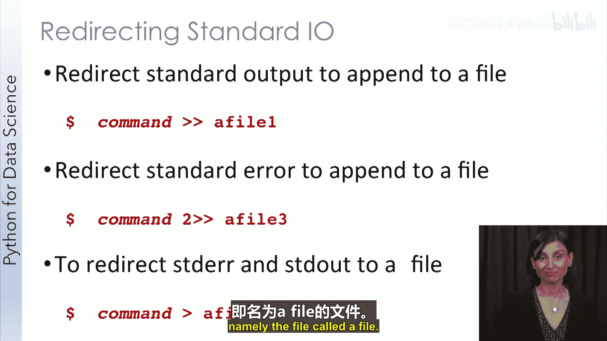
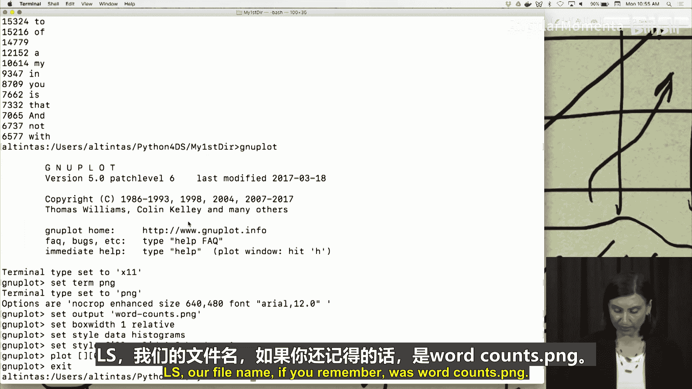

# 011：Unix系统导论

在本节课中，我们将要学习Unix操作系统的基础知识。Unix命令行及其提供的工具是任何数据科学项目的核心工具之一。在开始使用它们进行后续讲座和练习之前，我们将为您提供一个基于Unix的操作系统的基本介绍。

## 什么是Unix及其重要性

您可能会惊讶地发现，当今大多数操作系统都构建在Unix之上。除了基于Windows操作系统的那些，几乎所有操作系统都是如此。各种Linux发行版、macOS、iOS和Android只是当今流行的几个例子。

下图展示了基于Unix的操作系统的家族树，仅此图就显示了Unix的影响力。毋庸置疑，这使得Unix在工业界被广泛采用。事实上，许多数据和计算系统的后端，包括像Facebook和Google这样的行业巨头，都使用Unix。

作为一个操作系统，Unix提供了一个非常强大的开发环境，它建立在许多小型实用程序的可组合性之上，每个程序都专注于做好一件事。我们称这些程序为**命令**。用户可以使用这些命令和一些编程语法（或简称为脚本）来构建自己的命令和程序。

Unix无疑是大多数编程工作的必备技能。那么，为什么它对我们数据科学家来说很重要呢？除了作为一个强大的操作系统，Unix还提供了用于数据搜索、子字符串提取和转换的命令。有效使用这些命令可以帮助通过命令行快速操作和分析数据，这在探索性分析和数据准备阶段尤其有用。此外，Unix甚至提供了将命令链接在一起作为简单管道的快速方法。许多数据科学工具都带有命令行界面，这需要与命令行交互并通过Unix shell执行。在拥有一些Unix命令行经验后，您可能会发现更容易使用其他命令行工具和应用程序。

## Unix操作系统的三个主要部分

我们将从了解Unix操作系统的三个主要部分开始，即内核、shell和程序。

Unix shell是用户和内核之间的接口，它充当Unix的命令行解释器。简单来说，它允许内核执行Unix命令和其他用户开发的程序。例如，在这个shell中，`ls` 是一个用于列出文件的Unix命令。它将被shell解释，并在用户按下回车键时执行。

Unix shell在用户每次登录到类Unix系统时自动启动。它接受命令并为这些命令执行系统调用。它还通过shell环境提供了一个编程或shell脚本接口。

总结一下，在Unix中，命令是由shell执行的程序。每次shell从用户那里接收到一个命令时，它会将该命令传递给内核，内核进而创建一个具有唯一标识符的进程来运行它。

## 文件和进程

Unix的一个重要特性是，一切都被表示为一个进程或一个文件，甚至是硬盘卷。这就是为什么Unix没有像Windows那样的命名驱动器的概念。

*   **进程**：是一个正在执行的程序，由一个唯一的进程标识符（我们通常称之为PID）来标识。
*   **文件**：是数据的集合，并组织在一个目录结构中。用户和正在运行的进程创建这些文件。目录实际上只是包含其他文件的特殊文件。

文件被组织在一个分层结构中，看起来像一棵倒置的树，有一个根。为了访问和处理每个文件，我们通过这个树形结构中的所谓**路径**。路径用斜杠字符分隔我们接触到的树的每个节点。我们可以从根开始，经过由斜杠分隔的每个目录，到达每个文件，这被称为**绝对路径**。

例如，`/users/altas/f.txt` 就是文件 `f.txt` 的一个绝对路径。使用这个绝对路径，我可以在我的Unix系统中的任何地方访问到 `f.txt`。

另一种访问 `f.txt` 的方法是尽可能使用**相对路径**。如果我已经在我的主目录中（我的主目录是 `/users/altas`，在这里用绿色表示），我可以直接访问该目录下的 `f.txt`，而无需列出其他目录名。这被称为相对路径，因为它相对于我们正在操作的目录。我们将正在操作的目录称为**工作目录**。

因此，以 `/users/altas` 作为工作目录（用绿色表示），我可以说 `f.txt` 或 `./f.txt` 来访问 `f.txt`。这里的 `.` 指的是工作目录。

现在，假设我的工作目录是 `python_for_data_science`（用黄色表示），我想访问 `altas` 下的 `f.txt`。我可以选择将工作目录更改为 `altas`，然后使用我们之前用过的相对路径。或者，我可以使用 `f.txt` 的绝对路径。然而，Unix提供了一个更简单的方法来访问 `f.txt`。我们将利用 `..` 目录，它指的是我们当前目录的父目录。每个Unix目录都有一个特殊的实用程序，指向该目录的父目录。对于 `python_for_data_science`，其父目录是 `altas`。父目录用两个点 `..` 表示，我们可以通过 `../f.txt` 从 `python_for_data_science` 访问 `f.txt`。

## 路径快捷方式

现在，我想向您展示Unix系统中的另一个重要快捷方式：波浪号 `~` 字符。`/users` 下的任何目录（如 `altas`）都指向特定用户的主目录。对于该用户，`~` 就指向那个主目录。我可以使用波浪号字符来访问主目录下的任何内容，例如 `~/f.txt` 或 `~/altas/f.txt`。

在使用相对路径时需要注意：您需要检查您所在的目录，或者当您在运行的程序中使用相对路径时，需要知道该程序将在哪个目录中运行，否则会出现与路径相关的错误。一个用于检查目录的好命令是 `pwd`，它代表“打印工作目录”。

## 启动Unix Shell并实践

让我们启动一个Unix shell并回顾我们所学的内容。

这是我的Unix shell，如您所见，我的用户名是 `altas`。我在 `/users/altas` 目录下，这恰好是我的主目录。当我在这个目录下输入 `ls` 时，我会看到我有一个名为 `python_for_data_science` 的目录。`ls` 是一个Unix命令，代表“列表”，它列出任何Unix目录中的文件和文件夹。

我想将当前工作目录切换到 `python_for_data_science`，所以我会输入 `cd python_for_data_science`，这是另一个Unix命令。现在您会看到，我所在的目录从 `/users/altas` 变为了 `/users/altas/python_for_data_science`。如果我在这个目录下输入 `ls` 来列出文件和文件夹，我会看到两个文本文件：一个叫 `fruits.txt`，另一个叫 `shakespeare.txt`。

让我们清屏以便看得更清楚，我们使用另一个Unix命令 `clear`。现在，假设我在此工作目录中，想进行探索，但我忘记了这个工作目录是什么。在我的情况下，您看得很清楚，因为我配置了命令行来显示我们所在的工作目录。但我们可以使用另一个Unix命令 `pwd`（打印工作目录）来查看我们当前在哪个工作目录下。

这个目录中有两个文本文件。一个用于显示这些文本文件内容的Unix命令是 `cat`。如果我输入 `cat fruits.txt`，我将看到 `fruits.txt` 的内容。我也可以对 `shakespeare.txt` 做同样的事情，这是一个更大的文件，它有大约12,000行，但您会看到仍然可以用 `cat` 显示其内容。让我们清屏。

那么，我如何了解如何使用这些Unix命令呢？有一个Unix实用程序或命令（我们交替使用“实用程序”和“命令”这两个词，它们通常被称为实用程序命令），我可以使用 `man` 命令（代表“手册页”）来查找任何这些命令的文档。例如，我可以输入 `man ls` 或 `man cat`。另外，`ls` 实际上提供了一组开关选项。例如，我可以使用 `ls -l` 以长格式显示此目录中的所有内容。在长格式下，我会看到两个文件的信息：谁在什么时间创建了它们、文件大小以及文件的访问权限。我也可以输入 `ls -a`，这将显示此目录中的隐藏文件和文件夹。因此，除了那两个文本文件，我还看到了 `.`（指当前工作目录）和 `..`（指上级目录）。您知道，`python_for_data_science` 的上级目录是 `altas`，这恰好是我的主目录。

如何访问主目录下的任何内容？我绝对可以说 `ls /users/altas`。我可以说 `ls ~`，这是我的主目录。或者，请注意我现在如何使用 `..` 选项：`ls ..`，这是我们的父目录。我看到在这个主目录下还有其他文件和文件夹，如果我想访问其中任何一个，我可以说 `ls ../temp` 或 `ls ../cs1501` 等等。

让我们清屏并继续下一个视频。

## 基本文件系统命令

现在我们对shell有了一些基本了解，让我们开始探索Unix系统中的一些命令。在本视频结束时，您将能够：在Unix中列出文件和目录、更改到目录、创建新目录、解释什么是标准输入和标准输出，并说出六个简单的Unix命令。

在任何操作系统中，最基本、最基础的命令通常与能够管理文件系统有关。我们现在将讨论 `ls` 命令（用于列出Unix系统中的文件）、`mkdir` 命令（“创建目录”的缩写）以及 `cd` 命令（用于更改到目录）。我们还将讨论星号 `*` 字符，它充当通配符，用于替换给定模式中的任何其他字符。例如，如果我列出 `*.txt`，它将列出所有扩展名为 `.txt` 的文件。

在切换到shell之前，我还想谈谈shell启动时创建的三个文件描述符。这些描述符始终可供命令使用。

*   **标准输入**：是用户输入数据的默认来源。它通常是用户的键盘，但可以通过文件重定向轻松切换到另一个文件。
*   **标准输出**：是程序输出或打印其功能或主要输出的地方。默认是用户的终端或您的shell，但可以通过文件重定向轻松切换到另一个进程或另一个文件。标准输出应保留用于命令或程序的正确输出。
*   **标准错误**：是用于错误消息或从程序中产生的任何其他非功能性输出的输出通道，例如您的跟踪打印语句。它的默认值也是用户的终端窗口。

如果您是程序员，这三个文件也是程序员在读取、写入或报告错误或程序诊断时使用的。

## 实践基本命令

我们回到Unix shell。我们使用 `pwd` 查看打印工作目录，使用 `ls` 查看此目录中的文件和文件夹列表。我们讨论了 `cd` 来更改到另一个目录。但为了能够更改到另一个目录，我们需要有另一个目录。目前在这个目录中，我们只有两个文本文件。我怎么知道呢？如果我以长格式列出命令，我需要在一行的开头看到 `d`（如果是目录的话）。所以，在 `python_for_data_science` 中还没有目录，让我们创建一个。创建目录的命令是 `mkdir`，代表“创建目录”。所以是 `mkdir my_first_dir`。现在如果我输入 `ls`，我会看到 `my_first_dir` 在那里。我可以现在以长格式显示此目录的内容，我会看到第一行的开头有一个 `d`。现在，让我们也看看那些隐藏文件。如果您记得我们上一个视频，查看隐藏文件和文件夹的选项是 `-a`。我们将把它与长选项结合起来，所以我们会说 `ls -la`（长格式且显示隐藏项）。然后我们查看它。我们看到 `my_first_dir` 是一个目录，`..`（代表父目录）是一个目录，`.`（代表当前目录）也是一个目录。

现在我可以移动到这些目录中的任何一个，我将使用 `cd` 命令进入 `my_first_dir`。如果您查看里面，什么都没有。让我们清屏。我们在 `my_first_dir` 中，如果我们执行长选项 `ls -l`，什么都没有。那么如何获取那些隐藏文件呢？`ls -a`。现在如果我们说 `ls ..`（父目录），我们会看到 `python_for_data_science` 中的所有内容。我想查看该目录中 `fruits.txt` 的内容，所以我们会说 `cat ../fruits.txt`，我们将看到 `fruits.txt` 的内容。

如果我想将 `fruits.txt` 复制到我当前所在的目录，我可以简单地使用另一个Unix命令 `cp`（代表“复制”）。`cp ../fruits.txt .`。所以我说：获取父目录中的 `fruits.txt`（`../fruits.txt`）并将其带到这里（`.`）。`cp` 的语法是：复制源文件和目标位置。现在，如果我在这个目录下执行 `ls`，我会看到这里有一个 `fruits.txt` 的副本。如果我列出父目录，我仍然有一个 `fruits.txt` 的副本，因为我只是复制了它，并没有移动它。如果我希望系统中只有一个 `fruits.txt` 副本在这个目录里，我应该使用移动命令来处理 `shakespeare.txt`。我们知道父目录有 `shakespeare.txt`。我可以说 `mv ../shakespeare.txt .`。让我们清屏。所以我们使用了移动选项，对吧？现在当我说 `ls -l` 时，我会看到这里有 `shakespeare.txt` 和 `fruits.txt`。试想一下，如果我列出父目录 `ls ..`，您期望在那里看到什么？特别是，您期望在那里看到 `shakespeare.txt` 吗？答案是否定的，因为我们没有复制 `shakespeare.txt`，而是使用 `mv` 命令实际移动了它。

在这个目录中，我们有两个文本文件。如果我只想显示所有文本文件，我可以利用那个通配符选项，记住星号字符，然后说 `ls *.txt`。所以我在这里向shell传达的是：我想列出任何具有 `.txt` 扩展名的文件。因此，`ls *.txt` 将给我此目录中的所有文本文件。

现在我们已经回顾了基本命令，可以进入下一个视频了。

## 标准输入/输出重定向

在上一个视频中，我们以讨论标准输入和输出结束，并提到我们确实可以将它们重定向到其他文件。在本视频中，我们将学习如何做到这一点。在本视频结束时，您将能够：说出所有三个Unix文件描述符的名称、使用重定向操作符，并解释 `cat` 和 `more` 命令之间的区别。

在Unix和类Unix操作系统上，从命令行启动的每个进程都有三个与之关联的文件描述符。标准输入通常连接到键盘，标准输出和标准错误通常连接到启动应用程序的终端屏幕。然而，这些文件描述符可以被重定向并连接到文件、其他进程的输入/输出等。

*   **重定向标准输入**：要重定向标准输入使其来自文本文件而不是用户的键盘，我们使用小于号 `<` 操作符。语法是：`命令 < 文件名`。
*   **重定向标准输出**：我们使用大于号 `>` 操作符，或者可以显式使用文件描述符 `1>`。文件描述符1（FD1）是可选的，因为 `>` 默认重定向到标准输出。语法是：`命令 > 文件名` 或 `命令 1> 文件名`。
*   **重定向标准错误**：我们需要将文件描述符2与大于号操作符一起使用，写作 `2>`。语法是：`命令 2> 文件名`。

我们也可以同时重定向标准输出和标准错误，例如：`命令 > 文件5 2> 文件4`。这意味着我们将标准错误重定向到文件4，将标准输出重定向到文件5。最后，我们看到所有三个文件描述符被重定向到不同的文件。命令的输出使用 `>` 操作符重定向到一个文件（用绿色表示）。来自命令的错误流使用 `2>` 操作符重定向到另一个文件（用蓝色表示）。并且命令从另一个文件（用深红色表示）接受数据，而不是来自标准输入，使用 `<` 操作符。

关于这些重定向的一个有趣之处是，它们不需要按特定顺序排列，只要您将重定向操作符与文件名保持在一起即可。这意味着所有带操作符的颜色部分应该在一起。事实上，甚至命令名可以放在最后。另请注意，如果您编写了一个期望从终端输入的程序，并且您想从文件提供输入，输入重定向会很有用。

在标准输出和标准错误重定向中，将大于号操作符加倍（`>>` 和 `2>>`）将追加到文件，而不是覆盖文件。所以在这个例子中，我们看到命令使用 `>>` 追加到文件1，命令使用 `2>>` 将错误追加到文件3。这里还有第三个命令，它展示了一种将标准输出和错误重定向到同一文件的方法。`2>&1` 意味着将文件描述符2的输出发送到与文件描述符1输出相同的地方，即名为“文件”的文件。

## 实践重定向

让我们在命令行上回顾其中一些概念。

我们回到Unix shell。如果您记得我们的第一个Unix shell，我们最终在 `python_for_data_science/my_first_dir` 文件夹中。我可以通过输入 `pwd` 看到这一点。我也可以在这个目录中执行 `ls` 并查看其内容，您可能记得我们有两个文件：`fruits.txt` 和 `shakespeare.txt` 被移动到了这个目录。

现在我将使用 `cat` 命令显示 `fruits.txt` 的内容，我看到大约有8到9行。如果我对 `shakespeare.txt` 做同样的事情，您会注意到一些有趣的事情：它无法完全显示在shell中，所以它会快速滚动文件中的所有12,000多行，然后带我回到文件的末尾，我只能看到文件的结尾。如何解决这个问题？Unix中有另一个命令叫 `more`。您可能记得 `man` 命令是Unix中另一个用于查看所有这些命令手册页的命令。所以如果我说 `man more`，我会看到 `more` 命令的描述；如果我说 `man cat`，我会看到 `cat` 命令的描述。如果我说 `more shakespeare.txt`，它会从第一行开始显示，显示尽可能多能适应我的Unix shell窗口的内容。我只需按键盘上的空格键就可以浏览这个文件并查看所有行，或者我可以按 `Q` 键退出。所以这里有一个区别：`cat shakespeare.txt` 会滚动整个文件，我们看不到文件的开头（当然我们可以用鼠标向上滚动，但我们不希望这样）。而 `more shakespeare.txt` 会显示尽可能多能适应我们shell窗口的文件内容。

为什么这有用？因为我们想浏览文件，有时对于这些较长的文件，我们想对其做些操作，比如排序或计算行数。假设我想对 `fruits.txt` 的内容进行排序。`sort` 是一个Unix命令，我们可以用它进行快速数据操作。我会说 `sort fruits.txt`，我将看到 `fruits.txt` 的所有内容按字母顺序排序。现在我将获取排序后的 `fruits.txt` 并将其保存到另一个文件中。这里要使用的是标准输出重定向大于号 `>` 符号，我会称该文件为 `fruits_sorted.txt`。我在标准输出中看不到任何内容，因为我将标准输出重定向到了这个文件。如果我现在 `cat fruits_sorted.txt`，当然，我们可以像之前看到的那样直接将文件名提供给 `cat` 命令。或者，`cat` 实际上可以接受来自文件的重定向输入，例如 `cat < fruits_sorted.txt`，我会看到该文件的内容。所以，这与我们之前看到的命令的标准输出相同。

接下来我要做的是进一步操作这个文件，只获取其中的唯一行。我可以查看 `fruits_sorted.txt` 并获取其中的唯一行。这里我们看到重复的苹果和桃子，现在只剩下苹果、葡萄、甜瓜、橙子、桃子和草莓，共六行。所以这个文件中有六种唯一的水果名称。如果我想将其保存到另一个文件，我会说 `uniq fruits_sorted.txt` 并将输出重定向到 `fruits_unique.txt`。我可以快速查看 `fruits_unique.txt` 的内容，看到它与命令的标准输出相同。如果我现在列出目录，我会看到四个文件，而不仅仅是 `fruits.txt` 和 `shakespeare.txt`，我还会看到 `fruits_sorted.txt` 和 `fruits_unique.txt`。

为什么这有用？因为有很多Unix命令，我想快速将输出保存到文件中，也许在这个例子中计算数量。我如何计算唯一水果的数量？那就是计算 `fruits_unique.txt` 中的行数。如果您记得我们之前的视频，`wc` 命令有一个 `-l` 选项可以只给我们文件中的行数。所以我会说 `wc -l fruits_unique.txt`，它会给我数字6作为行数。所以在我们原始的 `fruits.txt` 中有六个唯一的水果名称。您可以看到，我们已经开始使用我们拥有的Unix命令进行一些数据探索。我们有一个包含一堆水果名称的文件。我们想看看其中有多少个唯一的水果名称，或者我们可以查看其排序选项。所以我们在用这些数据做些什么。如果您将该文件视为数据集，我们正在操作和探索该数据。

我也可以使用这个命令，比如在Unix中使用 `who` 命令，它显示当时有多少用户或谁登录了Unix系统。如果我只说 `who`，我会看到三个 `altas` 登录，因为我打开了三个shell。我可以简单地将此命令的输出重定向到一个名为 `names.txt` 的文件。我会看到所有这些名称都保存在我的shell中的 `names.txt` 文件中。我如何使用它？我可能会浏览它，并向当时登录的所有用户发送电子邮件。有许多Unix命令利用标准输入。之后，也许我会说，我将这些名称作为标准输入提供给另一个命令，获取这些名称，也许使用 `mail` 命令向这些用户发送标准消息等等。实际上，我可以通过将正确的输出重定向到正确的文件来操作这些文件，并可以将其用作在另一个操作中生成的数据集。

但重定向是如何工作的？我想向您展示的另一件事是：命令组一起执行，以及重定向如何应用于与其耦合的命令。要将两个命令串在一起，我可以说 `pwd`，然后紧接着执行 `ls -l`，如果我使用分号 `;` 操作符。在 `pwd` 之后输入分号，意味着执行 `pwd`，然后紧接着执行 `ls -l`，就像在shell上一个接一个地键入这两个命令一样。所以我将在这里看到两个输出：`pwd` 的输出，然后是我刚刚键入的 `ls -l` 操作的输出。

现在假设我想将这两个命令的输出重定向到一个名为 `output.txt` 的文件。请思考一下，您期望在标准输出中看到什么？您实际会看到的是第一个命令的输出，因为这个重定向操作符 `> output.txt` 只应用于与其捆绑的命令。如果您希望所有这些输出（`pwd` 和 `ls -l` 的输出）都进入 `output.txt`，我们需要将它们放在括号中。所以我可以输入 `(pwd; ls -l) > output.txt`。现在如果我 `cat output.txt`，我会看到这两个命令的所有输出都被重定向到了 `output.txt`。因此，我们实际上通过将这两个命令缝合在一起并将它们放在括号中，创建了一个复合命令。

我想向您展示的另一个不太有趣但有用的Unix结构是：我们可以通过将重定向输出发送到空设备 `/dev/null` 来抑制这些重定向的输出。在这个例子中，我本可以说，将输出发送到 `/dev/null`，而不是 `output.txt`。这样它就不会去任何地方，只会被忽略；它不会显示在标准输出上，也不会进入特定的文本文件。所以有一个Unix程序的笑话：如果你想忽略某人，你只需告诉他们“我把你重定向到 `/dev/null` 了”，这就是这个说法的来源。

我们刚刚回顾了标准输入/输出和重定向，希望您能自己更多地练习这些重定向。在下一个视频中，我们将回顾其他一些有趣的Unix功能。

## 管道和过滤器

正如我们在现场演示中看到的，当我们将命令输出重定向到文件时，为了将数据从一个命令传输到另一个命令，会保存很多文件。相反，我们实际上可以使用Unix中的其他东西将一个命令的输出**管道**传输到另一个命令。在本视频中，我们将解释什么是Unix管道，并回顾一些可以转换通过管道传输给它们的内容的特殊命令，这些命令称为**过滤器**。在本视频结束时，您将能够：用一个例子描述什么是Unix管道、说出五个过滤器命令的名称，并区分重定向输出和使用Unix管道。

简单来说，Unix管道是一种将一个命令的输出发送到另一个命令的输入的方法。在这个例子中，Unix命令 `cat` 的输出被管道传输到另一个Unix命令 `wc`，后者计算输出中的行数、单词数和字符数。请注意这个图示：当一个命令将其输出发送到管道时，该输出的接收端是另一个命令，而不是文件。在大多数情况下，接收命令将被触发运行。然而，在一些特殊情况下，命令会对通过管道接收的输入进行处理，就像这里的 `wc` 计算提供给 `cat` 命令的文件内容一样。我们称此类命令为**过滤器**。过滤器是一个程序，它接受输入并以某种方式转换其输入。当过滤器放在Unix管道之后时，它接受管道另一侧命令的输出并将其用作输入。`grep`、`more`、`less`、`sort` 和 `uniq`（正如我们刚刚看到的）都属于此类命令。

*   `grep`：将在给定的输入流中搜索包含给定字符串的行或查找模式。
*   `more`：正如您所见，将显示尽可能多能适应您的shell窗口的内容（类似于 `less`）。
*   `sort`：将按字母或数字顺序对输入流中的行进行排序。
*   `uniq`：将给出输入流中的唯一行。

但主要的一点是，所有这些命令都将以某种方式转换它们的输入。

## 实践管道和过滤器

让我们现在回顾一些这些管道和过滤器，以了解它们的作用。

*   `ls -la | more`：有时当我们查看 `ls` 的输出时，该目录中有太多文件和目录，无法适应您的shell。因此，如果您简单地将其管道传输到 `more`，您将看到 `ls -la` 的部分输出，并且通过按空格键（正如我们在上一个视频中所做的那样），您可以看到该目录中其余的行或文件和目录。
*   `cat 文件名 | wc`：我们将看到 `cat` 输出中的行数、单词数、字符数，即文件名内容中的行数、单词数、字符数。
*   `man cat | grep file`：`grep` 在这里做的是，它将在 `cat` 命令手册页的每一行中查找“file”的出现。因此，您将获得 `man cat` 的输出，并且只能看到该手册页中包含“file”文本的行。
*   `ls | grep txt | wc -l`：我们有 `ls` 的输出，我们正在该输出中查找“txt”。`grep` 将输出包含“txt”的每一行，但我们并不止于此，然后该输出被管道传输到 `wc`。`wc` 输出中的行数将告诉您该目录中有多少个文本文件（如果您试图计算那里的文本文件数量的话）。
*   `who | sort > current_users.txt`：这个例子很好地结合了重定向和管道。这里我们看到 `who` 被管道传输到 `sort`，`who` 将告诉您当时谁登录了您的Unix系统。`sort` 命令将按字母顺序排序，并将其写入名为 `current_users.txt` 的文件中。

一个有趣的事情是，您可以像我们在第四行所做的那样，将多个管道链接在一起，创建一个小脚本。所以这里的双管道用于此目的。

在下一个视频中，我们将执行其中一些管道和过滤器，并使用这些命令探索一些数据集。

## 深入实践管道和过滤器

我们又回到了我的shell，我们打开了终端。让我们通过回忆上次所做的事情来开始我们的管道和过滤器现场编码会话。记得我们有一个文件 `fruits.txt`。在这个目录中，我们想计算其中唯一水果名称的数量。我们说过 `uniq fruits_sorted.txt`，并将其管道传输到 `fruits_unique.txt`。就像这样，所以我们将 `uniq` 命令输出中的唯一水果名称重定向到一个名为 `fruits_unique.txt` 的文本文件。然后我们使用这个文本文件与 `wc` 命令（单词计数命令）和 `-l` 选项来计算该文件中的行数。为什么？因为行数将给我们水果的数量，因为每一行都是一个唯一的水果名称。如果我实际显示该文件的内容，我们看到每一行都是一个唯一的水果名称。我可以说 `wc -l fruits_unique.txt`，我们可以看到6是其中唯一水果名称的数量。

您可能已经注意到这个命令的问题是：我们必须将 `uniq` 命令的结果保存到一个额外的文件中，只是为了计算水果数量。我们能做得更好吗？答案是肯定的，如果我们利用我们刚刚讨论的管道和过滤器。我们本可以只使用 `uniq fruits_sorted.txt` 并将其管道传输到 `wc -l`。让我们试试：`uniq fruits_sorted.txt | wc -l`，我们得到了6，作为其中的水果数量，非常完美。实际上，我们本可以做得更好。我们甚至不需要 `fruits_sorted.txt` 文件。我们可以直接输入，记得原始的 `fruits.txt` 文件吗？`cat fruits.txt`，它里面有所有这些水果名称。我们本可以直接说 `sort fruits.txt | uniq`。`uniq` 将接受 `sort fruits.txt` 的输出，但该输出将是排序后的名称，`uniq` 将从中挑选出唯一的条目。所以我们可以将其管道传输到 `uniq`，它将给我们唯一水果的数量。然后我们可以将其管道传输到 `wc -l`。注意我们得到了相同的答案，相同的结果，而且更快、更高效。您是否注意到，与我为获得相同结果而键入的所有其他命令相比，这一个命令有多短？这就是使Unix如此强大的功能之一，正如我们在第一个Unix视频中描述的那样。

现在让我们使用 `man` 和 `grep` 命令再看一个过滤器命令。正如我提到的，`man` 是Unix中的手册页命令。如果我说 `man cat`，我将获得 `cat` 命令的手册页。如果您查看此手册页，您会注意到“file”是多次使用的单词之一，但具体有多少次？我们在这个例子中试图计算它。我实际上可以说 `man cat | grep file`，使用 `grep` 在其中查找“file”这个词的模式。所以我可以将其管道传输到 `grep`，并找到该手册页中包含“file”一词的每一行。这里我们看到，在该手册页中有相当多的行提到了“file”这个词。现在我可以将其管道传输到 `wc` 命令（单词计数命令）并仅使用行数选项，我会看到该手册页中有10行提到了“file”这个词。

让我们继续，清屏。最后，让我们看一个管道和过滤器，它显示我的Unix系统中正在运行的进程。我们以前没有做过的一个命令是 `ps`，这是一个用于报告进程状态的命令，在Unix中代表“进程状态”。我们将使用 `ps` 来显示与所有终端关联的所有进程。所以要做到这一点，我实际上使用一些 `ps` 选项。如果我只说 `ps`，我会看到这里只有几个命令在运行。但如果我说 `ps -aef`，我会得到与所有终端关联的每一个进程，以及在我的Unix系统中运行的每一个进程。实际上，我们看到输出相当多，有很多进程，甚至无法适应我的终端窗口。现在让我们添加 `more` 命令，以便更好地查看这里的情况。为此，我实际上要稍微减小我的字体大小，以便向您展示更多内容。让我们执行 `ps -aef | more`。现在我将看到所有这些进程，正如您在顶部看到的。有UID、PID、PPID，这些是与进程关联的不同标识符。其中一些是父进程，一些是Unix系统中当前运行进程的唯一ID，一些实际上用于启动我们的终端和我们的一些Unix核心功能，这些属于系统和我们的内核。但如果您浏览这个，您会注意到第一行的UID并没有真正排序，我们可能想使用我们的 `sort` 命令对其进行排序。让我们创建一个管道来对 `ps` 命令的结果进行排序，但这次我们将添加一个重定向来保存排序过滤器命令的结果。如果我只是说 `ps -aef | sort`，也许我会将其管道传输到 `more`，这样我现在可以看到它们都排序了。您在这里看到，包括第一个标题行，它仍然在我的终端中。也许我想稍后处理该文件以了解其中一些命令，所以我可以不使用 `more`，而是直接说将其重定向到 `output.txt`。现在，`output.txt` 将包含格式化的数据，我想使用它。我能够以一种方式快速准备数据以供进一步分析。

我想在这里提到的一件事是：我们有管道传输到 `sort` 命令，正如您所见，并且我们有过滤器（即 `sort` 命令），它处理并对 `ps` 命令的输出进行操作。所以 `ps` 命令被管道传输到一个过滤器（这恰好是 `sort` 命令），但有一个重定向——记住，有五种命令，其中一些是过滤器命令，一些只是不对此输入执行任何操作的常规命令，我们重定向到文件，比如 `output.txt` 是一个文件，我们将 `sort` 的输出（通常进入标准输出）重定向到一个名为 `output.txt` 的文件。

在这个对管道和过滤器的快速介绍之后，在下一个视频中，让我们专注于一些过滤器命令和其他我们可以利用的Unix实用程序，以进行快速的探索性数据分析，就像我们在这里开始的那样，通过转换 `ps` 的结果并将其保存到文件 `output.txt` 中（这些结果的排序版本）以供进一步数据分析。

## 更多过滤器命令和数据分析

在我们的管道和过滤器演示中，我们看到了Unix命令在链接在一起时如何促进复杂的数据操作。过滤器命令通常为数据分析师提供了一种快速检查和转换数据的方法。现在我们将回顾其中一些命令并提供更多示例。在本视频结束时，您将能够：使用Unix命令对文本数据进行排序、清理、剪切和探索、在Unix shell上绘制数据，并使用管道和过滤器在Unix中进行快速数据探索。

当我们处理文本文件或Unix命令的输出时，我们主要进行文本数据操作和搜索。一些有助于实现这些目标的有用命令是：`grep`、`cat`、`wc`（单词计数）、`sort` 和 `uniq`，以及 `head`、`tail`、`cut`、`sed` 和 `find`。虽然我们在早期的编码会话中讨论了前五个命令，但我们还没有看到这里列出的第二组命令。

*   `head` 命令用于列出文本文件或输入流的前N行。
*   `tail` 命令列出最后N行。
*   `cut` 命令是一个非常强大的命令，它为我们提供了一种剪切文件每一行的一部分的方法。
*   `sed` 或流编辑器用于对输入流（如文件或来自管道的输入）执行基本的文本转换。
*   `find` 将使我们能够在文件系统或层次结构中进行快速搜索。

这些命令最好通过示例来学习，所以让我们看看可以使用这些命令在Unix中解决的两个问题。考虑到我们拥有的莎士比亚作品的文本文件，我可以尝试找出他所有作品中使用频率最高的单词，甚至可以创建前15个单词的图表。我也可以专注于我的基于Unix的系统，并查找在我的系统中运行最多进程的前三个用户ID。我还可以只转换其中一个文件，比如我们有的 `fruits.txt`，使其所有字母都变为大写。我们将在即将到来的现场编码会话中关注这三个问题，但让我描述一下第一个问题的管道和过滤器语句。

在第一个命令中，我们将标准输入重定向为来自 `shakespeare.txt`。由于此文件每行有许多单词，我们首先关注 `sed` 命令，将单词之间的每个空格转换为换行符。在此命令之后，我们应该有一个每行一个单词的标准输出流，以及一些在运行此命令之前存在的空行。然后我们对此输出进行排序，并删除剩余的空行。最后这两个用于排序和删除剩余空行的命令的顺序无关紧要，因为它们为即将到来的 `uniq` 命令准备输出流。现在我们需要找出文件中唯一单词的数量。`uniq` 命令的 `-c` 选项为我们提供计数以及各个单词（计数所属的单词）。现在我们有了每个单词的计数，我们需要使用 `sort` 命令的 `-nr` 选项进行数字排序。最后，我们使用 `head` 命令获取 `sort` 命令输出中的前15行，并将输出写入一个名为 `counts_vs_words` 的文件。这个长而有效的单行命令帮助我们在shell上进行快速数据探索，而无需编写大型程序。想想看，否则您将需要使用多少行Java或C代码来执行相同的操作。请注意，在除macOS之外的Unix系统中，`sed` 正则表达式可能看起来更简单，它只是说：将每个空格字符（`\s`）替换为换行符（`\n`）。

接下来，我们看到这些命令的类似用法用于我们的第二个问题，我们将在现场编码会话中更多地关注这个问题。最后，我们将使用一个新命令 `tr` 命令将 `fruits.txt` 的内容转换为全部大写字母。接下来，我们将可视化我们的发现以完成我们的探索性分析。Unix中用于绘图的简单工具称为 `gnuplot`。虽然在本课程中我们将使用Matplotlib和其他更高级的Python包进行可视化，但我想向您展示一个Gnuplot示例，以演示您可以通过shell使用Gnuplot做什么。

## 现场数据分析实践

现在我们回顾了所有命令，让我们开始在Unix shell上进行现场编码会话。

我们回到shell。这是我的 `python_for_data_science/my_first_dir` 工作目录，所以我们可以在这里看到 `pwd`，我们可以看到我们在哪里。让我们执行 `ls`，在这个目录中，我们有 `fruits.txt`，我们有 `shakespeare.txt`，我们探索过它们。让我们使用 `head` 和 `tail` 命令以及一些管道和过滤器进行更多探索。我可以首先查看 `fruits.txt` 的前五行，如果您记得 `fruits.txt`，它里面有一些水果名称，对吧？我将使用 `head -5 fruits.txt` 获取前五行，我看到我得到了前五行。然后也许最好查看我拥有的所有水果文件的前五行。在这种情况下，记住星号是通配符操作符，我们将使用它。所以如果我只是说 `head -5 fruits*`，我会看到那里所有的水果文件，对吧？`fruits_sorted` 的前五行（苹果被很好地排序了）、`fruits_unique`（我们没有任何重复的名称，因为它们都是唯一的名称），然后我们有 `fruits.txt`。所以我们在上一个会话中做了这个。我也可以将输出管道传输到 `cat` 命令，但它无论如何都会显示它接收到的输入，但为了完整性，让我们清屏并说 `head -5 fruits* | cat`，我们看到相同的输出。

让我们使用相同的逻辑查看所有水果文件的最后三行。停一下，想想您将如何使用 `tail` 命令获取最后三行。我们只需将这里的 `head`