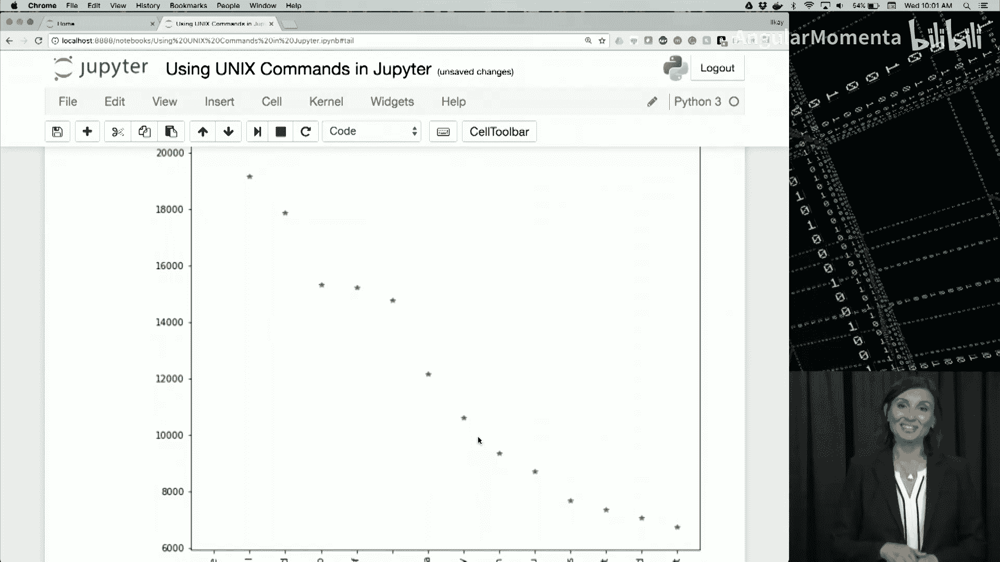

# 012：为何使用Jupyter笔记本 🚀

在本节课中，我们将学习Jupyter笔记本的基础知识，包括其核心功能、创建与运行代码、使用Markdown进行文档编写，以及如何管理笔记本文件。Jupyter笔记本因其结合代码、文档和结果于一体的特性，已成为数据科学社区中广泛使用的工具。

## 为何选择Jupyter笔记本？ 🤔

在课程早期，我们已经见过Jupyter笔记本的示例。本周，我们将开始一起构建笔记本，并更深入地使用它们。首先，我们需要讨论为何选择Jupyter笔记本。

通过本视频的学习，你将能够描述Jupyter笔记本的特性，这些特性使其在数据科学社区中迅速获得广泛认可。

Jupyter提供了许多功能，其中一些我们已经提及，但让我们回顾一下。数据科学过程涉及我们在课程早期学到的步骤。Jupyter笔记本允许我们通过结合笔记、代码和图形来记录这个过程。最重要的是，结合这些功能使其他人能够阅读笔记本，理解每个步骤背后的动机以及决策的原因，这促进了良好的协作。

与文档和协作的重要性相一致，这也体现了良好的科学实践。如果其他人想要检查你的结果或在你的发现基础上进行研究，他们可以确切地看到你是如何进行研究的。几个世纪以来，对他人方法的复制和检查一直是科学过程的核心要素，但计算工具的出现引发了关于如何在使用计算进行科学时最好地确保此类实践的讨论，而Jupyter笔记本正是为此而生。

Jupyter笔记本不仅包含你的笔记和过程，还包含你的结果。你可以通过各种方式轻松地与同事分享笔记本，并在过程中展示你的结果。

最后，正如我们之前提到的，Jupyter支持Julia、Python和R这三种当今进行数据科学最流行的编程语言，以及其他语言。我个人一看到Jupyter提供的功能就转向了它，我的许多同事也做出了同样的转变。因此，本课程旨在让你熟悉并开始使用笔记本。

为了让你入门，我们将从Jupyter笔记本的基础知识开始，以便在本视频结束时，你将能够创建Jupyter笔记本并在其中运行Python代码。

## 开始使用笔记本环境 💻

现在你已经完成了Jupyter笔记本的设置，并且我们回顾了Jupyter的一些背景知识，让我们开始使用笔记本环境。

你看到的第一个页面称为仪表板，它基本上列出了你启动Jupyter笔记本的文件夹内容。你可以通过这个仪表板在文件系统中导航，就像任何其他文件资源管理器界面一样。需要注意的是，这个文件系统是Jupyter笔记本服务器运行的地方，它甚至可能在另一台机器上。如果你不使用本地主机作为服务器，你只会看到另一个界面。

此时，我想提醒你，如果你还没有开始，请跟着我一起操作。我们知道在线课程成功的最大障碍之一是开始使用基础设施和学习环境。所以我真的希望你和我一起做。我们只是要启动我们的第一个笔记本，运行一些初始代码，并添加一些文档，这不会花费你太多时间，但会让你开始运行。如果你现在设置好，在课程的其余部分，你将能够跟随我们展示的材料在笔记本中操作，并自己尝试代码。

现在，让我们通过“新建”按钮创建一个新笔记本。在右上角，我们将选择Python 3作为我们的Python版本。

现在我有了一个笔记本。我点击顶部的“未命名”来命名它。我将其命名为“Intro notebook”。我们重命名了我们的笔记本。现在，如果我们回到仪表板，我们会看到一个名为“Intro notebook.ipynb”的文件，这就是我们刚刚创建并重命名的笔记本。

一开始，有时会有些混淆，因为笔记本应用程序和笔记本文件都称为“notebook”，但它们是分开的。笔记本应用程序是一个Web应用程序，它在浏览器中创建界面并执行Python和其他语言的代码。笔记本文件是一种文件格式，扩展名为`.ipynb`，它将代码、图像和文本保存在一个可以共享的单一文档中。正如我们之前所说，这个功能在数据科学中获得了很大的流行。

你可能已经意识到，“Intro notebook”在不同的浏览器标签页中。在你的浏览器中，任何我打开的笔记本都会有一个标签页，你可以同时打开多个。现在，让我们开始使用代码单元格进行编码。希望你正在跟着操作，但如果你落后了，请随时暂停视频并尝试我展示的每一步。一开始花些时间是正常的，所以如果有时感到困惑，请不要担心。

我现在点击第一个单元格。只需用鼠标点击笔记本中的矩形单元格，然后输入Python代码，比如我可以输入`print("Hello world")`，这是任何计算机科学编程课程中的传统问候语。

我可以通过几种不同的方式运行这段代码：一种是转到顶部的工具栏并按下运行按钮，我应该会看到结果，就像我们在这里看到的“Hello world”被打印出来；或者我可以重新点击那个单元格，同时按下`Shift` + `Enter`，它应该会运行相同的单元格。

请注意，这是在称为内核的Python进程中执行代码。基本上，每个打开的笔记本或浏览器标签页都有一个在后台运行的内核。Jupyter笔记本应用程序与内核通信，让它加载数据并执行代码。`Shift` + `Enter`或那个播放按钮会在执行时或内核执行时在第一个单元格下方创建另一个单元格。所以这里的这个是我们的第二个单元格。

因此，我们可以说Jupyter笔记本是单元格的集合，其中一些包含我们刚刚做的代码。现在我们已经学会了使用单元格，让我们执行更多代码，例如，你可以将笔记本用作计算器。我们可以问的一个问题是：一年有多少秒？所以我们需要计算天数乘以24（小时）乘以60（分钟）乘以60（秒）。记住，我们可以通过工具栏上的运行按钮或`Shift` + `Enter`来运行它。

所以我通过按`Shift` + `Enter`来运行它。我得到了那个大数字作为输出。你可能已经注意到，当我打印某些东西时，它会显示为代码单元格下方的文本。如果我像这里一样运行一个没有赋值或打印语句的计算，它会作为输出行出现，我们为那个数字有一个输出行。

那个数字很难阅读，它是一个很大的数字，所以让我们把它转换成百万。为此，在下一个单元格中，我将输入`_ / 1e6`，然后按`Shift` + `Enter`。我们看到输出变成了以百万为单位的数字。这里让我解释一下我做了什么：`_`指的是最后一个执行的单元格的输出，因为我们之前执行了那个输出行。我们使用10的6次方的简写科学记数法将其转换为以百万为单位的数字，然后我们运行它，大约是3153.6万秒，这样更容易阅读。

现在我在想，闰年呢？因为闰年有366天。Jupyter笔记本的好处是你可以回到单元格，更新它并再次运行。所以，为了计算闰年，我只需转到那个输出行，它显示了执行的顺序，我将去更新那行，将365改为366。修改单元格后，我们将用新问题计算秒数：闰年有多少秒？所以我按`Shift` + `Enter`，我们看到数字已经改变。

但由于我们还没有执行下一个单元格，那个数字还没有改变。但环境将我们放到了下一个单元格，所以我们可以再次重新运行那个相同的单元格。所以我们有那个输出行，并且我们知道那个输出行是在之后执行的，因为那里的数字顺序更大。所以我现在要在那个输出行上按`Shift` + `Enter`，现在是输出行，我们知道那个数字已经更新了。

很好。但也许我们希望两者都在我们的笔记本中，我想有闰年有多少天的问题，也想要有平年。那我们该怎么做？这里我们可以复制并粘贴代码单元格，为与两个问题相关的代码设置单独的单元格，而不是完全更新单元格。为此，我将使用工具栏上的剪切和粘贴按钮。

所以我要转到那个单元格，点击那个输出行，与之关联的单元格，这里有剪切和粘贴，我只需复制，然后按粘贴按钮。现在我有两个单元格。在第二个单元格中，我可以输入`365 * 24 * 60 * 60`，然后重新运行它。我将得到两个问题的答案：平年和闰年各有多少秒？当然，我也需要对百万转换做同样的事情，所以我可以去那里粘贴。我需要点击我想要粘贴的上方单元格。

所以如果我现在去输出行并按`Shift` + `Enter`运行那个，按`Shift` + `Enter`运行下一个，按`Shift` + `Enter`运行输出行，现在它变成了输出行，按`Shift` + `Enter`运行最后一行，我们一切都按顺序很好地执行了。

到目前为止，我们使用了只有一行的代码单元格。但实际上，代码单元格中的代码不必像我们在快速示例中所做的那样只有一行，你可以在笔记本中执行任何类型的Python代码，有时可能简单到导入一个模块，有时可能是打印一个变量或创建复杂的分析或图表。

但现在让我们用一个两行代码的例子。如果你在那里运行任何Python代码，我现在点击最后一个单元格。如果我简单地说`x = 4 + 3`，然后在下一行`print(x)`。现在当我按`Shift` + `Enter`运行时，环境将运行那个代码块。

当你点击这个时，你会注意到一些事情：如果我使用上下箭头，我可以在不同的代码行之间移动。一旦我到达顶行，我可以转到单元格。但是当我有很多行并且想要快速在不同代码单元格之间切换时，这可能有点挑战。也许你想在不使用鼠标的情况下，仅通过键盘快速上下移动几个单元格。

为此，笔记本界面被实现为模态的，这意味着如果你在单元格边框处按`Escape`键，就像我在这里要做的那样，在输出行单元格处按`Escape`，你现在可以使用键盘上的上下箭头来更改单元格。在我这样做之前，光标在`print(x)`行，所以如果我不在那种我的单元格被突出显示为蓝色的转义模式，如果我按上箭头，我会进入`x = 4 + 3`行，现在我可以按上箭头在单元格之间移动。这是一个非常有用的功能，我可以去执行这些，并且它仍然处于那种模态模式。

那么现在我们如何摆脱其中一些单元格呢？让我们点击底部的代码单元格，它变成了绿色。让我们输入。我会输入`print("temp")`，因为我剪切了这个。现在，也许我想快速检查一些东西，但我不希望它永久留在我的笔记本中，我可以直接点击它，然后在上面的工具栏中简单地选择“剪切”，它就会被删除。

让我们在这里结束代码单元格的介绍，随着课程的进行，你会看到更多。接下来，我们将实际看看笔记本中一些称为Markdown单元格的特殊单元格。我们刚刚学会了在笔记本中运行代码，但还没有使用记录我们分析的功能。在这个视频中，我们将学习如何做到这一点。

通过本视频的学习，你将能够在Jupyter笔记本中添加和格式化文本。

## 使用Markdown单元格进行文档编写 📝

现在我们将从上一个视频结束的地方继续，使用另一种称为Markdown单元格的单元格类型。

让我们打开一个新单元格，这次我们将使用加号工具栏按钮。我按加号，然后会看到一个新的单元格被插入到突出显示的单元格下方。我们现在可以点击单元格，并通过在笔记本右上角的下拉菜单中选择“Markdown”来将单元格的用途从代码更改为Markdown。

所以现在这个单元格，当我点击它时，它是一个Markdown单元格。这意味着我们可以在其中编写文本而不是代码。这对于记录你的数据分析流程非常有用，所以我可以直接输入“Hi”，然后运行它，我会看到有文本，所以我实际上可以再次点击那个文本单元格，回到Markdown单元格模式。

尽管Markdown单元格是一种设计简单的文本标记，类似于文字编辑器，但你可以使用这些Markdown单元格进行相当多的格式化和美化，以及科学编辑。Markdown单元格支持HTML和其他文本格式化语言，如LaTeX。

例如，我们可以创建项目符号列表。让我在这里实际做得更好一点。然后我转到下一行，输入`* `（星号加空格），我放在这个空格后面的所有内容都会被渲染成一个项目符号列表，所以我可以输入“One fish”、“Two fish”、“Red fish”、“Blue fish”。当我运行这个并按`Shift` + `Enter`时，它会将我刚刚输入的内容创建成一个项目符号列表。所以我们现在不是运行代码，而是通过这个文本标记单元格渲染HTML。

你可以用它做很多事情，我们也可以创建标题或标题。为此，我们将使用井号`#`符号。所以如果我们输入一个井号，它已经显示这是标题一。这是Markdown。如果我们输入两个井号，它会使其变小一点，就像标题二。如果我们继续这样，三个井号将是标题三，依此类推。当我按`Shift` + `Enter`时，我会看到这些被渲染为我想要的，即标题、项目符号列表和文本。

我们还可以做粗体文本。所以我只需输入`**示例文本**`，如果我按`Shift` + `Enter`，它会将其格式化为粗体。我可以通过使用斜体字体来使事物变为斜体或强调事物，我可以输入`*示例文本*`，它已经开始将其编辑为斜体。或者斜体。我看到它强调了最后一行。

链接，比如`google.com`，我们怎么做？如果你直接放一个`http://google.com`在这里，它会自动将其渲染为指向`google.com`的链接。

当然，有很多渲染文本的方式，如果你想了解更多，我们在后续阅读中提供了一个Markdown指南。另外，作为旁注，大多数人认为Markdown是代码注释或记录代码，但我认为它更像是写科学论文或白皮书，你可以用Markdown创建非常复杂的编辑，例如，你可以使用LaTeX方程创建方程。LaTeX是一种文档编辑语言，具有用于科学写作的许多文本组件的语法，包括编写方程。

所以让我们转到下一个单元格。也许在这里我可以向你展示，我将再次从那个代码单元格切换到Markdown单元格。然后我在那里输入一个LaTeX方程。要在LaTeX中写方程，我需要将它们写在两个美元符号之间，就像这样。然后我就可以写我的LaTeX方程，然后我们会看到它如何被渲染成一个格式漂亮的方程。让我们渲染这一行。正如你在单元格中看到的，我们输入了一个漂亮的小LaTeX方程代码。即使它是一个Markdown单元格，而不是代码单元格，它也知道如何将其渲染成这个美丽的方程。

所以在这里我可以添加更多文本，这是粗体的LaTeX方程。现在我输入它，当我按`Shift` + `Enter`时，我会看到它被很好地格式化，几乎就像你在科学论文中看到的那样。这非常棒，例如，当你从科学论文或你想尝试的数据科学算法中实现代码时，其中涉及很多数学，你当然可以先用LaTeX写一个优雅的方程，对人类来说更容易阅读，然后你可以在紧随其后的代码单元格中的Python函数中实现它，这使你的合作者或读者更容易理解。

接下来，我们将讨论如何在笔记本中使用代码单元格进行成像。

## 管理笔记本文件与分享 🤝

你现在已经处于使用笔记本的良好状态，但让我介绍一些更有用的实践。

通过本视频的学习，你将能够管理Jupyter笔记本文件并与你的团队分享笔记本。

所以在这个视频中，我们将更多地讨论如何更好地格式化和注释我们的笔记本，并在图像周围使用一些图像和Markdown。

我们将在本课程的第5周学习关于绘图和Python的更多内容，但如果你能耐心听我讲，并且请不要担心如果你不理解代码，我想向你展示如何在笔记本的代码单元格中生成图像，以及如何使用周围的Markdown来解释那个单元格。

所以我要转到我的笔记本，你看到最后一行，如果你点击它，如果你不确定它是Markdown还是代码，你已经在这里看到它指示是代码，但你也可以通过工具栏中的Markdown下拉菜单来检查。

所以这里我将使用一个简单的matplotlib函数叫做`plot`，我需要导入一些东西。它基本上是说导入`pyplot`和`plot`函数，我们将使用`plot`函数来绘制一个向量，`[0, 1, 0, 1]`四个值，不是吗？如果我在这里按`Shift` + `Enter`，我会看到图表被生成。再次，我们有四个值`[0, 1, 0, 1]`，我们只是使用一个简单的matplotlib函数绘制出来，我们将在本课程后面看到更多关于如何使用matplotlib创建可视化等内容。

现在也许我想解释这个图表，我该怎么做？我转到点击它下面的代码单元格，然后将其转换为Markdown。我可以简单地写：“这是一个使用matplotlib绘制的向量图。”就这样，我运行这个，这样我就可以看到我的文本实际上就在那个图表下面，并进一步解释那个图表。

让我们稍微向上移动一下我们的笔记本。为此，我将使用`Escape`键，然后使用上下箭头在单元格之间移动。我想回到我们计算的第一个问题：闰年有多少秒？这只是代码。在它上面，我想使用Markdown添加一行文本来解释那段代码是做什么的，或者我在那里试图做什么。

所以我转到那个单元格上方的单元格，也就是输出行，我转到那个输出行单元格，然后转到我的工具栏并点击“添加”。这里我可以点击我添加的新单元格，将其转换为Markdown，然后输入：“下面是计算闰年秒数的代码。”如果我们运行这个，我们可以看到我们正在很好地记录，我还没有改变太多，但我只是继续运行笔记本，看看如何通过按`Shift` + `Enter`逐个运行所有内容，每次都会将我们带到下一行。

现在我们已经完成了我们的笔记本。我们需要保存它。当然，笔记本应用程序会在你输入时保存检查点，但如果你想确保，你也可以选择“保存”或使用那个保存按钮。你会看到当我使用检查点时，这里创建了一个检查点，所以如果我想在以后转到该检查点版本的笔记本，我可以去点击它。

所以现在让我们关闭我们的浏览器标签页，我们已经完成了我们的笔记本，保存了它，现在让我们关闭浏览器标签页并转到我们的仪表板。在我们的仪表板上？我们看到那个绿色的笔记本就在我们的笔记本文件旁边，它显示正在运行，所以尽管我们关闭了它，运行笔记本的内核仍在运行。所以既然它在运行，我们可以直接点击并轻松打开它。

所以现在如果你想确保内核在我们关闭笔记本后没有运行，也许我们不会在近期使用它，并且我们想确保一切都保存并关闭，我们可以转到“文件”，然后在那里选择“关闭并停止”。当我们关闭它后回到仪表板时，我们会看到绿色的笔记本变成了某种灰色，笔记本不再运行了。

当然，要运行它，我们只需要重新打开笔记本。记住，内核被关闭了，但当我查看这个笔记本整体时，我之前所做的一切都保留了下来，所以一旦它运行，它就会一直保留，直到我去重新运行笔记本。所以如果我与协作者分享这个，他们将能够看到我的输出，然后他们可以更改并重新执行，或者他们可以通过按`Shift` + `Enter`重新执行相同的操作，他们甚至可以在内核下做“重启并运行全部”之类的操作。所以这个内核有不同的运行选项。

我想讨论的另一件事是，假设你完成了分析，并想把它发送给你的同事，他们当然可以像查看报告一样查看你的分析，但他们也可以在自己的机器上重新运行或轻松修改笔记本。如果你真的想保存一个不可执行的笔记本版本并保存在你的档案中呢？我们可以通过转到这里的文件菜单选项来做到这一点，你可以将笔记本下载为多种不同的格式，这里我将下载为HTML。

所以当我将我们刚刚创建的笔记本下载为HTML文件时，你会看到笔记本看起来就像我们在笔记本应用程序中看到的那样，但它是一个没有顶部名称和顶部工具栏的HTML文件，不可编辑，所以我们有了一个可以存档的笔记本版本，带有你上次运行该笔记本时的输出，这也使得随着时间的推移或如果你的协作者只想查看不可执行的结果，更容易记录每个系统的结果，你可以通过笔记本界面分享HTML文件或PDF。

至此，我们将结束Jupyter的介绍。在课程的其余部分，随着我们学习更复杂的Python数据科学模块，我们将向你展示其他一些笔记本功能。希望你会像我们一样享受使用笔记本，并跟随我们展示的所有不同应用的笔记本。

在对Jupyter笔记本进行了简要概述之后，我们现在将开始进一步使用笔记本。

在我们向你展示优秀的Python库之前，我想快速概述一下如何通过Jupyter笔记本使用Unix命令。

## 在Jupyter中使用Unix命令 🐚

尽管Python语言本身提供了使用Unix shell命令的方式，但Jupyter笔记本提供了一种更简单、更交互式的方式来使用Unix命令。我们只需在命令前加上感叹号`!`来执行它们，就像在Unix shell中执行一样。需要注意的是，Jupyter将使用你的默认Shell来执行这些命令，因此执行这些命令所需的任何调整都应基于你的Jupyter环境设置的操作系统。

现在让我们切换到我们的笔记本，执行一些我们回顾过的对数据科学家有用的命令。

让我们从`ls`开始。要显示与笔记本在同一目录下名为“Unix”的数据目录的内容，我们使用感叹号`!`加上`ls`命令。所以在我的笔记本环境和你的第3周文件夹中，你有一个名为“dot Unix”的文件夹。所以这里我们将去执行那个特定的shell命令，它说有一个Shakespeare.txt数据文件。

为了存储这个数据文件的名称，我将在笔记本中使用一个局部变量，就像我们通常在Python脚本中使用的方式。所以这里我们说`filename = "Unix/Shakespeare.txt"`。要显示这个变量，我们可以使用Unix方式，并在前面加上感叹号`!`来使用`echo`命令显示`filename`变量存储的值，或者简单地使用Python中的`print`函数，那么我们就不需要Unix那样的美元符号，我们只需将其作为Python变量使用。所以在这里，我们按`Shift` + `Enter`执行它，我们看到`echo`和`print`执行了相同的操作，输出了相同的行。

接下来，让我们显示文件的前几行和最后几行，以基本了解文件的头部和尾部。为此，我们将使用`head`命令。所以我可以快速用感叹号`!`执行`head`，加上`-n 3`显示前三行，加上`$filename`用于Unix变量解析，当我按`Shift` + `Enter`时，我们会看到前三行被显示出来。如果我想显示前30行，我可以改变那个数字为30，我会看到该数据文件的前30行，这是关于莎士比亚作品版权的一些免责声明。

对于底部的几行也是如此，查看文件的顶部和底部很重要，因为它让我们对文件有一些了解。为此，我们使用感叹号`!`加上`tail`命令。所以当我按`Shift` + `Enter`执行时，我会看到底部10行。让我们把那个数字改成大一点的，比如40，这样我们实际上可以看到一些关于莎士比亚的内容，所以我们看到在他的一部作品的结尾有一些内容。这应该告诉我们，它看起来是一个大文件，包含了莎士比亚的所有作品，在顶部和底部我们甚至看不到数据，只看到那些免责声明。

它有多大？我们可以使用`wc`（字数统计）来显示单词数、行数、字符数以弄清楚。所以这里我输入`!wc $filename`，当我这样做时，我得到大约124,000行、单词和字符。要只获取行数，我们使用带有`-l`选项的`wc`命令，这将在下一个输出行中显示。我们也可以使用管道和过滤器来做同样的事情，结合`cat`命令和`wc`命令。

现在让我们在文件中查找单词“parchment”的出现。正如你可能记得的，用于此的命令是`grep`。使用`grep`命令，它将显示所有至少包含一次单词“parchment”的行。所以这里我们输入`!grep -i parchment $filename`，这应该给我们所有包含“parchment”的行。当我按`Shift` + `Enter`时，基本上这些行中都有单词“parchment”在某个地方。

但具体有多少行？我们可以再次利用管道和过滤器。这次，让我们查找单词“liberty”而不是“parchment”，只是为了换个花样。我们要做的是：`cat $filename`通过管道传递给`grep`，在输出中查找“liberty”，并计算`grep`输出的行数，应该是这样的。如果我们没有`wc -l`，让我们暂时点击那个，我们只会得到“liberty”这个词，因为我们使用了`-o`选项。如果我将其传递给`wc`，我们刚刚移除的那个，我们会看到有71行。

因为我使用了带有`-o`选项的`grep`，我没有看到完整的行，只看到“liberty”这个词。现在让我们使用流编辑器`sed`来将所有出现的单词“parchment”替换为“manuscript”，并将结果写入一个名为“temp.txt”的新文件。我们可以这样做，然后在新的“temp.txt”文件中搜索单词“manuscript”。

所以我们将使用`sed`命令进行替换。这里我们说查找“parchment”，全局替换为“manuscript”，输入是我们的文件名，然后通过重定向写入“temp.txt”。我快速执行这个，现在我应该有“temp.txt”，你应该在你的第3周目录中都有“temp.txt”，你从那里打开了笔记本。

然后我们将去计算或查找“manuscript”在这个“temp.txt”中的出现次数。所以我们看到之前列出的“parchment”的相同行被列出，但“parchment”被替换为“manuscript”。当你快速将一组数据值替换为其他数据值时，这可能很有用。

现在让我们看看如何在管道和过滤器中一起使用`sort`命令和`head`命令。`head`在这里给我们前五行。正如你之前所见，`cat $filename`。如果我们对这五行进行排序，`sort`将根据ASCII数字按升序字符顺序排列这些行。

我们可以使用不同的排序选项。如果我们现在将这个输出传递给`sort`，通过一个管道，我们将按升序字符顺序排列这些行。就像这样。我们使用不同的排序选项，有时这里我们看到“liberty”这是按升序字符顺序排列的，意思是基于它们的ASCII数字。但如果我们想按第二组单词排序呢？所以“of”、“presented”和“releases”我们怎么做？通常我们处理的数据文件是空格分隔或逗号分隔的，所以我们将这些作为我们数据集中的列，也许想基于第二列排序。

为此，我们可以利用`sort`命令的选项，`-f`忽略大小写，我们现在说按第二列排序，加上命令的其余部分。我继续运行这个。我们看到“of”、“presented”和“releases”现在按正确的顺序排列。

接下来，我们将排序并找出唯一行的数量。记住，我们有大约124,000行文件在我们的数据文件“Shakespeare.txt”中。现在，让我们找出有多少唯一行，排序并将其传递给`uniq`命令，并计算行数，我们看到这里行数更少，有些行是重复的，看起来我们大约有110,000行。

为了总结一切，我们将计算数据文件中最频繁出现的单词。正如你在Unix练习中记得的，我们使用了一系列流编辑器命令进行一些处理，将空格替换为换行符，我们将从这里开始做同样的事情。在唯一字符计数和排序序列的末尾，我们将使用`head`命令检索前15个。

所以这与我们之前运行的管道过滤器完全相同，你只需要在开头加上感叹号`!`用于管道过滤器，正如你在这里看到的，然后如果你运行这个，它仍在处理，正如你看到星号在那里，它没有更新输入中的运行编号。我们会看到前15个被显示出来。所以发送`head`和`sort`命令是正确的，发送最后两个错误，但这是因为`head`在15行后停止。

那么我们如何将这个输出写入文件呢？我们会看到这个你知道这里。如果你运行这个，我们可以写入“count_vs_words.txt”。使用这个命令，按`Shift` + `Enter`，它仍在运行，正如你看到那里有一个星号。我们必须等一会儿让它运行完成。命令的标准输出将被写入“count_vs_words.txt”。记住`sort`给了我们一个错误，那是命令的标准错误，我们会在笔记本界面上看到，就像这里一样，所以这就是为什么我们在命令中留下了那个错误。

所以让我们`cat`显示“count_vs_words.txt”的内容。是前15个。我们没有移除空格，所以其中一些显示为那样。现在我们将利用Python的Matplotlib库来绘制莎士比亚作品中的前15个单词。所以这里再次，在第5周，我们将学习更多关于Matplotlib的知识，但这里我们看到一个使用Matplotlib的小脚本。就这样做，它显示“I”和空格，所有这些都很好地绘制在图表上。正如我之前提到的，我们将在第5周学习更多关于Matplotlib的知识。接下来，我们将讨论Python中的NumPy库，应该会很有趣。

---

在本节课中，我们一起学习了Jupyter笔记本的核心价值与基本操作。我们了解了Jupyter如何通过结合代码、文档和结果来促进数据科学工作流的记录与协作。我们实践了创建笔记本、运行Python代码、使用Markdown单元格进行格式化文档编写、管理笔记本文件以及通过`!`前缀执行Unix命令。这些技能为后续深入学习Python数据科学库打下了坚实的基础。