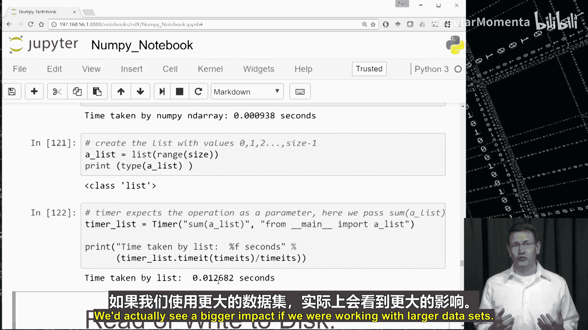

# 013：为何选择NumPy 🚀

在本节课中，我们将学习NumPy的核心价值。NumPy是Python中进行科学计算的基础包，尤其对于数据科学至关重要。我们将探讨其关键特性、速度优势以及它如何成为其他流行数据科学库（如pandas）的基石。

## NumPy的关键特性

NumPy提供了一系列用于科学计算的关键功能。

以下是其主要特性：

*   **多维数组支持**：NumPy的核心是`ndarray`对象，用于表示向量和矩阵。在进行数据科学工作时，我们几乎时刻都在与矩阵打交道。
*   **丰富的矩阵运算**：NumPy提供了大量可在矩阵上执行的操作。这包括线性代数中的基本运算，如矩阵的加、减、乘，也包含优化的统计运算和快速傅里叶变换等。
*   **广播机制**：处理矩阵和向量时，确保维度对齐是较复杂的环节。NumPy通过支持“广播”机制简化了这一过程，使代码更易编写和阅读。
*   **高性能与可扩展性**：NumPy的速度通常足以满足生产代码的需求。若需进一步优化，它还提供了与Fortran、C和C++等优化编译代码库交互的能力。

## 数据科学家偏爱NumPy的三个原因

上一节我们介绍了NumPy的功能特性，本节我们来看看数据科学家始终使用NumPy的三个核心原因。

以下是具体原因：

1.  **速度快**：使用NumPy数组通常比使用Python列表快10倍以上。为实现这种速度，NumPy数组的大小是固定的（与可动态改变大小的列表不同），并且数组中的所有元素必须是同一类型（例如，全是整数或全是浮点数）。这种限制使NumPy数组比列表更节省空间，并开启了一系列内存和计算优化。
2.  **功能强大**：如前所述，NumPy提供的操作非常实用。无论是计算向量或矩阵的平均值、矩阵乘法，还是基于索引或值选择矩阵的子集，都能轻松实现。即使后续使用pandas，你也会发现许多函数底层依赖于NumPy。
3.  **生态基石**：Python中许多我们喜爱的包都依赖于NumPy。例如，我们即将学习的pandas就是构建在NumPy之上的。虽然pandas提供了比NumPy更高级的功能，但在某些时候你仍会直接使用NumPy的功能。

## 开始使用NumPy数组

在接下来的视频中，我们将通过Jupyter Notebook深入探讨如何使用NumPy。本节我们将学习使用NumPy数组的基础知识。

在本节结束时，你应该能够创建一维和二维的`ndarray`，使用基本索引访问数组中的元素，并使用内置函数创建具有不同形状和初始值的数组。

就像使用Python的基本数据结构一样，我们将从创建`ndarray`和访问其元素开始。

### 创建与访问数组

首先，我们需要导入NumPy包。惯例是将其导入为`np`，然后使用`np`来访问该包中的函数。

```python
import numpy as np
```

现在，让我们创建第一个一维数组（或称向量）。

```python
an_array = np.array([3, 33, 333]) # 创建一个一维数组
print(type(an_array)) # 查看对象类型，应为 numpy.ndarray
print(an_array.shape) # 查看数组形状，应为 (3,)
print(an_array[0], an_array[1], an_array[2]) # 访问元素，输出 3 33 333
```

`ndarray`是可变的，这意味着我们可以更改其元素。

```python
an_array[0] = 888 # 将第一个元素改为888
print(an_array) # 输出 [888  33 333]
```

需要注意的是，NumPy数组是类型严格的。尝试将整数元素赋值为字符串会导致错误。

```python
# an_array[0] = 'a string' # 这行代码会引发错误
```

接下来，我们创建一个二维数组（即矩阵）。

```python
another_array = np.array([[11, 12, 13], [21, 22, 23]]) # 创建二维数组
print(another_array)
print(another_array.shape) # 输出 (2, 3)，表示2行3列
print(another_array[0, 1]) # 访问第0行第1列的元素，输出 12
print(another_array[1, 0]) # 访问第1行第0列的元素，输出 21
```

### 使用库函数创建数组

NumPy最便捷的特性之一是提供了多种库函数，用于创建具有不同预设值和大小的数组。

```python
# 创建一个2x2的零矩阵
zeros_array = np.zeros((2, 2))
print(zeros_array)

# 创建一个2x2的矩阵，并用9.0填充
full_array = np.full((2, 2), 9.0)
print(full_array)

# 创建一个3x3的单位矩阵（对角线为1，其余为0）
identity_matrix = np.eye(3)
print(identity_matrix)

# 创建一个1x2的全1矩阵（注意：这是二维数组，形状为(1,2)）
ones_array = np.ones((1, 2))
print(ones_array.shape) # 输出 (1, 2)

# 创建一个2x2的随机矩阵
random_array = np.random.random((2, 2))
print(random_array)
```

现在，你应该对创建NumPy数组和访问其中的元素感到比较自如了。在下一个视频中，我们将开始学习更高级的索引功能。

## 数组切片与索引进阶 🧩

在上一节中，我们学习了创建和基本访问数组。本节我们将探讨访问和排列`ndarray`中数据的不同方法。

在本节结束时，你应该能够使用切片索引来访问`ndarray`的子集，并理解这种索引方式会创建对同一底层数据的第二个引用。

### 切片索引

从字符串和列表的学习中，我们知道可以使用切片索引来获取这些数据结构的子集。我们可以使用类似的索引从NumPy数组中提取子区域。

首先，我们创建一个3x4的数组作为示例。

```python
import numpy as np
an_array = np.array([[11, 12, 13, 14],
                     [21, 22, 23, 24],
                     [31, 32, 33, 34]])
```

接下来，使用切片索引提取前两行（第0行和第1行）以及中间两列（第1列和第2列）。

```python
a_slice = an_array[:2, 1:3] # 行：0:2，列：1:3
print(a_slice) # 输出 [[12 13]
               #      [22 23]]
```

**重要概念**：切片`a_slice`指向的是`an_array`中相同元素的内存地址。这意味着切片拥有自己的索引系统。

```python
print(a_slice[0, 0]) # 输出 12，对应 an_array[0, 1]
```

修改切片中的元素会同时改变原始数组中的对应元素。

```python
print(an_array[0, 1]) # 输出 12
a_slice[0, 0] = 1000
print(an_array[0, 1]) # 输出 1000
```

如果你希望切片是原始数据的一个副本，而不是引用，则需要显式地进行复制。

```python
a_slice_copy = np.array(an_array[:2, 1:3]) # 创建副本
a_slice_copy[0, 0] = 9999
print(an_array[0, 1]) # 仍然输出 1000，原始数组未改变
```

### 更多切片示例

```python
# 获取第1行的所有列（返回一维数组）
row_rank1 = an_array[1, :]
print(row_rank1, row_rank1.shape) # 输出 [21 22 23 24] (4,)

# 获取第1行的所有列（保持二维数组形状）
row_rank2 = an_array[1:2, :]
print(row_rank2, row_rank2.shape) # 输出 [[21 22 23 24]] (1, 4)

# 获取第1列的所有行
col_rank1 = an_array[:, 1]
col_rank2 = an_array[:, 1:2]
print(col_rank1, col_rank1.shape) # 一维 [12 22 32] (3,)
print(col_rank2, col_rank2.shape) # 二维 [[12] [22] [32]] (3, 1)
```

### 数组索引

我们也可以使用索引数组来访问或重新排列大矩阵中的元素。

```python
# 创建一个4x3的数组
an_array = np.array([[11, 12, 13],
                     [21, 22, 23],
                     [31, 32, 33],
                     [41, 42, 43]])
# 创建行和列索引数组
row_indices = np.array([0, 1, 2, 0])
col_indices = np.arange(4) # 等价于 np.array([0, 1, 2, 3])

# 使用索引对访问元素
for row, col in zip(row_indices, col_indices):
    print(f"({row}, {col}) -> {an_array[row, col]}")
# 输出: (0,0)->11, (1,1)->22, (2,2)->33, (0,3)->41? (注意：col=3会越界，原示例有误)
# 更正的例子：使用有效的列索引
col_indices = np.array([0, 1, 2, 0])
print(an_array[row_indices, col_indices]) # 输出 [11 22 33 41]

# 通过索引数组修改元素
an_array[row_indices, col_indices] += 100000
print(an_array)
```

切片和数组索引是NumPy的核心，既方便又极其快速。在下一节中，我们将学习另一种基于数组值的索引方式。

## 布尔索引：基于条件筛选数据 🔍

在上一节中，我们学习了基于数组位置进行索引的各种方法。在数据科学中，我们经常非常关心数组中的值本身。

例如，我们可能想找出所有小于零或大于100的年龄，然后对这些值进行处理。为了进行这类数据清理，我们需要布尔索引。

在本节结束时，你应该能够使用条件索引来访问和排列`ndarray`中的相关数据。

### 创建布尔过滤器

首先，创建一个基础的示例数组。

```python
import numpy as np
an_array = np.array([[11, 12, 13],
                     [21, 22, 23],
                     [31, 32, 33]])
```

接下来，将条件与数组结合使用，创建布尔数组。

```python
filter = (an_array > 15) # 创建布尔过滤器
print(filter)
# 输出 [[False False False]
#       [ True  True  True]
#       [ True  True  True]]
```

现在，我们可以使用这个过滤器作为索引来获取原始数组中对应条件为`True`的值。

```python
print(an_array[filter]) # 输出所有大于15的值
```

我们也可以将这两个步骤合并为一步。

```python
print(an_array[an_array > 15]) # 一步完成条件筛选
```

### 复杂逻辑条件

我们可以组合更复杂的逻辑条件。

```python
# 获取值在20到30之间的元素
print(an_array[(an_array > 20) & (an_array < 30)])

# 获取所有偶数值
print(an_array[an_array % 2 == 0])
```

### 基于条件修改元素

我们也可以根据条件来修改数组元素。

```python
an_array[an_array % 2 == 0] += 100 # 将所有偶数值增加100
print(an_array)
```

过滤器在许多数据科学操作和其他涉及矩阵的计算机科学算法中都非常有用。例如，图像的绿幕抠图就利用了过滤函数将背景中的绿色像素替换为你选择的另一幅图像。随着课程的深入，我们将在清理数据时更多地看到这种应用。

## 数据类型与数组运算 📊

正如我们在NumPy介绍视频中提到的，每个`ndarray`都有自己的数据类型。本节我们将快速学习如何查看和设置该类型。此外，我们还将了解一系列数组运算。

在本节结束时，你应该能够检查和设置`ndarray`的数据类型，并熟练使用常见的数组函数。

### 数据类型

数据类型很重要。如果尝试将整数数组中的元素赋值为浮点值，将会出错。

```python
import numpy as np

# 创建整数数组
int_array = np.array([1, 2, 3])
print(int_array.dtype) # 输出 int64 (或类似)

# 创建浮点数数组
float_array = np.array([1.0, 2.0, 3.0])
print(float_array.dtype) # 输出 float64

# 显式指定数据类型
explicit_int = np.array([1, 2, 3], dtype=np.int32)
print(explicit_int.dtype)

# 强制转换输入数据的类型
# 将浮点数输入强制转换为整数（会截断小数部分）
forced_int = np.array([1.7, 2.2, 3.9], dtype=np.int32)
print(forced_int) # 输出 [1 2 3]

# 将整数输入强制转换为浮点数
forced_float = np.array([1, 2, 3], dtype=np.float64)
print(forced_float) # 输出 [1. 2. 3.]
```

### 基本算术运算

让我们看一些`ndarray`上常见的算术运算。首先创建两个维度相同的数组。

```python
x = np.array([[1, 2], [3, 4]], dtype=np.int64)
y = np.array([[5, 6], [7, 8]], dtype=np.float64)

print(x + y)  # 逐元素相加，结果为浮点型
print(np.add(x, y)) # 使用add函数，结果相同

print(x - y)  # 逐元素相减
print(np.subtract(x, y))

print(x * y)  # 逐元素相乘
print(np.multiply(x, y))

print(x / y)  # 逐元素相除
print(np.divide(x, y))

print(np.sqrt(x)) # 逐元素求平方根
print(np.exp(x))  # 逐元素计算e的x次方
```

对于许多运算来说，两个数组的维度需要对齐。在本例中，维度相同，所以没有问题。稍后在学习广播时，我们会看到这个约束有一定的灵活性。

## 常用数据分析函数：统计、排序与集合运算 📈

我们已经学习了矩阵的一些基本运算，包括加、减、乘等。接下来，我们将深入探讨在整个课程中你会用到的一些更实用的函数。

在本节结束时，你应该能够使用`ndarray`的常用函数进行数据分析，包括统计、排序和集合运算。

### 统计运算

作为一门数据科学课程，你会相当频繁地使用基本的统计运算。让我们看一些常用的统计函数。

```python
import numpy as np

# 创建一个2x4的随机数组
arr = np.random.randn(2, 4)
print(arr)

# 计算整个数组的平均值
print(np.mean(arr))

# 计算每一行的平均值 (axis=1)
print(np.mean(arr, axis=1))

# 计算每一列的平均值 (axis=0)
print(np.mean(arr, axis=0))

# 其他统计函数，如求和，使用方式类似
print(np.sum(arr))
print(np.sum(arr, axis=0))

# 计算每一行的中位数
print(np.median(arr, axis=1))
```

### 排序

接下来，看看内置的排序函数。

```python
# 创建一个有10个随机元素的数组
arr = np.random.randn(10)
print("原始数组:", arr)

# 创建副本并排序（不改变原始数组）
arr_copy = np.copy(arr)
arr_copy.sort()
print("排序后的副本:", arr_copy)
print("原始数组未变:", arr)

# 原地排序（改变原始数组）
arr.sort()
print("原地排序后的原始数组:", arr)
```

### 集合运算

在深入集合运算之前，先快速提一下`unique`函数。

```python
arr_with_duplicates = np.array([1, 2, 1, 4, 2, 1, 4])
print(np.unique(arr_with_duplicates)) # 输出 [1 2 4]
```

我们实际上可以在`ndarray`上使用集合运算。

```python
set1 = np.array(['desk', 'chair', 'bulb'])
set2 = np.array(['lamp', 'bulb', 'chair'])

# 交集
print(np.intersect1d(set1, set2)) # 输出 ['bulb' 'chair']

# 并集
print(np.union1d(set1, set2)) # 输出 ['bulb' 'chair' 'desk' 'lamp']

# 差集 (在set1中但不在set2中)
print(np.setdiff1d(set1, set2)) # 输出 ['desk']

# 检查set1的每个元素是否在set2中
print(np.in1d(set1, set2)) # 输出 [False  True  True]
```

以上是我们想在视频中强调的最关键的函数。在下一个视频中，我们将深入探讨广播机制。

> **扩展学习**：`ndarray`还有大量其他有用的函数。我们鼓励你自行探索笔记本中提供的更多示例，包括如何对矩阵和向量执行点积和內积、如何对多维数组求和、如何使用逐元素函数和获取矩阵转置、如何使用随机数生成、如何合并数据集、如何使用`where`函数等等。

## 广播机制：操作不同尺寸的数组 📡


在本节中，我们将讨论广播。广播是NumPy中较高级的特性之一，它可以使你的数组操作更加方便。

在本节结束时，你应该能够运用广播来对不同大小的`ndarray`执行操作。

### 广播原理

假设你有一个多维数组A，你想将数组B中的元素加到A的每一行上。这两个数组的大小不匹配。为了解决这个问题，你可能会尝试找出如何将B复制三次以便进行计算。这种大小不匹配正是广播旨在解决的问题。

让我们给矩阵和数组赋一些值。


```python
import numpy as np
A = np.array([[1, 2, 3],
              [4, 5, 6],
              [7, 8, 9]])
B = np.array([10, 20, 30])
```

现在，直接尝试将A和B相加。

```python
print(A + B)
# 输出：
# [[11 22 33]
#  [14 25 36]
#  [17 28 39]]
```

广播机制会尝试找出你想要相加的维度。由于A的列数（3）与B的列数（3）匹配，它会自动执行你期望的计算：将B加到A的每一行上。值得注意的是，B保持了其原始形状，这正是广播的美妙之处——不涉及复制，因此这是一个内存和计算效率都非常高的操作。

### 广播规则

在深入笔记本示例之前，我们先了解一下广播的规则（直接来自NumPy文档）。这些规则很可能符合你的直觉。

在两个`ndarray`之间，维度要么需要匹配，要么其中一个是标量。广播从匹配尾部维度开始，然后向前推进。标量值也适用，因为标量值有一行一列，所以加一个标量本质上也是使用了广播。

### 广播示例

现在让我们看一些更具体的例子。

```python
# 示例1：将 (3,1) 数组广播到 (4,3) 数组的每一行
start = np.zeros((4, 3)) # 4x3的零矩阵
add_rows = np.array([[1], [0], [2]]) # 3x1数组
print(start + add_rows)
# 输出：每一行都加上了 [1, 0, 2]

# 示例2：将 (4,1) 数组广播到 (4,3) 数组的每一列
add_cols = np.array([[1, 0, 2, 3]]).T # 创建1x4数组并转置为4x1
print(start + add_cols)
# 输出：每一列都加上了 [1, 0, 2, 3]^T

# 示例3：标量广播（最简单）
print(start + 1) # 所有元素加1
```

广播需要一些练习和耐心，在操作时画出矩阵会很有帮助。

## NumPy的速度优势：与列表的对比 ⚡

在本课程一开始我们就说过，NumPy因其速度和功能而受到重视。到目前为止，我们一直专注于展示NumPy的众多操作和内置功能。但现在，我想花点时间向你展示NumPy数组与Python列表之间的基本速度对比。

在本节结束时，你应该能够描述`ndarray`相对于列表的速度优势。

虽然我可以谈论`ndarray`的优势，特别是它们更节省空间和内存优化，但我认为亲眼看到速度差异更有说服力。

我们将使用`timeit`来测量代码的执行时间。我们计划使用包含100万个元素的数组或列表，并重复执行求和所有元素的操作1000次。

```python
import numpy as np
import timeit

# 测试 NumPy 数组
size = 1000000
n_array = np.arange(size) # 创建0到size-1的数组
print(type(n_array))

def numpy_sum():
    return np.sum(n_array)

time_numpy = timeit.timeit(numpy_sum, number=1000)
print(f"NumPy 数组求和1000次耗时: {time_numpy:.6f} 秒")

# 测试 Python 列表
a_list = list(range(size))
print(type(a_list))

def list_sum():
    return sum(a_list)

time_list = timeit.timeit(list_sum, number=1000)
print(f"Python 列表求和1000次耗时: {time_list:.6f} 秒")

print(f"NumPy 比列表快大约 {time_list/time_numpy:.1f} 倍")
```

运行结果会显示，对于这个包含100万个元素的求和操作，NumPy数组的速度比Python列表快一个数量级（大约10倍或更多）。这对于一个相当小的数组来说已经很明显，如果我们处理更大的数据集，将会看到更大的影响。



## 总结

本节课中，我们一起学习了NumPy的核心价值。我们探讨了NumPy作为科学计算基础包的关键特性，包括多维数组支持、丰富的运算、广播机制以及高性能。我们深入实践了如何创建和操作数组，使用了基本索引、切片、布尔索引和数组索引。我们还学习了数组的数据类型、常用算术、统计、排序和集合运算。最后，我们通过对比实验，直观地感受到了NumPy数组在速度上相对于Python列表的巨大优势。掌握NumPy是步入Python数据科学世界至关重要的一步，它为后续学习更高级的工具（如pandas）奠定了坚实的基础。