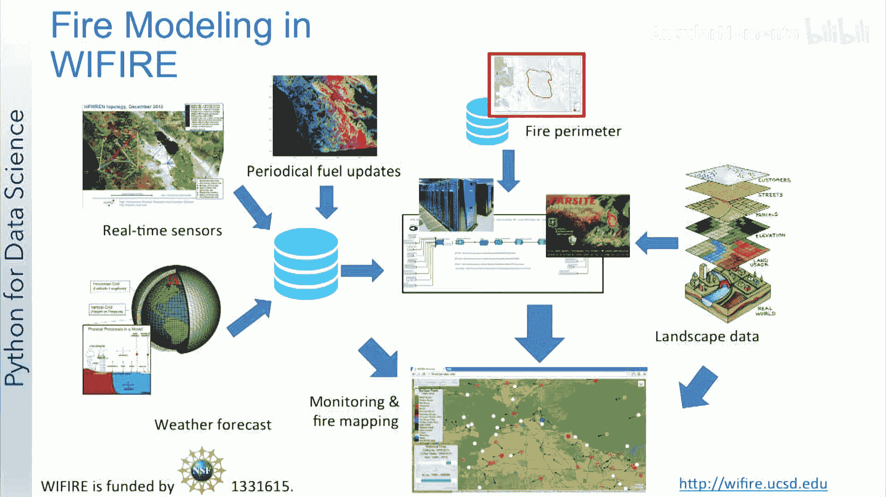
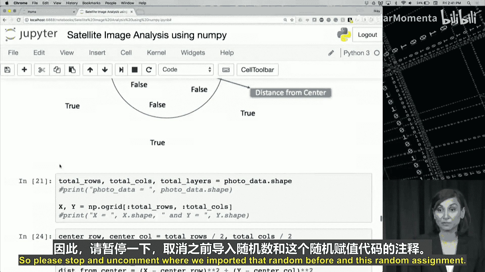

# 014：卫星图像示例教程 🛰️


## 概述
在本节课中，我们将分析一个来自名为WiFIR的研究项目的卫星图像数据集，并使用NumPy库进行分析。WiFIR是一个用于野火分析的集成系统，能够处理不断变化的城市动态和气候。通过本课，你将能够描述卫星图像数据是什么，以及它如何帮助对抗野火，并应用NumPy中的基本方法进行图像处理。

---

## 卫星图像与地球科学应用

上一节我们介绍了WiFIR系统及其目标。本节中我们来看看卫星图像数据本身及其在地球科学中的应用。

在这节课中，我们将使用一个来自Landsat的卫星图像，该图像可用于分析地球表面。对于任何地球科学应用来说，以地图、照片或卫星图像形式分析视觉图表是非常常见的，正如我们在此图像中看到的那样。

许多其他数据科学应用也会涉及某种形式的图像处理。我们需要对图像格式有基本的了解，并能够在Python中处理图像，才能在这个广阔的领域入门。

因此，在我们切换到笔记本进行进一步练习之前，让我们回顾一下关于图像处理和地球科学应用的几个关键点。

---

## 计算机如何存储图像

简单来说，计算机将图像存储为微小正方形的马赛克。这就像古老的马赛克艺术形式，或者今天孩子们玩的熔珠套件。

如果这些方形图块太大，就很难形成平滑的边缘和曲线。你使用的图块越多、越小，图像就越平滑，或者我们说，像素化程度越低。这有时被称为图像的分辨率。

请注意，矢量图形是一种不同的图像存储方法，旨在避免与像素相关的问题。但我们现在暂时不讨论这些，因为即使是矢量图像，最终也是以像素马赛克的形式显示的。

这些正方形中的每一个都称为一个**像素**。每个像素只有一种颜色，由一组数字定义。



描述每个像素的一种简单方法是使用三种颜色的组合，即红色、绿色和蓝色。这就是我们所说的**RGB图像**。


在RGB图像中，每个像素由三个8位数字表示，分别关联到红色、绿色和蓝色的值。这三个数字的组合反过来会给我们一个特定的像素颜色色调。

由于每个数字都是8位数字，因此值的范围是0到255。例如，黄色值可以通过RGB值（255， 255， 0）来识别，正如我们在此图中看到的。

如果所有三个值都处于全强度（即255），则显示为白色；如果所有三个颜色都被减弱或值为0，则显示为黑色。

由于每个值可以有256种不同的强度或亮度值，因此总共有1680万种色调。

在Python中，RGB图像是形状为 `高度 × 宽度 × 3` 的NumPy数组，对应每个RGB层。

---

## 分析WiFIR数据

现在你已经对彩色图像在Python中的存储方式有了基本背景，我们可以更深入地研究WiFIR数据。

在接下来的视频中，我们将浏览一个笔记本，首先从NASA的Landsat卫星导入一张高分辨率图像。我们将主要使用NumPy函数、过滤技术以及一些地球科学领域的知识来分析这张图像。

那么，我们最终如何将这些分析结果和预测性火灾模型使用起来呢？我们将把这个燃料数据集，作为我们用于火灾建模的众多数据集之一。我们在此图中看到，如何将许多实时分析结果作为火灾建模的一部分。一旦与其他信息来源集成，这种更好、更自动化的燃料模型可以带来更准确的结果。

我们为你提供了一个短视频，进一步解释了所有这些数据集是如何使用数据科学进行集成和分析的，作为本课开始笔记本之前的下一段视频。如果你想直接跳到笔记本，请随时跳过它。

---

## 使用NumPy进行基本图像处理

这里我们为你提供了一个NumPy笔记本，用于使用NumPy进行基本的图像处理。

如果你正在寻找该笔记本，你需要进入你的week3文件夹，找到“卫星图像分析”笔记本，并请定位包含数据的WiFIR文件夹。

我们选择卫星图像是因为卫星图像是一种非常有趣的图像数据来进行此练习。

以下是操作步骤：

1.  **导入必要的库**
    像我们的其他笔记本一样，我们将首先导入NumPy、SciPy和Matplotlib。

    ```python
    import numpy as np
    import scipy
    import matplotlib.pyplot as plt
    ```

2.  **读取卫星图像**
    接下来，我们将使用`imread`函数将卫星图像作为NumPy数组读取。这个函数由Python提供给我们。

    ```python
    from scipy import misc
    photo_data = misc.imread('WiFIR/3band_AustinTX.tif')
    ```

    如果我们查看这个数据的类型，我们会看到它是一个NumPy数组。正如我们之前讨论的，这是一张RGB图像，类型是NumPy数组，因为它将被转换为一个三维数组。

3.  **显示图像**
    让我们在笔记本中绘制图像，以便在处理之前查看它。我们首先设置一个15x15的图形大小，你可以根据笔记本的分辨率等调整这个大小。然后我们使用`imshow`函数来显示它。

    ```python
    plt.figure(figsize=(15,15))
    plt.imshow(photo_data)
    plt.show()
    ```

    我们看到图像显示出来了，很好，现在我们看到了彩色的卫星图像。

4.  **检查数组维度**
    但NumPy数组的维度是多少？我说过它是三维的，我们需要使用`shape`函数，`type`函数不足以显示维度。

    ```python
    print(photo_data.shape)
    ```
    输出类似于 `(3725, 4797, 3)`。3725是高度，4797是宽度，它有3层对应RGB。

5.  **理解颜色含义**
    这张图像有一个有趣的地方。像许多其他可视化一样，每个RGB层中的颜色都代表着某种含义。
    *   **红色**强度表示像素中地理数据点的海拔高度。
    *   **蓝色**强度表示坡向的度量。
    *   **绿色**强度表示坡度。

    对于训练有素的地球科学家或野外建模者来说，这些颜色有助于以更快、更有效的方式传达这些信息，而不是显示数字。如果只看这些数字，解释起来会很困难。但仅仅通过观察这张彩色图像，训练有素的眼睛已经可以分辨出海拔、坡度和坡向。这就是为这些颜色加载更多科学含义的想法。

6.  **探索图像数据**
    加载图像后，我们可以开始探索它。让我们检查它的大小，我们将使用NumPy数组的`size`函数。像我们做的许多其他事情一样，我们将检查数据值的最大值和最小值，以及平均像素值。

    ```python
    print(photo_data.size)
    print(photo_data.min())
    print(photo_data.max())
    print(photo_data.mean())
    ```
    这些值很重要，因为8位颜色强度不能超出0到255的范围。

7.  **访问和修改像素值**
    使用NumPy数组（图像数据变量`photo_data`），我们也可以检查图像中某个像素的RGB值。例如，我们将检查第150行第250列。我们将看到该像素的RGB值。

    ```python
    print(photo_data[150, 250])
    ```
    输出类似于 `[17, 35, 255]`，所以这个特定像素有很多蓝色。

    我们也可以只选择其中一个值，比如如果我们想选择绿色。

    ```python
    print(photo_data[150, 250, 1])
    ```
    索引1会给我们绿色值，所以我们会看到绿色值是35。

    同样，我们可以通过为像素分配特定值来更改每个像素的单个值。例如，我们将把刚刚处理过的像素（第150行第250列）设置为0。

    ```python
    photo_data[150, 250] = 0
    ```
    我们将所有三个层都设置为0，所以这个像素会变成黑色。当然，我们可以再次使用图形绘制和`imshow`来显示这个图像，但由于我们只改变了一个像素，所以变化不会很明显。

    我们也可以尝试改变一个像素范围。让我们尝试做一些更大的改变，将绿色层的值设置为全强度，对于行范围200到800内的所有列。

    ```python
    photo_data[200:800, :, 1] = 255
    ```
    我们显著增加了这些像素的绿色值。它再次从第200行到第800行，针对所有列。所以你可能会期望看到一个水平范围或一个比周围像素更绿的大条带。

    类似地，我们可以设置范围。我将重新加载图像，因为我们刚刚更改了图像，我想将其设置回原始状态。

    ```python
    photo_data = misc.imread('WiFIR/3band_AustinTX.tif')
    photo_data[200:800, :, :] = 255
    ```
    你期望看到什么？我希望它是白色的，因为所有三种颜色都完全增强了，所以显示为白色。当然，我们也可以通过将所有三个层设置为0而不是255来做成黑色，这样我们就减弱了所有颜色。

    现在请暂停视频，尝试调整范围和RGB值，让自己熟悉这种表示法。在笔记本的其余部分，我们将大量使用这种表示法，因此理解到这一点为止的所有内容非常重要。

---

## 使用布尔数组进行过滤

现在，让我们转到下一张幻灯片，我们将开始使用逻辑运算符创建一个相同大小的布尔NumPy数组，以便检查这些像素的值。

像之前一样，我将首先重新加载图像到`photo_data`，因为我们又更改了它一点，我想为笔记本的其余部分使用原始图像。

1.  **创建布尔掩码**
    我们将使用比较操作来选择所有小于50的值。这将创建一个与原始数组形状相同的布尔NumPy数组。

    ```python
    photo_data = misc.imread('WiFIR/3band_AustinTX.tif')
    low_value_filter = photo_data < 50
    print(photo_data.shape == low_value_filter.shape)
    ```

    我们生成了`low_value_filter`，使用全局比较运算符来筛选所有小于50的值。

2.  **应用过滤**
    现在我们如何使用这个`low_value_filter`数组进行过滤呢？也许我们现在将这个数组用作索引，将这些低值设置为零。

    ```python
    plt.figure(figsize=(15,15))
    plt.imshow(photo_data)
    plt.show()

    photo_data[low_value_filter] = 0

    plt.figure(figsize=(15,15))
    plt.imshow(photo_data)
    plt.show()
    ```

    这是我们的第一张图像，原始图像，下一张我们应用了过滤器。虽然肉眼不太明显，但图中强度有一点变化。

    让我们回到过滤器并将其设置为200，然后做同样的事情。我们会看到图像真的会改变。

    ```python
    low_value_filter = photo_data < 200
    photo_data[low_value_filter] = 0
    plt.imshow(photo_data)
    plt.show()
    ```

    现在我们的低值过滤器并不完全是低值过滤器，因为我们过滤的是相当高的值（任何小于200的值，最大值只有255）。我们应用这个过滤器到`photo_data`，这是我们的原始图像，我们看到下一张图像过滤掉了许多RGB值低（在本例中小于200）的像素。

---

## 使用行和列索引进行操作

现在，让我们使用行和列索引做一些更多的操作。在这里，我们将创建范围数组。

1.  **创建范围数组**
    我们将创建两个范围数组，一个用于行，一个用于列。

    ```python
    rows_range = np.arange(photo_data.shape[0])
    columns_range = np.arange(photo_data.shape[1])
    ```

    这些数组将是NumPy数组类型。

2.  **使用范围数组设置像素**
    在下一个单元格中，我们使用这些范围数组将与它们关联的像素值设置为所有颜色的全强度，这意味着使这些像素的颜色变为白色。

    ```python
    photo_data[rows_range, columns_range] = 255
    plt.imshow(photo_data)
    plt.show()
    ```

    现在如果我们绘制这个图像，我们会看到一条白色的对角线。因为我们有一个行的范围数组和一个列的范围数组，我们将这些作为索引设置给这个矩阵，并分配特定的像素（如(0,0), (1,1), (2,2)等）为255。我们看到那是一条从0到大约3700范围（图像中的行数）的对角白线。

---

## 创建圆形掩码

现在我们将做一些更有趣的事情。让我们尝试切出一个半径为总行索引一半的圆。

1.  **计算中心点和距离**
    为此，我们需要计算所有点到中心的欧几里得距离。如果你有一个三角形，其长边是从点(x1, y1)到中心(X, Y)，那么圆的半径就是任意点的欧几里得距离。所以，x² + y² 应该小于 r²。

    我们如何做到这一点呢？让我们看看如何转换其含义，并尝试为圆外的所有点创建一个为真的过滤器，圆内的所有点为假。

    在接下来的代码块中，我们首先获取`photo_data`的形状，并分配行数、列数和层数。

    ```python
    total_rows, total_columns, total_layers = photo_data.shape
    ```

2.  **使用`ogrid`创建网格**
    接下来，我们使用`ogrid`函数来帮助我们向量化从中心的距离，这将是两个变量的函数。`ogrid`返回一个NumPy数组。

    ```python
    x, y = np.ogrid[:total_rows, :total_columns]
    ```

    `ogrid`将给出总行数的范围和总列数的范围，它将给我们两个向量x和y。x将具有我们在这里给出的总行数，y将具有总列数。`ogrid`是一种在单行中创建多维NumPy数组操作的紧凑方法。

3.  **计算圆形掩码**
    接下来，我们现在将计算中心点X和Y，并将它们称为`center_row`和`center_column`（总行数除以2，总列数除以2）。我们将使用我们的两个向量x和y来计算距离大于我们试图创建的圆的半径的点。

    ```python
    center_row = total_rows / 2
    center_column = total_columns / 2
    distance_from_center = np.sqrt((x - center_row)**2 + (y - center_column)**2)
    radius = total_rows / 2
    circular_mask = distance_from_center > radius
    ```

    我们使用我们的中心行和x向量来创建从中心距离的矩阵。我们将确保这个矩阵中所有大于半径的值都为真。我们将其分配给`circular_mask`。

    如果我们打印`circular_mask`，只会看到边缘。那些边缘的矩阵值确实为真。但如果我们对图形的中心部分（行1500到1700，列200到2200）提供一个范围查询，我们会看到那些点或像素确实是假的。因此，我们能够识别出圆内和圆外的东西。

4.  **应用圆形掩码**
    现在我们准备好了圆形掩码。我们将继续过滤图像。我重新加载那个原始图像，并使用`photo_data`和我们生成的圆形掩码来过滤它，将所有那些值分配为0（黑色）。

    ```python
    photo_data = misc.imread('WiFIR/3band_AustinTX.tif')
    photo_data[circular_mask] = 0
    plt.imshow(photo_data)
    plt.show()
    ```

    想想你会期望在我们的原始图像中看到什么。当我们绘制这个图像时，我们会看到我们的图像被很好地切成了一个圆形。

---

## 组合掩码

现在让我们将这个圆形掩码与另一个掩码结合起来，该掩码现在遮罩图像的下半部分。

1.  **创建上半部分掩码**
    所以，它低于图像中任何低于那个中心行点的点。我们将使用相同的技术在这里创建一个掩码。在x向量中，任何低于图像中心点的行（即任何x小于`center_row`的行）将被过滤。所以，任何x小于`center_row`的行（即上半部分）将为真。我们称那个过滤器为`half_upper`。

    ```python
    half_upper = x < center_row
    ```

2.  **组合掩码**
    然后，我们将使用NumPy的`logical_and`函数来组合这两个过滤器。我们将`half_upper`和`circular_mask`作为两个过滤器提供给这个掩码。所以，我们正在对每个行-列索引处的真假值进行“与”操作。我们应该得到一个过滤器，为上半部分和圆形周围的部分给出真值。

    ```python
    half_upper_circular_mask = np.logical_and(half_upper, circular_mask)
    ```

3.  **应用组合掩码**
    现在，如果我们分配这个`half_upper_circular_mask`过滤器，并将该过滤器中为真的点分配值为255。这些部分在结果图像中应该显示为白色。

    ```python
    photo_data[half_upper_circular_mask] = 255
    plt.imshow(photo_data)
    plt.show()
    ```

    我们看到圆形周围在上半部分的任何东西都是白色的。我们本可以使用随机值，但需要导入random。所以请暂停并在我们导入random的地方取消注释。这个随机分配。你应该看到强度值的效果。当我们使用随机整数时，我们仍然在这里选择200到255之间的高强度值。但颜色会随机变化，不会是纯白色，而是会有白色的阴影。所以请暂停视频并尝试那一行，确保你理解那部分。

---

## 基于颜色含义创建掩码

现在让我们记住这张图像中每个RGB层的含义。记住红色代表海拔或地理点的高度。

现在我们知道如何创建掩码，我们将通过选择红色层（我们三层矩阵中的第0层）来创建一个，也许我们会选择强度高于150的任何东西。

1.  **创建红色掩码**
    我在这里做的是：我重新加载图像，并开始创建红色掩码。我取`photo_data`并选择第0层（我们的红色层）的所有行和列。红色掩码将为`photo_data`中红色层值小于150的所有值提供真值。

    ```python
    photo_data = misc.imread('WiFIR/3band_AustinTX.tif')
    red_mask = photo_data[:, :, 0] < 150
    ```

2.  **应用红色掩码**
    让我们使用这个掩码为所有这些点分配零。

    ```python
    photo_data[red_mask] = 0
    plt.imshow(photo_data)
    plt.show()
    ```

    我们只显示高海拔区域，我们的图像实际上变化很大，因为我们只显示了红色强度为150或更高的图像中的点。

3.  **创建绿色和蓝色掩码**
    接下来在笔记本中，我们做同样的事情来找到高坡向和高坡度，我们在这里唯一改变的是我们改变绿色和蓝色层。请运行那两个代码单元格，观察你的图像如何变化。它不应该是相同的图像。它应该根据地势、坡度和坡向而有差异。

---

## 创建复合掩码



最后，让我们使用逻辑“与”操作，为具有高海拔、高坡向和低坡度的点创建一个复合掩码，就像我们为圆形和上半部分所做的那样。

1.  **定义各个条件掩码**
    我们像之前一样做红色掩码，绿色掩码用于大于100的点，蓝色掩码用于小于100的点。

    ```python
    red_mask = photo_data[:, :, 0] > 150
    green_mask = photo_data[:, :, 1] < 100
    blue_mask = photo_data[:, :, 2] > 100
    ```

2.  **组合条件**
    我们的最终掩码将使用`logical_and`函数组合这三个条件。

    ```python
    final_mask = np.logical_and(red_mask, np.logical_and(green_mask, blue_mask))
    ```

3.  **应用并显示结果**
    如果你在这里绘制图像，你会看到那些值，图像再次从原始图像变化了一点，我们过滤掉了具有这三个条件的点。

    ```python
    photo_data[final_mask] = 0
    plt.imshow(photo_data)
    plt.show()
    ```

---

## 总结与练习

希望你喜欢这个笔记本。

作为练习，我建议你使用一张自己的照片，并创建一些有趣的过滤器来制作你自己的Instagram风格效果。

在本节课中，我们一起学习了：
1.  卫星图像数据的基本概念及其在野火分析等地球科学中的应用。
2.  计算机如何以RGB像素阵列的形式存储图像。
3.  如何使用NumPy读取、显示和探索图像数据。
4.  如何访问和修改图像中的单个像素或像素区域。
5.  如何创建和应用布尔掩码来过滤图像，例如基于强度阈值或几何形状（如圆形）。
6.  如何组合多个掩码来创建复杂的图像过滤效果。
7.  如何利用图像中RGB通道的特定科学含义（如海拔、坡度、坡向）进行有针对性的分析。

通过掌握这些基本技能，你已经为在Python中进行更高级的图像处理和数据分析打下了坚实的基础。